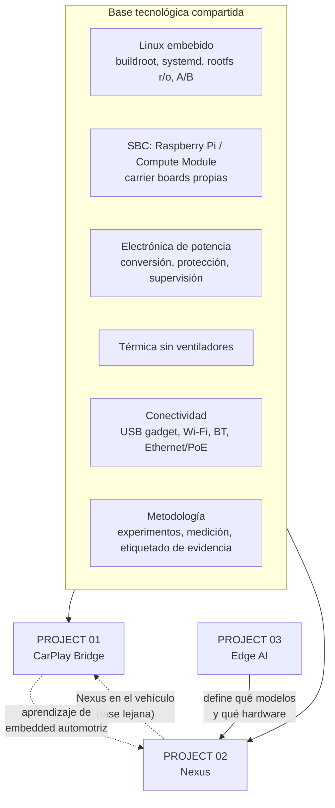
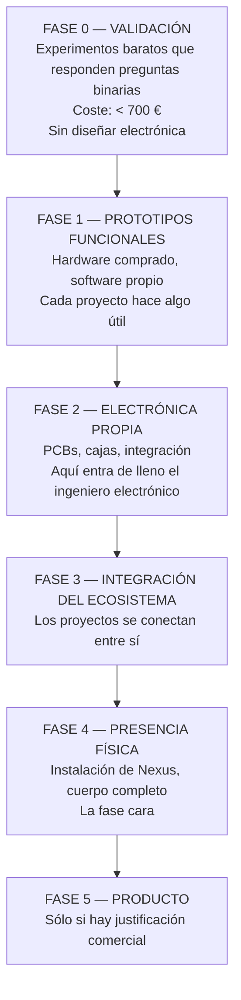
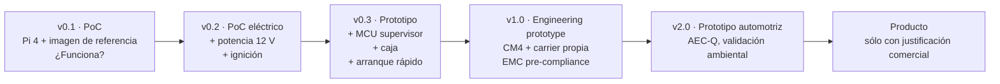
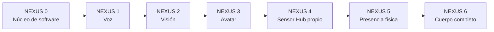
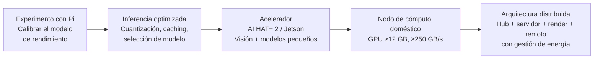
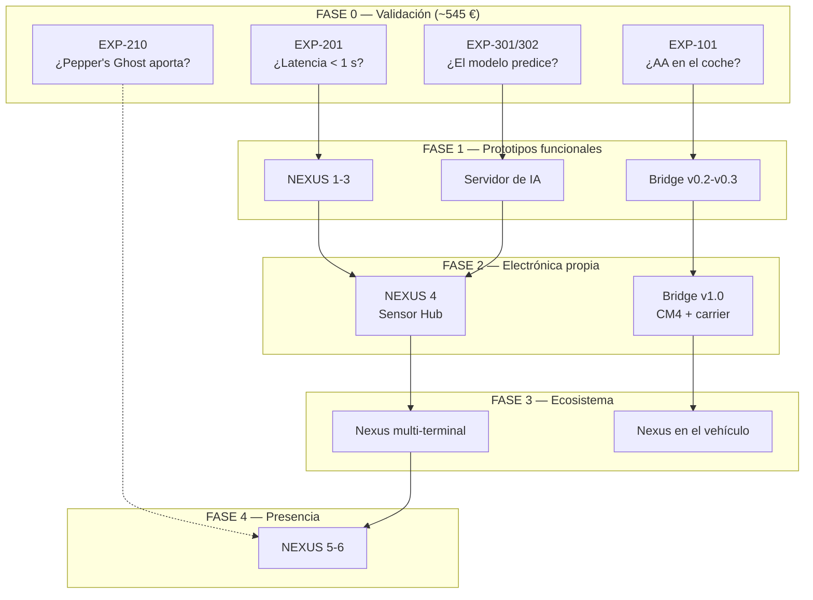

# PROJECT 00 — MASTER TECHNOLOGY ROADMAP

> **No hay fechas cerradas en este documento.** Se usan **fases tecnológicas** con puertas de salida medibles. Una fase termina cuando se cumple su criterio, no cuando pasa el tiempo.

---

## 1. Cómo se conectan los tres proyectos

A primera vista son tres cosas distintas. En realidad comparten el 70 % de la ingeniería.

| Elemento compartido | CarPlay Bridge | Nexus | Edge AI |
|---|---|---|---|
| Linux embebido con arranque rápido y rootfs inmutable | ✅ Crítico | ✅ Sensor Hub | ⚠️ |
| Compute Module + carrier board propia | ✅ v1.0 | ✅ NEXUS 4 | — |
| Conversión y protección de potencia | ✅ 12 V automotriz | ✅ PoE / 12 V | — |
| Disipación sin ventilador | ✅ | ✅ Requisito duro | ⚠️ Conflicto (los LLM quieren ventilador) |
| MCU supervisor | ✅ Ignición y apagado | ✅ Privacidad, IR, presencia | — |
| Aceleradores de IA | ⚠️ Futuro | ✅ Visión | ✅ Objeto de estudio |
| Metodología de medición | ✅ | ✅ | ✅ El proyecto **es** metodología |

> **Este solapamiento es la razón para hacer los tres proyectos en paralelo y no en serie.** El ingeniero que diseñe la etapa de potencia del CarPlay Bridge estará al 60 % del camino de la del Sensor Hub.

---

## 2. Fases del ecosistema

### FASE 0 — Validación

**Objetivo:** responder las preguntas que determinan si cada proyecto tiene sentido, gastando lo mínimo.

| Proyecto | Experimentos | Coste | Puerta de salida |
|---|---|---|---|
| CarPlay Bridge | `EXP-101` (¿funciona en nuestro coche?), `EXP-107` (¿alimenta el USB?) | ~105 € | El coche muestra Android Auto desde nuestro dispositivo |
| Nexus | `EXP-201` (latencia), `EXP-210` (Pepper's Ghost) | ~200 € | Conversación < 1 s p95, y decisión sobre display |
| Edge AI | `EXP-301`, `EXP-302` (modelo de rendimiento calibrado) | ~240 € | La fórmula predice el rendimiento dentro del ±30 % |
| **Total** | | **~545 €** | |

> **La Fase 0 completa cuesta menos que un día de ingeniería y elimina la mayor parte de la incertidumbre de los tres proyectos.** Es donde hay que empezar, sin excepción.

### FASE 1 — Prototipos funcionales

**Objetivo:** que cada proyecto haga algo real, con hardware comprado.

| Proyecto | Entregable | Puerta de salida |
|---|---|---|
| CarPlay Bridge | v0.2–v0.3: dispositivo instalado en el coche con etapa de potencia real | Uso diario durante 30 días sin fallos |
| Nexus | NEXUS 1–3: voz + visión + avatar, con periféricos USB | `EXP-212`: uso espontáneo creciente a los 30 días |
| Edge AI | Servidor doméstico funcionando con el modelo elegido | ≥ 30 t/s con el modelo de producción |

### FASE 2 — Electrónica propia

**Objetivo:** convertir prototipos en dispositivos.

| Proyecto | Entregable | Puerta de salida |
|---|---|---|
| CarPlay Bridge | v1.0: CM4 + carrier board propia, caja de aluminio, pre-compliance EMC | Sobrevive a ISO 7637-2 en banco; < 1 mA en reposo |
| Nexus | NEXUS 4: Sensor Hub propio con privacidad por hardware, IR seguro, radar, PoE | 30 días sin intervención; cadena de privacidad verificable |
| Edge AI | Acelerador integrado en el hub | Visión acelerada con margen térmico |

### FASE 3 — Integración del ecosistema

**Objetivo:** que los proyectos dejen de ser independientes.

| Integración | Descripción |
|---|---|
| Nexus en el escritorio y en la sala con memoria compartida | Un solo Nexus, varios terminales |
| El CarPlay Bridge aloja un terminal de Nexus | Nexus por voz en el coche, usando el hardware que ya está instalado |
| El router de modelos coordina edge, servidor y remoto con políticas | |
| Telemetría y diagnóstico unificados | |

### FASE 4 — Presencia física

**Objetivo:** Nexus como entidad presente.

| Hito | Contenido |
|---|---|
| NEXUS 5 | Instalación de display, óptica, estructura, iluminación de la sala |
| NEXUS 6 | Cuerpo completo, gestos, seguimiento de personas |

> ⚠️ **Esta es la fase con el salto de coste más grande (1 500–65 000 USD sólo en display).** No entrar sin haber pasado `EXP-210` y `EXP-212`.

### FASE 5 — Producto

Sólo si aparece una razón comercial. Requiere certificaciones, cadena de suministro, diseño para fabricación y, en el caso de CarPlay/Android Auto, acuerdos con los propietarios de las plataformas.

---

## 3. Roadmap del CarPlay Bridge

| Versión | Puerta de salida |
|---|---|
| v0.1 | Android Auto en la pantalla del coche desde nuestro dispositivo |
| v0.2 | Arranca y se apaga con el contacto, 500 ciclos sin corrupción |
| v0.3 | Uso diario 30 días; latencia añadida < 50 ms p95 |
| v1.0 | < 1 mA en reposo; sobrevive a transitorios; sin throttling en verano |
| v2.0 | Validación ambiental completa |

**Lo que NO está en este roadmap:** cualquier ruta que implique emular CarPlay. Cerrado por `01_CarPlay_Bridge/02_TECHNICAL_RESEARCH.md` §2.

---

## 4. Roadmap de Nexus

| Fase | Puerta de salida | ¿Electrónica? |
|---|---|---|
| NEXUS 0 | Memoria + herramientas fiables por texto | ❌ |
| NEXUS 1 | **Latencia < 1 000 ms p95 + barge-in** | ⚠️ Selección de componentes |
| NEXUS 2 | FAR < 0,1 % / FRR < 5 % en nuestra sala | ⚠️ Cámaras, IR |
| NEXUS 3 | Mirada dirigida < 200 ms, 60 fps estables | ❌ |
| NEXUS 4 | Hub 30 días sin intervención; privacidad verificable | ✅✅ |
| NEXUS 5 | Efecto de presencia validado con personas ajenas | ✅✅ |
| NEXUS 6 | Gestos coherentes con el habla | ✅ |

**Modificación respecto a la propuesta original del brief:** se añade **NEXUS 0** (núcleo de software antes de la voz). El brief empezaba en "asistente de software", pero conviene separar explícitamente la infraestructura cognitiva (memoria, router, agentes) de la interfaz de voz, porque son independientes y la primera es la base de todo lo demás.

---

## 5. Roadmap de Edge AI

| Etapa | Puerta de salida |
|---|---|
| 1 | El modelo `t/s ≈ BW/tamaño` predice dentro del ±30 % |
| 2 | Se conoce la cuantización óptima con evaluación propia |
| 3 | Se sabe qué puede y qué no puede hacer el hub |
| 4 | ≥ 30 t/s con el modelo conversacional elegido |
| 5 | < 500 kWh/año medidos; reanudación del servidor < 5 s |

---

## 6. Vista integrada

---

## 7. Dependencias críticas

| Dependencia | Qué bloquea si falla |
|---|---|
| `EXP-101` (AA en el coche) | Todo el Proyecto 01 |
| `EXP-201` (latencia conversacional) | NEXUS 1 en adelante |
| `EXP-212` (convivencia 30 días) | Toda la inversión en hardware de Nexus |
| `EXP-210` (Pepper's Ghost) | La estrategia de display de NEXUS 5 |
| `EXP-301/302` (modelo de rendimiento) | El dimensionado del servidor y del hub |
| `EXP-304` (AI HAT+ 2) | Qué puede hacer el Sensor Hub |
| Resolución legal de biometría (U-29) | NEXUS 2 con identificación de terceros |
| Cálculo IEC 62471 del IR (Q-E27) | Encender el iluminador IR |
| Decisión de licencias de software (R-07) | Cualquier ruta comercial del Bridge |

---

## 8. Presupuesto acumulado por fase

| Fase | Material | Etiqueta |
|---|---|---|
| Fase 0 | **~545 €** | `[HIPÓTESIS]` |
| Laboratorio (compartido por los tres proyectos) | **~1 000–2 500 €** | `[HIPÓTESIS]` |
| Fase 1 | ~800–1 500 € + servidor con GPU (`SIN PRECIO FIABLE`) | `[HIPÓTESIS]` |
| Fase 2 | ~1 500–3 000 € (PCBs, componentes, mecánica, series de 5) | `[HIPÓTESIS]` |
| Fase 3 | Incremental, sobre todo software | |
| Fase 4 | **1 500–65 000 USD** sólo en display | `[CONFIRMADO]` los precios de las opciones |
| Fase 5 | `SIN PRECIO FIABLE` | |

> **El salto de coste entre la Fase 3 y la Fase 4 es de dos órdenes de magnitud.** Ese es el punto de decisión más importante de todo el ecosistema, y hay dos experimentos baratos (`EXP-210` y `EXP-212`) diseñados específicamente para informarlo.

---

## 9. Principios que gobiernan el roadmap

| # | Principio |
|---|---|
| 1 | **Experimento barato antes que diseño caro.** Ningún PCB antes de haber respondido las preguntas binarias |
| 2 | **Cada fase deja algo utilizable.** No hay fases que sólo sirvan para llegar a la siguiente |
| 3 | **Comprar antes que diseñar**, hasta que comprar deje de servir |
| 4 | **Medir antes que opinar.** Toda decisión importante tiene un experimento asociado |
| 5 | **Las puertas de fase son numéricas**, no impresiones |
| 6 | **Documentar lo que no sabemos** con la misma claridad que lo que sabemos |
| 7 | **Un prototipo no es un producto.** Una Raspberry Pi puede ser lo correcto en la fase 1 y lo incorrecto en la 5 |
| 8 | **Reutilizar entre proyectos.** La etapa de potencia, el Linux embebido y la metodología son comunes |
