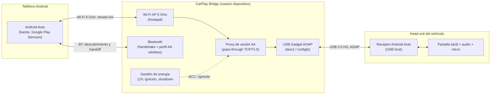

# PROJECT 01 — CARPLAY BRIDGE · Executive Summary

## 1. Qué es

Un dispositivo embebido, instalado en el vehículo, cuyo objetivo es:

> **Permitir que un teléfono Android use la pantalla del automóvil como interfaz.**

La idea inicial se describió como *"el Pi aparenta ser el dispositivo compatible que el coche espera"*. Esa formulación es la que hay que corregir primero, porque determina toda la arquitectura.

---

## 2. Corrección técnica fundamental (leer antes que nada)

La petición original asume que el camino es **emular un iPhone frente al sistema CarPlay del coche**. La investigación dice que eso **no es una ruta viable para nosotros**:

| Hecho | Etiqueta | Fuente |
|---|---|---|
| CarPlay es un enlace IP sobre USB (con iAP2 + USB NCM) o sobre Wi-Fi 5 GHz precedido de un handshake Bluetooth/iAP2 | `[CONFIRMADO]` | [WWDC16-722](https://developer.apple.com/videos/play/wwdc2016/722/), [WWDC17-717](https://developer.apple.com/videos/play/wwdc2017/717/) |
| La sesión exige autenticación con el **Apple Authentication Coprocessor**, componente que sólo se obtiene dentro del programa MFi | `[CONFIRMADO]` | [MFi Program — How it works](https://mfi.apple.com/en/how-it-works.html) |
| Apple licencia CarPlay **para head units** (equipo original, reemplazo aftermarket, unidades de moto), es decir para el lado **receptor** | `[CONFIRMADO]` | [MFi — Who should join](https://mfi.apple.com/en/who-should-join.html) |
| **No existe una categoría MFi para fabricar un "transmisor CarPlay"** — el lado fuente es exclusivamente un dispositivo Apple | `[INFERENCIA]` fuerte, derivada de lo anterior | — |

**Consecuencia:** construir un "iPhone falso" implicaría eludir un mecanismo de autenticación criptográfico. El propio brief prohíbe esa vía, y coincidimos: además de ilegal/no licenciable, sería un producto que Apple puede romper con cualquier actualización de iOS o de firmware del head unit.

### Reformulación del objetivo

El objetivo real no es "CarPlay". Es:

> **Proyectar la experiencia de un teléfono Android sobre la pantalla del coche, con entrada táctil y audio bidireccional, en un dispositivo propio que podamos controlar y evolucionar.**

Y para ese objetivo sí hay rutas construibles. El nombre "CarPlay Bridge" se mantiene como nombre de proyecto, pero la tecnología objetivo primaria es **Android Auto**, no CarPlay.

---

## 3. Las cinco rutas evaluadas

| Ruta | Descripción | Veredicto |
|---|---|---|
| **A — Pi emula iPhone (CarPlay source)** | El Pi habla CarPlay hacia el coche | ❌ `CURRENTLY IMPRACTICAL` — requiere romper autenticación MFi |
| **B — Pi como proxy Wireless Android Auto** | El Pi se presenta al coche como teléfono AA por USB (AOAP) y al teléfono como head unit por Wi-Fi; reenvía el stream sin modificarlo | ✅ **RUTA PRINCIPAL** — `PROVEN BUT REQUIRES INTEGRATION`, existe open source funcionando |
| **C — Pi como head unit propio + pantalla propia** | Sustituimos la pantalla del coche | ✅ `READY NOW` para PoC, pero cambia el producto |
| **D — Usar hardware licenciado comercial + lógica propia encima** | Integrar un dongle Carlinkit/Ottocast como componente | ⚠️ Viable como *componente*, no como base de producto (dependencia de terceros) |
| **E — Inyección por entrada de vídeo del coche (AUX/HDMI/cámara)** | Meter imagen por una entrada analógica/HDMI existente | ⚠️ Nicho: sólo en vehículos con esa entrada, sin táctil |
| **F — Reemplazo de head unit aftermarket** | Comprar/desarrollar un head unit certificado | 💰 Ruta de producto real a largo plazo; requiere licencia MFi/GAS |

Detalle completo en `02_TECHNICAL_RESEARCH.md` §5.

---

## 4. Qué queremos conseguir (metas medibles)

| # | Meta | Métrica de éxito |
|---|---|---|
| G1 | El teléfono Android se proyecta en la pantalla del coche sin cable | Sesión establecida < 30 s desde ignición `[CONFIRMADO]` que es alcanzable: el proyecto de referencia declara "connection under 30 seconds" |
| G2 | Latencia táctil percibida indistinguible de la conexión por cable | Δ latencia extremo-a-extremo < 50 ms respecto a AA cableado (a medir, `EXP-104`) |
| G3 | Arranque y apagado limpios con la llave del coche | 0 corrupciones de sistema de ficheros en 500 ciclos de ignición |
| G4 | Sobrevive al entorno eléctrico del vehículo | Cumple ISO 16750-2 load dump y ISO 7637-2 en banco |
| G5 | Base propia sobre la que construir funciones nuestras | El dispositivo puede alojar servicios adicionales (p. ej. puente con Nexus) |

---

## 5. Arquitectura recomendada en una figura

**Punto clave de esta arquitectura:** el Bridge **no genera** el contenido de Android Auto ni lo decodifica; lo **transporta**. El único que habla "Android Auto de verdad" es el teléfono. Eso elimina la necesidad de licencias del lado fuente, reduce la latencia (no hay transcodificación) y hace el sistema mucho más robusto ante actualizaciones.

---

## 6. Qué NO resuelve esta arquitectura

Hay que decirlo con claridad al ingeniero y al usuario:

- ❌ **No funciona en coches que sólo tienen CarPlay y no Android Auto.** Para esos vehículos, no hay ruta técnica legítima con un desarrollo propio. Las únicas opciones son (a) un producto comercial gris tipo *AI Box*, (b) reemplazar el head unit, o (c) una pantalla secundaria.
- ❌ **No convierte un coche sin proyección en uno con proyección.** Si el head unit no habla ni AA ni CarPlay, no hay nada que "puentear".
- ❌ **No da acceso a datos del vehículo (CAN) por sí solo.** Eso es un subsistema aparte y opcional.

---

## 7. Estado de madurez por bloque

| Bloque | Madurez |
|---|---|
| USB Gadget / AOAP sobre Raspberry Pi | `PROVEN BUT REQUIRES INTEGRATION` |
| Proxy de sesión Android Auto inalámbrico | `PROVEN BUT REQUIRES INTEGRATION` (open source de referencia) |
| Alimentación automotriz robusta + detección de ignición | `READY NOW` (ingeniería estándar, hay que hacerla bien) |
| Arranque < 15 s y apagado seguro | `EXPERIMENTAL` (depende de la imagen Linux; buildroot lo hace posible) |
| Compatibilidad con la larga cola de head units | `RESEARCH REQUIRED` — el riesgo #1 del proyecto |
| Emulación de CarPlay source | `CURRENTLY IMPRACTICAL` |
| Producto automotriz certificable (EMC, temperatura, homologación) | `RESEARCH REQUIRED` |

---

## 8. Recomendación inmediata

1. Construir el **MVP v0.1** con Raspberry Pi 4 (o Zero 2 W) validando la ruta B contra **el coche real que tengamos**. Coste bajo, resultado binario en un fin de semana. Ver `07_PROTOTYPE_PLAN.md`, `EXP-101`.
2. **En paralelo**, el ingeniero electrónico empieza por la **etapa de potencia automotriz**, que es independiente del protocolo y es trabajo real y reutilizable. Ver `04_HARDWARE_ARCHITECTURE.md`.
3. **No** invertir tiempo en CarPlay hasta que exista una razón comercial que justifique la ruta MFi de head unit completo.

---

## Documentos relacionados

- Investigación de protocolos y rutas: `02_TECHNICAL_RESEARCH.md`
- Arquitectura de sistema y presupuesto de latencia: `03_SYSTEM_ARCHITECTURE.md`
- Electrónica, potencia y protecciones: `04_HARDWARE_ARCHITECTURE.md`
- Módulos de software: `05_SOFTWARE_ARCHITECTURE.md`
- Detalle de protocolos (iAP2, AOAP, AirPlay): `06_PROTOCOL_RESEARCH.md`
- Plan de prototipo y experimentos: `07_PROTOTYPE_PLAN.md`
- Lista de materiales: `08_BOM.md`
- Riesgos y preguntas abiertas: `09_RISKS_AND_OPEN_QUESTIONS.md`
