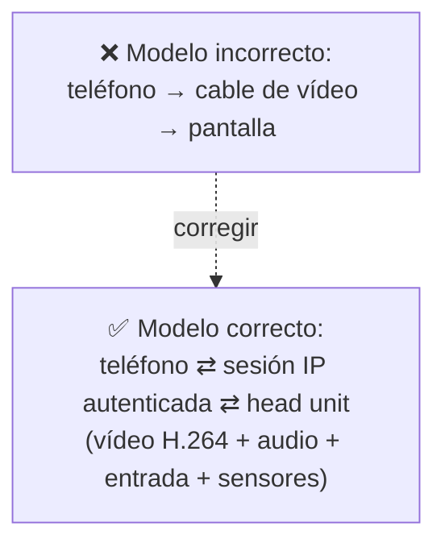
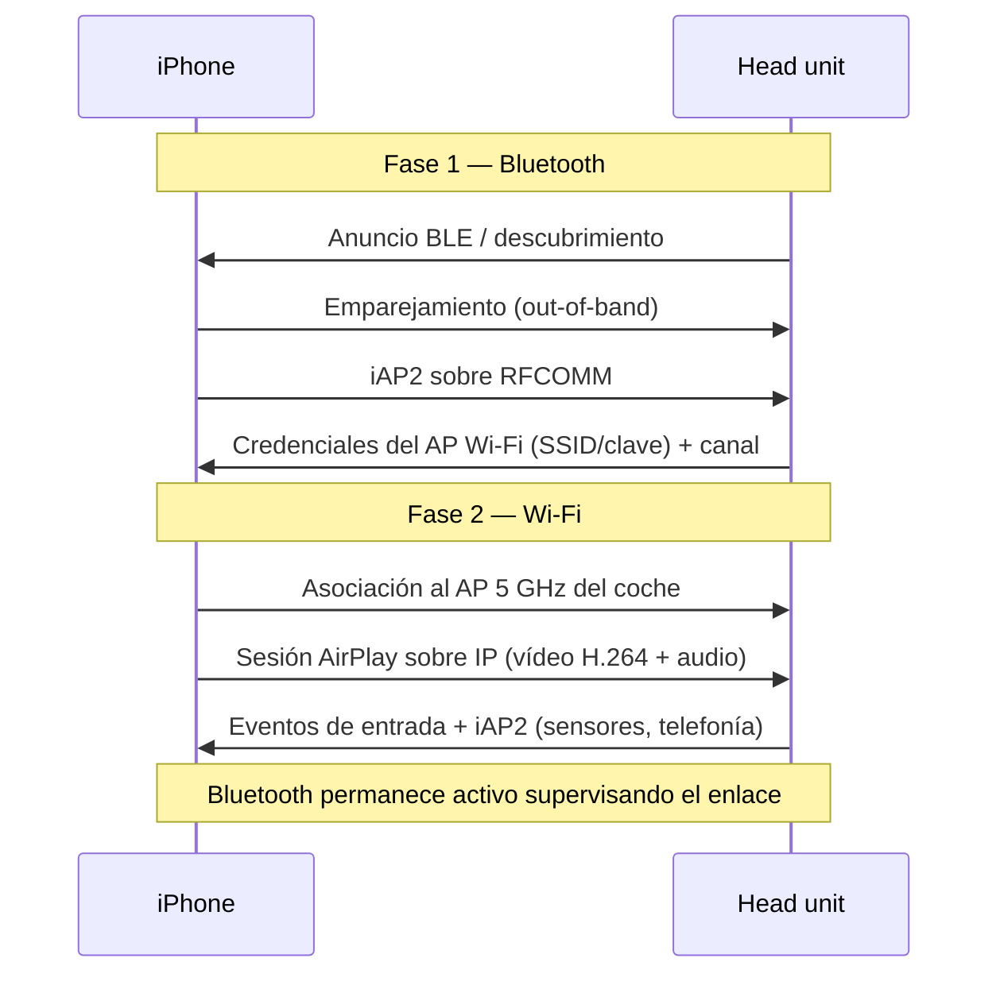
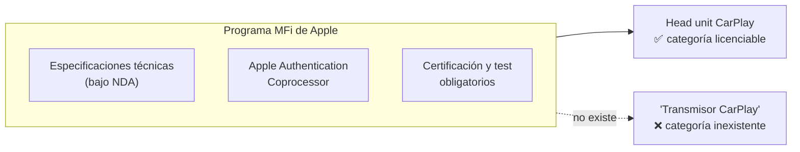
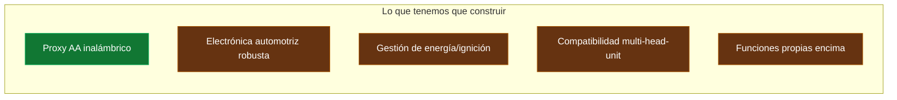
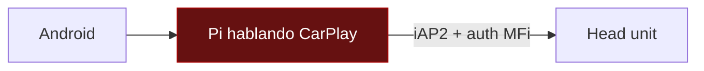
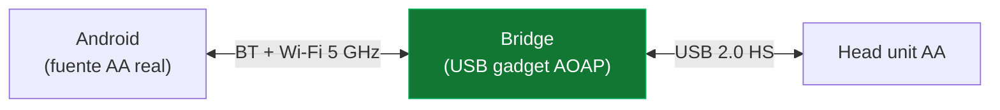
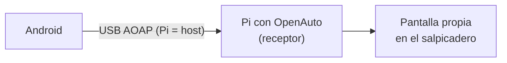
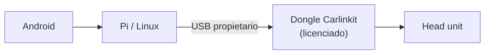
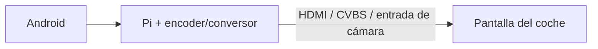

# PROJECT 01 — CARPLAY BRIDGE · Technical Research

> Este documento contiene la investigación cruda: cómo funcionan realmente CarPlay y Android Auto, qué está licenciado, qué es reversible, y qué arquitecturas son construibles. Las decisiones derivadas están en `03_SYSTEM_ARCHITECTURE.md`.

---

## 1. Modelo mental correcto

Lo primero que hay que desmontar es la idea de "pantalla del coche = monitor externo".

**No lo es.** Ni CarPlay ni Android Auto son "salida de vídeo". Ambos son **protocolos de proyección con sesión negociada, autenticación, y canales bidireccionales sobre IP**. El teléfono no manda "una imagen": manda un *stream H.264 comprimido* dentro de una sesión autenticada, y recibe eventos de entrada, audio de micrófono, y datos del vehículo.

Esto tiene una consecuencia dura de ingeniería: **cualquier dispositivo que quiera ocupar el lugar del teléfono tiene que hablar el protocolo completo y pasar su autenticación.** No hay atajo por hardware.

---

## 2. CarPlay: cómo funciona realmente

### 2.1 CarPlay cableado (wired)

| Paso | Qué ocurre | Etiqueta |
|---|---|---|
| 1 | El iPhone se conecta por USB. El head unit es **USB host**, el iPhone es **USB device**. | `[CONFIRMADO]` |
| 2 | Se establece **iAP2** (iPod Accessory Protocol 2) sobre el enlace USB. iAP2 es el protocolo propietario de accesorios de Apple. | `[CONFIRMADO]` — [wiomoc: Exploring Apple's MFi protocol iAP2](https://wiomoc.de/misc/posts/mfi_iap.html) |
| 3 | **Identificación** del accesorio: el head unit declara qué es y qué capacidades tiene (incluida CarPlay). | `[CONFIRMADO]` |
| 4 | **Autenticación**: el iPhone pide el certificado del *Apple Authentication Coprocessor* del accesorio, verifica que está firmado por Apple, y le envía un desafío que el coprocesador firma (RSA-1024 / SHA-1 según el análisis publicado). | `[CONFIRMADO]` — misma fuente + [MFi How it works](https://mfi.apple.com/en/how-it-works.html) |
| 5 | Tras autenticar, el head unit expone un **endpoint USB NCM** (Network Control Model): es decir, **Ethernet sobre USB**. A partir de aquí hay una red IP entre teléfono y coche. | `[CONFIRMADO]` |
| 6 | Sobre esa red IP se establece una sesión **AirPlay** (la misma familia que AirPlay mirroring). | `[CONFIRMADO]` |
| 7 | El vídeo viaja como **H.264** sobre TCP dentro de la sesión. | `[CONFIRMADO]` — [AppleInsider: Inside the tech behind CarPlay](https://appleinsider.com/articles/14/03/03/inside-the-tech-behind-carplay-apples-new-in-vehicle-infotainment-system) |
| 8 | Audio, telefonía, metadatos de navegación giro-a-giro y **datos de sensores del vehículo** viajan por iAP2. | `[CONFIRMADO]` |
| 9 | La entrada del usuario (táctil, rueda giratoria, botones, mandos de volante, touchpad) se envía del coche al teléfono por el mismo enlace. | `[CONFIRMADO]` — [WWDC16 Session 722](https://asciiwwdc.com/2016/sessions/722) |

**Nota de ingeniería importante:** el rol USB es al revés de lo que mucha gente asume. El **coche es el host**, el teléfono es el **device**. Cualquier dispositivo nuestro que quiera ocupar el lugar del teléfono debe funcionar en **modo device/gadget**, no en modo host. Esto es lo que restringe la elección de SBC (§7).

### 2.2 CarPlay inalámbrico (wireless)

| Detalle | Etiqueta | Fuente |
|---|---|---|
| Dos fases: Bluetooth negocia, Wi-Fi transporta | `[CONFIRMADO]` | [WWDC17-717 Developing Wireless CarPlay Systems](https://developer.apple.com/videos/play/wwdc2017/717/) |
| El AP debe estar certificado por Wi-Fi Alliance; se recomienda 802.11ac en 5 GHz | `[CONFIRMADO]` | WWDC17-717 |
| El AP debe soportar el **Apple Device Information Element** y el **Interworking Information Element** en sus beacons | `[CONFIRMADO]` | WWDC17-717 |
| El handoff BT→Wi-Fi tarda típicamente 2–4 s en sistemas correctos | `[INFERENCIA]` (dato de fuentes secundarias, coherente con la experiencia) | — |
| Se usan dos canales RFCOMM tras el emparejado | `[INFERENCIA]` (fuente secundaria) | — |

**Implicación de hardware:** el requisito de Information Elements específicos en el beacon significa que un AP genérico (`hostapd` por defecto) **no es suficiente** para CarPlay inalámbrico. Hay que emitir IEs propietarias. Esto es otro punto donde la ruta CarPlay se cierra sin especificación oficial.

### 2.3 El muro: MFi y autenticación

| Hecho | Etiqueta | Fuente |
|---|---|---|
| El coprocesador de autenticación sólo está disponible dentro de MFi | `[CONFIRMADO]` | [MFi FAQs](https://mfi.apple.com/en/faqs.html) |
| Apple abre aprobación CarPlay para head units IVI de fábrica, head units aftermarket de reemplazo y, desde 2025, unidades de control de moto | `[CONFIRMADO]` | [Eligible Products for Apple CarPlay Certification](https://www.blueasialabs.com/shouyehuandeng/eligible-products-for-apple-carplay-certification-approval-rules-for-factory-installed-and-aftermarket-head-units) |
| Los acuerdos son bajo NDA con tarifas anuales no públicas | `[CONFIRMADO]` | misma fuente |
| Desde 2026 se añaden pruebas de concurrencia multi-dispositivo para CarPlay inalámbrico | `[CONFIRMADO]` | misma fuente |
| **No hay categoría para un dispositivo que actúe como fuente CarPlay sin ser un dispositivo Apple** | `[INFERENCIA]` fuerte | derivada de las categorías publicadas |

### 2.4 Los "CarPlay AI Box": qué son realmente

Existe una categoría comercial de dispositivos que se enchufan al puerto USB de CarPlay cableado y ejecutan Android internamente, mostrando Android en la pantalla del coche.

| Observación | Etiqueta |
|---|---|
| Existen y se venden (Carlinkit, Ottocast y muchos clones) | `[CONFIRMADO]` — catálogos públicos |
| Para que el head unit acepte la sesión, el box **debe** superar la autenticación MFi, lo que implica o bien un coprocesador legítimo o bien un método no autorizado | `[INFERENCIA]` — es la única explicación compatible con §2.1 paso 4 |
| Apple no publica una categoría MFi que cubra este uso | `[INFERENCIA]` |
| Actualizaciones de iOS y de firmware de head unit rompen periódicamente el funcionamiento de CarPlay y accesorios | `[CONFIRMADO]` — reportes recurrentes tras iOS 18.4.1, iOS 26.x |

> **Recomendación:** estos dispositivos son útiles como **objeto de estudio y como banco de pruebas** (comprar uno para entender el comportamiento del head unit), pero **no** como base de un producto propio. Dependeríamos de una cadena de suministro gris y de un mecanismo que el fabricante de la plataforma puede invalidar.

### 2.5 Trabajo open source alrededor de CarPlay

| Proyecto | Qué hace | Relevancia para nosotros |
|---|---|---|
| [ludwig-v/wireless-carplay-dongle-reverse-engineering](https://github.com/ludwig-v/wireless-carplay-dongle-reverse-engineering) | Ingeniería inversa del firmware de dongles Carlinkit/CPlay2Air | Referencia de comportamiento; el firmware es tarball ofuscado |
| [rhysmorgan134/node-CarPlay](https://github.com/rhysmorgan134/node-CarPlay) | Librería JS que habla con el dongle Carlinkit por USB y entrega audio/vídeo al host | Convierte un Linux en **receptor** (head unit) |
| [Michael-1103/pi-carplay](https://github.com/Michael-1103/pi-carplay) | CarPlay y Android Auto en Linux ARM/x86 usando dongles Carlinkit, con vídeo acelerado | Idem, receptor |

**Dirección de estos proyectos:** todos convierten un ordenador en **head unit** (receptor). **Ninguno** convierte un ordenador en **teléfono** (fuente). Esto confirma empíricamente dónde está la barrera.

---

## 3. Android Auto: cómo funciona realmente

### 3.1 Android Auto cableado

| Paso | Qué ocurre | Etiqueta |
|---|---|---|
| 1 | El head unit es **USB host**; el teléfono es **USB device**. | `[CONFIRMADO]` |
| 2 | El head unit usa **AOAP (Android Open Accessory Protocol)** para pedir al teléfono que entre en "accessory mode". Es un handshake USB **público y documentado en AOSP**. | `[CONFIRMADO]` — [AOSP: Android Open Accessory](https://source.android.com/docs/core/interaction/accessories/protocol), [AOA 2.0](https://android.googlesource.com/platform/docs/source.android.com/+/03fbc41/src/tech/accessories/aoap/aoa2.md) |
| 3 | Una vez en accessory mode, se abre un canal bulk in/out y sobre él corre el **protocolo Android Auto**, basado en **Protocol Buffers** y cifrado con **SSL/TLS**. | `[CONFIRMADO]` — [f1xpl/aasdk](https://github.com/f1xpl/aasdk) |
| 4 | Canales multiplexados: control, vídeo, audio de media, audio de sistema, audio de voz, entrada de audio (micrófono), entrada (táctil/botones), sensores, Bluetooth. | `[CONFIRMADO]` — aasdk README |

### 3.2 La diferencia decisiva con CarPlay

| Aspecto | CarPlay | Android Auto |
|---|---|---|
| Handshake de transporte USB | iAP2 (propietario, NDA) | **AOAP (público en AOSP)** ✅ |
| Autenticación por hardware | Coprocesador MFi obligatorio | **No hay coprocesador obligatorio** ✅ |
| Protocolo de aplicación | AirPlay (propietario) | Protobuf sobre TLS (propietario pero con implementación libre del lado receptor) |
| Implementación open source del lado head unit | Sólo vía dongle licenciado | **Sí, nativa (`aasdk` / OpenAuto)** ✅ |
| Implementación open source del lado teléfono (fuente) | No | No (vive en Google Play Services) |

`[INFERENCIA]` **La ausencia de un coprocesador de autenticación obligatorio en la ruta USB de Android Auto es lo que hace posible la arquitectura del Bridge.** Un dispositivo puede presentarse por USB al coche y participar en la sesión sin poseer una llave de hardware.

### 3.3 Android Auto inalámbrico

| Detalle | Etiqueta |
|---|---|
| Fase 1 Bluetooth para descubrimiento/handshake, fase 2 Wi-Fi 5 GHz para el stream | `[CONFIRMADO]` |
| Requiere Android 11+ en el teléfono para AA inalámbrico genérico | `[CONFIRMADO]` |
| El teléfono puede conectarse a un AP creado por el adaptador | `[CONFIRMADO]` — es exactamente lo que hacen los adaptadores comerciales y el proyecto open source de §4 |

---

## 4. La pieza clave: el proxy de Android Auto inalámbrico sobre Raspberry Pi

Existe un proyecto open source que ya hace **casi exactamente** la mitad difícil de nuestro trabajo:

**[nisargjhaveri/WirelessAndroidAutoDongle](https://github.com/nisargjhaveri/WirelessAndroidAutoDongle)** `[CONFIRMADO]`

| Característica | Dato |
|---|---|
| Función | Permite usar Android Auto **inalámbrico** en un coche que sólo soporta AA **cableado** |
| Método | El Pi usa **USB gadget mode** para presentarse al head unit como un teléfono conectado; levanta un **AP Wi-Fi** y usa **Bluetooth** para el handshake con el teléfono real |
| Tratamiento del stream | *"passes through all Android Auto traffic without any modifications"* — **no transcodifica, no interpreta: reenvía** |
| Placas soportadas | Pi Zero W, Pi Zero 2 W, Pi 3 A+, Pi 4. **Excluye Pi 3 B+** por no tener USB OTG |
| Sistema | Imagen mínima construida con **buildroot** |
| Tiempo de conexión declarado | *"connection under 30 seconds"* desde el arranque |
| Limitación declarada | Probado en *"a very limited set of headunits and cars"* |

Existen forks (`batshalregmi/AAWirelessDongle`, `AmoghN/AAWirelessDongle`, `Ioniq3/AAWirelessDongle`) que confirman que la arquitectura es reproducible.

### Por qué esto es tan importante

El bloque de protocolo — el que parecía imposible — **ya está resuelto y es verificable en un fin de semana**. Lo que queda es exactamente donde aporta valor un ingeniero electrónico: potencia, robustez, térmica, integración y fiabilidad.

> ⚠️ **Advertencia de licencias:** el trabajo derivado de `aasdk`/OpenAuto/WirelessAndroidAutoDongle está bajo licencias open source (revisar cada una: GPLv3 en varios casos) y usa protocolo reverse-engineered de Google. Para un **producto comercial** habría que revisar tanto la licencia del código como el marco contractual de Google (programa de head units de Android Auto). Para uso personal / I+D interno el riesgo es bajo. Ver `09_RISKS_AND_OPEN_QUESTIONS.md` R-07.

---

## 5. Las seis arquitecturas, evaluadas

### Arquitectura A — Pi como fuente CarPlay ("iPhone falso")

- **Bloqueo:** paso 4 de §2.1. Sin coprocesador MFi legítimo no hay sesión, y no existe categoría MFi que nos lo venda para este uso.
- **Veredicto:** ❌ `CURRENTLY IMPRACTICAL`. Descartada por decisión explícita (no eludimos autenticación).

### Arquitectura B — Pi como proxy Android Auto inalámbrico ⭐

- **Estado:** `PROVEN BUT REQUIRES INTEGRATION`.
- **Ventaja crítica:** cero transcodificación → latencia añadida mínima, sin coste de CPU de vídeo, sin problema del encoder ausente del Pi 5 (§7.2).
- **Requisito:** el coche debe soportar Android Auto (cableado como mínimo).
- **Veredicto:** ✅ **RUTA PRINCIPAL.**

### Arquitectura C — Linux como head unit propio con pantalla propia

- **Estado:** `READY NOW` para PoC (OpenAuto + aasdk existen).
- **Uso real:** banco de pruebas excelente. Nos permite tener un "coche de laboratorio" sin coche. Ver `EXP-102`.
- **Como producto:** cambia el producto (ya no usamos la pantalla del coche). Válido para vehículos antiguos.

### Arquitectura D — Hardware licenciado comercial + lógica propia

- **Estado:** `EXPERIMENTAL`, y los dongles disponibles van en la dirección contraria (nos hacen *receptores*, no *fuentes*).
- **Uso real:** el dongle Carlinkit CPC200-CCPA + `node-CarPlay` sirve para hacer que **nuestro** Linux reciba CarPlay de un iPhone. Es interesante para Nexus (un Nexus en el coche que reciba CarPlay), no para el Bridge.

### Arquitectura E — Inyección por entrada de vídeo del vehículo

- **Estado:** `PROVEN BUT REQUIRES INTEGRATION` en vehículos que tienen esa entrada.
- **Limitaciones duras:** sin táctil de vuelta (habría que inyectar entrada por otro canal), resolución y calidad pobres en CVBS, muchos coches modernos no exponen ninguna entrada de vídeo.
- **Uso real:** plan B para vehículos concretos, no arquitectura general.

### Arquitectura F — Head unit aftermarket propio

- **Estado:** `RESEARCH REQUIRED` / ruta de producto.
- Es la única ruta que permite **legítimamente** soportar CarPlay: fabricar un head unit y certificarlo por MFi.
- Coste y complejidad de otro orden de magnitud (NDA, certificación, homologación, EMC automotriz, mecánica de integración por modelo de coche).

### Matriz de decisión

| Arquitectura | Coste | Rendimiento | Complejidad | Consumo | Disponibilidad | Escalabilidad | Apta prototipo | Apta producto |
|---|---|---|---|---|---|---|---|---|
| A — CarPlay source | — | — | Extrema | — | ❌ nula | — | ❌ | ❌ |
| **B — Proxy AA** ⭐ | Bajo | Alto | Media | Bajo | ✅ alta | Alta | ✅✅ | ✅ (con trabajo) |
| C — Head unit propio | Medio | Alto | Media | Medio | ✅ alta | Media | ✅✅ | ⚠️ nicho |
| D — Dongle licenciado | Medio | Medio | Media | Bajo | ⚠️ gris | Baja | ⚠️ | ❌ |
| E — Inyección vídeo | Bajo | Bajo | Alta | Medio | ⚠️ por coche | Baja | ⚠️ | ❌ |
| F — Head unit MFi | Muy alto | Alto | Muy alta | Medio | 💰 licencia | Alta | ❌ | ✅ |

---

## 6. Transporte: vídeo, audio y entrada

| Flujo | Dirección | Formato | Notas |
|---|---|---|---|
| Vídeo de proyección | Teléfono → Coche | H.264 (CarPlay) / H.264 en AA | `[CONFIRMADO]` para CarPlay; en AA el códec se negocia en el canal de vídeo `[CONFIRMADO]` vía aasdk |
| Audio de media | Teléfono → Coche | PCM/comprimido en canal dedicado | AA tiene canales separados para media, sistema y voz `[CONFIRMADO]` |
| Audio de micrófono | Coche → Teléfono | Canal de "audio input" | `[CONFIRMADO]` (aasdk lista *Audio input channel*) |
| Entrada táctil / botones | Coche → Teléfono | Canal de input | `[CONFIRMADO]` |
| Sensores del vehículo | Coche → Teléfono | Canal de sensores (AA) / iAP2 (CarPlay) | `[CONFIRMADO]` |
| Mandos de volante | Coche → Teléfono | Como eventos de botón en el canal de input | `[INFERENCIA]` |

### Estimación de ancho de banda `[INFERENCIA]`

| Elemento | Estimación | Razonamiento |
|---|---|---|
| Vídeo 800×480 @30 fps H.264 | 2–6 Mbps | Bitrate típico para UI con poco movimiento |
| Vídeo 1280×720 @30 fps H.264 | 5–15 Mbps | |
| Vídeo 1920×1080 @60 fps H.264 | 15–30 Mbps | Caso peor de head units premium |
| Audio media (stereo 48 kHz) | ≤ 1,5 Mbps | Si va sin comprimir: 48 k × 16 bit × 2 = 1,536 Mbps |
| Micrófono (mono 16 kHz) | 0,26 Mbps | |
| Entrada + control + sensores | < 0,1 Mbps | |
| **Total caso peor** | **≈ 33 Mbps** | |

**Conclusión:** USB 2.0 High Speed (480 Mbps nominal, ~280 Mbps reales) tiene **margen sobrado**. Wi-Fi 5 GHz 802.11ac también. **El cuello de botella nunca será el ancho de banda; será la latencia y el jitter.** Ver presupuesto de latencia en `03_SYSTEM_ARCHITECTURE.md` §5.

---

## 7. ¿Puede una Raspberry Pi hacer esto?

### 7.1 USB device / gadget mode — el requisito eliminatorio

| Placa | ¿USB peripheral? | Puerto | Velocidad | Notas |
|---|---|---|---|---|
| Pi Zero W / Zero 2 W | ✅ | micro-USB "USB" | USB 2.0 HS | Usado por el proyecto de referencia `[CONFIRMADO]` |
| Pi 3 A+ | ✅ | micro-USB | USB 2.0 HS | Soportado `[CONFIRMADO]` |
| Pi 3 B+ | ❌ | — | — | **Sin OTG** — excluido explícitamente `[CONFIRMADO]` |
| Pi 4 B | ✅ | USB-C (el de alimentación) | USB 2.0 HS | Hay que alimentar por GPIO para liberar el USB-C `[CONFIRMADO]` |
| Pi 5 | ✅ pero limitado | USB-C | **USB 2.0 solamente** | El controlador USB3 va por PCIe y **no soporta OTG**; la función peripheral nativa del SoC sale por el conector de alimentación. `dtoverlay=dwc2,dr_mode=peripheral` `[CONFIRMADO]` |
| CM4 / CM5 | ✅ | USB2 dedicado del módulo | USB 2.0 HS | **La opción correcta para producto**: el pin USB2 es un puerto de primera clase, no el de alimentación |

`[CONFIRMADO]` Fuentes: [Raspberry Pi Forums — Gadget mode on Pi 5](https://forums.raspberrypi.com/viewtopic.php?t=358612), [RPi 5 USB gadget mode possible?](https://forums.raspberrypi.com/viewtopic.php?t=358573), [Ben's Place — Pi5 USB-C Gadget](https://blog.hardill.me.uk/2023/12/23/pi5-usb-c-gadget/), Raspberry Pi *Using OTG mode on Raspberry Pi SBCs* white paper (RP-009276-WP).

> 🔧 **Conclusión de hardware nº1:** en Pi 4 y Pi 5 el puerto peripheral **es el mismo conector por el que se alimenta la placa**. En un prototipo se resuelve alimentando por GPIO 5V. **En una placa portadora propia (CM4/CM5) el problema desaparece**, porque el módulo expone USB2 y alimentación por pines separados. Esto por sí solo justifica pasar a Compute Module en cuanto salgamos del banco.

### 7.2 Codificación de vídeo — trampa importante en el Pi 5

| Placa | Decodificación HW | Codificación HW |
|---|---|---|
| Pi 4 | H.264 ✅ | **H.264 ✅** |
| Pi 5 | HEVC ✅, **H.264 ❌ (sólo software)** | **❌ ninguna** |

`[CONFIRMADO]` — [Raspberry Pi Forums: RPI5 h264/h265 video encoding](https://forums.raspberrypi.com/viewtopic.php?t=378329), discusión pública sobre BCM2712.

**Por qué importa:** cualquier arquitectura que obligue al Bridge a **decodificar y re-codificar** el vídeo (por ejemplo transcodificar de un formato del teléfono a otro del coche) sería muy costosa en un Pi 5 y consumiría los 4 núcleos. **La arquitectura B evita esto por diseño** al ser pass-through. Si en el futuro quisiéramos superponer gráficos propios sobre la imagen del coche, este límite vuelve a aparecer y sería un argumento para elegir Pi 4 / CM4, o un SoC con encoder (Rockchip RK3588 tiene encoder H.264/HEVC dedicado).

### 7.3 Comparativa de plataformas para el Bridge

| Plataforma | USB peripheral | Wi-Fi 5 GHz | BT | Encoder H.264 | Consumo típ. | Temp. industrial | Idoneidad |
|---|---|---|---|---|---|---|---|
| **Pi Zero 2 W** | ✅ | ❌ (sólo 2,4 GHz) | ✅ 4.2 | ❌ | ~1–2 W | ❌ | PoC barato, pero 2,4 GHz limita AA inalámbrico |
| **Pi 4 B (2 GB)** | ✅ (USB-C) | ✅ | ✅ 5.0 | ✅ | ~3–5 W | ❌ 0–50 °C | ⭐ **Mejor para prototipo** |
| **Pi 5** | ✅ (USB-C, USB2) | ✅ | ✅ 5.0 | ❌ | ~5–8 W | ❌ | Válido, pero sin encoder y más consumo |
| **CM4** | ✅ (USB2 dedicado) | ✅ (variante WiFi) | ✅ | ✅ | ~3–5 W | ✅ variantes -20/+85 | ⭐ **Mejor para engineering prototype** |
| **CM5** | ✅ | ✅ | ✅ | ❌ (sólo decode HEVC) | ~5–8 W | ✅ −20…+85 °C `[CONFIRMADO]` | Más potencia, sin encoder |
| **Rockchip RK3588 SBC** | ✅ (según placa) | según placa | según placa | ✅ dedicado | ~5–10 W | según placa | Alternativa si hacen falta encoder + NPU |
| **SoC automotriz dedicado** (p. ej. familia i.MX8 / TDA4) | ✅ | requiere módulo | requiere módulo | ✅ | variable | ✅ AEC-Q100 | Ruta de producción real |

`[PROPUESTA DE DISEÑO]` **Prototipo en Pi 4 B → engineering prototype en CM4/CM5 sobre placa portadora propia.**

---

## 8. Consideraciones automotrices (resumen; detalle en `04_HARDWARE_ARCHITECTURE.md`)

| Fenómeno | Magnitud | Referencia |
|---|---|---|
| **Load dump** (desconexión de batería con alternador cargando) | Pico hasta ~101 V en sistemas de 12 V, duración hasta ~400 ms; 10 pulsos con 1 min de intervalo | ISO 16750-2 `[CONFIRMADO]` — [MCC: Quick Guide on Automotive Load Dump Protection](https://solutions.mccsemi.com/news/application-note-quick-guide-on-automotive-load-dump-protection) |
| **Transitorios conducidos** (pulsos 1, 2a, 2b, 3a, 3b) | Negativos y positivos de decenas a cientos de V, ns–ms | ISO 7637-2 `[CONFIRMADO]` — [Analog Devices: LTspice models of ISO 7637-2 & ISO 16750-2](https://www.analog.com/en/resources/technical-articles/ltspice-models-of-iso-7637-2-iso-16750-2-transients.html) |
| **Cold crank** | Caída de la batería a ~4,5–6 V durante el arranque | ISO 16750-2 |
| **Rango de tensión de operación** | 9–16 V continuo típico | ISO 16750-2 |
| **Temperatura del habitáculo** | −30 a +85 °C, salpicadero al sol puede superar +70 °C ambiente | `[INFERENCIA]` estándar del sector |

**Implicación inmediata para el ingeniero:** el conversor de 12 V no puede ser un buck genérico de 40 V. Necesita **supresión de load dump aguas arriba** (TVS + protección de sobretensión o controlador de diodo ideal con clamp) o un conversor con `Vin_max` ≥ 60 V y desconexión activa.

---

## 9. Bibliografía y fuentes

**CarPlay / Apple**
- Apple Developer — [Developing CarPlay Systems, Part 1 (WWDC16-722)](https://developer.apple.com/videos/play/wwdc2016/722/) · [transcripción](https://asciiwwdc.com/2016/sessions/722)
- Apple Developer — [Developing Wireless CarPlay Systems (WWDC17-717)](https://developer.apple.com/videos/play/wwdc2017/717/)
- Apple — [MFi Program: How it works](https://mfi.apple.com/en/how-it-works.html) · [FAQs](https://mfi.apple.com/en/faqs.html) · [Who should join](https://mfi.apple.com/en/who-should-join.html)
- Apple Support — [Verifying accessories for Apple devices and services](https://support.apple.com/guide/security/verifying-accessories-sec70a4f377d/web)
- wiomoc — [Exploring Apple's MFi protocol iAP2](https://wiomoc.de/misc/posts/mfi_iap.html)
- Troopers 24 — Hannah Nöttgen, *Apple CarPlay: What's Under the Hood* (PDF)
- AppleInsider — [Inside the tech behind CarPlay](https://appleinsider.com/articles/14/03/03/inside-the-tech-behind-carplay-apples-new-in-vehicle-infotainment-system)

**Android Auto / AOAP**
- AOSP — [Android Open Accessory (AOA)](https://source.android.com/docs/core/interaction/accessories/protocol) · [AOA 1.0](https://source.android.com/docs/core/interaction/accessories/aoa) · [AOA 2.0](https://android.googlesource.com/platform/docs/source.android.com/+/03fbc41/src/tech/accessories/aoap/aoa2.md)
- [f1xpl/aasdk](https://github.com/f1xpl/aasdk) — librería del lado head unit
- [OpenAuto](https://opensource.com/article/18/3/openauto-emulator-Raspberry-Pi) — emulador de head unit sobre Raspberry Pi
- [nisargjhaveri/WirelessAndroidAutoDongle](https://github.com/nisargjhaveri/WirelessAndroidAutoDongle) ⭐

**Raspberry Pi**
- Raspberry Pi — *Using OTG mode on Raspberry Pi SBCs* (white paper RP-009276-WP)
- [Compute Module 5 Product Brief (RP-008181-DS)](https://pip.raspberrypi.com/documents/RP-008181-DS-compute-module-5-product-brief.pdf)
- [Foro: gadget mode en Pi 5](https://forums.raspberrypi.com/viewtopic.php?t=358612) · [encoding en Pi 5](https://forums.raspberrypi.com/viewtopic.php?t=378329)

**Automoción / eléctrico**
- [Analog Devices — LTspice models of ISO 7637-2 & ISO 16750-2 transients](https://www.analog.com/en/resources/technical-articles/ltspice-models-of-iso-7637-2-iso-16750-2-transients.html)
- [Diodes Inc — Ideal diode controllers and ISO 7637-2 / 16750-2 compliance](https://www.diodes.com/design/support/perspective/how-ideal-diode-controllers-ease-iso-7637-2-and-iso-16750-2-compliance-in-cars)
- [MCC Semi — Quick guide on automotive load dump protection](https://solutions.mccsemi.com/news/application-note-quick-guide-on-automotive-load-dump-protection)
