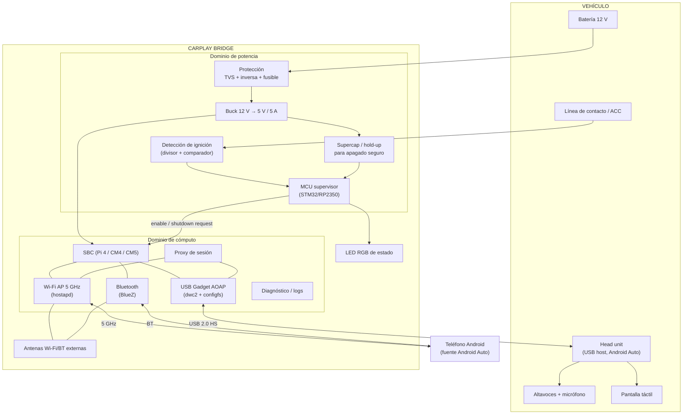
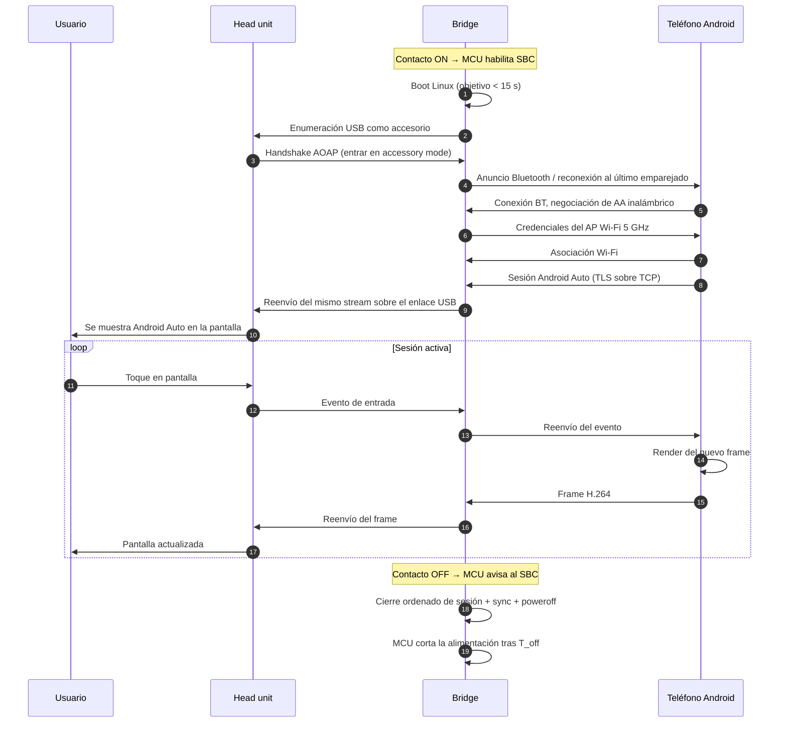
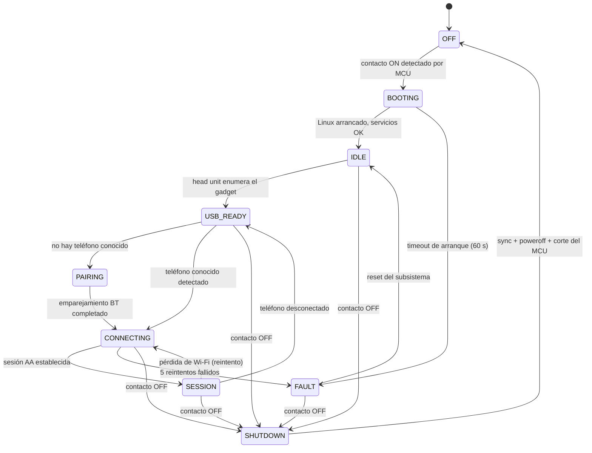
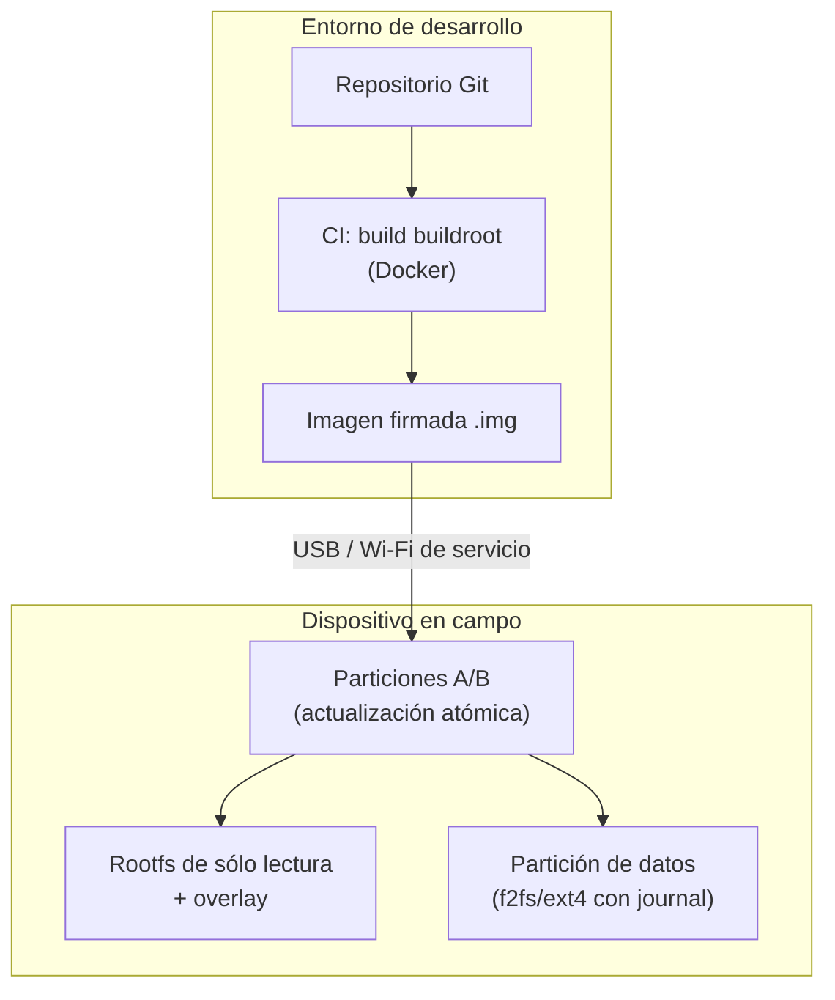
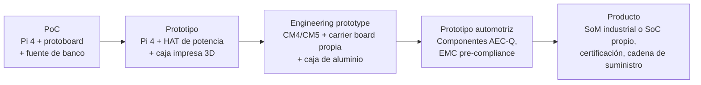

# PROJECT 01 — CARPLAY BRIDGE · System Architecture

---

## 1. Requisitos funcionales (FR)

| ID | Requisito | Prioridad |
|---|---|---|
| FR-01 | El dispositivo se presenta al head unit del vehículo como un teléfono compatible por USB | MUST |
| FR-02 | El dispositivo establece enlace inalámbrico (BT + Wi-Fi) con el teléfono Android del usuario | MUST |
| FR-03 | El dispositivo transporta la sesión de proyección sin alterar su contenido | MUST |
| FR-04 | El dispositivo arranca automáticamente al dar contacto y se conecta sin intervención | MUST |
| FR-05 | El dispositivo se apaga de forma ordenada al quitar contacto, sin corromper el almacenamiento | MUST |
| FR-06 | El dispositivo recuerda el último teléfono emparejado y prioriza su reconexión | SHOULD |
| FR-07 | El dispositivo soporta al menos dos teléfonos emparejados con política de prioridad | SHOULD |
| FR-08 | El dispositivo expone diagnóstico (logs, estado) accesible sin desmontarlo | SHOULD |
| FR-09 | El dispositivo permite actualización de firmware/software de forma segura | SHOULD |
| FR-10 | El dispositivo indica su estado con un indicador visible (LED RGB) | COULD |
| FR-11 | El dispositivo puede leer datos del vehículo por OBD-II/CAN y exponerlos | COULD (futuro) |
| FR-12 | El dispositivo puede alojar servicios adicionales propios (puente con Nexus) | COULD (futuro) |

## 2. Requisitos no funcionales (NFR)

| ID | Categoría | Requisito | Verificación |
|---|---|---|---|
| NFR-01 | Latencia | Latencia añadida por el Bridge sobre la conexión cableada equivalente < **50 ms** p95 | `EXP-104` |
| NFR-02 | Latencia | Jitter de vídeo < 10 ms p99 | `EXP-104` |
| NFR-03 | Arranque | De 0 V a sesión activa < **30 s**; objetivo < 20 s | `EXP-103` |
| NFR-04 | Fiabilidad | 0 fallos de sistema de ficheros en 500 ciclos de encendido/apagado | `EXP-105` |
| NFR-05 | Fiabilidad | MTBF objetivo > 5 000 h de operación | Estimación por FIT de componentes |
| NFR-06 | Térmica | Temperatura de unión de los ICs < 105 °C con ambiente de 70 °C | Simulación + termografía |
| NFR-07 | Potencia | Consumo medio < 5 W; pico < 12 W; consumo en reposo (contacto quitado) < **1 mA** | `EXP-106` |
| NFR-08 | Eléctrico | Sobrevive a load dump ISO 16750-2 e ISO 7637-2 pulsos 1/2a/2b/3a/3b | Banco de transitorios |
| NFR-09 | EMC | No degrada la recepción de radio AM/FM ni GNSS del vehículo | Cámara / prueba en vehículo |
| NFR-10 | Privacidad | No almacena ni transmite contenido de la sesión de proyección | Revisión de código |
| NFR-11 | Mantenibilidad | Toda la configuración vive en un único fichero versionado; imagen reproducible | CI de build |
| NFR-12 | Escalabilidad | La misma base de software corre en Pi 4, CM4 y CM5 sin bifurcación | CI multiplataforma |

---

## 3. Arquitectura de sistema

### 3.1 Frontera hardware / software

| Responsabilidad | Lado | Motivo |
|---|---|---|
| Supervivencia eléctrica (transitorios, inversa, sobretensión) | **Hardware** | El software no existe cuando llega el pulso |
| Detección de ignición y temporización de apagado | **Hardware (MCU supervisor)** | Debe funcionar aunque el SBC esté colgado |
| Corte real de alimentación del SBC | **Hardware (MCU + load switch)** | Garantiza recuperación de un SBC bloqueado |
| Watchdog del sistema | **Ambos** | HW watchdog en MCU, SW watchdog en systemd |
| Enumeración USB como accesorio AOAP | **Software** (kernel `configfs` + gadget) | |
| Wi-Fi AP, Bluetooth, emparejamiento | **Software** | |
| Transporte de la sesión | **Software** | |
| Indicación de estado al usuario | **Ambos**: el MCU controla el LED, el SBC le manda el estado | El LED debe poder mostrar "SBC muerto" |

> `[PROPUESTA DE DISEÑO]` **La decisión de meter un MCU supervisor** (en lugar de dejar toda la lógica de energía al SBC) es la decisión arquitectónica más importante del lado hardware. Se justifica en `04_HARDWARE_ARCHITECTURE.md` §6.

---

## 4. Flujo de datos

### 4.1 Tabla de interfaces

| Sistema A | Sistema B | Interfaz | Protocolo | Ancho de banda | Requisito de latencia | Notas |
|---|---|---|---|---|---|---|
| Batería 12 V | Bridge | Cable de alimentación | — | hasta 12 W | — | Fusible en línea obligatorio |
| Línea ACC | MCU supervisor | GPIO analógico | Nivel + histéresis | — | Detección < 100 ms | Aislado y protegido |
| MCU | SBC | UART + 2 GPIO | Protocolo propio simple | 115200 bd | < 10 ms | `SHUTDOWN_REQ`, `ALIVE` |
| Bridge | Head unit | USB 2.0 High Speed | AOAP + Android Auto (protobuf/TLS) | ~30 Mbps pico | **crítico** | El enlace de la sesión |
| Bridge | Teléfono | Wi-Fi 5 GHz 802.11ac | Android Auto sobre TCP/TLS | ~30 Mbps pico | **crítico** | Canal dedicado, sin uplink a Internet |
| Bridge | Teléfono | Bluetooth 4.2/5.0 | Descubrimiento + handshake AA | < 1 Mbps | < 1 s | Se mantiene como canal de control |
| Bridge | Técnico | Wi-Fi cliente / UART / Ethernet | SSH, journald | — | — | Sólo en modo diagnóstico |
| Bridge | Vehículo (futuro) | CAN / OBD-II | ISO 15765-4 (OBD) | < 0,5 Mbps | < 100 ms | **Sólo lectura**, ver R-09 |

---

## 5. Presupuesto de latencia (latency budget)

Este es el análisis que determina si el producto se siente bien o mal.

### 5.1 Cadena completa: toque → pixel

```mermaid
flowchart LR
    T["👆 Toque"] --> A["Digitalizador\nhead unit"] --> B["Head unit\nempaqueta evento"] --> C["USB → Bridge"] --> D["Bridge\nreenvía"] --> E["Wi-Fi → teléfono"] --> F["Android procesa\ny renderiza"] --> G["Encoder H.264\ndel teléfono"] --> H["Wi-Fi → Bridge"] --> I["Bridge\nreenvía"] --> J["USB → head unit"] --> K["Decoder del\nhead unit"] --> L["Pantalla\n(scan-out)"] --> M["👁 Pixel"]
```

### 5.2 Presupuesto numérico

| # | Etapa | Estimación | Etiqueta | Controlamos |
|---|---|---|---|---|
| 1 | Digitalizador táctil del head unit | 5–20 ms | `[HIPÓTESIS]` | ❌ |
| 2 | Empaquetado y envío del evento por el head unit | 2–10 ms | `[HIPÓTESIS]` | ❌ |
| 3 | USB HS head unit → Bridge | < 1 ms | `[INFERENCIA]` | ⚠️ |
| 4 | **Reenvío en el Bridge (uplink)** | **0,5–3 ms** | `[HIPÓTESIS]` → `EXP-104` | ✅ |
| 5 | Wi-Fi 5 GHz Bridge → teléfono | 2–8 ms | `[INFERENCIA]` | ✅ (canal, potencia, antena) |
| 6 | Procesado y render en Android | 16–33 ms (1–2 frames) | `[INFERENCIA]` | ❌ |
| 7 | Codificación H.264 en el teléfono | 5–15 ms | `[INFERENCIA]` | ❌ |
| 8 | Wi-Fi teléfono → Bridge | 2–8 ms | `[INFERENCIA]` | ✅ |
| 9 | **Reenvío en el Bridge (downlink)** | **0,5–3 ms** | `[HIPÓTESIS]` → `EXP-104` | ✅ |
| 10 | USB Bridge → head unit | 1–3 ms | `[INFERENCIA]` | ⚠️ |
| 11 | Decodificación en el head unit | 10–30 ms | `[HIPÓTESIS]` | ❌ |
| 12 | Scan-out de la pantalla | 8–16 ms | `[INFERENCIA]` | ❌ |
| | **TOTAL estimado** | **≈ 53–150 ms** | | |
| | **De lo cual, atribuible al Bridge (4+5+8+9)** | **≈ 5–22 ms** | | ✅ |

### 5.3 Lectura de este presupuesto

1. **El Bridge no es el cuello de botella.** En el mejor de los casos añade ~5 ms; en el peor ~22 ms, de los cuales la mayoría es el aire Wi-Fi, no nuestro software.
2. **El cuello de botella real está fuera de nuestro control**: el render de Android (6), la codificación (7) y sobre todo la decodificación del head unit (11). `[INFERENCIA]`
3. **Por eso la arquitectura pass-through es correcta.** Si transcodificáramos añadiríamos decodificación + codificación completas (~30–60 ms en un Pi 5 por software) y duplicaríamos el peor tramo de la cadena. Sería la diferencia entre "se siente nativo" y "se siente roto".
4. **Umbral de percepción:** por debajo de ~100 ms la interacción táctil se percibe como directa; por encima de ~150 ms se percibe como laggy. `[INFERENCIA]` Estamos en el margen, pero sin holgura para desperdiciar.

### 5.4 Dónde puede romperse

| Riesgo de latencia | Síntoma | Mitigación |
|---|---|---|
| Canal Wi-Fi 5 GHz congestionado o mal elegido | Micro-cortes, frames perdidos | Escaneo de canal al arrancar; preferir canales DFS-free; antena externa |
| Coexistencia BT/Wi-Fi en la misma antena | Jitter periódico | Antenas separadas o módulo con coexistencia gestionada |
| Buffers de socket demasiado grandes (bufferbloat) | Latencia creciente con el tiempo | Ajuste de `SO_SNDBUF`, `TCP_NODELAY`, qdisc `fq_codel` |
| CPU del SBC saturada por logging | Picos de jitter | Logging a `tmpfs` con rate-limit; nada de logs por defecto en producción |
| Throttling térmico | Degradación progresiva tras 20 min al sol | Disipación pasiva bien dimensionada; ver `04_HARDWARE_ARCHITECTURE.md` §7 |

---

## 6. Máquina de estados del dispositivo

### Código de LED asociado `[PROPUESTA DE DISEÑO]`

| Estado | LED |
|---|---|
| `OFF` | Apagado |
| `BOOTING` | Blanco, respiración lenta |
| `IDLE` / `USB_READY` | Azul fijo |
| `PAIRING` | Azul parpadeo rápido |
| `CONNECTING` | Verde parpadeo |
| `SESSION` | Verde fijo (o apagado tras 10 s, configurable — es un coche, no una discoteca) |
| `FAULT` | Rojo, patrón de parpadeos = código de error |
| `SHUTDOWN` | Ámbar, respiración rápida |

---

## 7. Arquitectura de despliegue

`[PROPUESTA DE DISEÑO]` **Rootfs de sólo lectura + A/B.** Es la única forma de cumplir NFR-04 (0 corrupciones en 500 cortes de energía) sin depender de que el usuario apague bien el coche. Un corte de corriente en mitad de una escritura de rootfs es el modo de fallo nº1 de los dispositivos embebidos de automoción.

---

## 8. Arquitectura de producción futura

| Fase | Qué cambia | Qué se conserva |
|---|---|---|
| PoC → Prototipo | Se añade potencia automotriz real y caja | El software es el mismo |
| Prototipo → Eng. prototype | Pi → Compute Module; el USB peripheral pasa a ser un puerto propio; PCB de 4 capas | El software es el mismo |
| Eng. prototype → Automotriz | Componentes con rango de temperatura extendido; EMC; conector automotriz | Casi todo el software |
| Automotriz → Producto | Posible cambio de SoC (coste, longevidad, encoder HW); certificaciones | Arquitectura de software |

> **Lo importante:** la arquitectura de software está diseñada para no cambiar entre fases. Todo el trabajo de las fases 3–5 es **electrónica, mecánica y cumplimiento**, no reescritura de software.
