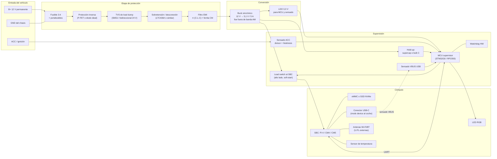
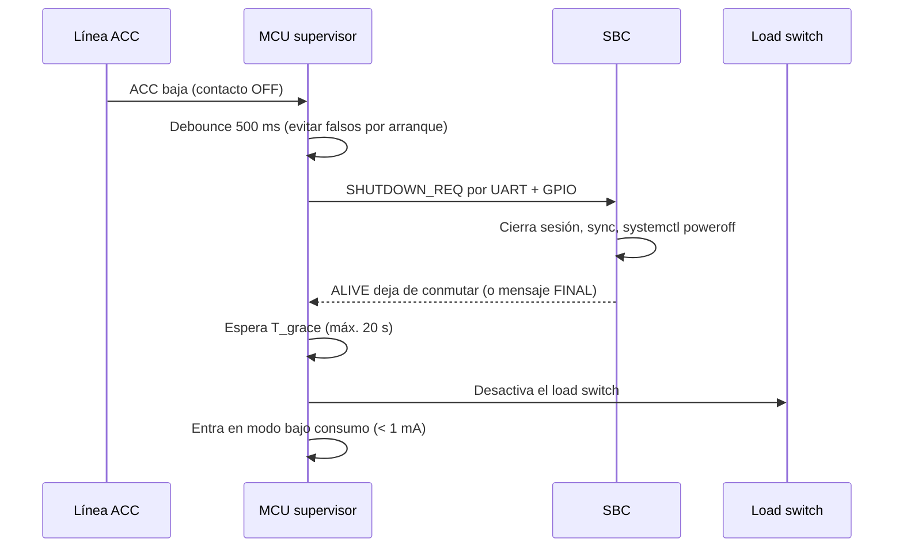

# PROJECT 01 — CARPLAY BRIDGE · Hardware Architecture

> **Este es el documento principal para el ingeniero electrónico.**
> Contiene la arquitectura eléctrica, las protecciones, el presupuesto de potencia, la térmica y las preguntas abiertas de diseño.

---

## 1. Diagrama de bloques eléctrico



---

## 2. Presupuesto de potencia

### 2.1 Consumos por bloque `[INFERENCIA]` salvo donde se indique

| Bloque | Tensión | Corriente típ. | Corriente pico | P típ. | P pico | Notas |
|---|---|---|---|---|---|---|
| SBC Raspberry Pi 4 B (2 GB), carga media | 5,1 V | 0,7 A | 1,4 A | 3,6 W | 7,1 W | Con Wi-Fi AP + BT + USB gadget activos |
| SBC Raspberry Pi 5, carga media | 5,1 V | 1,0 A | 2,5 A | 5,1 W | 12,8 W | Pi 5 pide 5 V/5 A para plena funcionalidad `[CONFIRMADO]` |
| SBC CM4 (2 GB, WiFi) | 5,0 V | 0,6 A | 1,2 A | 3,0 W | 6,0 W | |
| SSD NVMe (si se usa) | 3,3 V | 0,3 A | 0,8 A | 1,0 W | 2,6 W | Sólo en variantes con NVMe |
| MCU supervisor + LDO | 3,3 V | 15 mA | 40 mA | 0,05 W | 0,13 W | |
| LED RGB | 3,3 V | 20 mA | 60 mA | 0,07 W | 0,2 W | |
| **Total en operación (Pi 4)** | | | | **≈ 4,8 W** | **≈ 9,5 W** | |
| **Total en operación (Pi 5 + NVMe)** | | | | **≈ 7,2 W** | **≈ 15,7 W** | |

### 2.2 Dimensionado del conversor

```
P_out_max (Pi 5 + NVMe, con margen 30 %)  = 15,7 W × 1,3 ≈ 20,4 W
I_out_max @ 5,1 V                          = 20,4 / 5,1 ≈ 4,0 A
Elección: buck de 5 A continuos, 6 A pico
Rendimiento asumido η = 0,88 @ 12 V→5 V
P_in                                       = 20,4 / 0,88 ≈ 23,2 W
I_in @ 12 V                                ≈ 1,93 A
I_in @ 9 V (cold crank)                    ≈ 2,58 A
Fusible                                    = 3 A (rápido) o 3,15 A
Disipación en el buck (12 % de 23,2 W)     ≈ 2,8 W  ← esto hay que disipar
```

`[PROPUESTA DE DISEÑO]` **Buck de 5 A con `Vin_max` ≥ 60 V**, para tolerar transitorios que superen el clamp sin depender exclusivamente del TVS.

### 2.3 Consumo en reposo (crítico)

Un dispositivo permanentemente conectado a B+ que consuma de más **descarga la batería del coche**. Regla práctica del sector: el consumo parásito total del vehículo debe quedar por debajo de ~50 mA; un accesorio no debería contribuir más de ~1–2 mA. `[INFERENCIA]`

| Estado | Objetivo | Cómo se consigue |
|---|---|---|
| Contacto OFF, SBC apagado | **< 1 mA** | Buck en modo shutdown (pin EN a masa por el MCU), MCU en STOP con wake por GPIO |
| Contacto ON, SBC arrancando | ~2 A @ 12 V | — |
| Contacto ON, sesión activa | ~0,5–1,3 A @ 12 V | — |

> ⚠️ **Requisito duro:** el buck debe tener pin de **enable** y consumo de shutdown en el rango de µA. Muchos módulos buck genéricos de eBay consumen 5–20 mA en vacío. Eso descargaría una batería de coche en pocas semanas. **No usar módulos genéricos ni siquiera en el prototipo si va a quedarse instalado.**

---

## 3. Cadena de protección de entrada

Orden recomendado desde el conector hacia dentro:


### 3.1 Qué protege cada etapa

| Etapa | Amenaza | Opción A (simple, prototipo) | Opción B (robusta, producto) |
|---|---|---|---|
| Fusible | Cortocircuito | Fusible de cuchilla 3 A en el cable | Fusible SMD + PTC |
| Polaridad inversa | Instalación al revés | Diodo Schottky en serie (pierde 0,4 V y disipa ~0,8 W @ 2 A) | **P-FET en serie** con Vgs controlada, o controlador de diodo ideal — pérdida ~0,05 V |
| Load dump | Pico hasta ~101 V, ~400 ms, 10 pulsos `[CONFIRMADO]` ISO 16750-2 | TVS unidireccional de alta energía (p. ej. serie SMDJ 5–6 kW, Vbr ~ 26–33 V) | TVS + **controlador de sobretensión con FET en serie** (familia LTC4364 / LT4363) que **desconecta** en vez de disipar |
| Transitorios ISO 7637-2 (pulsos 1, 2a, 2b, 3a, 3b) | ns–ms, ± cientos de V | TVS + bulk capacitor | Idem opción A + filtro |
| EMI conducida | Ruido del alternador; y **nuestro** ruido hacia el coche | Filtro π: C bulk + inductor + C | Filtro π + **choke de modo común** + placa con plano de masa continuo |
| ESD en conectores | Descarga del usuario | TVS de baja capacitancia en D+/D− | Idem + conector con contacto de chasis primero |

### 3.2 Por qué "desconectar" es mejor que "disipar" en load dump

```
Load dump ISO 16750-2 test A, sistema 12 V:
  Us pico ≈ 101 V, duración td ≈ 400 ms
Si un TVS clampa a 33 V y el circuito consume 2 A:
  P_TVS ≈ (101 − 33) V × I_pulso   ← con Ri de la fuente, la corriente puede ser decenas de A
  Energía en 400 ms: fácilmente > 100 J
```

`[INFERENCIA]` Un TVS de 5–6 kW aguanta pulsos de 10/1000 µs, **no** 400 ms. Un load dump completo sin supresión centralizada **destruye** un TVS dimensionado sólo por potencia de pico.

`[PROPUESTA DE DISEÑO]` Para el **engineering prototype** en adelante: **controlador de sobretensión con FET en serie** que abra el paso durante el evento, más TVS para los pulsos rápidos. Esto es exactamente lo que hacen los controladores de diodo ideal / surge stopper de automoción. Fuente de referencia: [Diodes Inc — ideal diode controllers para ISO 7637-2 / 16750-2](https://www.diodes.com/design/support/perspective/how-ideal-diode-controllers-ease-iso-7637-2-and-iso-16750-2-compliance-in-cars).

Para el **PoC de banco**, un TVS + fuente de laboratorio limitada es suficiente: no hay load dump en el banco.

---

## 4. Detección de ignición y apagado seguro

### 4.1 El problema

Si cortamos la corriente al SBC en el instante en que se quita el contacto:
- El sistema de ficheros puede corromperse (NFR-04).
- La sesión no se cierra limpiamente y el head unit puede quedar en un estado raro.

Si dejamos el SBC encendido con el contacto quitado:
- Descargamos la batería.

### 4.2 Solución



| Parámetro | Valor propuesto | Justificación |
|---|---|---|
| Debounce de ACC | 500 ms | El arranque del motor hace caer ACC momentáneamente en muchos vehículos `[INFERENCIA]` |
| `T_grace` máximo | 20 s | Suficiente para un apagado limpio; si el SBC no responde, se corta igual |
| Hold-up de energía | ≥ `T_grace` × I_SBC | Ver §4.3 |
| Reencendido rápido | Si ACC vuelve durante `T_grace`, abortar el apagado | Evita el ciclo molesto en gasolineras |

### 4.3 Dimensionado del hold-up

**Opción 1 — Depender de la batería del coche (recomendada):** el B+ sigue presente aunque el ACC baje. Basta con que el MCU mantenga el load switch cerrado durante `T_grace`. **No hace falta supercondensador.** ✅ `[PROPUESTA DE DISEÑO]` — es la opción sensata.

**Opción 2 — Hold-up autónomo (si alimentamos sólo de ACC o queremos sobrevivir a la desconexión de batería):**

```
Energía necesaria = P_SBC × T_grace = 5 W × 20 s = 100 J
Con supercondensadores de 5,5 V trabajando de 5,1 V a 3,0 V:
  E = ½·C·(V1² − V2²)  ⇒  100 = ½·C·(5,1² − 3,0²) = ½·C·17,0
  C = 11,8 F   ← muy grande, caro y voluminoso
Con T_grace reducido a 5 s: C ≈ 2,9 F  ← todavía grande
```

`[INFERENCIA]` **Conclusión: el hold-up autónomo por supercap para un SBC de 5 W es poco práctico.** La solución correcta es (a) alimentar de B+ permanente y controlar el corte por software/MCU, y (b) minimizar el tiempo de apagado con rootfs de sólo lectura, que hace que el apagado sea casi instantáneo y tolerante a cortes.

> 🔧 **Decisión para el ingeniero (Q-E02):** ¿alimentamos de B+ permanente con corte por MCU, o sólo de ACC con hold-up? La recomendación es B+ permanente. Requiere garantizar el consumo en reposo < 1 mA.

---

## 5. Térmica

### 5.1 El escenario que importa

Un dispositivo en el salpicadero o en la guantera de un coche aparcado al sol:

| Escenario | Temperatura ambiente interna | Etiqueta |
|---|---|---|
| Coche aparcado al sol, verano | 60–80 °C (habitáculo), hasta 100 °C en el salpicadero directo | `[INFERENCIA]` — valor de sector |
| Conducción con A/C | 20–30 °C | |
| Invierno, arranque en frío | −20 a −30 °C | |

Un Raspberry Pi 4/5 tiene rango comercial 0–50 °C. `[CONFIRMADO]` Un CM4/CM5 en variante industrial va de −20 a +85 °C. `[CONFIRMADO]` — [CM5 Product Brief](https://pip.raspberrypi.com/documents/RP-008181-DS-compute-module-5-product-brief.pdf)

> ⚠️ **Esto es un argumento de peso para pasar a Compute Module** en cuanto el dispositivo vaya a quedarse instalado en un vehículo real. Un Pi 4 estándar en un salpicadero en verano hará throttling o directamente no arrancará.

### 5.2 Cálculo de disipación

```
Potencia a disipar en la caja (peor caso Pi 5 + NVMe):
  P_SBC   ≈ 8 W
  P_buck  ≈ 2,8 W
  P_otros ≈ 0,3 W
  P_total ≈ 11,1 W

Objetivo: T_junction < 105 °C con T_ambient = 70 °C
  ΔT disponible = 35 K
  Resistencia térmica total requerida: Rth ≤ 35 K / 11,1 W ≈ 3,2 K/W

Una caja de aluminio mecanizada de ~120×80×30 mm con buen acoplamiento
tiene Rth_caja-ambiente del orden de 3–6 K/W en convección natural. [INFERENCIA]
```

`[INFERENCIA]` **Estamos justo en el límite con Pi 5.** Con Pi 4 o CM4 (≈ 6 W totales) el margen es cómodo. **Otro argumento para no usar Pi 5 en este proyecto**, sumado a que no tiene encoder de vídeo (que aquí no necesitamos) ni ventaja de CPU relevante para un proxy de red.

`[PROPUESTA DE DISEÑO]` **Caja de aluminio con el SoC acoplado térmicamente a la carcasa mediante pad térmico.** Sin ventilador: un ventilador en un coche es ruido, polvo y una pieza móvil que falla.

### 5.3 Reglas térmicas de diseño

| Regla | Motivo |
|---|---|
| Nada de ventiladores | Fiabilidad, ruido, ingreso de polvo |
| SoC acoplado a la caja con pad térmico (no aire) | Convección natural en caja cerrada es muy mala |
| El buck lejos del SoC | No sumar dos fuentes de calor en el mismo punto |
| Vías térmicas bajo el buck hacia plano de masa interno | Estándar en diseño de potencia |
| Sensor de temperatura leído por el MCU y por el SBC | Permite degradar funcionalidad antes de fallar (NFR-06) |
| Montaje: **no** en el salpicadero directo al sol | Guantera, consola central o detrás del head unit |

---

## 6. El MCU supervisor: justificación

`[PROPUESTA DE DISEÑO]` Añadir un microcontrolador pequeño dedicado a la gestión de energía.

### ¿Por qué no dejar todo al SBC?

| Escenario | Sin MCU | Con MCU |
|---|---|---|
| El SBC se cuelga durante el arranque | Queda consumiendo indefinidamente | El MCU detecta ausencia de `ALIVE` y corta/reinicia |
| Contacto OFF | El SBC debe detectarlo, pero está ocupado | El MCU lo detecta con hardware determinista |
| Consumo en reposo | El SoC del Pi consume mA incluso "apagado" | El MCU en STOP consume µA y controla el enable del buck |
| Diagnóstico de fallo del SBC | Imposible: el que falla es quien informa | El MCU controla el LED y puede reportar |
| Actualización de software fallida (brick) | Requiere desmontar el dispositivo | El MCU puede forzar arranque desde la partición B |

### Candidatos

| MCU | Pros | Contras |
|---|---|---|
| **STM32G0** (p. ej. STM32G031) | Muy barato, bajo consumo, ADC, disponible en rango industrial, ecosistema maduro | Cadena de herramientas C |
| **RP2350** | Barato, dos núcleos, PIO muy flexible, buen soporte | Consumo en reposo peor que STM32G0 `[HIPÓTESIS]`, sin grado automotriz |
| **ATtiny / AVR** | Ultra simple | Menos periféricos, menos margen para crecer |
| **PMIC + supervisor discreto** | Sin firmware | Sin flexibilidad; no resuelve el apagado ordenado |

`[PROPUESTA DE DISEÑO]` **STM32G031 o equivalente** para el engineering prototype. Para el PoC, se puede emular la función con un temporizador y un load switch, o incluso con GPIO del propio Pi, aceptando el riesgo.

---

## 7. Integridad de señal y layout

| Señal | Requisito | Nota |
|---|---|---|
| USB 2.0 HS D+/D− | Par diferencial 90 Ω ± 10 %, longitudes emparejadas (< 0,15 mm de skew), referencia continua a plano de masa | No enrutar sobre huecos del plano |
| Alimentación 5 V al SBC | Caída total < 100 mV a 3 A → pistas anchas o polígono | Considerar sensado remoto si la distancia es larga |
| Conmutación del buck | Lazo de conmutación (Vin-C, FET, GND) lo más pequeño posible | Es la fuente principal de EMI radiada |
| Líneas RF (U.FL a antena) | Coplanar 50 Ω o cable coaxial directo del módulo | Preferible cable directo del módulo al conector de panel |
| Sensado ACC (12 V) | Divisor con filtro RC + clamp a 3,3 V + resistencia serie ≥ 10 kΩ | La línea ACC lleva todo el ruido del coche |
| Masa | Plano continuo; masa de potencia y masa de señal unidas en un punto bajo el buck | Evitar bucles de masa con el chasis |

### Apilado de PCB propuesto `[PROPUESTA DE DISEÑO]`

4 capas: `Señal / GND / Potencia+GND / Señal`
- USB HS en la capa 1 sobre plano de masa continuo en la capa 2.
- Buck en la capa 4 con vías térmicas al plano interno.

---

## 8. Antenas y RF

| Decisión | Recomendación | Motivo |
|---|---|---|
| Antena interna de PCB vs externa | **Externa (U.FL/MHF4 a antena adhesiva)** | La caja metálica bloquea; el coche es un entorno RF hostil |
| Wi-Fi y BT en la misma antena | Evitar si se puede | Coexistencia degrada latencia y throughput |
| Ubicación de la antena | Fuera de la caja metálica, pegada a plástico | |
| Banda | 5 GHz obligatorio para el enlace con el teléfono | `[CONFIRMADO]` requisito de AA inalámbrico |
| Módulo Wi-Fi | Integrado del Pi/CM (variante WiFi) para prototipo; módulo dedicado para producto | El del CM4/CM5 admite antena externa homologada |

> Nota: el CM4/CM5 en variante inalámbrica **requiere** usar una antena certificada o re-certificar el conjunto. Punto a verificar con el fabricante antes de diseñar la mecánica. `[HIPÓTESIS]` → tarea de investigación normativa.

---

## 9. Conectores y mecánica

| Elemento | Propuesta | Alternativa |
|---|---|---|
| Entrada de alimentación | Conector automotriz 2–3 vías con retención (familia Molex MX150 / Deutsch DT) | Bornero para prototipo |
| Salida USB al coche | **Cable cautivo USB-C** (macho, hacia el head unit) | Conector USB-C hembra + cable, pero es un punto de fallo más |
| Antenas | SMA de panel o cable directo a antena adhesiva | |
| Diagnóstico | Cabecera JST interna (UART) + LED | No exponer un puerto de servicio al exterior en producto |
| Caja | Aluminio extruido o mecanizado, con aletas | Plástico ABS sólo para PoC |
| Montaje | Pestañas para brida o velcro industrial | |
| Estanqueidad | No requerida (interior de habitáculo). IP20 suficiente | IP54 si va en el maletero/motor |

---

## 10. Comparativa de plataformas de cómputo (decision matrix)

| Criterio (peso) | Pi Zero 2 W | **Pi 4 B 2 GB** | Pi 5 | **CM4** | CM5 | RK3588 SBC |
|---|---|---|---|---|---|---|
| USB peripheral (25 %) | ✅ 5 | ✅ 4 (usa USB-C de alim.) | ✅ 3 (USB2 en USB-C) | ✅ 5 (puerto dedicado) | ✅ 5 | ⚠️ 3 (según placa) |
| Wi-Fi 5 GHz (20 %) | ❌ 0 | ✅ 5 | ✅ 5 | ✅ 5 | ✅ 5 | ✅ 4 |
| Consumo (15 %) | ✅ 5 | ✅ 4 | ⚠️ 2 | ✅ 4 | ⚠️ 3 | ⚠️ 3 |
| Rango de temperatura (15 %) | ❌ 1 | ❌ 1 | ❌ 1 | ✅ 5 | ✅ 5 | ⚠️ 3 |
| Disponibilidad y longevidad (10 %) | ✅ 4 | ✅ 5 | ✅ 5 | ✅ 5 | ✅ 5 | ⚠️ 3 |
| Facilidad de prototipado (10 %) | ✅ 5 | ✅ 5 | ✅ 5 | ⚠️ 3 (necesita carrier) | ⚠️ 3 | ⚠️ 3 |
| Encoder HW (5 %) — no crítico aquí | ❌ 0 | ✅ 5 | ❌ 0 | ✅ 5 | ❌ 0 | ✅ 5 |
| **Puntuación ponderada** | **2,9** | **⭐ 4,0** | **3,2** | **⭐ 4,6** | **4,3** | **3,3** |

**Conclusión:**
- **Prototipo:** Raspberry Pi 4 B 2 GB. `[PROPUESTA DE DISEÑO]`
- **Engineering prototype / producto:** Compute Module 4 sobre carrier board propia. `[PROPUESTA DE DISEÑO]`
- Pi 5 no aporta nada a este proyecto y cuesta más en consumo y térmica.

---

## 11. Preguntas para el ingeniero electrónico

| ID | Pregunta | Por qué importa |
|---|---|---|
| **Q-E01** | ¿Buck discreto (controlador + FETs) o módulo integrado? ¿Qué frecuencia de conmutación elegimos para no caer en la banda de AM (530–1710 kHz)? | Afecta EMI, coste y área |
| **Q-E02** | ¿Alimentamos de B+ permanente con corte por MCU, o sólo de ACC con hold-up? | Determina si hay supercap y el consumo parásito |
| **Q-E03** | ¿Qué estrategia de load dump: TVS puro, o surge stopper con FET en serie? ¿A partir de qué fase lo introducimos? | Coste vs robustez |
| **Q-E04** | ¿Qué MCU supervisor? ¿Necesitamos grado automotriz (AEC-Q100) desde el engineering prototype o sólo en producción? | Coste y disponibilidad |
| **Q-E05** | ¿Cable cautivo USB o conector? ¿Qué longitud de cable USB podemos permitirnos manteniendo la integridad de señal HS? | Fiabilidad mecánica vs SI |
| **Q-E06** | ¿Caja de aluminio mecanizada, extruida o fundida? ¿Acoplamos el SoC a la caja o usamos un disipador interno? | Térmica y coste |
| **Q-E07** | ¿Qué antenas y dónde se montan? ¿Hacemos una medición de patrón dentro del vehículo? | Calidad percibida del producto |
| **Q-E08** | ¿Cómo protegemos el sensado de ACC frente a los transitorios que llegan por esa misma línea? | Es la línea más sucia del coche |
| **Q-E09** | ¿Qué nivel de EMC apuntamos y cuándo hacemos pre-compliance? ¿Tenemos acceso a cámara o usamos sondas near-field? | Planificación y presupuesto |
| **Q-E10** | ¿Ponemos interfaz CAN desde el principio (aunque no se use) o dejamos sólo el footprint? | Coste marginal bajo, opción futura valiosa |
| **Q-E11** | ¿Cómo garantizamos < 1 mA en reposo y cómo lo medimos con precisión? | Es un requisito duro y fácil de incumplir sin darse cuenta |
| **Q-E12** | ¿Necesitamos protección contra jump start a 24 V? | Muchos estándares lo exigen; sube el `Vin_max` requerido |

---

## 12. Fuentes

- ISO 16750-2 / ISO 7637-2: [Analog Devices — LTspice models of ISO 7637-2 & ISO 16750-2 transients](https://www.analog.com/en/resources/technical-articles/ltspice-models-of-iso-7637-2-iso-16750-2-transients.html)
- [Diodes Inc — How ideal diode controllers ease ISO 7637-2 and ISO 16750-2 compliance in cars](https://www.diodes.com/design/support/perspective/how-ideal-diode-controllers-ease-iso-7637-2-and-iso-16750-2-compliance-in-cars)
- [MCC Semi — Quick guide on automotive load dump protection (ISO 16750-2)](https://solutions.mccsemi.com/news/application-note-quick-guide-on-automotive-load-dump-protection)
- [Raspberry Pi Compute Module 5 Product Brief](https://pip.raspberrypi.com/documents/RP-008181-DS-compute-module-5-product-brief.pdf)
