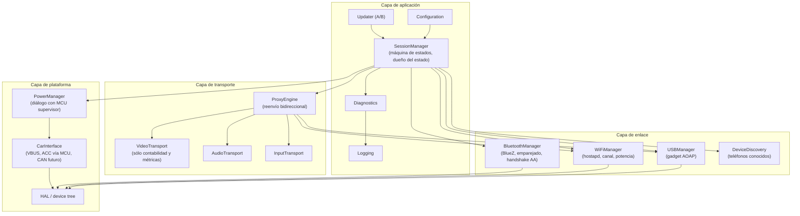
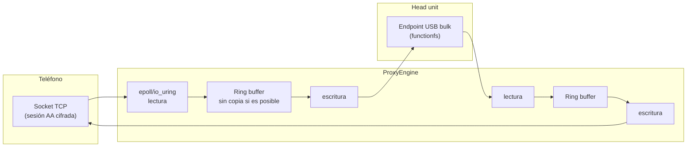

# PROJECT 01 — CARPLAY BRIDGE · Software Architecture

---

## 1. Principios de diseño

1. **Pass-through antes que procesamiento.** Todo lo que no haya que tocar, no se toca. Es lo que mantiene la latencia baja y la compatibilidad alta.
2. **El estado vive en un solo sitio.** Un `SessionManager` es el dueño del estado; el resto reporta y obedece.
3. **Todo módulo debe poder fallar y reiniciarse sin tumbar el sistema.** Supervisión por systemd con reinicio y backoff.
4. **La imagen es inmutable.** Rootfs de sólo lectura, A/B, datos en partición separada.
5. **Sin dependencias de nube para funcionar.** El coche puede estar en un sótano.
6. **Observabilidad sin coste en caliente.** Logging estructurado con niveles; nivel `INFO` no debe tocar el path de datos.

---

## 2. Módulos



### 2.1 Responsabilidad de cada módulo

| Módulo | Responsabilidad | Notas |
|---|---|---|
| **SessionManager** | Máquina de estados de `03_SYSTEM_ARCHITECTURE.md` §6. Único dueño del estado. Orquesta arranque, emparejado, sesión, recuperación y apagado | El corazón del sistema |
| **ProxyEngine** | Reenvío bidireccional de bytes entre el socket TCP del teléfono y el endpoint USB del coche. Sin parsear el contenido cifrado | Path caliente: aquí se gana o se pierde la latencia |
| **VideoTransport / AudioTransport / InputTransport** | En arquitectura pass-through **no** decodifican. Son contadores/métricas y, si en el futuro hiciera falta, puntos de extensión | Se documentan como módulos porque el brief los pide; hoy son delgados a propósito |
| **USBManager** | Crea/destruye el gadget por `configfs`, gestiona descriptores, detecta enumeración y desconexión | |
| **WiFiManager** | Levanta el AP 5 GHz (`hostapd`), elige canal, gestiona clientes, aplica `country code` | |
| **BluetoothManager** | BlueZ: publica el servicio, gestiona emparejamiento, entrega credenciales Wi-Fi al teléfono | |
| **DeviceDiscovery** | Base de datos de teléfonos conocidos, política de prioridad y reconexión automática | |
| **AuthenticationManager** | *En la arquitectura elegida no hay autenticación propia que gestionar.* El módulo existe como punto de extensión y para gestionar el emparejado BT | Documentado explícitamente para no crear la falsa expectativa de que emulamos credenciales |
| **CarInterface** | Abstracción de "lo que el coche nos dice": VBUS presente, estado de ACC (vía MCU), en el futuro CAN/OBD | |
| **PowerManager** | Protocolo con el MCU supervisor: `ALIVE`, `SHUTDOWN_REQ`, `STATE`, temperatura | |
| **Configuration** | Fichero único versionado (TOML/YAML) en la partición de datos, con valores por defecto en la imagen | |
| **Diagnostics** | Snapshot del estado, contadores, últimos errores, exportable por USB o Wi-Fi de servicio | |
| **Logging** | `journald` con almacenamiento en `tmpfs`; volcado a disco sólo bajo demanda o en fallo | Escribir logs a flash en cada arranque mata la eMMC |
| **Updater** | Actualización atómica A/B con verificación de firma y rollback automático | |

---

## 3. El ProxyEngine en detalle

Es el único módulo en el camino crítico de latencia.



### Reglas de implementación `[PROPUESTA DE DISEÑO]`

| Regla | Motivo |
|---|---|
| Un hilo (o un `io_uring`) por dirección, con afinidad de CPU fijada | Evita saltos de núcleo y jitter de planificación |
| `TCP_NODELAY` activado | Nagle añade hasta 40 ms de latencia en mensajes pequeños — inaceptable para eventos de entrada |
| Buffers pequeños (16–64 KB) y `SO_SNDBUF`/`SO_RCVBUF` acotados | Buffers grandes = bufferbloat = latencia creciente |
| `fq_codel` como qdisc en la interfaz Wi-Fi | Control activo de cola |
| Prioridad de proceso `SCHED_FIFO` moderada (no máxima) | Determinismo sin bloquear el sistema |
| Sin logging en el bucle de reenvío (salvo contadores atómicos) | Un `printf` por paquete destruye el rendimiento |
| Zero-copy donde el kernel lo permita (`splice`, `sendfile`, `functionfs` AIO) | Reduce uso de CPU y latencia |

### Métricas que debe exponer

| Métrica | Uso |
|---|---|
| Bytes/s por dirección | Detectar saturación |
| Latencia de reenvío p50/p95/p99 (marca de tiempo a la entrada y salida) | NFR-01, `EXP-104` |
| Reintentos, desconexiones, reconexiones | Fiabilidad |
| Ocupación máxima de buffer | Detectar bufferbloat |
| Temperatura del SoC y frecuencia de CPU | Detectar throttling (§ térmica) |

---

## 4. Sistema operativo y build

| Decisión | Opción elegida | Alternativas | Razón |
|---|---|---|---|
| Distribución | **Buildroot** | Yocto, Raspberry Pi OS Lite | El proyecto de referencia usa buildroot; arranque rápido, imagen mínima, reproducible. Yocto es más potente pero mucho más pesado para este alcance |
| Init | **systemd** (o BusyBox init si se prioriza arranque) | | systemd da supervisión y dependencias gratis; medir su coste en tiempo de arranque (`EXP-103`) |
| Rootfs | **Sólo lectura + overlayfs en tmpfs** | rootfs r/w | NFR-04 |
| Actualización | **A/B con rollback** | swupdate, RAUC, Mender | Elegir según el ecosistema; RAUC/swupdate encajan bien con buildroot |
| Almacenamiento | eMMC (CM4/CM5) | microSD (sólo PoC) | Las microSD son la causa nº1 de fallo en campo `[INFERENCIA]` |
| Kernel | Kernel de Raspberry Pi con `dwc2` y `libcomposite` | | |

### Objetivo de tiempo de arranque

```
Presupuesto objetivo: 15 s de 0 V a gadget USB enumerado
  Bootloader + firmware        ≈ 2 s
  Kernel                       ≈ 3 s
  Montaje de rootfs r/o        ≈ 0,5 s
  Servicios mínimos            ≈ 2 s
  Creación del gadget USB      ≈ 0,5 s
  hostapd + BlueZ              ≈ 3 s (en paralelo)
  Margen                       ≈ 4 s
```

`[HIPÓTESIS]` → `EXP-103`. El proyecto de referencia declara "connection under 30 seconds" `[CONFIRMADO]`, así que 15 s es ambicioso pero no absurdo.

**Truco importante:** el gadget USB debe crearse **lo antes posible**, incluso antes de que Wi-Fi y BT estén listos. El head unit necesita ver el dispositivo pronto; la sesión puede establecerse un poco después.

---

## 5. Protocolo MCU ↔ SBC

`[PROPUESTA DE DISEÑO]` UART 115200 8N1, mensajes de texto delimitados por `\n`, con checksum simple. Texto plano porque es depurable con un adaptador USB-serie de 3 €.

| Mensaje | Dirección | Formato | Significado |
|---|---|---|---|
| `ALIVE` | SBC → MCU | `ALIVE <uptime_s>*<crc>` | Latido cada 1 s. Su ausencia durante 10 s = SBC colgado |
| `STATE` | SBC → MCU | `STATE <estado>*<crc>` | Para que el MCU pinte el LED |
| `SHUTDOWN_REQ` | MCU → SBC | `SHUTDOWN_REQ <grace_s>*<crc>` | Contacto quitado; apágate |
| `SHUTDOWN_ACK` | SBC → MCU | `SHUTDOWN_ACK*<crc>` | Voy a apagarme |
| `ACC` | MCU → SBC | `ACC <0\|1>*<crc>` | Estado de la ignición |
| `TEMP` | MCU → SBC | `TEMP <mC>*<crc>` | Temperatura de la placa |
| `VBUS` | MCU → SBC | `VBUS <0\|1>*<crc>` | Presencia de VBUS del head unit |
| `PING` / `PONG` | ambas | | Verificación de enlace |

Además, **dos GPIO de respaldo** por si el UART falla: `SHUTDOWN_REQ_N` (MCU→SBC) y `ALIVE_PULSE` (SBC→MCU, tren de pulsos). El hardware nunca debe depender exclusivamente de un enlace serie con firmware en ambos extremos.

---

## 6. Gestión de errores y recuperación

| Fallo | Detección | Recuperación |
|---|---|---|
| El head unit no enumera el gadget | Timeout de 20 s sin `SET_CONFIGURATION` | Destruir y recrear el gadget; tras 3 intentos, probar descriptores alternativos |
| El teléfono no se conecta al Wi-Fi | Timeout de 30 s | Reiniciar `hostapd`; cambiar de canal; volver a anunciar por BT |
| La sesión AA cae | Socket cerrado | Reintento con backoff (1 s, 2 s, 4 s, 8 s, 16 s), luego a `PAIRING` |
| El proxy se bloquea | Watchdog interno de 5 s sin progreso con datos pendientes | Reiniciar el proceso del proxy (no todo el sistema) |
| El SBC se cuelga | El MCU deja de recibir `ALIVE` | El MCU corta y restaura alimentación |
| Sobretemperatura | Sensor > umbral | Reducir potencia de Wi-Fi, avisar por LED, y a T crítica apagar ordenadamente |
| Actualización fallida | El sistema nuevo no marca "boot OK" en 3 arranques | Rollback automático a la partición anterior |

---

## 7. Seguridad

| Amenaza | Mitigación |
|---|---|
| Alguien se conecta a nuestro AP Wi-Fi | WPA2/WPA3 con clave generada por dispositivo (no una clave común de fábrica), no difundida en el SSID |
| Alguien accede por SSH | SSH deshabilitado por defecto; se habilita con un jumper físico o una secuencia deliberada |
| Firmware malicioso | Actualizaciones firmadas; verificación antes de conmutar A/B |
| Contenido de la sesión | Ya va cifrado extremo a extremo por TLS entre teléfono y head unit; el Bridge no lo descifra ni lo puede descifrar. **Esto es una garantía de privacidad estructural, no una promesa** (NFR-10) |
| Extracción de la eMMC | Sin datos personales almacenados salvo la lista de teléfonos emparejados; cifrar esa partición si se considera necesario |
| Acceso al bus CAN (futuro) | **Sólo lectura, con aislamiento galvánico y sin capacidad de transmisión física** en la primera versión — ver R-09 |

---

## 8. Preguntas para el equipo de software

| ID | Pregunta |
|---|---|
| **Q-S01** | ¿`epoll` clásico o `io_uring`? ¿Merece la pena la complejidad de `io_uring` para ~30 Mbps? |
| **Q-S02** | ¿Lenguaje del proxy: C, C++ o Rust? El proyecto de referencia y `aasdk` son C++. Rust daría más garantías pero rompe la reutilización directa |
| **Q-S03** | ¿Reutilizamos directamente el proyecto open source de referencia (y aceptamos su licencia) o reimplementamos desde AOAP + observación del protocolo? |
| **Q-S04** | ¿Sistema de actualización: RAUC, swupdate o Mender? |
| **Q-S05** | ¿Cómo probamos automáticamente sin un coche? ¿Construimos un "head unit de laboratorio" con OpenAuto (`EXP-102`)? |
| **Q-S06** | ¿Qué telemetría queremos y cómo la sacamos del vehículo respetando la privacidad? |
| **Q-S07** | ¿Cómo gestionamos la base de datos de compatibilidad por modelo de head unit (perfiles de descriptores)? |
| **Q-S08** | ¿Exponemos una API local para que Nexus (Proyecto 02) pueda hablar con el Bridge en el futuro? |
