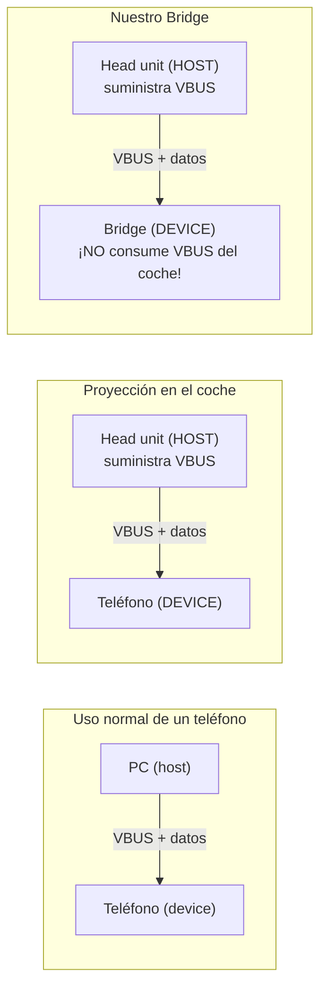
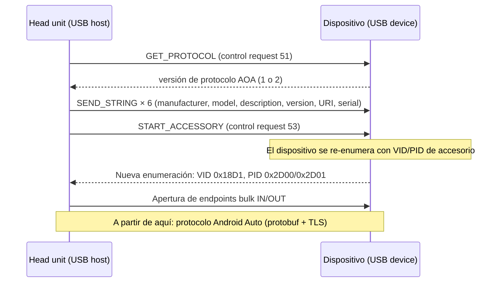
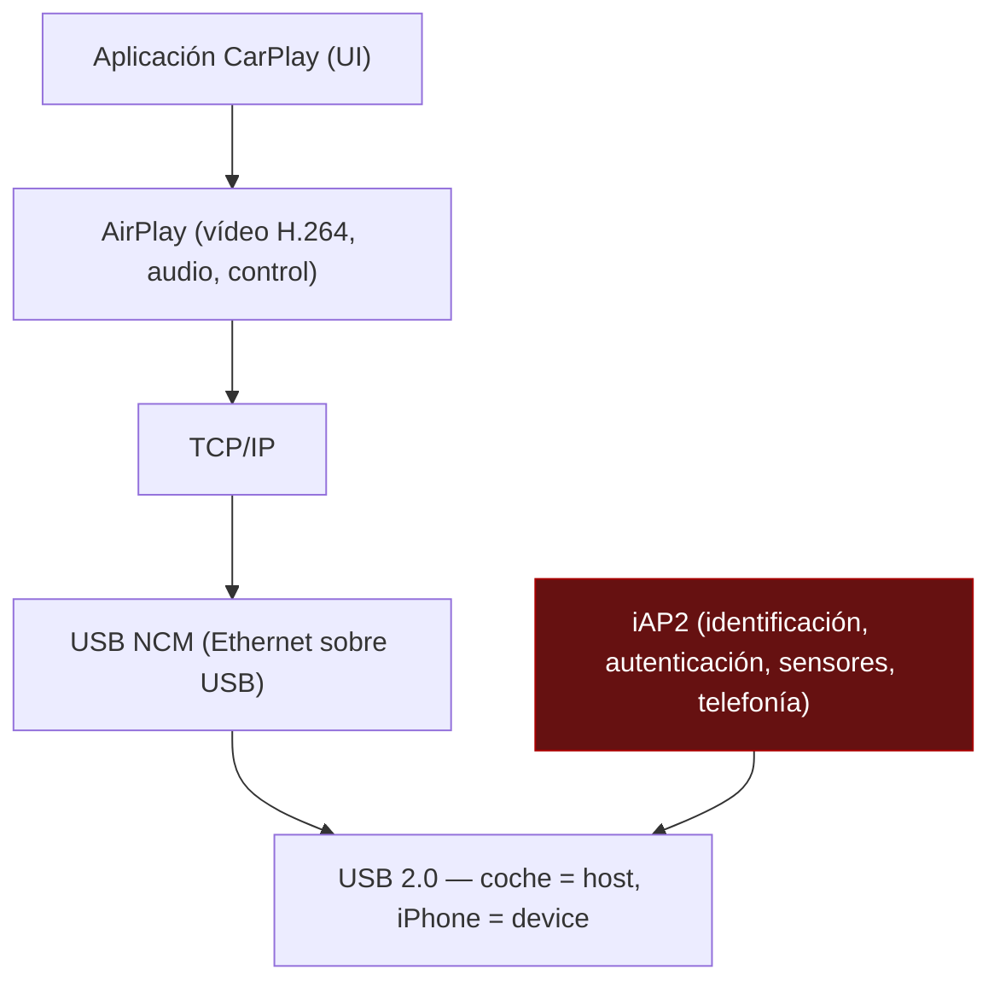
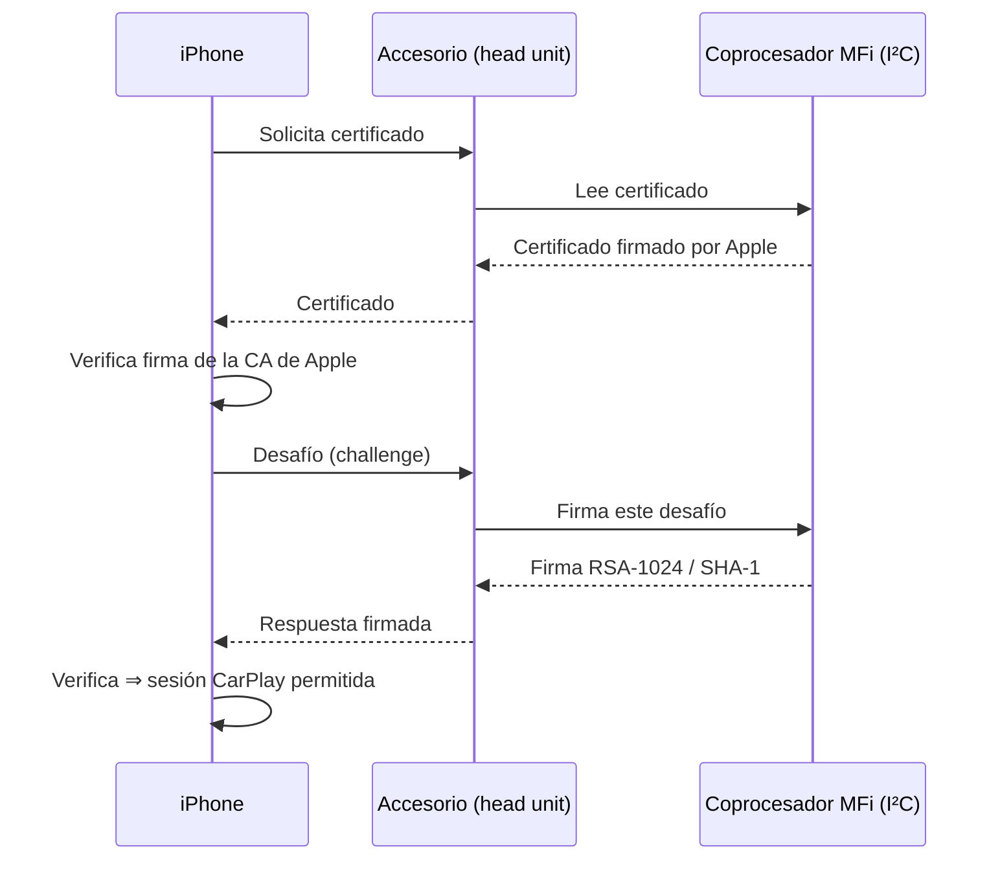

# PROJECT 01 — CARPLAY BRIDGE · Protocol Research

> Documento de referencia de protocolos. Para el ingeniero electrónico, lo relevante está en §1 (roles USB), §5 (requisitos eléctricos derivados del protocolo) y §6 (RF).

---

## 1. Roles USB — la parte que decide la electrónica

### 1.1 Quién es host y quién es device



| Punto | Consecuencia de ingeniería |
|---|---|
| El head unit es **host** y suministra VBUS (típicamente 5 V / 0,5–2,1 A) | Nuestro dispositivo **puede** alimentarse del USB del coche en el prototipo, pero **no debe** en el producto: muchos head units limitan a 500 mA y cortan el puerto al detectar sobreconsumo `[HIPÓTESIS]` → `EXP-107` |
| Nuestro dispositivo es **device/peripheral** | El SBC debe tener controlador USB con modo peripheral (ver `02_TECHNICAL_RESEARCH.md` §7.1) |
| VBUS del head unit debe **detectarse** pero no necesariamente **consumirse** | `[PROPUESTA DE DISEÑO]` sensar VBUS con divisor + GPIO para saber si el coche está despierto; alimentar el SBC desde la línea de 12 V |
| Riesgo de "backfeed" (nuestro 5 V alimentando el puerto del coche) | **Obligatorio** un diodo ideal / load switch unidireccional en VBUS |

> ⚠️ **Trampa clásica:** si alimentamos el Bridge por USB desde el coche *y* por 12 V a la vez, y no hay control de backfeed, se puede dañar el puerto USB del head unit. Un puerto USB roto en un coche moderno puede significar cambiar el módulo entero. **Esta es una de las decisiones que el ingeniero electrónico tiene que blindar.**

### 1.2 Velocidades USB disponibles

| Modo | Velocidad nominal | Throughput real típico | ¿Nos vale? |
|---|---|---|---|
| USB 2.0 Full Speed (12 Mbps) | 12 Mbps | ~8 Mbps | ❌ insuficiente para vídeo |
| **USB 2.0 High Speed (480 Mbps)** | 480 Mbps | ~280 Mbps | ✅ **sobra** (necesitamos ~30 Mbps) |
| USB 3.x | 5 Gbps+ | — | No disponible en modo peripheral en Pi 5 `[CONFIRMADO]` |

`[CONFIRMADO]` En Pi 5 el puerto USB-C sólo tiene conectadas las líneas de USB 2.0; los pines de USB 3 no van a ninguna parte. Fuente: foros oficiales de Raspberry Pi.

**Conclusión:** USB 2.0 HS es suficiente y es lo único disponible. No hay que perseguir USB 3.

### 1.3 Configuración de USB gadget en Linux

`[CONFIRMADO]` — mecanismo estándar del kernel Linux (`configfs` + `libcomposite`).

```
# Habilitar el controlador en modo peripheral
# /boot/firmware/config.txt
dtoverlay=dwc2,dr_mode=peripheral
```

```
# Esqueleto de gadget por configfs
/sys/kernel/config/usb_gadget/g1/
├── idVendor            # se declara el VID/PID que ve el head unit
├── idProduct
├── bcdDevice
├── strings/0x409/
│   ├── manufacturer
│   ├── product
│   └── serialnumber
├── configs/c.1/
└── functions/
    └── <función>        # bulk in/out para AOAP
```

> `[HIPÓTESIS]` **Los descriptores importan.** Algunos head units filtran por VID/PID o por cadenas de fabricante antes de intentar el handshake AOAP. Es una de las causas probables de "funciona en este coche y no en aquel". → `EXP-108`.

---

## 2. AOAP — Android Open Accessory Protocol

`[CONFIRMADO]` — [AOSP: Android Open Accessory](https://source.android.com/docs/core/interaction/accessories/protocol)

### 2.1 El handshake



| Elemento | Valor | Etiqueta |
|---|---|---|
| VID de accesorio Google | `0x18D1` | `[CONFIRMADO]` AOSP |
| PID en modo accesorio | `0x2D00` (accessory) / `0x2D01` (accessory + ADB) | `[CONFIRMADO]` AOSP |
| Control requests | 51 = GET_PROTOCOL, 52 = SEND_STRING, 53 = START, 54 = REGISTER_HID (AOA 2.0), 58 = SET_AUDIO_MODE (AOA 2.0) | `[CONFIRMADO]` AOSP |
| AOA 2.0 añade | Audio (I2S sobre USB) y soporte HID | `[CONFIRMADO]` [AOA 2.0](https://android.googlesource.com/platform/docs/source.android.com/+/03fbc41/src/tech/accessories/aoap/aoa2.md) |
| **¿Requiere chip de autenticación?** | **No** | `[CONFIRMADO]` — no aparece en la especificación |

### 2.2 Encima de AOAP: el protocolo Android Auto

`[CONFIRMADO]` — [f1xpl/aasdk](https://github.com/f1xpl/aasdk)

| Canal | Función |
|---|---|
| Control | Handshake, versión, ping/pong, apagado |
| Video | Stream de vídeo comprimido con configuración negociada (resolución, fps, DPI) |
| Media Audio | Música y podcasts |
| System Audio | Sonidos del sistema, alertas |
| Speech Audio | Voz del asistente |
| Audio Input | **Micrófono del coche hacia el teléfono** |
| Input | Táctil, botones, rueda giratoria |
| Sensor | Velocidad, GPS, marcha, luces, temperatura |
| Bluetooth | Coordinación del emparejado BT para telefonía |

Transporte: **Protocol Buffers** dentro de mensajes con cabecera propia, sobre **SSL/TLS**. `[CONFIRMADO]`

> 🔑 **Consecuencia arquitectónica clave:** como el contenido va cifrado con TLS entre teléfono y head unit, el Bridge **no puede** inspeccionar ni modificar el contenido sin romper el cifrado. Esto es una **ventaja**: nos obliga a la arquitectura pass-through, que es la correcta por latencia. También significa que no podemos "inyectar" UI propia dentro de la sesión de Android Auto. `[INFERENCIA]`

---

## 3. iAP2 y CarPlay — referencia (ruta no seleccionada)

Se documenta para que quede constancia de **por qué** se descartó, no como plan de implementación.

### 3.1 Pila CarPlay cableado



El bloque rojo es el bloqueo: iAP2 exige el **Apple Authentication Coprocessor**.

### 3.2 Secuencia de autenticación MFi



`[CONFIRMADO]` — mecanismo descrito en [wiomoc: Exploring Apple's MFi protocol iAP2](https://wiomoc.de/misc/posts/mfi_iap.html) y [MFi: How it works](https://mfi.apple.com/en/how-it-works.html).

| Pregunta | Respuesta |
|---|---|
| ¿Podemos comprar el coprocesador? | Sólo siendo miembro MFi `[CONFIRMADO]` |
| ¿Podemos ser miembros MFi para esto? | Sólo para fabricar un **head unit**, no un transmisor `[INFERENCIA]` fuerte |
| ¿Podemos emular la firma? | Requeriría la clave privada de Apple. **Fuera de discusión.** |
| ¿Podemos reutilizar el coprocesador de un producto comprado? | Legal y técnicamente problemático, y rompe con actualizaciones. Descartado. |

### 3.3 CarPlay inalámbrico — requisitos del punto de acceso

`[CONFIRMADO]` — WWDC17-717:

- AP certificado por Wi-Fi Alliance
- Recomendado 802.11ac en 5 GHz
- Debe emitir el **Apple Device Information Element**
- Debe emitir el **Interworking Information Element**

`[INFERENCIA]` Estas IEs no están documentadas públicamente en detalle; se obtienen con la especificación MFi. `hostapd` estándar no las emite. Esto refuerza que la ruta CarPlay no es implementable sin licencia.

---

## 4. Comparativa de protocolos, resumida

| Dimensión | CarPlay | Android Auto |
|---|---|---|
| Transporte cableado | USB, coche = host | USB, coche = host |
| Handshake de transporte | iAP2 (NDA) | **AOAP (público)** |
| Autenticación por hardware | **Obligatoria (MFi)** | No |
| Capa de aplicación | AirPlay | Protobuf + TLS |
| Vídeo | H.264 | H.264 (negociado) |
| Transporte inalámbrico | BT → Wi-Fi 5 GHz con IEs propietarias | BT → Wi-Fi 5 GHz |
| Implementación libre lado receptor | ❌ (sólo vía dongle) | ✅ aasdk / OpenAuto |
| Implementación libre lado fuente | ❌ | ❌ |
| **¿Podemos construir un proxy legítimo?** | ❌ | ✅ |

---

## 5. Requisitos eléctricos derivados del protocolo

Para el ingeniero electrónico, esto es lo que el protocolo impone sobre el hardware:

| Requisito | Origen | Especificación |
|---|---|---|
| El enlace USB debe estar disponible **antes** de que el head unit escanee | Los head units suelen enumerar una vez al arrancar y no reintentar indefinidamente `[HIPÓTESIS]` → `EXP-108` | **Arranque del Bridge ≤ arranque del head unit**. Objetivo < 15 s |
| VBUS del coche debe sensarse | Saber si el coche está despierto sin depender del ACC | Divisor 5 V → 3,3 V, GPIO con protección |
| Prohibido backfeed hacia VBUS | Proteger el puerto del coche | Diodo ideal o load switch con bloqueo inverso |
| Integridad de señal en D+/D− | USB HS = 480 Mbps, 90 Ω diferencial | Par diferencial controlado, longitud emparejada, sin vías innecesarias |
| ESD en el conector USB | Es un conector accesible al usuario | TVS de baja capacidad (< 1 pF) en D+/D− |
| Aislamiento de ruido del sistema del coche | El alternador y los inyectores generan mucho ruido | Filtrado LC en la entrada de 12 V + ferrita en común |
| Consumo compatible con el puerto del coche si se alimenta por USB | Muchos puertos limitan a 500 mA–2,1 A | En prototipo, medir consumo real (`EXP-106`); en producto, alimentar de 12 V |

---

## 6. Requisitos de RF derivados del protocolo

| Requisito | Motivo | Implicación de diseño |
|---|---|---|
| **Wi-Fi 5 GHz obligatorio** | Android Auto inalámbrico usa 5 GHz `[CONFIRMADO]` | Descarta Pi Zero 2 W (sólo 2,4 GHz) para el rol final |
| El Bridge crea un AP, no se conecta a uno | Es el AP al que se asocia el teléfono | `hostapd`, selección de canal, potencia |
| Coexistencia BT + Wi-Fi | Ambos activos simultáneamente durante toda la sesión | Módulos con coexistencia gestionada, o antenas separadas |
| La antena va dentro de una caja, posiblemente metálica, dentro de un coche (jaula de Faraday parcial) | Peor caso de RF | **Antena externa por U.FL/MHF**, no antena de PCB dentro de caja de aluminio |
| Regulación por región | 5 GHz tiene bandas DFS y límites de potencia | Fijar `country code` correcto en `hostapd`; evitar canales DFS (requieren radar detection y retrasan la puesta en marcha) |
| Distancia teléfono ↔ Bridge típica: 0,3–1,5 m | El teléfono está en el bolsillo o en el soporte | Margen de enlace generoso; no es el problema |

> 🔧 **Para el ingeniero:** la decisión de antenas es una de las que más impacto tiene en la percepción de calidad del producto y es puramente hardware. Ver `04_HARDWARE_ARCHITECTURE.md` §8 y la pregunta Q-E07.

---

## 7. Qué NO está resuelto en la investigación de protocolo

| Incógnita | Impacto | Cómo se resuelve |
|---|---|---|
| ¿Qué descriptores USB exactos espera cada head unit? | Alto — es la causa probable de incompatibilidades | `EXP-108`: barrido de VID/PID/strings contra varios coches |
| ¿Cuántas veces reintenta un head unit la enumeración si el gadget aparece tarde? | Alto — fija el requisito de tiempo de arranque | `EXP-103` |
| ¿El head unit tolera una desconexión y reconexión USB en caliente durante la sesión? | Medio — determina la estrategia de recuperación de errores | `EXP-109` |
| ¿Qué resoluciones/fps negocia realmente cada head unit? | Medio — afecta al ancho de banda y a la latencia | Captura del canal de control durante `EXP-101` |
| ¿Cómo se comporta la sesión al perder el Wi-Fi 2 s y recuperarlo? | Medio — UX de túneles y aparcamientos | `EXP-110` |
| ¿Existe alguna ruta contractual con Google para head units/adaptadores AA? | Alto para producto comercial | Investigación legal/comercial, no técnica |

---

## 8. Fuentes

- AOSP — [Android Open Accessory protocol](https://source.android.com/docs/core/interaction/accessories/protocol) · [AOA 1.0](https://source.android.com/docs/core/interaction/accessories/aoa) · [AOA 2.0](https://android.googlesource.com/platform/docs/source.android.com/+/03fbc41/src/tech/accessories/aoap/aoa2.md)
- [f1xpl/aasdk](https://github.com/f1xpl/aasdk) — canales y transporte del protocolo Android Auto
- [nisargjhaveri/WirelessAndroidAutoDongle](https://github.com/nisargjhaveri/WirelessAndroidAutoDongle)
- Apple — [WWDC16-722](https://developer.apple.com/videos/play/wwdc2016/722/), [WWDC17-717](https://developer.apple.com/videos/play/wwdc2017/717/), [MFi Program](https://mfi.apple.com/en/how-it-works.html)
- [wiomoc — Exploring Apple's MFi protocol iAP2](https://wiomoc.de/misc/posts/mfi_iap.html)
- Linux kernel — documentación de `configfs` USB gadget (`Documentation/usb/gadget_configfs.rst`)
