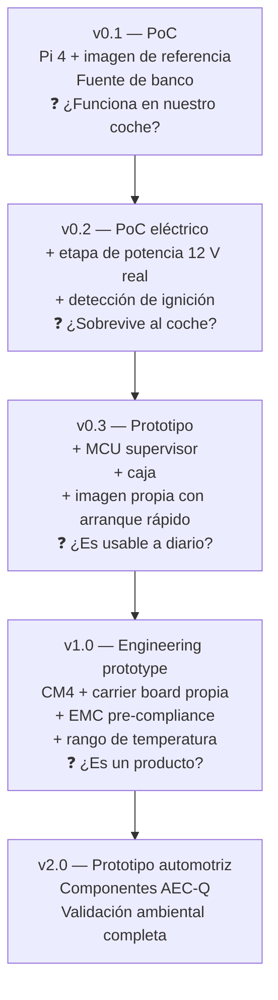
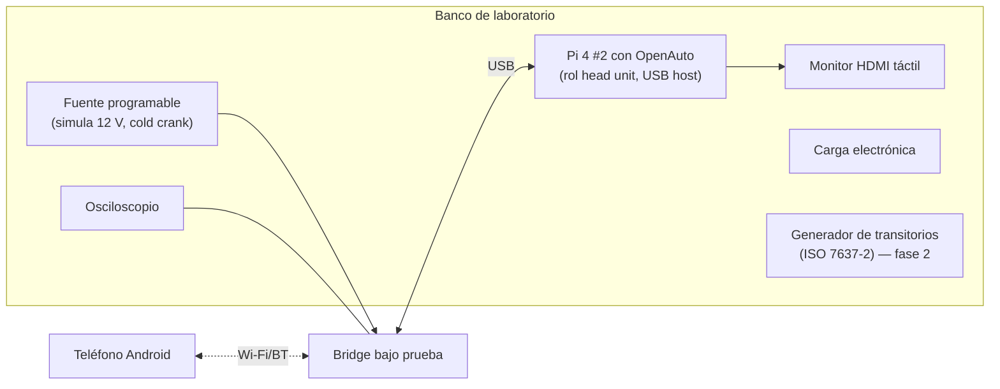
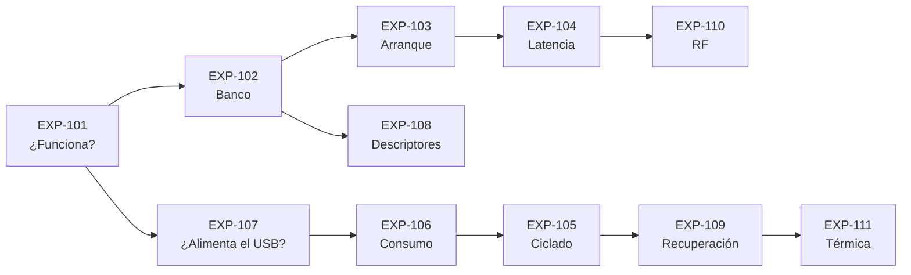

# PROJECT 01 — CARPLAY BRIDGE · Prototype Plan

---

## 1. CARPLAY BRIDGE MVP v0.1 — definición

**Clasificación: PROOF OF CONCEPT.** No es un prototipo, no es un producto. Su único objetivo es responder una pregunta binaria:

> ¿Podemos hacer que **nuestro coche concreto** muestre Android Auto proveniente de un dispositivo que hemos construido nosotros?

### Hardware mínimo

| Elemento | Qué | Por qué |
|---|---|---|
| SBC | Raspberry Pi 4 B 2 GB | USB peripheral + Wi-Fi 5 GHz + encoder (por si acaso) |
| Alimentación | Fuente de banco o adaptador de mechero de calidad, entrando por **GPIO 5 V** | El USB-C queda libre para el modo device |
| Cable | USB-C ↔ USB-A **de datos** (no de carga) | Causa nº1 de "no funciona" |
| Almacenamiento | microSD A2 de 16 GB | Aceptable en PoC |
| Refrigeración | Disipador pasivo | |
| Teléfono | Android 11+ con Wi-Fi 5 GHz | Requisito de AA inalámbrico |
| Vehículo | Uno con Android Auto **cableado** funcionando | Verificar antes con un cable normal |

### Software mínimo

Imagen del proyecto de referencia [`WirelessAndroidAutoDongle`](https://github.com/nisargjhaveri/WirelessAndroidAutoDongle) escrita en la microSD, sin modificaciones.

> **Sí: el PoC v0.1 no requiere escribir código.** El valor está en obtener el resultado binario lo antes posible y con el mínimo de variables. Si funciona, sabemos que la arquitectura B es correcta y todo el trabajo posterior tiene sentido. Si no funciona, lo sabemos antes de gastar en electrónica.

### Criterio de éxito

- ✅ La pantalla del coche muestra Android Auto desde el teléfono, sin cable entre teléfono y coche.
- ✅ El táctil responde.
- ✅ Se oye audio y funciona el micrófono.

### Presupuesto estimado
Orden de magnitud: **< 100 € / 100 USD** si ya se dispone del teléfono y el coche. `[HIPÓTESIS]` — re-cotizar, ver `08_BOM.md`.

---

## 2. Evolución del prototipo

| Versión | Clasificación | Duración estimada `[HIPÓTESIS]` | Entregable |
|---|---|---|---|
| v0.1 | PoC | 1 fin de semana | Vídeo del coche funcionando |
| v0.2 | PoC | 2–4 semanas | HAT de potencia sobre protoboard/PCB simple |
| v0.3 | Prototype | 1–2 meses | Dispositivo instalable, usable a diario |
| v1.0 | Engineering prototype | 3–6 meses | Carrier board CM4, caja de aluminio, informe de EMC |
| v2.0 | Engineering prototype avanzado | 6–12 meses | Validación ambiental, candidato a producción |

---

## 3. Banco de pruebas de laboratorio

Antes de v0.3 hay que dejar de depender del coche para desarrollar. Se construye un **head unit de laboratorio**.

`[PROPUESTA DE DISEÑO]` El "head unit de laboratorio" con OpenAuto **no será idéntico** a un head unit real (`EXP-102` lo verifica), pero permite iterar 20 veces al día en lugar de 2, y permite automatizar pruebas de regresión.

---

## 4. Experimentos

### EXP-101 — Validación de la arquitectura B en vehículo real

| Campo | Contenido |
|---|---|
| **Hipótesis** | Un Raspberry Pi 4 con la imagen de referencia consigue que el head unit de nuestro vehículo muestre Android Auto proveniente de un teléfono conectado inalámbricamente |
| **Hardware** | Pi 4 B 2 GB, microSD, cable USB-C de datos, alimentación por GPIO, teléfono Android 11+, vehículo con AA cableado |
| **Software** | Imagen precompilada de `WirelessAndroidAutoDongle` |
| **Procedimiento** | 1) Verificar que AA funciona con cable directo. 2) Flashear la imagen. 3) Alimentar el Pi por GPIO. 4) Conectar el Pi al puerto USB del coche. 5) Emparejar el teléfono por Bluetooth. 6) Esperar la sesión |
| **Medición** | Tiempo desde alimentar hasta ver AA en pantalla; ¿responde el táctil?; ¿hay audio?; ¿funciona el micro?; latencia subjetiva |
| **Éxito** | AA visible y usable, sesión estable ≥ 20 min |
| **Fallo** | No enumera, no se establece sesión, o la sesión cae repetidamente |
| **Decisión siguiente** | ✅ → seguir con EXP-102/103. ❌ → capturar `dmesg` y logs, revisar si el head unit exige descriptores concretos (EXP-108). Si el fallo es estructural, reevaluar arquitecturas C/E |

---

### EXP-102 — Head unit de laboratorio

| Campo | Contenido |
|---|---|
| **Hipótesis** | Un segundo Pi ejecutando OpenAuto reproduce el comportamiento de un head unit real lo suficiente como para servir de banco de desarrollo |
| **Hardware** | Pi 4 #2 + monitor HDMI (idealmente táctil), Bridge bajo prueba |
| **Software** | OpenAuto + aasdk |
| **Procedimiento** | Montar OpenAuto como host USB; conectar el Bridge; comparar la traza de enumeración y de negociación con la capturada en EXP-101 en el coche real |
| **Medición** | Diferencias en el handshake AOAP; resoluciones negociadas; comportamiento ante desconexión |
| **Éxito** | Las diferencias son conocidas y acotadas; se puede desarrollar contra el banco |
| **Fallo** | Comportamiento sustancialmente distinto → el banco sólo sirve para pruebas de humo |
| **Decisión siguiente** | Define cuánto podemos desarrollar sin coche |

---

### EXP-103 — Tiempo de arranque

| Campo | Contenido |
|---|---|
| **Hipótesis** | Es posible llegar de 0 V a gadget USB enumerado en < 15 s, y a sesión activa en < 30 s |
| **Hardware** | Bridge, osciloscopio o analizador lógico con marca en GPIO, banco EXP-102 |
| **Software** | Instrumentación con GPIO en hitos del arranque + `systemd-analyze` |
| **Procedimiento** | Marcar con GPIO: (a) inicio del kernel, (b) rootfs montado, (c) gadget creado, (d) hostapd listo, (e) sesión activa. Medir 20 arranques |
| **Medición** | Tiempos p50/p95 de cada hito |
| **Éxito** | (c) < 15 s y (e) < 30 s de forma consistente |
| **Fallo** | > 30 s a sesión, o el head unit deja de reintentar antes de que estemos listos |
| **Decisión siguiente** | Si falla: quitar systemd, reducir servicios, precargar el gadget desde initramfs |

---

### EXP-104 — Latencia añadida por el Bridge

| Campo | Contenido |
|---|---|
| **Hipótesis** | El Bridge añade < 50 ms p95 sobre la conexión cableada equivalente |
| **Hardware** | Cámara de alta velocidad (240 fps o más, sirve un móvil moderno), o fotodiodo + osciloscopio sobre la pantalla |
| **Software** | App de test en el teléfono que cambie toda la pantalla a blanco al recibir un toque |
| **Procedimiento** | Medir "toque → cambio de pantalla" en tres configuraciones: (1) teléfono con cable al coche, (2) teléfono con adaptador comercial, (3) teléfono con nuestro Bridge. 30 repeticiones cada una |
| **Medición** | Latencia extremo a extremo p50/p95/p99 por configuración; además, marca de tiempo interna del ProxyEngine |
| **Éxito** | Δ(config 3 − config 1) < 50 ms p95 |
| **Fallo** | Δ > 100 ms, o jitter > 30 ms |
| **Decisión siguiente** | Si falla: analizar si es Wi-Fi (canal/RSSI), buffers (bufferbloat) o CPU. Ver §3 de `05_SOFTWARE_ARCHITECTURE.md` |

---

### EXP-105 — Ciclado de energía

| Campo | Contenido |
|---|---|
| **Hipótesis** | Con rootfs de sólo lectura, 500 cortes de alimentación en momentos aleatorios no corrompen el sistema |
| **Hardware** | Fuente programable o relé controlado, Bridge |
| **Software** | Script que corta la alimentación en un instante aleatorio entre 0 y 60 s tras el arranque, y verifica integridad al volver |
| **Procedimiento** | 500 ciclos automatizados durante una noche |
| **Medición** | Nº de arranques fallidos, nº de errores de sistema de ficheros, integridad de la partición de datos |
| **Éxito** | 0 fallos irrecuperables; ≤ 1 % de arranques con recuperación automática |
| **Fallo** | Cualquier corrupción irrecuperable |
| **Decisión siguiente** | Si falla: revisar montajes, `sync` en escrituras de datos, cambiar a f2fs, o reducir aún más lo escribible |

---

### EXP-106 — Consumo

| Campo | Contenido |
|---|---|
| **Hipótesis** | Consumo medio en sesión < 5 W; consumo en reposo (ACC OFF) < 1 mA @ 12 V |
| **Hardware** | Multímetro con rango de µA (o amperímetro tipo Power Profiler), fuente de banco |
| **Software** | — |
| **Procedimiento** | Medir en: arranque, idle, sesión activa, apagado con B+ presente. Registrar 10 min de cada estado |
| **Medición** | Corriente media, pico, y consumo en reposo |
| **Éxito** | Cumple NFR-07 |
| **Fallo** | Reposo > 5 mA → la batería del coche se agotaría en semanas |
| **Decisión siguiente** | Identificar el culpable (LDO, buck, LED, pull-ups) y rediseñar la etapa de potencia |

---

### EXP-107 — Alimentación desde el puerto USB del vehículo

| Campo | Contenido |
|---|---|
| **Hipótesis** | El puerto USB del head unit **no** suministra corriente suficiente ni estable para alimentar el Bridge |
| **Hardware** | Bridge, medidor de corriente USB en línea, vehículo real |
| **Software** | — |
| **Procedimiento** | Alimentar sólo por USB del coche. Medir tensión y corriente durante arranque y sesión. Provocar picos de CPU |
| **Medición** | V_bus bajo carga, corriente máxima antes de que el puerto corte, número de cortes en 30 min |
| **Éxito de la hipótesis** | El puerto no basta ⇒ confirma que hay que alimentar de 12 V (arquitectura ya asumida) |
| **Refutación** | El puerto basta ⇒ se simplifica enormemente la instalación y el producto (¡sería una gran noticia!) |
| **Decisión siguiente** | Determina si el producto necesita cableado a 12 V o es plug-and-play |

---

### EXP-108 — Sensibilidad a los descriptores USB

| Campo | Contenido |
|---|---|
| **Hipótesis** | Algunos head units aceptan o rechazan el gadget en función del VID/PID o de las cadenas de fabricante/modelo |
| **Hardware** | Bridge, varios vehículos (o el banco EXP-102 modificado) |
| **Software** | Script que reconstruye el gadget con distintos conjuntos de descriptores |
| **Procedimiento** | Barrer combinaciones de VID/PID y strings; registrar cuáles llegan a `START_ACCESSORY` |
| **Medición** | Tasa de éxito por combinación y por vehículo |
| **Éxito** | Se encuentra un conjunto que funcione en todos los vehículos probados, o se caracteriza la necesidad de perfiles |
| **Fallo** | Cada coche necesita algo distinto sin patrón |
| **Decisión siguiente** | Define si hace falta una base de datos de perfiles de compatibilidad (Q-S07) |

---

### EXP-109 — Recuperación ante desconexión USB en caliente

| Campo | Contenido |
|---|---|
| **Hipótesis** | El head unit tolera que el gadget desaparezca y vuelva durante la sesión, y restablece la proyección sin reiniciarse |
| **Hardware** | Bridge con capacidad de destruir/recrear el gadget bajo demanda |
| **Software** | Comando de test |
| **Procedimiento** | Provocar 20 desconexiones lógicas durante sesión activa; medir si y en cuánto tiempo se restablece |
| **Medición** | Tasa de recuperación, tiempo de recuperación, ¿requiere intervención del usuario? |
| **Éxito** | ≥ 90 % de recuperaciones automáticas en < 15 s |
| **Fallo** | El head unit requiere ciclo de contacto |
| **Decisión siguiente** | Define la estrategia de recuperación de errores del `SessionManager` |

---

### EXP-110 — Robustez del enlace inalámbrico

| Campo | Contenido |
|---|---|
| **Hipótesis** | La sesión sobrevive a interrupciones breves de Wi-Fi (< 3 s) sin caerse |
| **Hardware** | Bridge, teléfono, jaula o atenuador RF (o simplemente distancia/obstáculo) |
| **Software** | Script que baja la interfaz Wi-Fi durante N segundos |
| **Procedimiento** | Interrupciones de 0,5 / 1 / 2 / 3 / 5 s, 10 repeticiones cada una |
| **Medición** | ¿Cae la sesión? ¿Cuánto tarda en recuperarse? ¿Qué ve el usuario? |
| **Éxito** | Interrupciones ≤ 2 s no tumban la sesión |
| **Fallo** | Cualquier interrupción tumba la sesión → mala UX en aparcamientos y túneles |
| **Decisión siguiente** | Ajustar timeouts y buffers de reintento |

---

### EXP-111 — Térmica en vehículo real

| Campo | Contenido |
|---|---|
| **Hipótesis** | En un coche aparcado al sol en verano, el dispositivo en su ubicación prevista se mantiene por debajo del umbral de throttling |
| **Hardware** | Bridge con caja definitiva, registradores de temperatura (termopares o sensores I²C), cámara termográfica |
| **Software** | Registro de temperatura del SoC y frecuencia de CPU |
| **Procedimiento** | Instalar en la ubicación prevista; registrar 8 h en un día de verano; incluir 1 h de sesión activa tras el remojo térmico |
| **Medición** | T ambiente interna, T de la caja, T del SoC, ocurrencia de throttling |
| **Éxito** | Sin throttling durante 30 min de sesión tras 4 h al sol |
| **Fallo** | Throttling o apagado |
| **Decisión siguiente** | Rediseño térmico, cambio de ubicación recomendada, o cambio a CM industrial |

---

## 5. Orden recomendado de ejecución

**EXP-101 es la puerta.** Todo lo demás depende de su resultado. Es barato, rápido y decisivo: hacerlo primero, esta semana.
