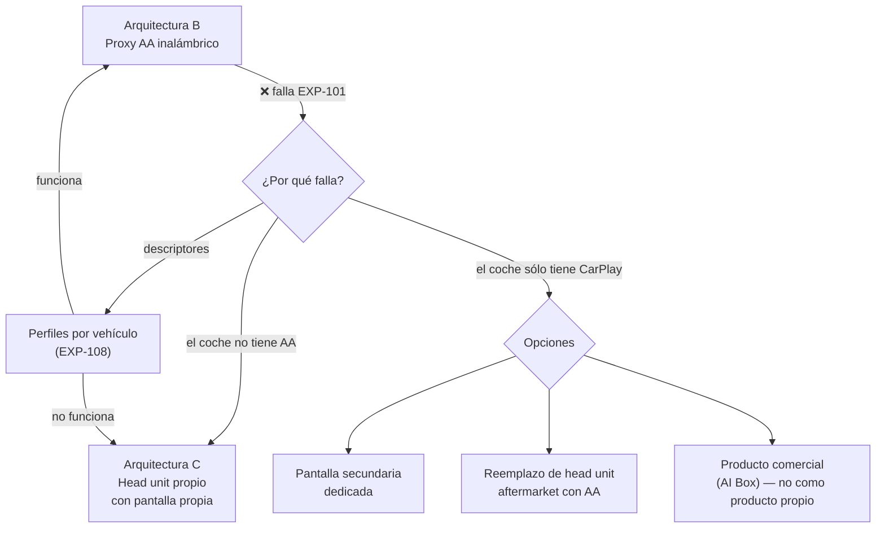

# PROJECT 01 — CARPLAY BRIDGE · Risks and Open Questions

---

## 1. Registro de riesgos

Escala: **P** = probabilidad (1–5), **I** = impacto (1–5), **R** = P × I.

| ID | Riesgo | P | I | R | Categoría | Mitigación |
|---|---|---|---|---|---|---|
| **R-01** | **El head unit de nuestro coche no acepta el gadget** (descriptores, timing o comportamiento no previsto) | 3 | 5 | **15** | Técnico | `EXP-101` lo detecta en el primer fin de semana. Mitigación: `EXP-108` (barrido de descriptores), perfiles por vehículo |
| **R-02** | **La larga cola de head units es inabordable**: funciona en 3 coches y falla en 30 | 4 | 4 | **16** | Técnico / producto | Base de datos de perfiles; empezar por un conjunto acotado de vehículos objetivo; el proyecto de referencia ya admite estar probado en "a very limited set of headunits" |
| **R-03** | **Google o los fabricantes cambian el protocolo** y rompen la compatibilidad | 2 | 5 | **10** | Externo | Arquitectura pass-through (no interpretamos el protocolo) → somos mucho menos frágiles que un reimplementador. Es la mayor ventaja de la arquitectura elegida |
| **R-04** | **Latencia percibida inaceptable** | 2 | 4 | 8 | Técnico | `EXP-104` con criterio numérico; presupuesto de latencia ya calculado con margen |
| **R-05** | **Sobretemperatura en verano** con throttling o apagado | 4 | 3 | **12** | Térmico | Migrar a CM industrial, caja de aluminio, ubicación recomendada, `EXP-111` |
| **R-06** | **Consumo parásito descarga la batería** del vehículo | 3 | 5 | **15** | Eléctrico | Requisito duro NFR-07 (< 1 mA), MCU supervisor, `EXP-106`. Riesgo de reputación grave si se materializa |
| **R-07** | **Licencias de software**: reutilizar código GPL o protocolo reverse-engineered en un producto comercial | 3 | 4 | **12** | Legal | Decidir pronto: (a) uso personal/I+D — riesgo bajo; (b) producto — revisión legal y posible reimplementación limpia. **No dejar esta decisión para después de escribir el código** |
| **R-08** | **Daño al puerto USB del vehículo** por backfeed o sobrecarga | 2 | 5 | **10** | Eléctrico | Diodo ideal/load switch unidireccional obligatorio; `EXP-107` |
| **R-09** | **Interferencia con sistemas del vehículo** (radio, GNSS, CAN si se añade) | 3 | 4 | **12** | EMC / seguridad | Pre-compliance temprano; **CAN sólo lectura y aislado** en las primeras versiones. Nunca transmitir en el bus del vehículo sin una justificación y una validación exhaustivas |
| **R-10** | **Corrupción de almacenamiento** por cortes de energía | 4 | 3 | **12** | Software | Rootfs de sólo lectura + A/B; `EXP-105` |
| **R-11** | **Distracción del conductor / responsabilidad** si el dispositivo falla en marcha | 2 | 5 | **10** | Producto / legal | Modo de fallo seguro: si el Bridge muere, el head unit vuelve a su interfaz nativa. Nunca bloquear funciones del vehículo |
| **R-12** | **Obsolescencia de la plataforma de cómputo** (fin de vida del CM4) | 2 | 3 | 6 | Suministro | Raspberry Pi publica compromisos de disponibilidad; abstraer la plataforma en el software |
| **R-13** | **Componentes Wi-Fi/BT sin certificación reutilizable** obligan a re-certificar el conjunto | 3 | 3 | 9 | Normativo | Usar módulos pre-certificados con antenas homologadas |
| **R-14** | **Apple/Google cambian su postura hacia los adaptadores** de terceros | 2 | 4 | 8 | Externo | Nuestro producto no depende de una autenticación que puedan revocar (a diferencia de la ruta CarPlay) |
| **R-15** | **El proyecto pierde foco** persiguiendo compatibilidad con CarPlay | 3 | 3 | 9 | Gestión | Este documento existe precisamente para cerrar esa discusión. **CarPlay = fuera de alcance salvo ruta de head unit certificado** |

### Riesgos por encima del umbral (R ≥ 12): atención prioritaria

1. **R-02** (16) — la larga cola de head units
2. **R-01** (15) — nuestro coche no funciona
3. **R-06** (15) — consumo parásito
4. **R-05**, **R-07**, **R-09**, **R-10** (12)

---

## 2. Incógnitas (unknowns)

Cosas que **no sabemos** y que no son opinables: hay que medirlas.

| ID | Incógnita | Cómo se resuelve |
|---|---|---|
| **U-01** | ¿Funciona la arquitectura B en nuestro vehículo concreto? | `EXP-101` |
| **U-02** | ¿Cuánto tarda un head unit real en dejar de reintentar la enumeración? | `EXP-103` + `EXP-108` |
| **U-03** | ¿Cuánta latencia añade realmente el Bridge? | `EXP-104` |
| **U-04** | ¿El puerto USB del coche puede alimentarnos? | `EXP-107` |
| **U-05** | ¿Qué descriptores USB exige cada head unit? | `EXP-108` |
| **U-06** | ¿Cuál es el consumo real en reposo del diseño? | `EXP-106` |
| **U-07** | ¿Qué temperatura alcanza el dispositivo en verano en su ubicación? | `EXP-111` |
| **U-08** | ¿El banco OpenAuto es representativo de un head unit real? | `EXP-102` |
| **U-09** | ¿Existe alguna ruta contractual con Google para adaptadores AA? | Investigación comercial/legal, no técnica |
| **U-10** | ¿Qué licencias exactas aplican al código que reutilicemos y cómo afectan a un producto? | Revisión legal de `aasdk`, OpenAuto y WirelessAndroidAutoDongle |
| **U-11** | ¿Los módulos Wi-Fi de CM4/CM5 permiten usar antena externa manteniendo la certificación? | Consulta al fabricante |
| **U-12** | ¿Qué margen de EMC tenemos con un buck conmutando cerca de la banda AM? | Medición con sondas near-field |

---

## 3. Enfoques alternativos si la ruta principal falla

| Alternativa | Cuándo se activa | Coste de cambio |
|---|---|---|
| Perfiles de descriptores por vehículo | Si falla por incompatibilidad de enumeración | Bajo (software) |
| Head unit propio con pantalla propia (arq. C) | Si el vehículo no soporta AA | Medio (añade pantalla y mecánica) |
| Pantalla secundaria dedicada | Vehículos sin proyección alguna | Medio |
| Reemplazo de head unit aftermarket | Solución de usuario, no de producto | — |
| Ruta MFi de head unit certificado (arq. F) | Sólo si hay justificación comercial fuerte | Muy alto |

---

## 4. Recomendación técnica actual

### Qué hacer

1. **Ejecutar EXP-101 esta semana.** Coste ~105 €, duración un fin de semana, resultado binario. Todo el proyecto depende de él.
2. **En paralelo, el ingeniero electrónico arranca con la etapa de potencia**, que es independiente del resultado de EXP-101 y es trabajo reutilizable incluso si cambiamos de arquitectura.
3. **Comprar los tres dispositivos de referencia** (`08_BOM.md` §5) para tener puntos de comparación medibles.
4. **Cerrar la cuestión de licencias (R-07/U-10) antes de escribir código propio**, no después.

### Qué no hacer

1. ❌ **No perseguir la emulación de CarPlay.** Está cerrada por diseño de Apple, y el brief prohíbe eludir autenticación. Toda hora invertida ahí es una hora perdida.
2. ❌ **No usar Raspberry Pi 5** en este proyecto: más consumo, más calor, sin encoder de vídeo, sin ventaja para un proxy de red.
3. ❌ **No usar módulos buck genéricos** si el dispositivo va a quedarse conectado a la batería (R-06).
4. ❌ **No diseñar la PCB antes de EXP-101 y EXP-107.** Esos dos experimentos cambian requisitos de la placa.
5. ❌ **No tocar el bus CAN** hasta tener una razón funcional concreta y una estrategia de aislamiento y de sólo lectura.

### La frase para el ingeniero

> El protocolo, que parecía la parte imposible, está resuelto y es verificable en un fin de semana con 105 €. **El trabajo real de este proyecto es electrónico:** sobrevivir al entorno eléctrico del vehículo, no descargar la batería, no cocerse en verano, arrancar en menos de 15 segundos y no morir tras 500 cortes de corriente. Ahí es donde el proyecto se gana o se pierde.
