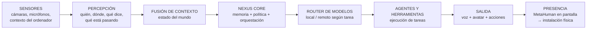
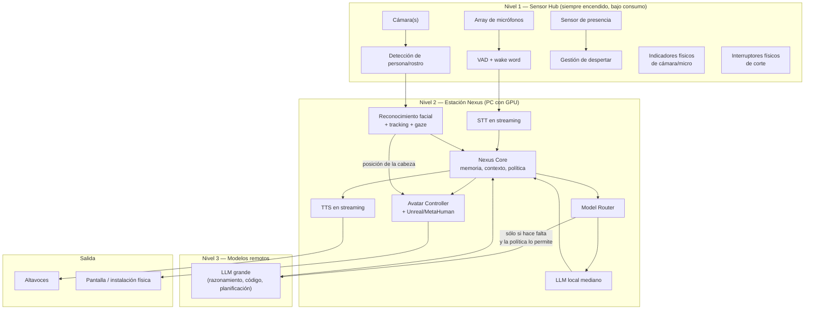

# PROJECT 02 — NEXUS · Executive Summary

## 1. Qué es

**Nexus** es un compañero digital personal: un sistema que escucha, ve, reconoce, recuerda, razona, actúa sobre el ordenador y el entorno, y — progresivamente — adquiere una representación visual y física como humano digital.

No es un chatbot. Es una **arquitectura de percepción + orquestación + actuación + presencia**, en la que el modelo de lenguaje es sólo uno de los componentes.

---

## 2. Qué queremos conseguir

| # | Capacidad | Estado hoy |
|---|---|---|
| G1 | Conversación por voz natural, con interrupción (barge-in) y latencia conversacional | `PROVEN BUT REQUIRES INTEGRATION` |
| G2 | Reconocerme por la cara y adaptar el comportamiento según quién esté delante | `PROVEN BUT REQUIRES INTEGRATION` |
| G3 | Memoria persistente: recordar hechos, preferencias e historia | `PROVEN BUT REQUIRES INTEGRATION` |
| G4 | Usar varios modelos (locales y remotos) eligiendo el adecuado por tarea | `PROVEN BUT REQUIRES INTEGRATION` |
| G5 | Ejecutar tareas reales: herramientas, automatización, control del ordenador | `PROVEN BUT REQUIRES INTEGRATION` |
| G6 | Avatar MetaHuman que habla con labios sincronizados y mira al usuario | `PROVEN BUT REQUIRES INTEGRATION` |
| G7 | Cuerpo completo con lenguaje corporal y movimiento | `EXPERIMENTAL` |
| G8 | Presencia física en una superficie transparente a tamaño real | `RESEARCH REQUIRED` |
| G9 | Privacidad verificable: procesamiento local por defecto, control físico de sensores | `READY NOW` (es una decisión de diseño, no un problema técnico) |

---

## 3. Las tres correcciones técnicas más importantes

### 3.1 "Pantalla LED transparente" probablemente **no** es la tecnología correcta

La visión describe una superficie vertical transparente donde aparece Nexus a tamaño real. La investigación dice:

| Tecnología | Transparencia | Pixel pitch | Distancia mínima de visión | ¿Sirve para una cara a 1–2 m? |
|---|---|---|---|---|
| LED transparente (film/rejilla) | 35–85 % | **3,9–25 mm** | ≈ pitch en metros → **4–25 m** | ❌ **No.** A 1,5 m verías puntos, no una cara |
| OLED transparente | ~40 % | ~0,1–0,2 mm | < 1 m | ⚠️ Sí, pero disponibilidad y tamaño limitados |
| MicroLED transparente | variable | fino | < 1 m | ⚠️ Prototipos/concepto, no producto accesible |
| Pepper's Ghost (film + proyector/panel) | efecto de transparencia | el de la fuente | < 1 m | ✅ **Sí, y es la ruta práctica hoy** |
| Light field / Looking Glass HLD | opaco | 4K | < 1 m | ⚠️ Da profundidad, pero no es transparente |

`[CONFIRMADO]` El pixel pitch de LED transparente comercial va de ~3,9 mm a ~25 mm y la transparencia sube al aumentar el pitch — es decir, **cuanta más transparencia, peor resolución**. Fuentes en `08_TRANSPARENT_DISPLAY_RESEARCH.md`.

> **Corrección:** lo que la visión describe ("una entidad que parece estar ahí, de cuerpo entero, tras un cristal") se consigue **mejor y antes** con una configuración tipo **Pepper's Ghost** (panel de alto brillo + lámina semirreflectante) que con LED transparente. El LED transparente es una tecnología de **escaparate y fachada**, pensada para verse desde 10 metros.

### 3.2 "Un cerebro grande corriendo en local" no es la arquitectura correcta

Ver `../03_Edge_AI_Research/` completo. Resumen: en hardware de bajo consumo, el límite es el **ancho de banda de memoria**. Un modelo de 70B en una Raspberry Pi no es "lento": es inviable por dos órdenes de magnitud.

> **Corrección:** la arquitectura correcta es una **jerarquía**: modelos pequeños y especializados en el dispositivo (VAD, wake word, cara, tracking), un modelo mediano en un servidor doméstico, y un modelo grande remoto para razonamiento profundo. El router decide.

### 3.3 El avatar no es "un modelo 3D bonito": es un problema de latencia

La cadena LLM → texto → TTS → fonemas → animación facial → render → pantalla tiene un presupuesto de tiempo. Si el avatar responde 2 segundos tarde, deja de sentirse vivo, por muy realista que sea el MetaHuman.

> **Corrección:** priorizar **arquitectura de streaming** (TTS y animación empezando antes de que el LLM termine) sobre fidelidad visual. Un avatar sencillo y reactivo se siente más vivo que un MetaHuman fotorrealista con 2 s de retardo.

---

## 4. Restricción de licencia importante sobre MetaHuman

`[CONFIRMADO]` Desde Unreal Engine 5.6 (junio 2025) MetaHuman está integrado en el motor, es gratuito para individuos y estudios por debajo de 1 M USD de ingresos anuales, y el EULA permite usar los personajes **en otros motores y herramientas** (Unity, Godot, Blender, Maya).

`[CONFIRMADO]` **Pero el EULA prohíbe usar MetaHumans para entrenar, construir, mejorar o probar cualquier modelo de IA / ML / red neuronal o base de datos.**

**Qué significa para Nexus:**
- ✅ Usar un MetaHuman como **avatar animado en tiempo real** por nuestro sistema: permitido.
- ❌ Grabar el MetaHuman para **entrenar** un modelo de generación de caras, de lipsync o de vídeo: **prohibido**.
- ⚠️ Zona a verificar con asesoría legal: usar salidas del MetaHuman como datos de evaluación de un modelo propio.

Esto **no bloquea el proyecto**, pero sí bloquea una ruta concreta (destilar el avatar a un modelo generativo ligero). Fuentes en `06_METAHUMAN_ARCHITECTURE.md`.

---

## 5. Experiencia de usuario objetivo

| Momento | Cómo debería sentirse |
|---|---|
| Entro en la habitación | Nexus gira la mirada hacia mí antes de que yo hable. Me reconoce. No dice nada si no procede |
| Le hablo | Responde en menos de un segundo, con voz natural. Si le interrumpo, se calla inmediatamente |
| Le pido algo complejo | Reconoce que va a tardar, lo dice, y trabaja. No me deja mirando una pantalla congelada |
| Hay otra persona | Sabe que hay alguien más. Cambia de comportamiento (no revela información privada) |
| No le hablo en 3 horas | No hace nada. No interrumpe. Está presente pero no molesta |
| Cierro los sensores | Un indicador **físico** confirma que la cámara y el micrófono están cortados. No es un icono en pantalla: es hardware |

> El criterio de éxito de la UX no es "impresiona en una demo", es **"me acostumbro a que esté ahí"**.

---

## 6. Arquitectura en una figura

---

## 7. Fases del proyecto

| Fase | Nombre | Contenido | Requiere ingeniero electrónico |
|---|---|---|---|
| **NEXUS 0** | Núcleo de software | Memoria, router de modelos, herramientas, agentes. Sin voz ni visión | ❌ |
| **NEXUS 1** | Voz | Wake word, VAD, STT/TTS en streaming, barge-in | ⚠️ (elección de array de micrófonos) |
| **NEXUS 2** | Visión | Detección, reconocimiento facial, tracking, gaze | ⚠️ (cámaras, iluminación IR) |
| **NEXUS 3** | Avatar | MetaHuman con lipsync y mirada dirigida al usuario | ❌ |
| **NEXUS 4** | Sensor Hub dedicado | Hardware propio: array de micrófonos, cámaras, presencia, indicadores, kill switches | ✅✅ **aquí entra de lleno** |
| **NEXUS 5** | Presencia física | Instalación con display, óptica, mecánica, térmica, alimentación | ✅✅ |
| **NEXUS 6** | Cuerpo completo interactivo | Cuerpo entero, seguimiento de personas, lenguaje corporal | ✅ |

> **Se puede llegar hasta NEXUS 3 sin tocar un soldador.** Eso es deliberado: valida el concepto antes de invertir en hardware.

---

## 8. Recomendación inmediata

1. **Empezar por NEXUS 1 (voz) con hardware comprado, no diseñado.** Un array de micrófonos USB con procesamiento embebido (tipo ReSpeaker XVF3800, que ya incluye AEC, beamforming, DoA y VAD `[CONFIRMADO]`) elimina el 80 % del trabajo difícil de audio.
2. **Medir la latencia conversacional desde el primer día.** Es el requisito que define si el sistema se siente vivo. Ver `05_AUDIO_SYSTEM.md` §4.
3. **No comprar todavía ninguna pantalla transparente.** Primero hacer una maqueta de Pepper's Ghost a escala con material barato (`EXP-2xx` en `10_PROTOTYPE_ROADMAP.md`).
4. **Decidir la política de privacidad antes de escribir el código de percepción**, no después. Los indicadores físicos y los kill switches son requisitos de hardware que hay que prever desde el principio.

---

## Documentos relacionados

| Documento | Contenido |
|---|---|
| `02_SYSTEM_VISION.md` | Visión completa, casos de uso, requisitos |
| `03_AI_ARCHITECTURE.md` | Core, memoria, router de modelos, agentes |
| `04_VISION_SYSTEM.md` | Detección, reconocimiento, tracking, gaze, privacidad |
| `05_AUDIO_SYSTEM.md` | Wake word, VAD, STT, TTS, barge-in, latencia |
| `06_METAHUMAN_ARCHITECTURE.md` | Avatar, animación, licencias, pipeline |
| `07_SENSOR_HARDWARE.md` | **Electrónica del Sensor Hub** |
| `08_TRANSPARENT_DISPLAY_RESEARCH.md` | Comparativa completa de tecnologías de display |
| `09_SYSTEM_ARCHITECTURE.md` | Arquitectura de sistema, tiempo real, despliegue |
| `10_PROTOTYPE_ROADMAP.md` | Fases y experimentos |
| `11_BOM.md` | Materiales |
| `12_RISKS_AND_OPEN_QUESTIONS.md` | Riesgos y preguntas abiertas |
