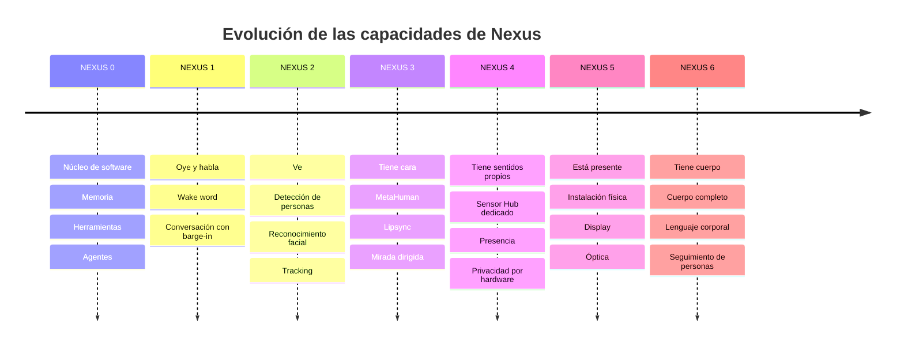

# PROJECT 02 — NEXUS · System Vision

---

## 1. La visión a largo plazo

Nexus no es un producto con una lista de funciones cerrada. Es una **entidad persistente** que acumula capacidades:

La propiedad que define el proyecto no es ninguna capacidad concreta, sino la **continuidad**: la misma identidad, la misma memoria y el mismo comportamiento a través de todas las fases.

---

## 2. Casos de uso que definen el diseño

| # | Caso de uso | Qué exige del sistema |
|---|---|---|
| UC-01 | Entro en la sala; Nexus me mira y me saluda por mi nombre | Detección de presencia + reconocimiento facial + control de mirada + política de "cuándo hablar" |
| UC-02 | Le pido que busque algo mientras hago otra cosa | Ejecución asíncrona de tareas + notificación no intrusiva |
| UC-03 | Le interrumpo a mitad de una frase | Barge-in con corte de TTS en < 200 ms |
| UC-04 | Le pregunto por algo que hablamos hace semanas | Memoria episódica con recuperación semántica |
| UC-05 | Le pido que modifique código en mi ordenador | Agente con acceso a herramientas + permisos + confirmación |
| UC-06 | Hay una visita en casa | Reconocimiento de desconocido + cambio de política de privacidad |
| UC-07 | Le hablo desde el otro lado de la sala con música puesta | Array de micrófonos con AEC y beamforming |
| UC-08 | Está en silencio durante horas | Modo de bajo consumo, sin interrumpir, sin grabar |
| UC-09 | Quiero verificar que no me está escuchando | Indicador físico + kill switch de hardware |
| UC-10 | Se cae Internet | Funcionalidad degradada pero operativa con modelos locales |

> UC-09 y UC-10 son los que separan un producto en el que confías de uno que toleras.

---

## 3. Requisitos funcionales

### Percepción

| ID | Requisito | Fase |
|---|---|---|
| FR-P01 | Detectar actividad de voz en el entorno con falsos positivos bajos | NEXUS 1 |
| FR-P02 | Activarse por palabra clave sin enviar audio a ningún sitio antes de la activación | NEXUS 1 |
| FR-P03 | Transcribir voz a texto en streaming | NEXUS 1 |
| FR-P04 | Identificar al hablante por voz | NEXUS 1+ |
| FR-P05 | Detectar personas en el campo de visión | NEXUS 2 |
| FR-P06 | Reconocer rostros conocidos e identificar desconocidos como tales | NEXUS 2 |
| FR-P07 | Seguir la posición 3D de la cabeza del usuario | NEXUS 2 |
| FR-P08 | Estimar la dirección de la mirada del usuario | NEXUS 2+ |
| FR-P09 | Detectar gestos básicos | NEXUS 2+ |
| FR-P10 | Conocer el contexto del ordenador (aplicación activa, ventana, proyecto) | NEXUS 0+ |
| FR-P11 | Detectar presencia sin usar cámara (para el modo de bajo consumo) | NEXUS 4 |

### Cognición

| ID | Requisito | Fase |
|---|---|---|
| FR-C01 | Mantener memoria de corto plazo (conversación actual) | NEXUS 0 |
| FR-C02 | Mantener memoria de largo plazo con recuperación semántica | NEXUS 0 |
| FR-C03 | Mantener perfiles por persona identificada | NEXUS 2 |
| FR-C04 | Enrutar cada petición al modelo adecuado según tarea, latencia, privacidad, coste y disponibilidad | NEXUS 0 |
| FR-C05 | Descomponer tareas complejas y coordinar agentes | NEXUS 0 |
| FR-C06 | Ejecutar herramientas con permisos explícitos y trazabilidad | NEXUS 0 |
| FR-C07 | Funcionar en modo degradado sin conexión a Internet | NEXUS 0 |

### Expresión

| ID | Requisito | Fase |
|---|---|---|
| FR-E01 | Sintetizar voz en streaming con calidad natural | NEXUS 1 |
| FR-E02 | Interrumpirse inmediatamente cuando el usuario habla | NEXUS 1 |
| FR-E03 | Animar el rostro del avatar sincronizado con la voz | NEXUS 3 |
| FR-E04 | Expresar emociones coherentes con el contenido | NEXUS 3 |
| FR-E05 | Dirigir la mirada y la cabeza del avatar hacia el usuario real | NEXUS 3 |
| FR-E06 | Usar lenguaje corporal y gestos | NEXUS 6 |
| FR-E07 | Renderizar el avatar a tamaño real en una superficie física | NEXUS 5 |

### Privacidad y control

| ID | Requisito | Fase |
|---|---|---|
| FR-S01 | Procesar audio y vídeo localmente por defecto | NEXUS 1 |
| FR-S02 | Indicador **físico** de cámara activa, controlado por hardware, no por software | NEXUS 4 |
| FR-S03 | Indicador **físico** de micrófono activo | NEXUS 4 |
| FR-S04 | Interruptor físico que corta la alimentación de cámara y micrófono | NEXUS 4 |
| FR-S05 | Base de datos de rostros cifrada, con embeddings y no con imágenes | NEXUS 2 |
| FR-S06 | Política de retención configurable con borrado efectivo | NEXUS 2 |
| FR-S07 | Registro auditable de qué se envió a un servicio remoto y cuándo | NEXUS 0 |

---

## 4. Requisitos no funcionales

| ID | Categoría | Requisito | Cómo se verifica |
|---|---|---|---|
| NFR-01 | Latencia | **Fin de habla del usuario → primer audio de respuesta < 1 000 ms p95** | Medición instrumentada (`EXP-201`) |
| NFR-02 | Latencia | Barge-in: usuario habla → TTS silenciado < 200 ms | `EXP-202` |
| NFR-03 | Latencia | Wake word → sistema escuchando < 300 ms | `EXP-201` |
| NFR-04 | Latencia | Movimiento de la cabeza del usuario → mirada del avatar < 200 ms | `EXP-205` |
| NFR-05 | Precisión | Reconocimiento facial: FAR < 0,1 % con FRR < 5 % en condiciones de la instalación | `EXP-203` |
| NFR-06 | Precisión | Wake word: < 1 falso positivo cada 24 h | `EXP-204` |
| NFR-07 | Disponibilidad | Funcionalidad conversacional básica sin Internet | Prueba con red cortada |
| NFR-08 | Consumo | Sensor Hub en reposo (esperando wake word) < 3 W | Medición |
| NFR-09 | Térmica | Instalación física sin ventiladores audibles en modo conversación | Medición SPL |
| NFR-10 | Ruido | El sistema no debe superar 30 dBA a 1 m en reposo | Medición SPL |
| NFR-11 | Privacidad | Ningún audio ni vídeo sale del dispositivo sin una acción explícita del router y un registro | Auditoría de código + captura de red |
| NFR-12 | Mantenibilidad | Cada subsistema (audio, visión, avatar) puede reiniciarse sin reiniciar el resto | Prueba |
| NFR-13 | Escalabilidad | La arquitectura admite añadir sensores y modelos sin rediseño | Revisión de arquitectura |

---

## 5. Presupuesto de latencia conversacional

Este es el número que determina si Nexus "se siente vivo".

| Etapa | Objetivo | Realista hoy | Etiqueta |
|---|---|---|---|
| Detección de fin de turno | 100–300 ms | Los sistemas modernos usan detección semántica de turno, no un temporizador de silencio fijo | `[CONFIRMADO]` que existe esta técnica |
| STT (streaming, ya casi completo al terminar de hablar) | 50–150 ms | | `[INFERENCIA]` |
| Construcción de contexto + recuperación de memoria | 20–100 ms | Depende del índice vectorial | `[INFERENCIA]` |
| LLM: tiempo hasta el primer token | 150–600 ms local / 300–800 ms remoto | | `[INFERENCIA]` |
| TTS: tiempo hasta el primer audio | 90–300 ms | Sistemas comerciales de gama alta declaran ~90 ms | `[CONFIRMADO]` (dato de proveedor) |
| Reproducción y buffer de salida | 20–80 ms | | `[INFERENCIA]` |
| **TOTAL** | **430–1 530 ms** | | |

**Objetivo NFR-01: < 1 000 ms p95.** Es alcanzable, pero no sobra nada. `[INFERENCIA]`

### Las tres reglas que hacen posible cumplirlo

1. **Todo en streaming.** El TTS empieza a hablar con la primera frase del LLM, no cuando termina. El STT transcribe mientras el usuario habla.
2. **El primer token importa más que los tokens/segundo.** Un modelo que da el primer token en 200 ms y luego va a 20 t/s se siente mejor que uno que tarda 800 ms y va a 60 t/s.
3. **Los lazos rápidos nunca salen del dispositivo.** VAD, wake word, corte de barge-in y tracking facial se ejecutan localmente siempre. Sólo el razonamiento puede ir a la red.

---

## 6. Clasificación temporal de los componentes

| Componente | Clase | Presupuesto | Dónde debe ejecutarse |
|---|---|---|---|
| VAD | **REAL-TIME** | < 30 ms | Sensor Hub |
| Wake word | **REAL-TIME** | < 200 ms | Sensor Hub |
| Corte de TTS por barge-in | **REAL-TIME** | < 200 ms | Estación (o Sensor Hub) |
| Cancelación de eco acústico (AEC) | **REAL-TIME (duro)** | < 10 ms | **Hardware dedicado** (DSP del array) |
| Tracking de la cabeza para la mirada del avatar | **REAL-TIME** | < 100 ms | Estación (GPU) |
| Render del avatar | **REAL-TIME** | 16,7 ms (60 fps) | Estación (GPU) |
| STT en streaming | NEAR-REAL-TIME | < 300 ms | Estación |
| TTS en streaming | NEAR-REAL-TIME | < 300 ms al primer audio | Estación o remoto |
| Reconocimiento facial (identificación) | NEAR-REAL-TIME | < 500 ms | Estación o acelerador |
| LLM conversacional | NEAR-REAL-TIME | < 600 ms al primer token | Estación o remoto |
| Recuperación de memoria | NEAR-REAL-TIME | < 100 ms | Estación |
| Agentes con herramientas | **ASYNCHRONOUS** | segundos a minutos | Cualquiera |
| Indexación de memoria a largo plazo | **ASYNCHRONOUS** | minutos | Estación, en segundo plano |
| Reentrenamiento / ajuste de perfiles | **ASYNCHRONOUS** | horas | Estación, en reposo |

> 🔧 **Consecuencia para el ingeniero electrónico:** la AEC en tiempo real duro es el argumento principal para usar un array de micrófonos con **DSP dedicado** en lugar de micrófonos crudos procesados por CPU. Ver `07_SENSOR_HARDWARE.md` §3.

---

## 7. Lo que Nexus explícitamente NO va a hacer

Definir esto evita que el proyecto crezca sin control:

| No hará | Por qué |
|---|---|
| Grabar continuamente audio o vídeo en almacenamiento | Requisito de privacidad; además el volumen de datos es inmanejable |
| Enviar audio o vídeo crudo a servicios remotos por defecto | FR-S01 |
| Actuar sobre el mundo físico sin confirmación (domótica crítica, compras, mensajes) | Seguridad y confianza |
| Ejecutar un LLM grande localmente en un dispositivo de bajo consumo | Físicamente inviable, ver Proyecto 03 |
| Reconocer emociones para tomar decisiones sobre personas | Base científica cuestionable y problemática éticamente |
| Identificar a personas que no han consentido ser identificadas | Legal y éticamente necesario. La base de datos de rostros es opt-in |
| Sustituir el sistema operativo del ordenador | Nexus vive **sobre** el sistema, no lo reemplaza |

---

## 8. La pregunta abierta de fondo

> **¿Cuál es la unidad mínima de Nexus?**

Hay dos respuestas posibles, y hay que elegir pronto porque cambia todo el hardware:

| Opción | Descripción | Implicación |
|---|---|---|
| **A — Nexus es un lugar** | Vive en una habitación, en una instalación fija con sensores y display | Hardware potente, sin restricción de consumo, presencia física real. Pero sólo existe ahí |
| **B — Nexus es un servicio** | Vive en un servidor, y las instalaciones (sala, ordenador, coche) son terminales | Más complejo (sincronización, identidad distribuida), pero Nexus te acompaña |

`[PROPUESTA DE DISEÑO]` **Opción B con una instalación principal.** El núcleo (memoria, router, agentes) vive en el servidor doméstico; la instalación de la sala es el terminal más rico; el ordenador y, en el futuro, el vehículo (Proyecto 01) son terminales adicionales. Esto también es lo que conecta los tres proyectos.

Ver `09_SYSTEM_ARCHITECTURE.md` §2 para el desarrollo de esta decisión.
