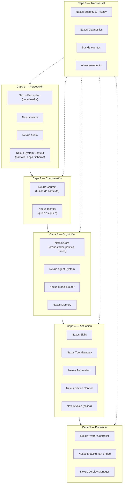
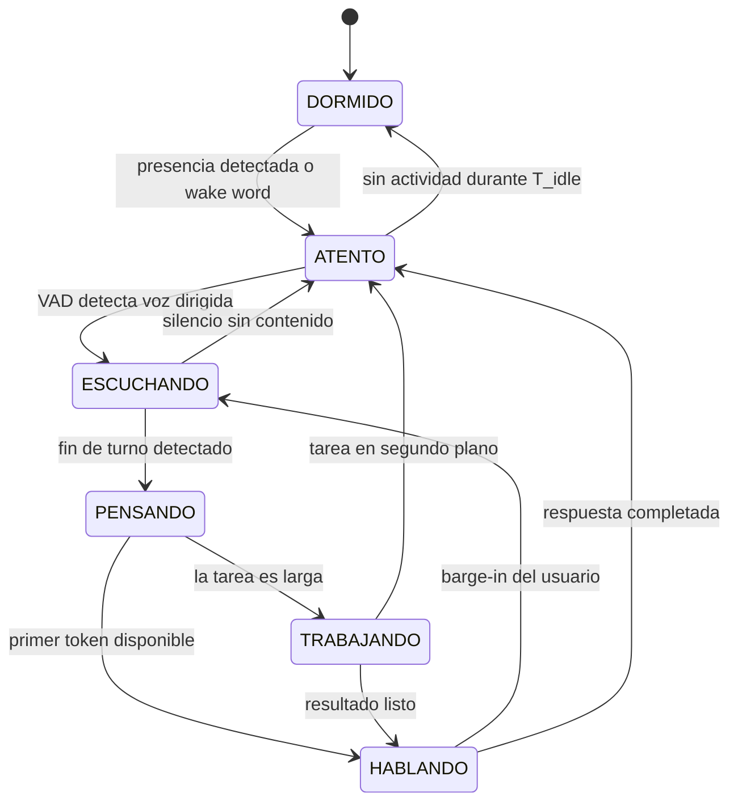
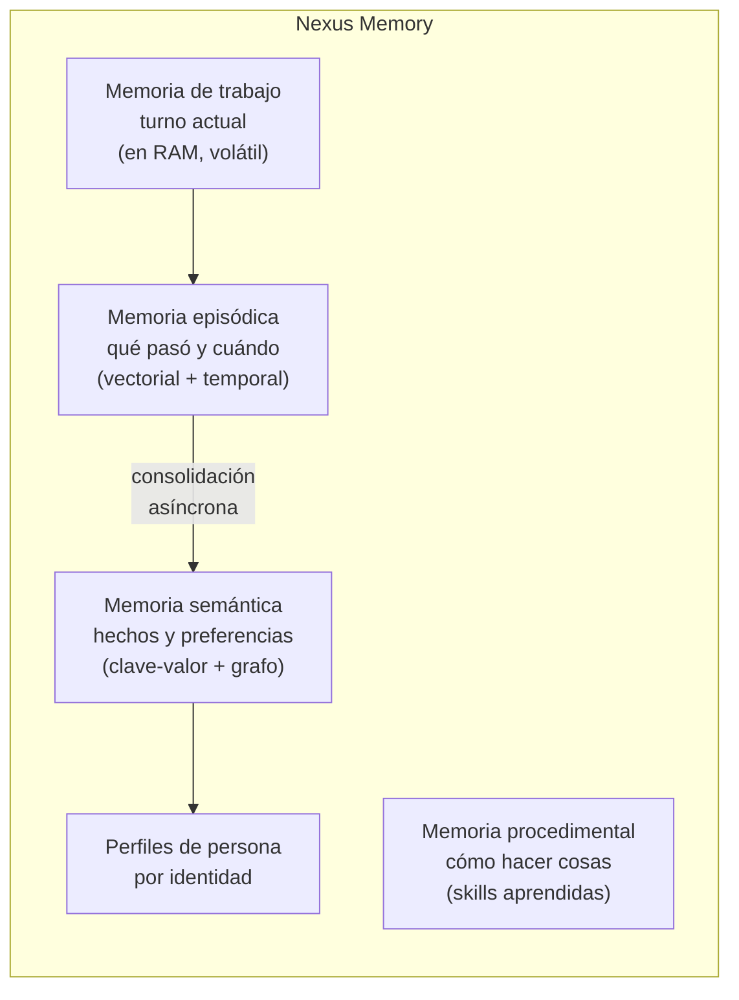
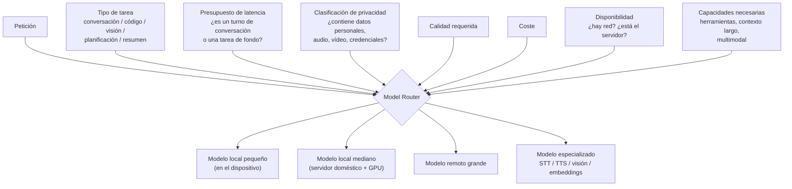
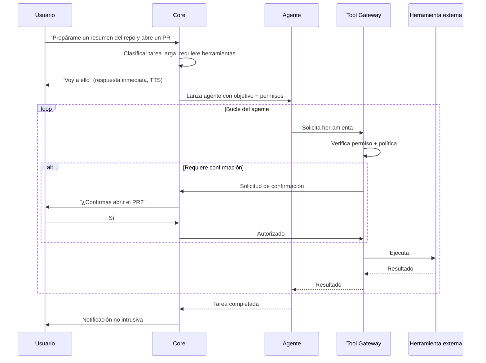
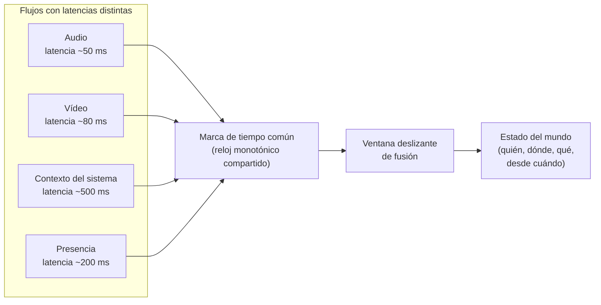
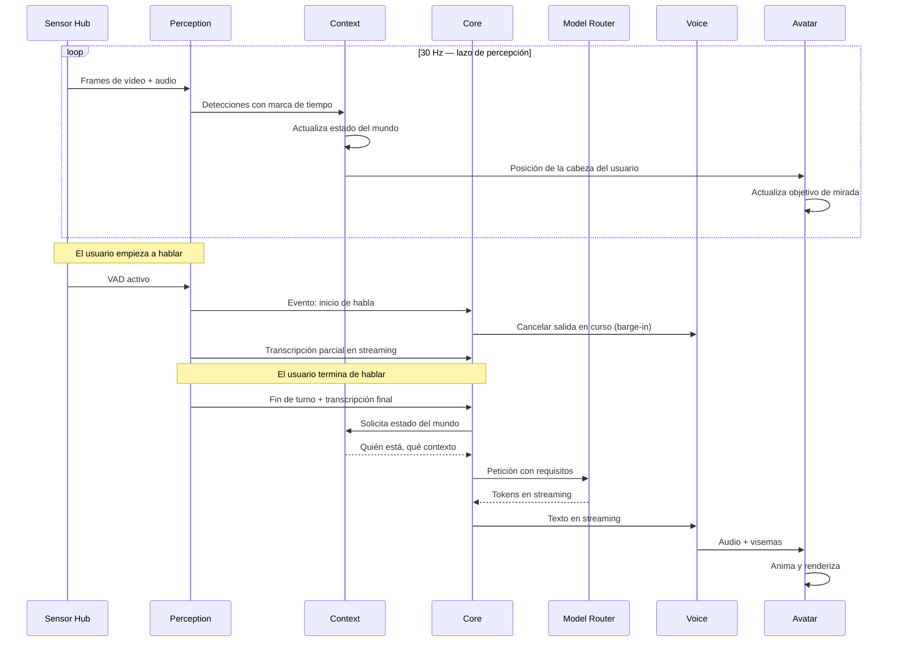

# PROJECT 02 — NEXUS · AI Architecture

---

## 1. Arquitectura modular propuesta

La lista de módulos del brief es buena. La reorganizamos por **capas de responsabilidad** para que las dependencias sean unidireccionales y cada capa pueda probarse aislada.

### Cambios respecto a la lista original del brief

| Cambio | Motivo |
|---|---|
| `Nexus Perception` pasa a ser un **coordinador** de `Vision` y `Audio`, no un hermano | Evita duplicar la lógica de fusión temporal |
| Se añade `Nexus System Context` como fuente de percepción de primera clase | El contexto del ordenador es tan importante como los sensores físicos |
| `Nexus Security` pasa a capa 0 transversal | La privacidad no puede ser un módulo al que se llama; tiene que estar en el camino de todos los datos |
| Se añade un **bus de eventos** explícito | Es lo que permite que los subsistemas se reinicien de forma independiente (NFR-12) |
| `Nexus Voice` se sitúa en actuación (salida); la entrada de voz está en `Nexus Audio` | Separar entrada de salida evita acoplamientos raros |

---

## 2. Nexus Core: el orquestador

El Core es responsable de **decidir qué hacer**, no de hacerlo.

### Responsabilidades

| Responsabilidad | Detalle |
|---|---|
| Gestión de turnos | Cuándo empieza y termina un turno de conversación; cuándo Nexus puede hablar sin que le pregunten |
| Política de comportamiento | Qué revelar, ante quién, en qué contexto |
| Construcción del contexto | Ensamblar el prompt: identidad, memoria relevante, estado del mundo, herramientas disponibles |
| Delegación | Decidir entre respuesta directa, agente, o herramienta |
| Interrupción | Cancelar trabajo en curso cuando el usuario cambia de tema o interrumpe |
| Presupuesto | Controlar cuánto se gasta (tiempo, tokens, coste) por interacción |

### La máquina de turnos

> **La transición crítica es `HABLANDO → ESCUCHANDO` por barge-in.** Debe ocurrir en < 200 ms (NFR-02) e implica cancelar el TTS, descartar el audio en cola, y **no** perder el contexto de lo que se estaba diciendo (Nexus debe saber que fue interrumpido y en qué punto).

---

## 3. Nexus Memory

### Tipos de memoria

| Tipo | Contenido | Tecnología propuesta | Recuperación |
|---|---|---|---|
| Trabajo | Turno actual, últimos N turnos | En memoria | Directa |
| Episódica | "El martes hablamos de X" | Base vectorial (embeddings) + índice temporal | Búsqueda semántica + filtro temporal |
| Semántica | "Prefiere respuestas cortas", "trabaja en el proyecto Rutinal" | Almacén estructurado, opcionalmente grafo | Consulta directa + expansión |
| Procedimental | "Para desplegar, hace falta ejecutar esto" | Skills versionadas | Por nombre y por descripción |
| Perfiles | Por persona: nombre, relación, permisos, preferencias | Almacén cifrado | Por ID de identidad |

### Decisiones de diseño

| Decisión | Elección | Motivo |
|---|---|---|
| ¿Qué se guarda de una conversación? | **Un resumen estructurado, no la transcripción cruda** | Privacidad, volumen y calidad de recuperación |
| ¿Cuándo se consolida? | Asíncronamente, cuando el sistema está en reposo | No robar latencia al camino conversacional |
| ¿Se guardan embeddings de voz y cara? | **Sí, embeddings; no, medios crudos** | Un embedding no permite reconstruir la cara ni la voz |
| ¿Se puede borrar? | Sí, borrado efectivo por persona, por tema y por rango de fechas | FR-S06 |
| ¿Qué modelo de embeddings? | Local, pequeño y estable en el tiempo | Si cambia el modelo hay que reindexar; elegir uno y mantenerlo |
| ¿Dónde vive? | En el servidor doméstico, cifrada en reposo | El Sensor Hub nunca almacena memoria |

> ⚠️ **Trampa conocida:** cambiar de modelo de embeddings invalida todo el índice. Planificar la reindexación desde el principio y versionar el índice con el nombre del modelo.

---

## 4. Nexus Model Router

Es el componente que hace posible tener "muchos cerebros".

### Entradas de decisión

### Tabla de políticas de enrutado `[PROPUESTA DE DISEÑO]`

| Tipo de petición | Destino por defecto | Nunca puede ir a | Razón |
|---|---|---|---|
| Wake word, VAD | Dispositivo | Ningún sitio remoto | Latencia dura y privacidad |
| Detección/reconocimiento facial | Dispositivo o servidor local | Remoto | **Datos biométricos: nunca salen** |
| Clasificación de intención simple | Modelo local pequeño | — | Latencia |
| Conversación cotidiana | Modelo local mediano | — | Latencia + privacidad + coste cero |
| Razonamiento complejo, código, planificación | Modelo remoto grande | — | Capacidad |
| Resumen de documento sensible | Modelo local mediano | Remoto, salvo confirmación explícita | Privacidad |
| Transcripción de voz | Modelo local | Remoto por defecto | Privacidad |
| Síntesis de voz | Local o remoto | — | Calidad vs latencia; decisión configurable |

### Reglas duras del router

1. **Regla de privacidad**: si la carga está clasificada como biométrica o sensible, el router **no puede** elegir un destino remoto, aunque sea el mejor por calidad. No es una preferencia: es una restricción.
2. **Regla de degradación**: si el destino elegido no está disponible, el router degrada a la mejor alternativa **permitida** y **lo dice**. Nexus nunca finge que sigue funcionando igual.
3. **Regla de trazabilidad**: cada decisión de enrutado se registra (qué, a dónde, por qué, cuándo). FR-S07.
4. **Regla de presupuesto**: cada turno de conversación tiene un presupuesto de latencia; si el destino ideal no cabe, se usa uno más rápido.

### Modelos candidatos por rol

| Rol | Ejecución | Criterio de selección | Nota |
|---|---|---|---|
| Wake word | Dispositivo, CPU o NPU | Falsos positivos, consumo | Ver `05_AUDIO_SYSTEM.md` |
| VAD | Dispositivo, CPU | Latencia < 30 ms | |
| STT streaming | Servidor, GPU | WER, latencia, streaming real | |
| Identificación de hablante | Servidor | EER | Embeddings, no audio |
| Detección de rostro | Dispositivo/acelerador | fps, precisión con poca luz | |
| Embedding facial | Dispositivo/acelerador | Precisión de verificación | |
| LLM conversacional | Servidor doméstico | Tiempo al primer token, calidad | Ver Proyecto 03 para dimensionado |
| LLM de razonamiento | Remoto | Capacidad | |
| TTS | Servidor o remoto | Naturalidad, latencia al primer audio | |
| Embeddings de memoria | Servidor | Estabilidad, calidad de recuperación | |

> Deliberadamente **no fijamos nombres de modelos concretos** en este documento: el panorama cambia cada pocos meses y el valor de la arquitectura es ser indiferente al modelo. Lo que sí fijamos son los **roles** y los **criterios**.

---

## 5. Nexus Agent System

### Modelo de ejecución

### Niveles de permiso de herramientas `[PROPUESTA DE DISEÑO]`

| Nivel | Descripción | Ejemplos | Confirmación |
|---|---|---|---|
| **L0 — Lectura local** | Sólo lee del sistema local | Leer ficheros, listar procesos, consultar memoria | No |
| **L1 — Lectura externa** | Consulta servicios externos sin efectos | Buscar en la web, consultar API de lectura | No, pero se registra |
| **L2 — Escritura local** | Modifica el sistema local | Escribir ficheros, ejecutar comandos | Configurable por ámbito |
| **L3 — Escritura externa** | Efectos fuera del sistema | Enviar mensajes, abrir PRs, comprar | **Siempre** |
| **L4 — Físico** | Actúa sobre el mundo físico | Domótica, cerraduras, vehículo | **Siempre + confirmación reforzada** |

> **Regla:** el nivel de permiso lo aplica el `Tool Gateway`, **no** el agente ni el modelo. Un modelo no puede auto-concederse permisos porque el mecanismo de permisos vive fuera de él.

---

## 6. Nexus Context: fusión

El problema central de la percepción multimodal es **la sincronización temporal**.

### El "estado del mundo"

Una estructura que el Core consulta y que responde en todo momento:

| Campo | Ejemplo |
|---|---|
| `personas_presentes` | `[{id: "gabriel", confianza: 0.97, posición: [0.3, 0.1, 1.8], mirando_a_nexus: true, desde: t-45s}]` |
| `hablante_actual` | `"gabriel"` o `null` |
| `nivel_de_ruido` | `42 dBA` |
| `iluminación` | `"baja"` |
| `contexto_ordenador` | `{app: "VS Code", proyecto: "Rutinal", fichero: "..."}` |
| `estado_conversación` | `"esperando_respuesta_del_usuario"` |
| `última_interacción` | `t-320s` |
| `sensores_activos` | `{cámara: true, micrófono: true}` |

> **Requisito técnico clave:** todos los flujos deben llevar marcas de tiempo de un **reloj monotónico común**. Si el Sensor Hub y la estación son máquinas distintas, hay que sincronizarlos (PTP o al menos NTP con corrección de deriva). Sin esto, la fusión audio-visual ("¿quién de los dos que veo está hablando?") no funciona. `[PROPUESTA DE DISEÑO]` → Q-E22.

---

## 7. Nexus Identity

Separación de conceptos que el brief mezclaba y conviene distinguir:

| Concepto | Pregunta que responde | Tecnología | Persistencia |
|---|---|---|---|
| **Face Detection** | ¿Hay una cara y dónde? | Detector de rostros | Por frame |
| **Face Recognition** | ¿De quién es esta cara? | Embedding + comparación con la base | Consulta |
| **Face Tracking** | ¿Es la misma cara del frame anterior? | Tracker (IoU + filtro) | Por sesión de visión |
| **Person Re-identification** | ¿Es la misma persona que salió y volvió? | Embedding de cuerpo + contexto | Minutos–horas |
| **Speaker Identification** | ¿De quién es esta voz? | Embedding de voz | Consulta |
| **Identity Fusion** | Juntando cara + voz + contexto, ¿quién es? | Fusión bayesiana de evidencias | Continua |

`[PROPUESTA DE DISEÑO]` **La identidad es una creencia con confianza, no un hecho binario.** El sistema mantiene `P(persona = X)` y actúa según umbrales:

| Confianza | Comportamiento |
|---|---|
| > 0,95 | Trata como identificado: usa el nombre, aplica el perfil |
| 0,7–0,95 | Trata como probable: no usa el nombre, no revela información privada |
| < 0,7 | Trata como desconocido: modo conservador |
| Múltiples personas | Modo conservador para todos, salvo que el hablante esté identificado con alta confianza |

Detalle de implementación en `04_VISION_SYSTEM.md`.

---

## 8. Diagrama del lazo en tiempo real

---

## 9. Preguntas para el equipo de software

| ID | Pregunta |
|---|---|
| **Q-A01** | ¿Bus de eventos: en proceso, o un broker (NNG/ZeroMQ/MQTT)? Depende de si el Sensor Hub es otra máquina |
| **Q-A02** | ¿Cómo representamos el "estado del mundo": estructura compartida con bloqueo, o un flujo de eventos con proyección? |
| **Q-A03** | ¿Qué política de consolidación de memoria? ¿Resúmenes generados por el LLM, o extracción estructurada? |
| **Q-A04** | ¿Cómo versionamos los perfiles de persona cuando cambia el modelo de embeddings? |
| **Q-A05** | ¿El router es un modelo o son reglas? Recomendación: **reglas primero**, un modelo sólo si las reglas no bastan |
| **Q-A06** | ¿Cómo probamos el sistema conversacional de forma reproducible (grabaciones sintéticas, escenarios)? |
| **Q-A07** | ¿Qué hacemos cuando dos personas hablan a la vez? |
| **Q-A08** | ¿Cómo maneja el Core que una tarea de fondo termine mientras hay una conversación en curso? |
