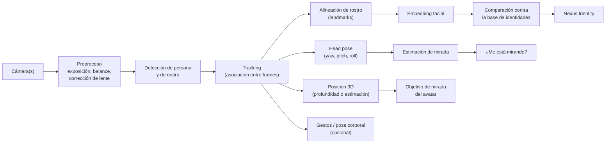
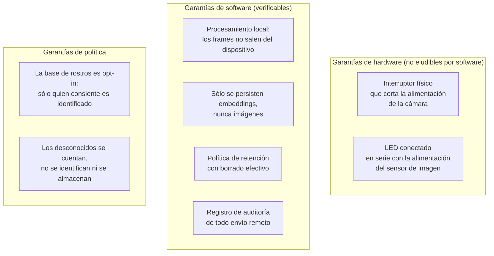

# PROJECT 02 — NEXUS · Vision System

---

## 1. Pipeline de visión



---

## 2. Los cinco problemas, separados

El brief los mezclaba; separarlos es imprescindible porque tienen requisitos y costes muy distintos.

| Problema | Frecuencia | Coste computacional | Latencia tolerable | ¿Dónde? |
|---|---|---|---|---|
| **Face Detection** | 10–30 Hz | Bajo-medio | < 100 ms | Dispositivo / acelerador |
| **Face Tracking** | 30 Hz | Muy bajo | < 33 ms | Dispositivo (CPU) |
| **Face Recognition** | 0,2–2 Hz | Medio | < 500 ms | Dispositivo / servidor |
| **Person Re-ID** | 1 Hz | Medio | < 2 s | Servidor |
| **Gaze / Head Pose** | 15–30 Hz | Bajo-medio | < 100 ms | Dispositivo |

> 🔑 **Optimización clave:** el reconocimiento (caro) **no se ejecuta en cada frame**. Se ejecuta cuando el tracker crea una nueva pista, y luego cada N segundos para confirmar. El tracking (barato) mantiene la identidad entre reconocimientos. Esto reduce la carga en un orden de magnitud.

---

## 3. Tecnologías candidatas

### 3.1 Detección de rostro

| Opción | Tipo | Ventajas | Inconvenientes | Madurez |
|---|---|---|---|---|
| **SCRFD** (InsightFace) | CNN eficiente | Diseñado para "precisión bajo presupuesto estricto de latencia y cómputo", con despliegue en edge; hay modelos precompilados para Hailo | Requiere runtime de inferencia | `READY NOW` `[CONFIRMADO]` — [InsightFace SCRFD](https://www.insightface.ai/research/scrfd) |
| **RetinaFace** | CNN | Muy preciso, landmarks incluidos | Más pesado | `READY NOW` |
| **MediaPipe Face Detection** | Ligero | Muy rápido en CPU, fácil de integrar | Menos preciso a distancia | `READY NOW` |
| **YOLO (variantes face)** | Detector genérico | Detecta persona y cara con un modelo | Precisión de landmarks menor | `READY NOW` |

`[PROPUESTA DE DISEÑO]` **SCRFD** como detector principal, por su relación precisión/latencia y porque hay modelos precompilados para acelerador Hailo, lo que abre la puerta a ejecutarlo en el Sensor Hub.

### 3.2 Embedding y reconocimiento facial

| Opción | Precisión LFW | Notas | Madurez |
|---|---|---|---|
| **InsightFace ArcFace** (`buffalo_l` / `w600k_r50`) | **99,83–99,86 %** | Referencia del sector; top-5 en NIST FRVT 1:1; embeddings de 512 dimensiones | `READY NOW` `[CONFIRMADO]` — [InsightFace](https://www.insightface.ai/guides/choose-face-recognition-model-and-evaluate) |
| **InsightFace `buffalo_s` / `buffalo_sc`** | ~99,5 % (MBF móvil) | Variantes para edge | `READY NOW` `[CONFIRMADO]` |
| **`antelopev2` / `glintr100`** | Superior | Modelo grande de servidor | `READY NOW` |
| **Hailo + API de embeddings** | — | Existe una API pública de embeddings faciales de 512 dimensiones sobre Hailo-8 | `PROVEN BUT REQUIRES INTEGRATION` `[CONFIRMADO]` — [Seeed face-recognition-api](https://github.com/Seeed-Solution/face-recognition-api) |

`[CONFIRMADO]` La recomendación de InsightFace es **normalizar los embeddings (L2) y usar similitud coseno**; la API expone `face.normed_embedding`.

`[PROPUESTA DE DISEÑO]` **`buffalo_l` en el servidor; `buffalo_s` si hay que ejecutarlo en el Sensor Hub.** Umbral de similitud a calibrar empíricamente en la instalación real (`EXP-203`), **no** a copiar del paper: las condiciones de iluminación y ángulo de nuestra instalación no son las del benchmark.

> ⚠️ **Advertencia importante sobre las cifras de precisión:** un 99,83 % en LFW **no** significa 99,83 % en nuestra sala. LFW son fotos frontales bien iluminadas. En una instalación real con contraluz, ángulos oblicuos y distancia de 2–3 m, la precisión cae sustancialmente. `[INFERENCIA]` **Hay que medir en nuestras condiciones.** Existe literatura específica sobre pipelines híbridos de reconocimiento facial con oclusión en dispositivos edge que confirma que este es un problema activo `[CONFIRMADO]` — [PubMed 42451311](https://pubmed.ncbi.nlm.nih.gov/42451311/).

### 3.3 Head pose y gaze

| Nivel | Qué da | Método | Precisión típica |
|---|---|---|---|
| **Nivel 1 — Posición de la cara** | Dónde está la cabeza en la imagen | Caja del detector | Suficiente para "mirar hacia allí" |
| **Nivel 2 — Head pose** | Yaw / pitch / roll | Landmarks 3D + PnP, o red dedicada | ±5–10° `[INFERENCIA]` |
| **Nivel 3 — Gaze** | Hacia dónde miran los ojos | Red dedicada de estimación de mirada | ±5–15° `[INFERENCIA]` |

`[PROPUESTA DE DISEÑO]` **Empezar por el nivel 1–2.** Para que el avatar "te mire", basta con la posición 3D de la cabeza. El gaze (nivel 3) sólo hace falta para responder a "¿me está mirando el usuario?" — útil para decidir si hablar, pero no crítico.

### 3.4 Profundidad — ¿hace falta?

Para dirigir la mirada del avatar hay que conocer la posición **3D** de la cabeza del usuario. Opciones:

| Opción | Cómo | Precisión | Coste | Complejidad |
|---|---|---|---|---|
| **Cámara RGB + estimación por tamaño de cara** | La cara conocida ocupa N píxeles → distancia estimada | ±20–30 % `[HIPÓTESIS]` | Nulo | Baja |
| **Estéreo (dos cámaras RGB)** | Triangulación | ±2–5 cm a 2 m `[INFERENCIA]` | Bajo | Media (calibración) |
| **Cámara de profundidad estructurada/ToF** | Medición directa | ±1–2 cm `[INFERENCIA]` | Medio-alto | Baja (viene resuelto) |
| **Cámara estéreo con procesamiento integrado** | El módulo entrega la nube de puntos | ±1–3 cm | Medio-alto | Baja |

`[PROPUESTA DE DISEÑO]` **Para NEXUS 2–3, cámara RGB única con estimación por tamaño de cara es suficiente.** El error de ±20 % en distancia se traduce en un error angular pequeño para la mirada del avatar, porque lo que importa es sobre todo la dirección, no la distancia exacta. Añadir profundidad real es una mejora de NEXUS 4, justificada si (a) hay varias personas a distintas profundidades, o (b) el avatar es de cuerpo completo y hace falta escala real.

### 3.5 Mercado de cámaras de profundidad (estado 2026)

| Familia | Estado | Notas |
|---|---|---|
| **RealSense** | Escindida de Intel a mediados de 2025 como compañía independiente, con 50 M USD de Intel Capital y MediaTek Innovation Fund; mantiene línea de producto y roadmap | `[CONFIRMADO]` — [Tom's Hardware](https://www.tomshardware.com/tech-industry/realsense-completes-spin-out-from-intel-gets-usd50-million-in-funding-from-intel-capital-and-mediatek) |
| **RealSense D555** | Cámara con PoE y ASIC propio con 5 TOPS de cómputo de IA a bordo, telemetría en tiempo real y pipelines de visión personalizables | `[CONFIRMADO]` — [RealSense D555](https://www.realsenseai.com/products/d555-poe/) |
| **Luxonis OAK** | Alternativa con procesamiento a bordo | `[CONFIRMADO]` que existe y compite; specs a verificar |
| **Orbbec** | Alternativa (familia Femto y otras) | `[CONFIRMADO]` que compite en el mercado |

> ⚠️ Nota de riesgo de suministro: RealSense acaba de independizarse. Antes de comprometer un diseño con una de estas familias, verificar disponibilidad a largo plazo y soporte de SDK. `[PROPUESTA DE DISEÑO]` mantener la abstracción de cámara en el software para poder cambiar de proveedor.

---

## 4. De la visión al avatar: el lazo de mirada

Este es el lazo que hace que Nexus "te mire", y es el que más impresiona en una demo.


**Latencia total estimada: 70–90 ms.** `[INFERENCIA]` Cumple NFR-04 (< 200 ms) con margen.

### La calibración es el problema difícil

Para que el avatar mire **al usuario real** y no "hacia algún sitio", hay que resolver una transformación geométrica:

```
Punto en la imagen de la cámara (u, v) + distancia estimada d
        ↓ (intrínsecos de la cámara)
Punto 3D en el sistema de la cámara (Xc, Yc, Zc)
        ↓ (extrínsecos: dónde está la cámara respecto a la pantalla)
Punto 3D en el sistema del mundo/pantalla (Xw, Yw, Zw)
        ↓ (dónde está el avatar virtual respecto a la pantalla)
Vector de mirada del avatar
```

| Incógnita | Cómo se resuelve |
|---|---|
| Intrínsecos de la cámara (focal, centro, distorsión) | Calibración con patrón de tablero de ajedrez. Estándar |
| Extrínsecos cámara→pantalla | **Medición mecánica** + refinamiento. Depende del montaje |
| Escala del avatar respecto al mundo real | Decisión de diseño: ¿el avatar está "detrás" de la pantalla a qué distancia? |

> 🔧 **Para el ingeniero electrónico:** la posición de la cámara respecto a la pantalla debe ser **mecánicamente rígida y conocida**. Si la cámara se mueve, la mirada se descalibra. Esto es un requisito de diseño mecánico, no de software. → Q-E24.

### El "efecto Mona Lisa"

`[INFERENCIA]` Un avatar en una pantalla plana que "mira a cámara" parece mirar a todos los observadores simultáneamente desde cualquier ángulo. Para que mire a **una** persona concreta y los demás lo perciban, el avatar debe mirar a un punto **desplazado** respecto al observador. Esto es un efecto conocido en retratos y en videoconferencia.

Consecuencia: en una instalación con varias personas, el efecto de "me mira a mí" es más débil de lo esperado en una pantalla 2D plana. Un display con profundidad real (light field) o una configuración Pepper's Ghost con profundidad física lo mejora. → argumento adicional en `08_TRANSPARENT_DISPLAY_RESEARCH.md`.

---

## 5. Iluminación: el factor más subestimado

`[INFERENCIA]` En reconocimiento facial en instalaciones reales, la iluminación causa más fallos que el modelo.

| Problema | Efecto | Solución |
|---|---|---|
| Contraluz (ventana detrás del usuario) | La cara queda en silueta, el detector falla | Iluminación IR activa + sensor con buena respuesta IR, o control de exposición por región de interés |
| Poca luz nocturna | Ruido, embeddings inestables | Iluminadores IR de 850 nm o 940 nm |
| Luz de la propia pantalla del avatar | Ilumina la cara del usuario de forma variable | Puede ser una ventaja: el display es una fuente de luz frontal |
| Parpadeo de luces LED de la sala | Bandas en la imagen | Sincronizar exposición con la frecuencia de red (anti-flicker 50/60 Hz) |

`[PROPUESTA DE DISEÑO]` **Iluminación IR activa en el Sensor Hub** con:
- LEDs IR de **940 nm** (invisibles al ojo; 850 nm produce un resplandor rojo tenue perceptible)
- Cámara **sin filtro de corte IR** o con filtro conmutable
- Control de intensidad por PWM desde el MCU del hub
- **Apagado físico junto con la cámara** cuando el kill switch está activo (si el IR está encendido, la cámara está mirando: es un indicador honesto)

> 🔧 Detalles eléctricos del iluminador IR en `07_SENSOR_HARDWARE.md` §5.

---

## 6. Privacidad del subsistema de visión

Este es un requisito de **arquitectura**, no una función que se añade después.



| Garantía | Nivel | Por qué a ese nivel |
|---|---|---|
| El LED de cámara no se puede apagar por software | **Hardware** | Un LED controlado por software es una promesa, no una garantía |
| El kill switch corta la alimentación, no una señal lógica | **Hardware** | Idem |
| Los frames nunca salen del dispositivo | **Software + regla dura del router** | Verificable por captura de red |
| Sólo embeddings en la base de datos | **Software** | Un embedding de 512 flotantes no permite reconstruir la cara con fidelidad |
| Base de datos cifrada en reposo | **Software** | |
| Sólo se identifica a quien ha consentido | **Política** | Requisito legal en muchas jurisdicciones para datos biométricos |

> ⚠️ **Nota legal:** los datos biométricos (embeddings faciales, huellas de voz) están sujetos a normativa específica en la UE (RGPD, categorías especiales del art. 9) y en otras jurisdicciones. Un sistema de uso personal en el domicilio tiene un tratamiento distinto de uno que identifique a visitantes. **Esto debe consultarse antes de que el sistema identifique a alguien que no sea el propietario.** → riesgo R-24.

---

## 7. Presupuesto computacional de visión

Estimación para el pipeline completo a 30 fps, resolución 1280×720 `[HIPÓTESIS]` — a validar con `EXP-206`:

| Etapa | Frecuencia | Coste relativo | ¿Acelerable en NPU? |
|---|---|---|---|
| Captura + preproceso | 30 Hz | Bajo | No (ISP) |
| Detección de rostro (SCRFD) | 15 Hz | **Alto** | ✅ Sí |
| Tracking | 30 Hz | Muy bajo | No hace falta |
| Landmarks + head pose | 15 Hz | Medio | ✅ Sí |
| Embedding facial | 0,5 Hz | Medio (pero poco frecuente) | ✅ Sí |
| Detección de persona (cuerpo) | 5 Hz | Alto | ✅ Sí |
| Estimación de pose corporal (opcional) | 10 Hz | Muy alto | ✅ Sí |

**Conclusión:** con detección + tracking + embedding esporádico, un acelerador de visión modesto (Hailo-8 de 13/26 TOPS, o incluso la CPU de un mini-PC) es suficiente. La pose corporal completa es lo que dispara el coste, y sólo hace falta en NEXUS 6.

---

## 8. Preguntas abiertas de visión

| ID | Pregunta | Resolución |
|---|---|---|
| **Q-V01** | ¿Una cámara o varias? Una sola tiene punto ciego; varias complican la fusión | `EXP-207`: mapear la cobertura necesaria en la sala real |
| **Q-V02** | ¿Qué umbral de similitud usamos, y cómo lo calibramos? | `EXP-203` con curva ROC en nuestras condiciones |
| **Q-V03** | ¿Necesitamos profundidad real o basta con la estimación por tamaño? | `EXP-205`: medir el error angular de la mirada con ambos métodos |
| **Q-V04** | ¿IR de 850 nm o 940 nm? ¿Cuánta potencia? | `EXP-208` + cálculo de irradiancia y seguridad ocular |
| **Q-V05** | ¿Ejecutamos la visión en el Sensor Hub o en la estación? | Depende de si queremos que los frames crucen la red |
| **Q-V06** | ¿Cómo manejamos a varias personas simultáneas en el control de mirada del avatar? | Decisión de diseño de comportamiento |
| **Q-V07** | ¿Qué hacemos con un rostro desconocido: ignorarlo, contarlo, o preguntar? | Decisión de política, con implicaciones legales |
