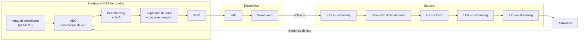
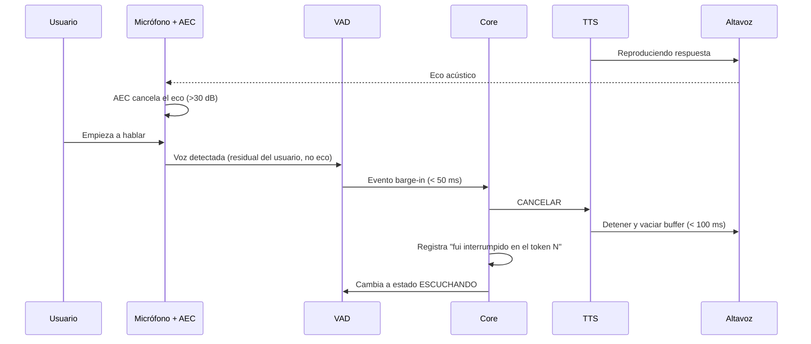
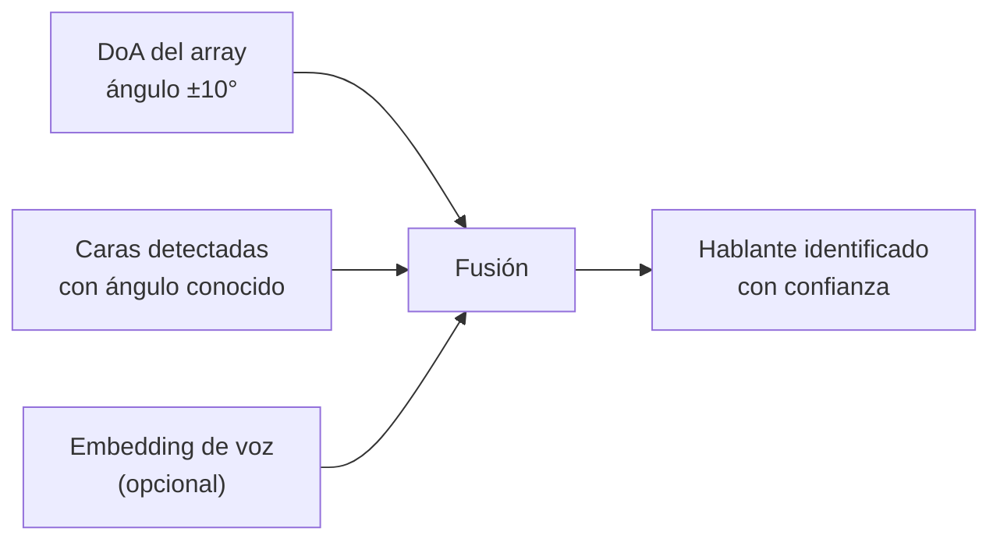

# PROJECT 02 — NEXUS · Audio System

> El audio es el subsistema donde el hardware marca más diferencia. Un buen array de micrófonos con DSP dedicado resuelve por hardware problemas que en software son muy difíciles.

---

## 1. La cadena completa

**La línea punteada es la más importante del diagrama.** Sin señal de referencia del altavoz hacia el AEC, Nexus se oye a sí mismo y el barge-in es imposible.

---

## 2. Por qué el AEC tiene que ser hardware

| Problema | Por qué es difícil en software |
|---|---|
| El AEC necesita alineación temporal exacta entre la señal reproducida y la captada | En un PC con Linux/Windows, la latencia entre el buffer de salida y el de entrada varía y no es determinista `[INFERENCIA]` |
| La cancelación debe ser > 30 dB para que el wake word funcione mientras Nexus habla | Requiere filtros adaptativos con convergencia rápida y no linealidades del altavoz compensadas |
| Debe funcionar en tiempo real duro (< 10 ms) | Un fallo de planificación del SO produce un artefacto audible |

`[PROPUESTA DE DISEÑO]` **Usar un array de micrófonos con procesador de voz dedicado.** Esto convierte un problema de investigación en una compra.

### Candidato principal: array de 4 micrófonos con XMOS XVF3800

`[CONFIRMADO]` — [Seeed Studio ReSpeaker XVF3800](https://www.seeedstudio.com/ReSpeaker-XVF3800-USB-Mic-Array-p-6488.html), [wiki](https://wiki.seeedstudio.com/respeaker_xvf3800_introduction/), [repositorio](https://github.com/respeaker/reSpeaker_XVF3800_USB_4MIC_ARRAY)

| Característica | Dato |
|---|---|
| Configuración | 4 micrófonos en disposición circular |
| Procesado a bordo | **AEC**, beamforming múltiple, desreverberación, **DoA** (dirección de llegada), supresión dinámica de ruido, **AGC de 60 dB**, **VAD** |
| Alcance | Captación de campo lejano 360° hasta ~5 m |
| Interfaces | **USB plug-and-play** (sin drivers; Windows, macOS, Linux, Raspberry Pi, Jetson) **o modo I²S** para integración embebida |
| Extra | Módulo ESP32-S3 en la placa `[CONFIRMADO]` — [CNX Software](https://www.cnx-software.com/2025/07/29/respeaker-xmos-xvf3800-4-mic-array-board-features-esp32-s3-module-works-over-usb/) |

**Por qué es la elección correcta para empezar:**
- El **DoA** nos da gratis "de qué dirección viene la voz", que se puede fusionar con la visión para resolver "¿quién de los que veo está hablando?"
- El **modo dual USB / I²S** significa que el mismo módulo sirve para el prototipo (USB a un PC) y para el producto integrado (I²S a nuestro propio SoC). **No hay que rehacer el trabajo al pasar de fase.**
- El AEC y el VAD vienen resueltos.

### Alternativas

| Opción | Ventaja | Inconveniente |
|---|---|---|
| Micrófonos MEMS I²S crudos + AEC en software | Coste mínimo, control total | El AEC en software es el problema difícil. No recomendado para empezar |
| Arrays de más micrófonos (6, 8, 16) | Mejor beamforming y localización | Coste, complejidad, y para una sala doméstica 4 suele bastar |
| Micrófono direccional único | Simple | Sin campo lejano ni DoA; obliga al usuario a colocarse |
| Array propio con DSP XMOS | Control total del formato y la geometría | Trabajo de firmware DSP considerable. Fase NEXUS 4+ |

---

## 3. Wake word

| Requisito | Valor |
|---|---|
| Latencia de detección | < 200 ms (NFR-03) |
| Falsos positivos | < 1 cada 24 h (NFR-06) |
| Falsos negativos | < 5 % a 3 m con ruido de fondo moderado |
| Consumo | Debe poder correr permanentemente en el Sensor Hub |
| **Privacidad** | **El audio anterior a la activación no sale del dispositivo bajo ninguna circunstancia** |

### Opciones

| Opción | Tipo | Nota |
|---|---|---|
| Modelos abiertos de wake word entrenables | Open source | Permiten entrenar la palabra "Nexus" con datos sintéticos |
| Motores comerciales de wake word | Licencia | Mejor rendimiento, coste por dispositivo |
| VAD + STT continuo con detección de la palabra en el texto | — | **Descartado**: obliga a transcribir todo el tiempo, mal para consumo y para privacidad |

`[PROPUESTA DE DISEÑO]` Wake word con modelo entrenable open source, entrenado específicamente con la palabra elegida y con grabaciones de la sala real. La palabra debe:
- Tener ≥ 3 sílabas (menos falsos positivos)
- No ser una palabra común en la conversación
- Ser fonéticamente distintiva

> "Nexus" tiene 2 sílabas y suena parecido a otras palabras. `[HIPÓTESIS]` Puede dar falsos positivos. Considerar "Hey Nexus" o similar. → `EXP-204`.

---

## 4. STT, LLM y TTS en streaming

### 4.1 Por qué el streaming lo cambia todo

```mermaid
gantt
    dateFormat X
    axisFormat %s
    title Sin streaming (secuencial)
    section Sin streaming
    Usuario habla        :0, 3
    STT completo         :3, 4
    LLM completo         :4, 7
    TTS completo         :7, 9
    Usuario oye          :milestone, 9, 0
```

```mermaid
gantt
    dateFormat X
    axisFormat %s
    title Con streaming (solapado)
    section Con streaming
    Usuario habla        :0, 3
    STT en streaming     :0, 3
    Fin de turno         :3, 4
    LLM primer token     :3, 4
    TTS primer audio     :4, 4
    Usuario oye          :milestone, 4, 0
    LLM sigue generando  :4, 6
    TTS sigue hablando   :4, 7
```

`[INFERENCIA]` La diferencia es de **6 segundos a 1 segundo** de latencia percibida, con los mismos modelos. **El streaming no es una optimización: es el requisito.**

### 4.2 Detección de fin de turno

El enfoque ingenuo — "esperar 800 ms de silencio" — produce dos fallos:
- Si el umbral es corto, Nexus interrumpe al usuario cuando hace una pausa para pensar.
- Si es largo, Nexus se siente lento.

`[CONFIRMADO]` Los sistemas modernos de agentes de voz usan **detección de turno entrenada para conversación real, en lugar de temporizadores de silencio fijos**, con latencias extremo a extremo del orden de 1 segundo.

`[PROPUESTA DE DISEÑO]` Detección de fin de turno híbrida:
1. VAD detecta silencio.
2. Un clasificador ligero evalúa si la transcripción parcial es sintácticamente completa.
3. Umbral de silencio adaptativo: corto si la frase parece terminada, largo si parece incompleta ("y entonces yo... ").

### 4.3 Estado del arte de latencia `[CONFIRMADO]` (datos de proveedores, agosto 2026)

| Métrica | Rango observado en el mercado |
|---|---|
| Latencia extremo a extremo de agentes de voz | ~0,8–3 s de TTFT (time to first token) según proveedor |
| API de agente de voz integrada (STT+LLM+TTS en una conexión) | ~1 s extremo a extremo |
| TTS: tiempo hasta el primer audio | ~90 ms en los sistemas más rápidos |

> Nota metodológica: son cifras **declaradas por proveedores** para sus servicios en la nube. Nuestro sistema local debe medirse en nuestras condiciones (`EXP-201`); no asumir estos números.

### 4.4 Barge-in

| Requisito | Valor | Nota |
|---|---|---|
| Latencia total de barge-in | < 200 ms (NFR-02) | Del inicio del habla al silencio |
| Cancelación de eco necesaria | > 30 dB `[HIPÓTESIS]` | Si no, el propio TTS dispara el VAD |
| Vaciado de buffer de audio | El buffer de salida debe ser pequeño (< 100 ms) | Un buffer grande hace que Nexus siga hablando tras el "cancelar" |
| Preservación de contexto | Nexus debe saber qué alcanzó a decir | Para no repetirlo ni contradecirse |

> 🔧 **Consecuencia de hardware:** el tamaño del buffer de audio de salida es un compromiso entre latencia de barge-in (quiere buffer pequeño) y robustez ante fallos de planificación (quiere buffer grande). Con una tarjeta de sonido USB genérica esto es difícil de controlar. Otro argumento para audio integrado con I²S en el hub. → Q-E25.

---

## 5. Salida de audio

| Aspecto | Requisito | Nota |
|---|---|---|
| Calidad | Inteligibilidad de voz, no alta fidelidad musical | Un altavoz de rango medio bien colocado supera a uno "hi-fi" mal colocado |
| Nivel | 65–75 dBA a 1 m para conversación | |
| Colocación | Lo más lejos posible de los micrófonos, y **no** apuntando a ellos | Reduce el trabajo del AEC |
| Direccionalidad | Hacia el usuario | |
| Latencia | Buffer < 100 ms (ver §4.4) | |
| Amplificación | Clase D, con control de volumen digital | Eficiencia y ruido bajo |
| Sincronización con el avatar | El audio y la animación labial deben ir alineados a < 40 ms `[INFERENCIA]` | Desincronización mayor se percibe como doblaje malo |

> ⚠️ **La sincronización labio-audio es un problema real.** Si el TTS y el render van por caminos distintos, se desincronizan. El diseño debe hacer que **el audio arrastre a la animación**, con marcas de tiempo compartidas. Ver `06_METAHUMAN_ARCHITECTURE.md` §5.

---

## 6. Identificación de hablante

| Función | Cómo | Uso |
|---|---|---|
| **Speaker Identification** | Embedding de voz comparado con perfiles registrados | Saber quién habla sin verle |
| **Speaker Diarization** | Segmentar "quién habló cuándo" | Conversaciones con varias personas |
| **Fusión con visión** | DoA del array + posición de las caras detectadas | Resolver "de los tres que veo, habla el de la izquierda" |

`[PROPUESTA DE DISEÑO]` La fusión DoA + visión es más barata y robusta que la identificación por voz pura para el caso "¿quién de los presentes habla?". La identificación por voz es útil cuando **no hay visión** (usuario fuera de cámara).

> Requisito de calibración: hay que conocer la relación angular entre el array de micrófonos y la cámara. Si están en el mismo módulo mecánico, es una constante conocida. **Otro argumento para integrar cámara y micrófonos en el mismo Sensor Hub rígido.** → Q-E24.

---

## 7. Presupuesto de latencia de audio, detallado

| Etapa | Objetivo | Dónde | Etiqueta |
|---|---|---|---|
| Captura + AEC + beamforming | < 10 ms | DSP del array | `[CONFIRMADO]` que el hardware lo hace en tiempo real |
| Transporte al host (USB o I²S) | 5–20 ms | | `[INFERENCIA]` |
| VAD | < 30 ms | Sensor Hub | |
| Wake word (sólo en activación) | < 200 ms | Sensor Hub | |
| Transporte al servidor (si aplica) | 1–10 ms | Ethernet local | |
| STT en streaming (retardo tras el fin del habla) | 50–150 ms | Servidor | |
| Detección de fin de turno | 100–300 ms | Servidor | |
| Core: contexto + memoria | 20–100 ms | Servidor | |
| LLM: primer token | 150–800 ms | Servidor o remoto | |
| TTS: primer audio | 90–300 ms | Servidor o remoto | |
| Buffer de salida | 20–80 ms | | |
| **TOTAL desde fin de habla** | **430–1 730 ms** | | |

### Dónde recortar si no llegamos a 1 000 ms

| Palanca | Ganancia potencial | Coste |
|---|---|---|
| Modelo local más pequeño para respuestas cortas | 300–500 ms | Menos calidad en respuestas complejas |
| Respuesta de relleno inmediata ("mmm", "a ver") mientras piensa | Percibida: enorme | Ninguno, pero hay que hacerlo bien para no sonar artificial |
| TTS local en vez de remoto | 100–300 ms | Menos naturalidad |
| Predicción de fin de turno más agresiva | 100–200 ms | Más interrupciones al usuario |
| Precalentar el modelo (mantenerlo cargado) | 500 ms+ en el primer turno | Memoria ocupada permanentemente |
| Cachear el contexto del sistema | 50–100 ms | |

> `[PROPUESTA DE DISEÑO]` **La "respuesta de relleno" es la palanca con mejor relación coste/beneficio.** Un humano tarda 200–400 ms en empezar a responder y llena ese hueco con señales. Que Nexus emita una señal de reconocimiento inmediata (un sonido sutil, o el avatar cambiando de expresión y mirando) cubre 500 ms de latencia real sin que se perciban.

---

## 8. Preguntas abiertas de audio

| ID | Pregunta |
|---|---|
| **Q-AU01** | ¿Array USB (rápido de integrar) o I²S (integrado, menor latencia)? Empezar por USB, migrar a I²S en NEXUS 4 |
| **Q-AU02** | ¿Qué palabra de activación? ¿Cuántas sílabas? ¿Se puede desactivar el wake word cuando hay contacto visual? |
| **Q-AU03** | ¿STT local o remoto? Local por privacidad, ¿a qué coste de precisión? |
| **Q-AU04** | ¿TTS local o remoto? Afecta a naturalidad, latencia y privacidad |
| **Q-AU05** | ¿Cómo medimos la latencia extremo a extremo de forma reproducible? |
| **Q-AU06** | ¿Cuántos altavoces y dónde? ¿Estéreo aporta algo, o es mejor un canal bien colocado? |
| **Q-AU07** | ¿Qué hacemos con música de fondo o televisión encendida? |
| **Q-AU08** | ¿El sistema debe poder hablar en varios idiomas y cambiar de uno a otro a mitad de conversación? |
