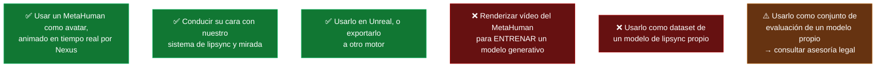
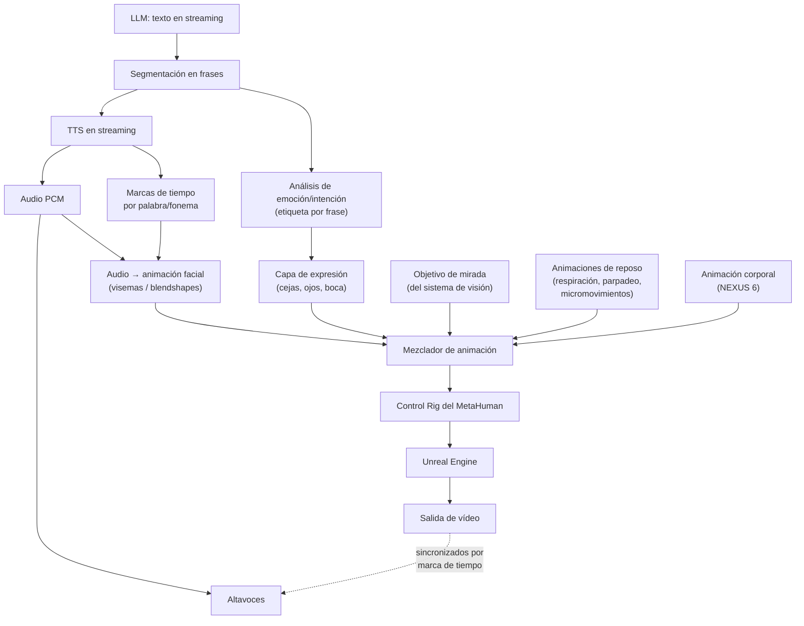
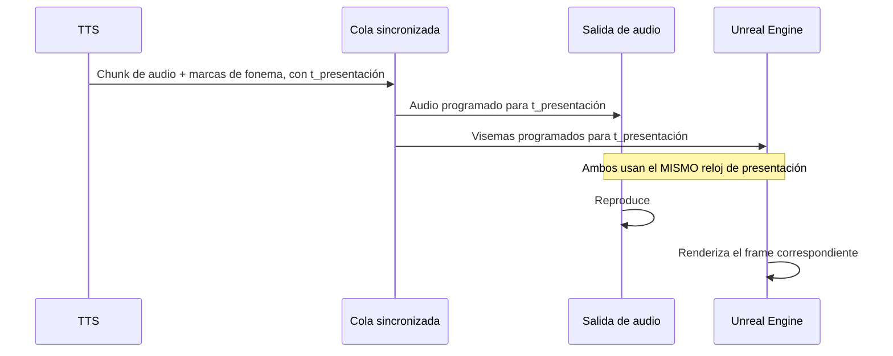
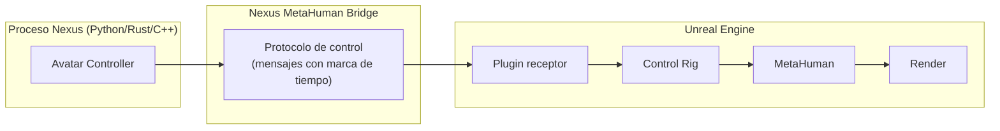

# PROJECT 02 — NEXUS · MetaHuman / Avatar Architecture

---

## 1. Estado de MetaHuman (agosto 2026)

| Hecho | Etiqueta | Fuente |
|---|---|---|
| MetaHuman salió de early access con la versión 5.6, publicada el **3 de junio de 2025**, con el Creator **integrado dentro de Unreal Engine** en lugar de ser una herramienta web independiente | `[CONFIRMADO]` | [metahuman.com — MetaHuman leaves early access](https://www.metahuman.com/news/metahuman-leaves-early-access-with-a-feature-packed-new-release) |
| Epic dejó de aceptar nuevos usuarios en la aplicación web | `[CONFIRMADO]` | misma fuente |
| Gratuito para individuos y estudios con ingresos anuales < 1 M USD; por encima, licencia de Unreal por puesto | `[CONFIRMADO]` | [Creative Bloq](https://www.creativebloq.com/3d/metahuman-just-broke-free-from-unreal-engine-5-why-everyone-can-now-create-lifelike-characters) |
| El nuevo EULA permite usar personajes y animaciones MetaHuman **en cualquier motor o herramienta** (Unity, Godot, Blender, Houdini, Maya) | `[CONFIRMADO]` | [CG Channel](https://www.cgchannel.com/2025/06/you-can-now-sell-metahumans-or-use-them-in-unity-or-godot/) |
| El royalty del 5 % de Unreal no aplica cuando se usan fuera de juegos Unreal | `[CONFIRMADO]` | misma fuente |
| Se pueden vender MetaHumans en Fab y en otros marketplaces | `[CONFIRMADO]` | misma fuente |
| ⛔ **Los MetaHumans no pueden usarse para entrenar, construir, mejorar ni probar ningún modelo de IA / ML / red neuronal ni base de datos** | `[CONFIRMADO]` | misma fuente |

### Qué significa esa última cláusula para Nexus

**Ruta que esto cierra:** la tentación natural de "renderizo 100 horas del MetaHuman y destilo un modelo generativo ligero que corra en un dispositivo pequeño" **está prohibida por licencia**. Si en el futuro queremos un avatar generativo ligero, habrá que partir de otro personaje base con licencia compatible. `[INFERENCIA]`

---

## 2. Pipeline del avatar

---

## 3. Tecnologías de animación facial a partir de audio

| Opción | Qué hace | Estado | Nota |
|---|---|---|---|
| **NVIDIA Audio2Face-3D** (parte de NVIDIA ACE) | Genera animación facial a partir de audio; hay plugin para Unreal Engine 5 y funciona con MetaHuman | `PROVEN BUT REQUIRES INTEGRATION` `[CONFIRMADO]` — [ACE Unreal Plugin: Character Animation](https://docs.nvidia.com/ace/latest/workflows/kairos/ace-unreal-plugin-animation.html), [NVIDIA Developer blog](https://developer.nvidia.com/blog/simplify-and-scale-ai-powered-metahuman-deployment-with-nvidia-ace-and-unreal-engine-5) | El plugin para Maya se distribuye con código fuente para que los desarrolladores hagan el suyo para otra herramienta `[CONFIRMADO]`. **Requiere GPU NVIDIA** |
| **Mapeo de visemas clásico** | Fonemas del TTS → blendshapes de boca | `READY NOW` | Menos realista, pero determinista, muy ligero y sin dependencia de GPU adicional |
| **MetaHuman Animator** | Captura de actuación facial desde vídeo/iPhone | `READY NOW` para animación *grabada* | No es para tiempo real desde texto; útil para crear animaciones base |
| **Modelos open source de audio→blendshape** | Varias implementaciones | `EXPERIMENTAL` | Calidad variable |

`[PROPUESTA DE DISEÑO]` **Empezar por el mapeo de visemas del TTS**, no por Audio2Face.

Razones:
1. Muchos motores de TTS entregan **marcas de tiempo por fonema o por palabra**; convertirlas en visemas es determinista y cuesta microsegundos.
2. Elimina una dependencia de GPU y de un servicio adicional en el camino crítico.
3. La diferencia de calidad importa menos de lo que parece cuando el avatar está a 2 m y en movimiento.
4. Se puede sustituir después sin cambiar la arquitectura: es un módulo detrás de la misma interfaz.

Audio2Face entra en NEXUS 3+ cuando la calidad visual pase a ser prioritaria y ya tengamos una GPU NVIDIA en la estación (que probablemente ya tengamos por el LLM local).

---

## 4. Capas de animación

Un avatar creíble no es "una animación": son varias capas mezcladas.

| Capa | Frecuencia de actualización | Fuente | Peso |
|---|---|---|---|
| **Base / postura** | Baja | Animación de reposo | 1,0 |
| **Respiración** | 0,2–0,3 Hz | Procedural | Sutil, siempre activa |
| **Parpadeo** | Aleatorio, 12–20/min | Procedural con distribución realista | Crítico: sin parpadeo el avatar parece muerto |
| **Micromovimientos de cabeza** | Continuo | Ruido de Perlin de baja amplitud | Crítico: la quietud perfecta es inquietante |
| **Mirada** | 30 Hz | Sistema de visión (posición del usuario) | Alta |
| **Sácadas oculares** | Aleatorio | Procedural: pequeños saltos de mirada | Muy importante para el realismo |
| **Expresión emocional** | Por frase | Etiqueta del LLM/análisis | Media |
| **Boca / visemas** | 30–60 Hz | TTS | Alta durante el habla |
| **Gestos** | Por frase | NEXUS 6 | — |

> ⚠️ **Valle inquietante (uncanny valley).** `[INFERENCIA]` El riesgo aumenta con el realismo. Un MetaHuman fotorrealista que se mueve mal produce más rechazo que un avatar estilizado que se mueve bien. **Las capas procedurales (parpadeo, respiración, micromovimientos, sácadas) importan más que la calidad del modelo.** Presupuestar tiempo para ellas desde el principio, no como "pulido final".

---

## 5. Sincronización audio-vídeo

Este es el problema técnico central del avatar.

| Requisito | Valor |
|---|---|
| Desviación audio-vídeo tolerable | < 40 ms `[INFERENCIA]`; el adelanto del vídeo se tolera peor que el retraso |
| Reloj de referencia | **El reloj del audio manda.** El vídeo se ajusta al audio, nunca al revés |
| Manejo de frames perdidos | Si el render pierde un frame, saltar visemas — nunca retrasar el audio |
| Cancelación (barge-in) | Vaciar audio y visemas simultáneamente |

`[PROPUESTA DE DISEÑO]` **Un único reloj de presentación compartido**, con el audio como maestro. Todos los eventos (audio, visemas, expresión, gestos) se programan contra ese reloj con un desfase de presentación de ~100 ms que da margen al render.

---

## 6. Comunicación Nexus ↔ Unreal Engine

### Opciones de transporte

| Opción | Latencia | Complejidad | Nota |
|---|---|---|---|
| **Live Link** (mecanismo nativo de Unreal para datos de animación en tiempo real) | Baja | Media | La ruta idiomática en Unreal |
| **Socket UDP propio + plugin C++** | Muy baja | Media-alta | Control total del formato |
| **OSC** | Baja | Baja | Sencillo, buen soporte |
| **Nexus embebido dentro de Unreal** | Nula | Alta | Acopla todo el sistema al motor. **No recomendado** |

`[PROPUESTA DE DISEÑO]` **Nexus y Unreal son procesos separados**, comunicados por un protocolo con marcas de tiempo. Razones: (a) Unreal puede caerse y reiniciarse sin tumbar Nexus, (b) podemos cambiar de motor de render sin tocar el núcleo, (c) el avatar es una **salida** de Nexus, no su corazón.

### Mensajes del protocolo `[PROPUESTA DE DISEÑO]`

| Mensaje | Contenido | Frecuencia |
|---|---|---|
| `GAZE_TARGET` | Punto 3D + peso + duración de transición | 30 Hz |
| `VISEME` | ID de visema + intensidad + `t_presentación` | 30–60 Hz durante el habla |
| `EXPRESSION` | Etiqueta emocional + intensidad + duración | Por frase |
| `GESTURE` | ID de gesto + `t_presentación` | Por frase (NEXUS 6) |
| `STATE` | Estado de Nexus (escuchando / pensando / hablando) | En cambios |
| `CANCEL` | Cancela todo lo programado a partir de ahora | Barge-in |
| `HEARTBEAT` | Sincronización de reloj | 1 Hz |

---

## 7. Requisitos de la máquina de render

| Elemento | Requisito | Etiqueta |
|---|---|---|
| Motor | Unreal Engine 5.6+ | `[CONFIRMADO]` que MetaHuman vive ahí |
| GPU | GPU dedicada con suficiente VRAM para un MetaHuman a 60 fps | `[HIPÓTESIS]` → `EXP-209` a medir con nuestra escena |
| Resolución objetivo | Depende del display final (ver `08_TRANSPARENT_DISPLAY_RESEARCH.md`) | |
| Frame rate | 60 fps estable; caídas por debajo de 30 rompen la ilusión | `[INFERENCIA]` |
| Sistema operativo | Windows es el camino menos accidentado para UE + MetaHuman; Linux es posible | `[INFERENCIA]` |
| Coexistencia con LLM local | La misma GPU tendría que renderizar **y** servir el LLM | ⚠️ **Conflicto de recursos** |

> ⚠️ **Conflicto de diseño importante:** si el LLM local y Unreal comparten GPU, compiten por VRAM y por cómputo, y el render pierde frames justo cuando Nexus está hablando (el peor momento posible). `[INFERENCIA]`
>
> **Opciones:** (a) dos GPUs, (b) dos máquinas (servidor de IA + máquina de render), (c) LLM en CPU/acelerador dedicado, (d) LLM remoto durante la conversación. `[PROPUESTA DE DISEÑO]` **Separar en dos máquinas a partir de NEXUS 3.** Encaja con la arquitectura de `09_SYSTEM_ARCHITECTURE.md`.

---

## 8. Cuerpo completo (NEXUS 6)

| Capacidad | Complejidad | Notas |
|---|---|---|
| Postura estática y cambios de peso | Baja | Animaciones de reposo por capas |
| Gestos con las manos coordinados con el habla | **Alta** | Los gestos deben ser coherentes con el contenido; hacerlo mal es peor que no gesticular |
| Señalar | Media | Requiere conocer la geometría real de la sala |
| Caminar virtualmente | Media (técnicamente), **alta conceptualmente** | ¿A dónde camina, si el escenario es una ventana fija? |
| Orientar el cuerpo hacia el usuario | Baja-media | Extensión natural del control de mirada |
| Seguir a una persona que se mueve | Media | Ya tenemos el tracking |

`[HIPÓTESIS]` **La coherencia entre gesto y habla es el problema difícil de NEXUS 6**, no la animación en sí. Un avatar que gesticula aleatoriamente parece nervioso; uno que gesticula en el momento correcto parece vivo. Esto requiere que el LLM emita etiquetas de énfasis junto con el texto, o un modelo dedicado de generación de gestos a partir del habla.

**Recomendación:** en NEXUS 6, empezar con un repertorio pequeño de gestos disparados por etiquetas explícitas del LLM (`<gesto: asentir>`, `<gesto: señalar>`), antes de intentar generación automática.

---

## 9. Preguntas abiertas del avatar

| ID | Pregunta |
|---|---|
| **Q-M01** | ¿Visemas del TTS o Audio2Face? Recomendación: visemas primero |
| **Q-M02** | ¿Unreal en la misma máquina que el LLM, o separadas? Recomendación: separadas desde NEXUS 3 |
| **Q-M03** | ¿Qué aspecto tiene Nexus? (Decisión de diseño, no técnica, pero condiciona todo lo demás) |
| **Q-M04** | ¿Cuerpo completo desde el principio en el modelo, aunque sólo se vea el busto? |
| **Q-M05** | ¿Cómo evaluamos objetivamente si el avatar "se siente vivo"? ¿Hay una métrica o sólo juicio? |
| **Q-M06** | ¿Fondo transparente o entorno virtual? Condiciona la tecnología de display |
| **Q-M07** | ¿Qué hacemos cuando Nexus no tiene nada que hacer? El comportamiento en reposo define la personalidad |
| **Q-M08** | ¿Hay riesgo de valle inquietante con este diseño concreto? ¿Lo probamos con personas ajenas al proyecto? |
