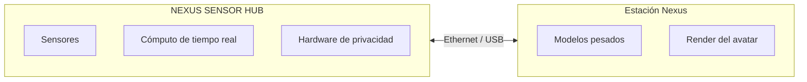
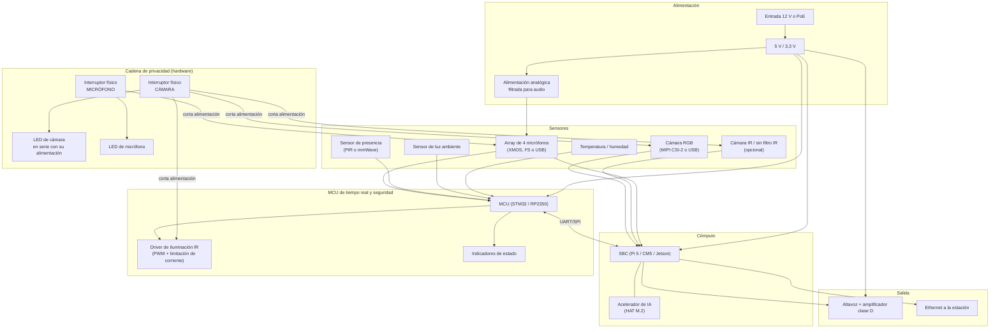
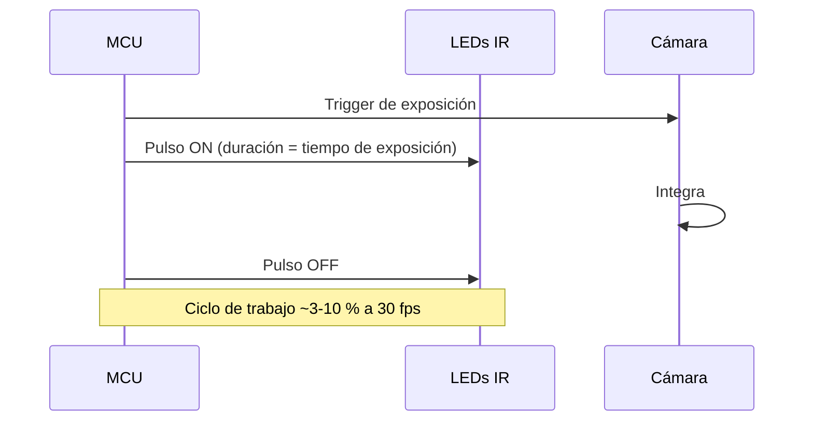
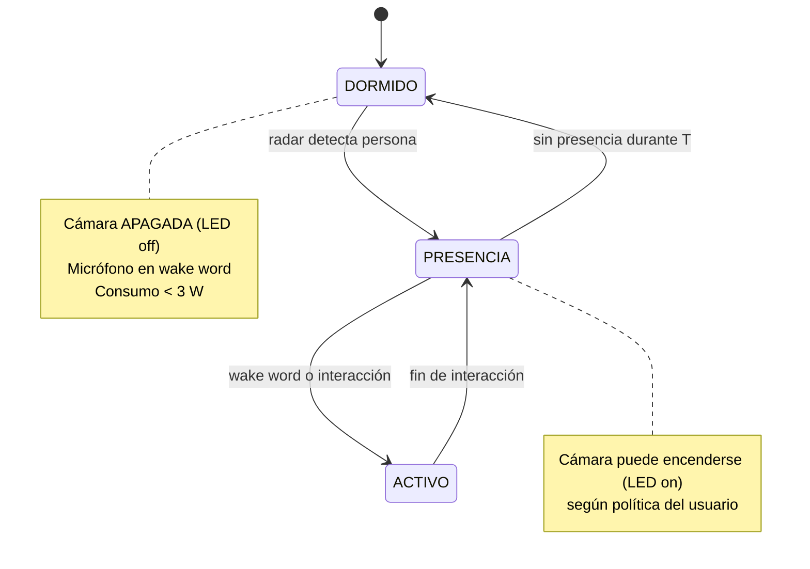
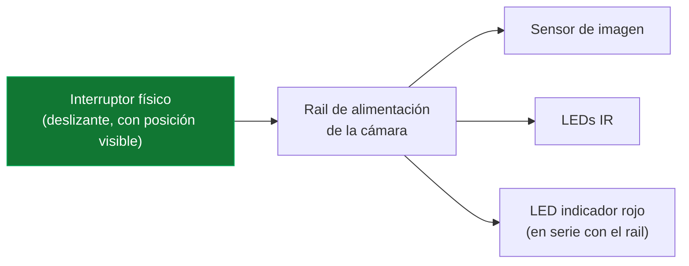

# PROJECT 02 — NEXUS · Sensor Hardware

> **Documento principal para el ingeniero electrónico en el Proyecto 02.**
> Define el **Nexus Sensor Hub**: el dispositivo físico que da a Nexus sus sentidos.

---

## 1. Por qué un Sensor Hub separado

La alternativa sería colgar cámaras y micrófonos USB del ordenador principal. Razones para no hacerlo:

| Motivo | Explicación |
|---|---|
| **Latencia determinista** | Los lazos de tiempo real duro (AEC, VAD, tracking) no deben depender del planificador de un PC de propósito general que además renderiza y ejecuta modelos |
| **Privacidad verificable** | Un dispositivo dedicado permite kill switches e indicadores **de hardware**. En un PC no es creíble |
| **Consumo** | El hub puede estar siempre encendido a pocos vatios; el PC no |
| **Integración mecánica** | Cámara, micrófonos e IR deben tener una relación geométrica fija y conocida (calibración) |
| **Independencia** | El PC puede reiniciarse, actualizarse o apagarse sin que Nexus pierda la percepción de presencia |
| **Reutilización** | El mismo hub sirve para la instalación de sala, para el escritorio y — con adaptación — para el vehículo (Proyecto 01) |

---

## 2. Arquitectura del Sensor Hub

---

## 3. Selección de la plataforma de cómputo

| Plataforma | CPU | IA | Consumo | Pros | Contras | Veredicto |
|---|---|---|---|---|---|---|
| **Raspberry Pi 5 + AI HAT+ 2 (Hailo-10H)** | 4× Cortex-A76 | **40 TOPS INT4**, 8 GB LPDDR4X propios `[CONFIRMADO]` | ~10–15 W | Ecosistema, coste, MIPI CSI, el acelerador puede correr detección facial **y** modelos generativos pequeños | Sin encoder de vídeo HW; Pi 5 no es de rango industrial | ⭐ **Recomendado para NEXUS 4** |
| **Raspberry Pi 5 + AI HAT+ (Hailo-8/8L)** | 4× Cortex-A76 | 13/26 TOPS | ~8–12 W | Más barato; hay modelos precompilados (SCRFD) y API de embeddings faciales de 512 dim `[CONFIRMADO]` | Sin memoria propia para LLM | ⭐ Buena opción si sólo hace visión |
| **NVIDIA Jetson Orin Nano Super 8 GB** | 6× Cortex-A78AE | **67 TOPS**, 102 GB/s de ancho de banda `[CONFIRMADO]` | 7–25 W configurable | Puede hacer visión **y** LLM pequeño; CUDA; ecosistema de robótica | Más caro; más consumo; software más pesado | ⭐ Si el hub debe pensar, no sólo percibir |
| **CM5 + acelerador M.2** | igual que Pi 5 | según acelerador | ~10 W | Rango industrial −20…+85 °C `[CONFIRMADO]`; integrable en placa propia | Requiere carrier board propia | ⭐ **Para el producto final** |
| **ESP32-S3 / STM32 solos** | MCU | mínima | < 1 W | Consumo bajísimo, ideal como MCU de tiempo real | Insuficiente para visión | ✅ **Como MCU auxiliar, no como cómputo principal** |
| **Mini-PC x86** | x86 | según GPU | 15–65 W | Potencia | Sin MIPI CSI, sin GPIO, mal factor de forma para un hub | ❌ Es la estación, no el hub |

`[PROPUESTA DE DISEÑO]`
- **Prototipo (NEXUS 2–3):** cámara USB + array de micrófonos USB conectados a la estación. Sin hub.
- **NEXUS 4:** Raspberry Pi 5 + AI HAT+ 2 + MCU auxiliar. Es el salto donde el hub se convierte en un dispositivo real.
- **Producto:** CM5 sobre placa portadora propia con el acelerador integrado.

---

## 4. Subsistema de audio

### 4.1 Elección del array

Ver `05_AUDIO_SYSTEM.md` §2. Resumen: **array de 4 micrófonos con DSP XMOS XVF3800**, que aporta AEC, beamforming, DoA, desreverberación, supresión de ruido, AGC de 60 dB y VAD, con modo **USB** o **I²S**. `[CONFIRMADO]`

| Fase | Conexión | Motivo |
|---|---|---|
| Prototipo | USB al PC | Cero trabajo de integración |
| NEXUS 4 | **I²S al SBC** | Menor latencia, menos jitter, control del buffer |
| Producto | Chip DSP + micrófonos MEMS **en nuestra propia PCB** | Control de la geometría del array y del coste |

### 4.2 Consideraciones eléctricas del audio

| Aspecto | Requisito | Motivo |
|---|---|---|
| Alimentación analógica separada | LDO dedicado con filtrado, no compartido con el digital | El ruido de conmutación entra directamente en el suelo de ruido de los micrófonos |
| Puertos acústicos | Alineados con la carcasa, sellados con juntas de espuma | Fugas acústicas degradan el beamforming |
| Geometría del array | Distancias entre micrófonos conocidas con precisión (±0,5 mm) | El DoA depende de diferencias de tiempo de llegada de decenas de µs |
| Aislamiento mecánico del altavoz | Desacoplo con silicona/espuma | La vibración estructural del altavoz llega a los micrófonos **por el chasis**, y el AEC eléctrico no la cancela |
| Distancia altavoz-micrófonos | Lo máxima posible; idealmente altavoz apuntando en dirección opuesta | Reduce el trabajo del AEC |
| Referencia de eco | Señal del altavoz de vuelta al DSP | Sin esto no hay AEC |

> ⚠️ **El problema más subestimado del audio en un dispositivo compacto es el acoplamiento estructural.** El AEC cancela el camino acústico por el aire, pero la vibración que llega por el chasis llega antes y con otra respuesta. Se resuelve con **mecánica** (desacoplo elástico), no con software. → Q-E26.

---

## 5. Subsistema de visión e iluminación IR

### 5.1 Cámara

| Parámetro | Requisito | Justificación |
|---|---|---|
| Resolución | 1080p suficiente; 4K innecesario | El reconocimiento facial funciona con la cara ocupando ≥ 80×80 px |
| Campo de visión | 90–120° horizontal | Cubrir una sala sin varias cámaras |
| Frame rate | ≥ 30 fps | Tracking suave |
| Sensibilidad con poca luz | Alta; píxel grande mejor que muchos megapíxeles | Escenario nocturno |
| Respuesta IR | **Sin filtro de corte IR** o con filtro conmutable | Para usar el iluminador IR |
| Interfaz | **MIPI CSI-2** preferible a USB | Menor latencia, menor jitter, menos carga de CPU |
| Obturador | Rolling shutter aceptable | No hay movimiento rápido |
| Montaje | Rígido y con orientación conocida respecto al array y a la pantalla | Calibración (§7) |

### 5.2 Iluminador IR — cálculo y seguridad

`[PROPUESTA DE DISEÑO]` LEDs IR de **940 nm** (invisibles) frente a 850 nm (resplandor rojo tenue visible).

| Parámetro | Valor propuesto | Nota |
|---|---|---|
| Longitud de onda | 940 nm | Invisible; menor respuesta del sensor que 850 nm → hace falta más potencia |
| Número de LEDs | 4–8 | Distribuidos para iluminación uniforme, no un punto |
| Corriente por LED | 100–350 mA (según modelo) | Con **fuente de corriente constante**, no resistencia serie |
| Control | PWM desde el MCU, con modulación sincronizada al obturador | Permite iluminación pulsada: más potencia instantánea con menos potencia media |
| Alcance objetivo | 3–4 m | |
| Disipación | Los LEDs IR de potencia calientan; requieren área de cobre o disipador | |

> ⚠️ **Seguridad ocular (obligatorio):** la radiación IR de 940 nm es invisible, por lo que **no dispara el reflejo de parpadeo ni la contracción pupilar**. Esto significa que una exposición peligrosa no produce molestia. La norma de referencia es **IEC 62471 (seguridad fotobiológica de lámparas)**. El diseño debe:
> 1. Calcular la irradiancia a la distancia mínima de exposición previsible (una persona que se acerca a 20 cm).
> 2. Mantenerse en el **grupo exento** de IEC 62471.
> 3. Incluir un límite de corriente **por hardware**, no sólo por firmware, para que un fallo de software no pueda sobrepilotar los LEDs.
>
> **Esta es una pregunta que el ingeniero electrónico debe resolver con cálculo, no con estimación.** → Q-E27.

### 5.3 Estrategia de iluminación pulsada `[PROPUESTA DE DISEÑO]`

Ventajas: menor potencia media (menos calor, menos consumo), mayor irradiancia instantánea (mejor relación señal/ruido), y menor exposición acumulada (mejor para seguridad).
Requisito: la cámara debe exponer un **trigger de exposición** o soportar disparo externo.

---

## 6. Sensor de presencia

| Tecnología | Alcance | Detecta | Consumo | Coste | Nota |
|---|---|---|---|---|---|
| **PIR** | 5–10 m | **Movimiento** de cuerpos calientes | µW | Muy bajo | ❌ **No detecta a alguien quieto.** Falla en el caso principal: estás sentado trabajando |
| **Radar mmWave (60 GHz / 24 GHz)** | 5–9 m | **Presencia**, incluso inmóvil; respiración; distancia | 50–500 mW | Medio | ⭐ Resuelve el problema real |
| **ToF de un punto** | 2–4 m | Distancia a un objeto | Bajo | Bajo | Limitado a un haz estrecho |
| **Ultrasonidos** | 2–5 m | Distancia | Bajo | Muy bajo | Sensible a temperatura y a superficies blandas |
| **Cámara** | — | Todo | Alto | — | Contradice el objetivo: queremos despertar **sin** encender la cámara |

`[PROPUESTA DE DISEÑO]` **Radar mmWave para detección de presencia**, con PIR opcional como confirmación de movimiento de bajo consumo.

**Por qué es la decisión correcta:** permite que el sistema sepa que hay alguien en la sala **con la cámara apagada**. Eso es simultáneamente una ventaja de consumo y una ventaja de privacidad: la cámara sólo se enciende cuando hay motivo, y el usuario puede verlo por el LED.

---

## 7. Integración mecánica y calibración

Este es un requisito que suele descubrirse tarde y cuesta caro.

| Requisito | Por qué |
|---|---|
| Cámara, array de micrófonos e iluminador IR en un **conjunto mecánico rígido** | La calibración cámara↔micrófonos↔pantalla debe ser constante |
| Relación conocida y documentada entre el eje óptico de la cámara y el eje del array | Para fusionar DoA con posición de la cara (`05_AUDIO_SYSTEM.md` §6) |
| Posición conocida del conjunto respecto al plano de la pantalla | Para el lazo de mirada del avatar (`04_VISION_SYSTEM.md` §4) |
| Tolerancias de montaje: **< 1 mm de posición, < 0,5° de orientación** `[HIPÓTESIS]` | A validar con el análisis de sensibilidad de la mirada |
| Procedimiento de recalibración documentado | Si se mueve algo, hay que poder recalibrar sin ingeniero |
| Referencias mecánicas (pines de posicionamiento), no montaje "a ojo" | Repetibilidad entre unidades |

---

## 8. Cadena de privacidad por hardware

`[PROPUESTA DE DISEÑO]` Este es el diseño que hace la promesa de privacidad **verificable**:

| Principio | Implementación |
|---|---|
| **El indicador no puede mentir** | El LED está eléctricamente en el mismo rail que alimenta el sensor. Si el sensor tiene corriente, el LED luce. No hay firmware que pueda apagarlo |
| **El corte es físico** | El interruptor abre el rail de alimentación del sensor, no una señal de "enable" |
| **La posición del interruptor es visible** | Interruptor deslizante con marca, no un pulsador con estado ambiguo |
| **Micrófono igual** | Rail separado, interruptor separado, indicador separado |
| **El IR sigue a la cámara** | Si la cámara está cortada, el IR también. No puede haber iluminación IR sin cámara |
| **El sistema debe funcionar con los sensores cortados** | Nexus debe degradar con elegancia, no fallar: "no puedo verte ahora mismo" |

> Esta es una decisión de **hardware** que hay que tomar antes de diseñar la PCB. Añadirla después es rediseñar la placa. → Q-E28.

---

## 9. Alimentación del Sensor Hub

### 9.1 Presupuesto de potencia `[HIPÓTESIS]` — a validar

| Bloque | Tensión | Típico | Pico | Notas |
|---|---|---|---|---|
| SBC (Pi 5) | 5 V | 5,0 W | 12,5 W | |
| Acelerador de IA (AI HAT+ 2) | 5 V / PCIe | 3,0 W | 6,0 W | `[HIPÓTESIS]` — verificar en documentación del fabricante |
| Cámara MIPI | 3,3 V | 0,3 W | 0,5 W | |
| Iluminador IR (pulsado, ciclo 5 %) | 5 V | 0,5 W | 8,0 W instantáneo | El pico manda para el dimensionado de los condensadores |
| Array de micrófonos | 5 V + analógica | 0,5 W | 0,8 W | |
| Radar mmWave | 3,3 V | 0,3 W | 0,5 W | |
| MCU + indicadores | 3,3 V | 0,2 W | 0,4 W | |
| Amplificador + altavoz | 5–12 V | 1,0 W | 10,0 W | Pico en picos de voz |
| **Total** | | **≈ 10,8 W** | **≈ 38,7 W instantáneo** | |

### 9.2 Opciones de alimentación

| Opción | Pros | Contras |
|---|---|---|
| **Adaptador 12 V + buck** | Simple, barato | Un cable más |
| **PoE (802.3af 15,4 W / at 30 W)** | **Un solo cable**: datos + alimentación. Muy elegante para una instalación fija | Requiere switch PoE; 802.3af puede quedarse corto en picos |
| **USB-C PD** | Común | Menos elegante en instalación fija |

`[PROPUESTA DE DISEÑO]` **PoE+ (802.3at, 30 W)** para la instalación fija. Un solo cable Ethernet lleva datos y alimentación, lo que simplifica enormemente la instalación en pared y elimina un adaptador visible. Los picos del IR pulsado y del amplificador se cubren con **condensadores de bulk locales**, no con más potencia de la fuente.

### 9.3 Reglas de diseño de alimentación

| Regla | Motivo |
|---|---|
| Rail analógico separado y filtrado para el audio | Ruido de conmutación en el suelo de ruido de los micrófonos |
| Bulk local en el driver IR dimensionado para el pulso | El pico de 8 W dura microsegundos; no debe llegar a la fuente |
| Rails de cámara y micrófono conmutables por hardware | §8 |
| Secuenciado de arranque | Algunos sensores exigen orden de rails |
| Margen de 30 % sobre el pico calculado | Componentes reales, envejecimiento |

---

## 10. Térmica del hub

| Fuente de calor | Potencia | Estrategia |
|---|---|---|
| SBC + acelerador | ~8–15 W | Acoplamiento a la carcasa; **sin ventilador** (NFR-09: no debe oírse) |
| LEDs IR | ~0,5 W medio | Área de cobre; separados del sensor de imagen |
| Amplificador clase D | ~1 W medio | Eficiencia alta, poco problema |
| **Sensor de imagen** | bajo, pero **crítico** | ⚠️ El ruido del sensor aumenta con la temperatura. **Mantener el sensor térmicamente aislado del SBC** |

> ⚠️ **Regla de diseño:** no montar la cámara pegada al SoC. El calor del procesador degrada la calidad de imagen con poca luz — justo cuando más falta hace. `[INFERENCIA]`

**NFR-09 (sin ventiladores audibles) es un requisito duro**: un dispositivo que zumba en una habitación silenciosa es inaceptable en un compañero doméstico. Esto acota la potencia disipable a lo que la carcasa pueda evacuar por convección natural: del orden de **10–15 W** para una caja de aluminio de tamaño razonable. `[INFERENCIA]` Si el hub necesita más, hay que mover cómputo a la estación.

---

## 11. Preguntas para el ingeniero electrónico

| ID | Pregunta | Por qué importa |
|---|---|---|
| **Q-E20** | ¿Pi 5 + AI HAT+ 2, Jetson Orin Nano, o CM5 con acelerador propio? | Define el consumo, la térmica y el factor de forma |
| **Q-E21** | ¿PoE+ o alimentación local? ¿Qué presupuesto de pico necesitamos realmente? | Define la instalación y la PCB |
| **Q-E22** | ¿Cómo sincronizamos los relojes entre el hub y la estación? ¿PTP, o basta con marcas de tiempo del hub? | Fusión multimodal (`03_AI_ARCHITECTURE.md` §6) |
| **Q-E23** | ¿MIPI CSI-2 o USB para la cámara? ¿Merece la pena la complejidad de CSI? | Latencia vs facilidad |
| **Q-E24** | ¿Qué tolerancias mecánicas de montaje necesitamos entre cámara, array y pantalla? Hace falta un análisis de sensibilidad | Calibración de la mirada y del DoA |
| **Q-E25** | ¿Array de micrófonos por USB o I²S? ¿Podemos controlar el tamaño del buffer de audio? | Latencia de barge-in |
| **Q-E26** | ¿Cómo desacoplamos mecánicamente el altavoz de los micrófonos? | El AEC no cancela la vibración estructural |
| **Q-E27** | **Cálculo de seguridad fotobiológica del iluminador IR (IEC 62471).** ¿Cuál es la irradiancia máxima a 20 cm? ¿Cómo limitamos por hardware? | **Seguridad de personas** |
| **Q-E28** | ¿Diseño exacto de la cadena de privacidad: qué interruptor, qué rails, dónde va el LED en serie? | No se puede añadir después |
| **Q-E29** | ¿Radar mmWave de qué banda y qué fabricante? ¿Interfiere con Wi-Fi? ¿Regulación? | Presencia sin cámara |
| **Q-E30** | ¿Podemos disipar 10–15 W sin ventilador en la carcasa prevista? | NFR-09 |
| **Q-E31** | ¿Qué pasa con el hub si se corta la red? ¿Debe seguir haciendo algo? | Define si el hub necesita almacenamiento |
| **Q-E32** | ¿Un solo hub o varios distribuidos por la sala? Cambia la arquitectura de sincronización | |
