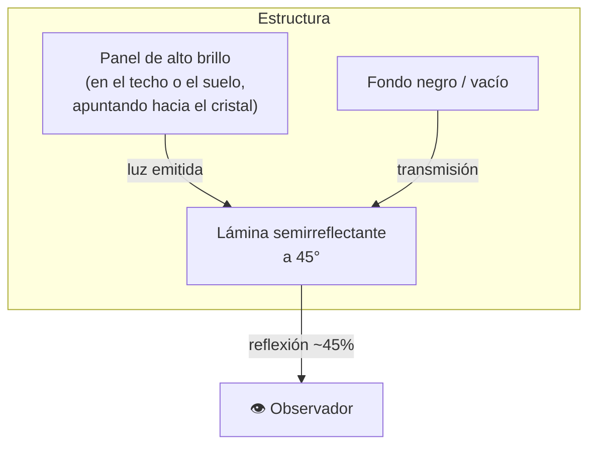
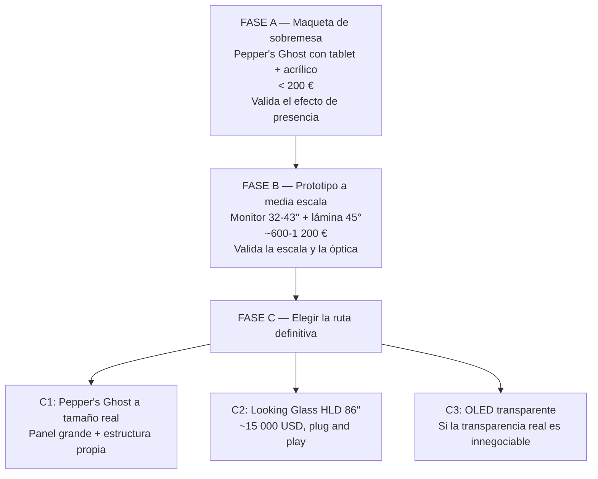

# PROJECT 02 — NEXUS · Transparent Display Research

> **Conclusión adelantada:** la tecnología que la visión describe ("una superficie vertical transparente donde aparece Nexus a tamaño real") **no se consigue mejor con LED transparente**. El LED transparente es tecnología de escaparate, pensada para verse desde 10 metros. Para una figura humana observada a 1–3 metros, las rutas realistas son **Pepper's Ghost** (hoy) y **OLED/MicroLED transparente** (mañana, con limitaciones de tamaño y coste).

---

## 1. El cálculo que decide la discusión

### La regla de la distancia mínima de visión

Para una pantalla de píxeles discretos, la distancia a la que el ojo deja de resolver píxeles individuales es aproximadamente:

```
d_min (metros) ≈ pixel_pitch (mm)          [regla práctica del sector, "regla del 1:1000"]
```

Esto viene de la agudeza visual humana (~1 minuto de arco):

```
Ángulo resuelto por el ojo:  θ ≈ 1' = 2,9 × 10⁻⁴ rad
Para que un píxel de pitch p no se resuelva:
        p / d < θ    ⇒    d > p / 2,9×10⁻⁴

Con p = 3,9 mm:   d > 13,4 m   ← ¡mucho peor que la regla práctica!
Con p = 10 mm:    d > 34,5 m
```

`[INFERENCIA]` La regla práctica del sector (`d_min ≈ pitch en metros`) es más permisiva porque asume contenido de vídeo en movimiento visto de forma no crítica. Para **una cara humana**, que es el estímulo que el sistema visual humano procesa con más precisión, hay que ser más estrictos.

### Aplicado a nuestro caso

| Escenario | Distancia de visión | Pixel pitch necesario (regla práctica) | Pixel pitch necesario (para una cara) |
|---|---|---|---|
| Nexus de cuerpo entero en una sala | **1,5–3 m** | ≤ 1,5–3 mm | **≤ 0,5–1 mm** `[INFERENCIA]` |
| Escaparate visto desde la calle | 5–15 m | 5–15 mm | 3–8 mm |
| Fachada de edificio | 20–50 m | 20–50 mm | 15–30 mm |

### Y lo que ofrece el LED transparente

`[CONFIRMADO]` El pixel pitch de LED transparente comercial va de **P3,9 a P25** (3,9 mm a 25 mm), y **la transparencia aumenta al aumentar el pitch**: aproximadamente 35 % a P10 y hasta 65 % a P25 en catálogos de fabricante; otras fuentes citan rangos de 40–75 % y de 65–85 % según producto. Fuentes: [Unilight — Transparent LED Display Buyer's Guide](https://www.unilightled.com/transparent-led-display-buyers-guide/), [XFox — Transparent LED Buying Guide 2026](https://www.xfoxledwall.com/post/transparent-led-display-buying-guide-2026-transparency-brightness-pixel-pitch-and-project-fit), [Crystal Display — Transparent displays compared](https://crystal-display.com/blog-transparent-displays-compared-lcd-vs-oled-vs-led/).

**Compromiso fundamental del LED transparente** (valores orientativos de catálogo, `[INFERENCIA]` a partir de las fuentes citadas):

| Pixel pitch | Transparencia típica | Distancia mínima de visión | ¿Cara humana legible a 2 m? |
|---|---|---|---|
| P3,9 | ~35–40 % | ~4 m (regla práctica) / ~13 m (agudeza) | ❌ |
| P6 | ~45–50 % | ~6 m / ~21 m | ❌ |
| P10 | ~35–60 % | ~10 m / ~34 m | ❌ |
| P16 | ~60–65 % | ~16 m | ❌ |
| P25 | ~65–70 % | ~25 m | ❌ |

> **El compromiso es físico, no de ingeniería:** la transparencia viene de dejar huecos entre las tiras de LED. Más huecos = más transparente = menos píxeles. **No existe un LED transparente de alta resolución y alta transparencia**, porque son la misma variable.

### Veredicto

| Tecnología | Pitch mínimo realista | ¿Sirve para una cara a 2 m? |
|---|---|---|
| LED transparente P3,9 (el mejor caso) | 3,9 mm | ❌ **No.** Requeriría ~4–13 m de distancia |
| LED transparente P10 (transparencia decente) | 10 mm | ❌ Rotundamente no |
| OLED transparente | ~0,1–0,2 mm (equivalente a un panel FHD/4K de ese tamaño) | ✅ Sí |
| Panel LCD/OLED normal en Pepper's Ghost | El del panel (fino) | ✅ Sí |

---

## 2. Catálogo completo de tecnologías

### 2.1 LED transparente (film adhesivo o rejilla)

| Parámetro | Rango | Fuente |
|---|---|---|
| Pixel pitch | 3,9–25 mm | `[CONFIRMADO]` |
| Transparencia | 35–85 % según pitch y producto | `[CONFIRMADO]` |
| Brillo | 1 000–6 000 nits; productos P6 con 4 500+ nits; exterior 5 000–7 500 nits | `[CONFIRMADO]` |
| Aplicación prevista | Escaparates, fachadas, publicidad a distancia | `[CONFIRMADO]` |
| Aplicación **no** prevista | Visión de cerca, contenido detallado | `[CONFIRMADO]` — "not ideal for close viewing" |
| Coste | Por m², depende fuertemente del pitch | `SIN PRECIO FIABLE` |

**Veredicto para Nexus:** ❌ **No es la tecnología correcta.** El pitch mínimo es 8–20× peor que lo necesario.

**Único caso en que tendría sentido:** una instalación en escaparate o vestíbulo donde Nexus se vea desde ≥ 8 m. Ese no es el caso de uso descrito.

---

### 2.2 OLED transparente

| Parámetro | Dato | Fuente |
|---|---|---|
| Transparencia | ~40 % | `[CONFIRMADO]` — [Crystal Display](https://crystal-display.com/blog-transparent-displays-compared-lcd-vs-oled-vs-led/) |
| Calidad de imagen | Negros reales, ángulos de visión muy amplios; pensado para visión cercana e interactiva | `[CONFIRMADO]` |
| Estado comercial | LG es el único con producto comercial anunciado de OLED transparente; se comercializa como solución de señalización profesional, y se integra en productos concretos (p. ej. un frigorífico con panel transparente de 36") | `[CONFIRMADO]` — [OLED-Info](https://www.oled-info.com/transparent-oleds), [LG Business Solutions](https://solutions.lg.com/us/transparent-oled) |
| Limitación clave | **El "negro" es transparente.** En un OLED transparente, un píxel apagado deja pasar el fondo | `[INFERENCIA]` física de la tecnología |
| Brillo | Inferior al LED transparente | `[INFERENCIA]` |
| Coste | Alto, canal profesional | `SIN PRECIO FIABLE` |

**Veredicto para Nexus:** ⚠️ **Técnicamente adecuado, comercialmente difícil.** Resolución correcta para visión cercana, pero:
- Disponibilidad limitada y canal profesional
- 40 % de transparencia significa que el fondo se ve **a través de Nexus**, lo que reduce el realismo salvo que haya un fondo oscuro y controlado
- El problema del negro transparente hace que las sombras del avatar "desaparezcan"

---

### 2.3 MicroLED transparente

| Parámetro | Dato | Fuente |
|---|---|---|
| Estado | Samsung mostró la primera pantalla MicroLED transparente en CES 2024 y en CES 2026 presenta aplicaciones reales y un roadmap para llevarla al hogar (ventanas, separadores de ambiente) | `[CONFIRMADO]` — [Sammy Fans](https://www.sammyfans.com/2026/01/02/samsung-making-transparent-micro-led-reality/) |
| Brillo | Significativamente superior a OLED y LCD | `[CONFIRMADO]` |
| Coste | Los MicroLED **no transparentes** de Samsung están en el orden de 150 000 USD para 110" | `[CONFIRMADO]` |
| Disponibilidad para nosotros | Ninguna | `[INFERENCIA]` |

**Veredicto:** ❌ `CURRENTLY IMPRACTICAL` por coste y disponibilidad. **Es la tecnología que probablemente ganará esta batalla en 5–10 años.** Vigilarla, no diseñar sobre ella.

---

### 2.4 Pepper's Ghost ⭐

La técnica clásica: un panel de alto brillo se refleja en una lámina semitransparente inclinada, y el observador ve la imagen "flotando" en el espacio detrás de la lámina.



| Parámetro | Característica |
|---|---|
| Resolución | La del panel usado (4K si se quiere) ✅ |
| Brillo aparente | ~30–50 % del panel (la lámina refleja parcialmente) → hay que sobredimensionar el brillo |
| Transparencia percibida | ✅ Excelente: la imagen parece flotar |
| Profundidad | ✅ Real: la imagen se forma a la distancia óptica del panel, no en la superficie del cristal. **Esto reduce el "efecto Mona Lisa"** de `04_VISION_SYSTEM.md` §4 |
| Requisito | **Fondo oscuro y controlado**, e iluminación ambiental controlada |
| Volumen | ⚠️ Requiere profundidad física: la estructura es una caja, no una lámina |
| Madurez | `READY NOW` — es la base de productos comerciales |

**Producto de referencia comercial `[CONFIRMADO]`:** la familia Proto Hologram usa este principio.

| Producto | Tamaño | Precio | Fuente |
|---|---|---|---|
| Proto M (sobremesa) | < 3 pies (~90 cm) | ~5 900–6 900 USD | [Entrepreneur](https://www.entrepreneur.com/business-news/proto-hologram-boxes-project-3d-images-like-the-jetsons/480494) |
| Proto Epic / Luma (tamaño real) | ~90 pulgadas de alto, cabe una persona de más de 1,80 m | **29 000–65 000 USD** | misma fuente |

> `[CONFIRMADO]` La propia fuente reconoce que "aunque las imágenes no son técnicamente hologramas, añadiendo sombras detrás del cuerpo y reflejos bajo los pies, la caja engaña al cerebro para que crea que podría haber alguien dentro". **Ese es exactamente el efecto que buscamos, y así es como se consigue.**

**Veredicto:** ⭐ **La ruta práctica.** Se puede prototipar con material de ferretería por menos de 200 €, y escalar a tamaño real con un panel grande y una lámina de acrílico semirreflectante.

---

### 2.5 Light field / Looking Glass

| Parámetro | Dato | Fuente |
|---|---|---|
| Producto | Looking Glass lanzó en septiembre de 2025 el **Hololuminescent Display (HLD)** | `[CONFIRMADO]` — [Looking Glass blog](https://blog.lookingglassfactory.com/looking-glass-unveils-a-new-category-of-display/) |
| Cómo funciona | Combina un display 2D de alta resolución con un grabado holográfico propietario que manipula la luz para crear profundidad | `[CONFIRMADO]` |
| Grosor | Menos de 1 pulgada | `[CONFIRMADO]` |
| Resolución | Hasta 4K | `[CONFIRMADO]` |
| Ventaja clave | **Acepta vídeo estándar**: no requiere pipeline 3D ni assets especiales | `[CONFIRMADO]` |
| Tamaños y precios | 16" 4K desde 1 500 USD (preventa); 27" 4K a 3 000 USD; 86" 4K a 15 000 USD | `[CONFIRMADO]` |
| Disponibilidad | 16" y 27" desde nov–dic 2025; 86" desde febrero 2026 | `[CONFIRMADO]` |
| Limitación | **No es transparente.** Da profundidad, no transparencia | `[INFERENCIA]` |

Además existe la familia de **light field displays** de Looking Glass (p. ej. 27" 5K), que ofrecen 3D visible por varias personas sin gafas. `[CONFIRMADO]` — [Looking Glass 27"](https://lookingglassfactory.com/looking-glass-27).

**Veredicto:** ⭐⭐ **Candidato muy fuerte y sorprendente.**
- El HLD de 86" a 15 000 USD es **4× más barato que un Proto Epic** y da profundidad a tamaño casi real.
- Acepta vídeo estándar → nuestro pipeline de Unreal sirve tal cual.
- No es transparente, pero **la profundidad importa más que la transparencia** para el efecto de presencia. La transparencia por sí sola, sin profundidad, produce un "fantasma plano".

---

### 2.6 Proyección

| Variante | Descripción | Veredicto |
|---|---|---|
| Retroproyección sobre film holográfico | Un proyector detrás de una lámina de retroproyección transparente | ⚠️ Requiere profundidad detrás; brillo limitado; el film transparente da imagen tenue |
| Proyección frontal sobre superficie | Simple | ❌ El observador hace sombra; sin negros |
| Proyección sobre niebla/agua | Efecto llamativo | ❌ Inviable en una casa |
| Proyección sobre maniquí / superficie con forma humana | Da volumen real y muy buen efecto de presencia | ⭐ Interesante y poco explorado; requiere que la forma sea fija |

### 2.7 Ventiladores holográficos (LED rotativos)

❌ **Descartado.** Baja resolución, ruido, pieza móvil peligrosa, artefactos visuales, y el efecto se pierde de cerca.

### 2.8 Display volumétrico real

❌ `CURRENTLY IMPRACTICAL` para una figura humana a tamaño real. Los sistemas volumétricos reales (voxels en un volumen) están en escala de laboratorio o de centímetros cúbicos.

---

## 3. Matriz de decisión

| Tecnología | Coste | Resolución a 2 m | Transparencia | Profundidad | Brillo | Complejidad | Volumen físico | Disponibilidad | Prototipo | Producto |
|---|---|---|---|---|---|---|---|---|---|---|
| LED transparente | Medio | ❌ 1 | ✅ 5 | ❌ 1 | ✅ 5 | Media | ✅ Fino | ✅ 5 | ⚠️ | ❌ |
| OLED transparente | Alto | ✅ 5 | ⚠️ 3 | ❌ 1 | ⚠️ 3 | Media | ✅ Fino | ⚠️ 2 | ⚠️ | ⚠️ |
| MicroLED transparente | ❌ Muy alto | ✅ 5 | ✅ 4 | ❌ 1 | ✅ 5 | Alta | ✅ Fino | ❌ 1 | ❌ | ❌ hoy |
| **Pepper's Ghost** | ✅ Bajo-medio | ✅ 5 | ✅ 5 (aparente) | ✅ 4 | ⚠️ 3 | ✅ Baja | ❌ Voluminoso | ✅ 5 | ⭐⭐ | ⭐ |
| **Looking Glass HLD** | Medio-alto | ✅ 5 | ❌ 1 | ✅ 5 | ✅ 4 | ✅ Baja | ✅ Fino | ✅ 4 | ⭐ | ⭐⭐ |
| Light field (27") | Medio | ✅ 5 | ❌ 1 | ✅ 5 | ✅ 4 | Media | ✅ Fino | ✅ 4 | ⭐ | ⚠️ tamaño |
| Retroproyección | ✅ Bajo | ⚠️ 3 | ✅ 4 | ❌ 2 | ❌ 2 | Media | ❌ Voluminoso | ✅ 5 | ⚠️ | ❌ |
| Proyección sobre forma | ✅ Bajo | ⚠️ 3 | ❌ 1 | ✅ 5 | ⚠️ 3 | Alta | Medio | ✅ 4 | ⭐ | ⚠️ |

---

## 4. Recomendación



### La recomendación concreta

1. **Empezar por una maqueta de Pepper's Ghost de sobremesa** (`EXP-210`). Coste ridículo, resultado inmediato, y responde a la pregunta que de verdad importa: *¿el efecto de presencia funciona, o Nexus se siente igual de real en un monitor normal?*

2. **No comprar ninguna pantalla transparente hasta responder esa pregunta.** `[HIPÓTESIS]` fuerte: gran parte del efecto de "está aquí" viene del **comportamiento** (que te mire, que reaccione, que esté a escala correcta), no de la tecnología del display. Un avatar bien animado en un monitor normal a tamaño correcto puede resultar más presente que un avatar mediocre en una pantalla transparente cara.

3. **Si el efecto Pepper's Ghost demuestra valor, la decisión final es entre C1 (a medida, más barato, voluminoso) y C2 (Looking Glass HLD, caro pero llave en mano y delgado).**

4. **Descartar el LED transparente** para este caso de uso, salvo que el escenario cambie a un espacio visto desde lejos.

---

## 5. Requisitos de la instalación física (independientes de la tecnología)

| Parámetro | Requisito | Nota |
|---|---|---|
| **Escala** | Nexus debe verse a **tamaño humano real** (o a una escala deliberada y consistente) | El cerebro detecta escalas incorrectas |
| **Altura de los ojos** | Los ojos del avatar a la altura de los ojos del usuario (~1,55–1,70 m de pie) | Determina la altura de montaje |
| **Distancia de visión** | 1,5–3 m | Determina la resolución necesaria |
| **Iluminación ambiental** | Controlada. Pepper's Ghost y OLED transparente **exigen** fondo oscuro | Puede requerir intervención en la sala |
| **Brillo** | Suficiente para el ambiente; a mayor luz ambiente, más brillo | Contradice el requisito de fondo oscuro; hay que equilibrar |
| **Ángulo de visión** | ≥ 120° horizontal para que funcione al moverse por la sala | Pepper's Ghost tiene ángulo limitado ⚠️ |
| **Ruido** | Sin ventiladores audibles (NFR-09) | Un panel grande disipa; hay que planificarlo |
| **Peso y montaje** | Un panel de 86" pesa decenas de kg | Requiere anclaje estructural, no un soporte cualquiera |
| **Consumo** | Un panel grande consume 200–500 W `[HIPÓTESIS]` | Instalación eléctrica dedicada |
| **Calor** | Ese consumo se convierte en calor en la habitación | |
| **Seguridad** | Estructura de cristal/acrílico a 45° sobre la cabeza de personas | ⚠️ **Requisito de seguridad mecánica serio** en Pepper's Ghost a tamaño real |

---

## 6. Preguntas para el ingeniero electrónico

| ID | Pregunta |
|---|---|
| **Q-E40** | ¿Qué controladora de vídeo necesita cada tecnología candidata? (LED transparente requiere sending/receiving cards específicas; OLED y Looking Glass aceptan HDMI/DP estándar) |
| **Q-E41** | ¿Cuál es el presupuesto eléctrico y térmico de la instalación completa? ¿Necesita línea dedicada? |
| **Q-E42** | En Pepper's Ghost a tamaño real: ¿qué material para la lámina (vidrio laminado vs acrílico), qué espesor, qué anclaje, y qué análisis estructural? **Es un elemento de seguridad** |
| **Q-E43** | ¿Cómo evitamos reflejos parásitos y dobles imágenes en la lámina? (una lámina de dos caras produce dos reflexiones; se resuelve con vidrio de recubrimiento especial o con cuña) |
| **Q-E44** | ¿Cómo integramos el Sensor Hub en la estructura sin que se vea y manteniendo la calibración geométrica? |
| **Q-E45** | ¿Iluminación de la sala controlada por Nexus? (Si el sistema puede atenuar las luces cuando aparece, mejora enormemente el efecto) |
| **Q-E46** | ¿Cuánto brillo real necesitamos, medido en la sala, para el ambiente lumínico previsto? |

---

## 7. Fuentes

- [Unilight — Transparent LED Display Buyer's Guide 2026](https://www.unilightled.com/transparent-led-display-buyers-guide/)
- [XFox — Transparent LED Display Buying Guide 2026](https://www.xfoxledwall.com/post/transparent-led-display-buying-guide-2026-transparency-brightness-pixel-pitch-and-project-fit)
- [Crystal Display — Transparent Displays Compared: LCD vs OLED vs LED](https://crystal-display.com/blog-transparent-displays-compared-lcd-vs-oled-vs-led/)
- [OLED-Info — Transparent OLEDs: introduction and market status](https://www.oled-info.com/transparent-oleds)
- [LG Business Solutions — Transparent OLED](https://solutions.lg.com/us/transparent-oled)
- [IEEE Spectrum — How LG and Samsung are making TV screens disappear](https://spectrum.ieee.org/transparent-tv)
- [Sammy Fans — Samsung transparent Micro LED (CES 2026)](https://www.sammyfans.com/2026/01/02/samsung-making-transparent-micro-led-reality/)
- [Looking Glass — Hololuminescent Display](https://blog.lookingglassfactory.com/looking-glass-unveils-a-new-category-of-display/) · [Looking Glass 27"](https://lookingglassfactory.com/looking-glass-27)
- [Entrepreneur — Proto Hologram boxes](https://www.entrepreneur.com/business-news/proto-hologram-boxes-project-3d-images-like-the-jetsons/480494)
- [CNN Business — Proto's hologram boxes](https://www.cnn.com/2024/09/27/tech/proto-hologram-boxes-3d-video-spc)
