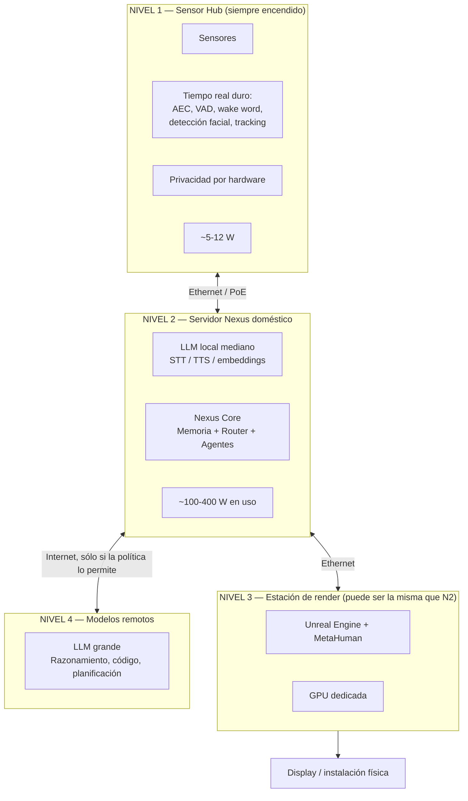
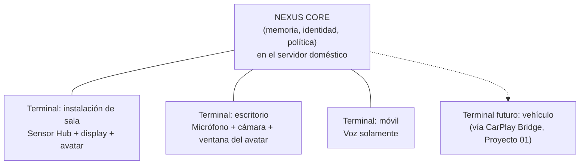
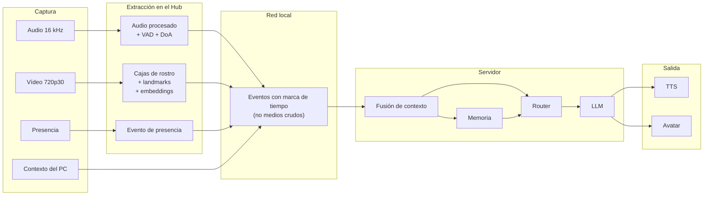
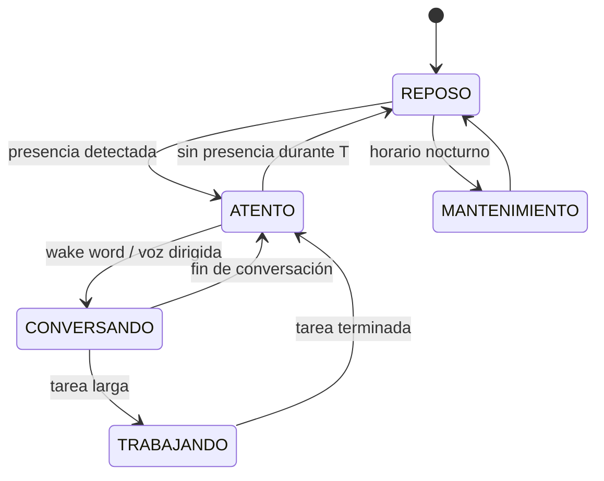

# PROJECT 02 — NEXUS · System Architecture

---

## 1. Arquitectura de despliegue en tres niveles

### Reparto de responsabilidades

| Nivel | Qué hace | Qué NUNCA hace |
|---|---|---|
| **1 — Sensor Hub** | Capta, procesa lo que es tiempo real duro, emite eventos | Almacenar memoria; enviar medios crudos a la red |
| **2 — Servidor** | Cognición, memoria, orquestación, modelos de tamaño medio | Renderizar el avatar (compite por GPU) |
| **3 — Render** | Unreal, MetaHuman, salida de vídeo | Tomar decisiones |
| **4 — Remoto** | Razonamiento pesado | Recibir datos biométricos o medios crudos |

> `[PROPUESTA DE DISEÑO]` Los niveles 2 y 3 pueden vivir en la misma máquina en NEXUS 0–2. **A partir de NEXUS 3 deben separarse**, por el conflicto de GPU descrito en `06_METAHUMAN_ARCHITECTURE.md` §7.

---

## 2. Nexus como servicio, no como lugar

Decisión tomada en `02_SYSTEM_VISION.md` §8:

| Implicación | Detalle |
|---|---|
| La memoria es única | Lo que le digo en el salón lo sabe en el escritorio |
| La identidad es única | Un solo Nexus, no varios |
| Los terminales son sustituibles | Se puede añadir uno sin tocar el núcleo |
| Hace falta gestión de sesión | ¿Qué pasa si hablo desde dos sitios a la vez? → Q-A09 |
| Hace falta descubrimiento | Los terminales encuentran el núcleo en la red local (mDNS) |
| El núcleo es un punto único de fallo | Requiere modo degradado en el terminal |

---

## 3. Flujo de datos completo

### Qué cruza la red y qué no

| Dato | ¿Cruza a la red local? | ¿Cruza a Internet? | Justificación |
|---|---|---|---|
| Audio crudo | ⚠️ Sólo el segmento de habla activo, tras el wake word | ❌ Nunca por defecto | Privacidad + ancho de banda |
| Vídeo crudo | ❌ **Nunca** | ❌ **Nunca** | Privacidad. Los frames no salen del Hub |
| Embeddings faciales | ✅ Al servidor | ❌ **Nunca** | Datos biométricos |
| Cajas y landmarks | ✅ | ❌ | Metadatos, no medios |
| Transcripción | ✅ | ⚠️ Sólo si el router lo autoriza | |
| Texto de respuesta | ✅ | ⚠️ Según política | |
| Eventos de presencia | ✅ | ❌ | |

> Esta tabla **es** la política de privacidad del sistema, expresada de forma verificable. Debe poder auditarse con una captura de red.

---

## 4. Bus de eventos

`[PROPUESTA DE DISEÑO]` Todos los subsistemas se comunican por un bus de eventos con estas propiedades:

| Propiedad | Requisito |
|---|---|
| Marca de tiempo | Todo evento lleva `t_captura` (reloj monotónico del origen) y `t_publicación` |
| Tipado | Esquemas versionados |
| Desacoplo | Un productor no sabe quién consume |
| Persistencia | Los eventos no se persisten por defecto (privacidad); sólo en modo diagnóstico |
| Reintentos | Los eventos de tiempo real **no se reintentan** (un frame viejo no sirve); los de cognición sí |
| Backpressure | Si un consumidor no da abasto, se descartan eventos antiguos, no se acumulan |

### Tipos de evento principales

| Evento | Origen | Frecuencia | Consumidores |
|---|---|---|---|
| `audio.vad` | Hub | Al cambiar | Core, TTS (barge-in) |
| `audio.speech_segment` | Hub | Por segmento | STT |
| `audio.doa` | Hub | 10 Hz durante habla | Fusión de identidad |
| `vision.faces` | Hub | 15 Hz | Fusión, Avatar |
| `vision.identity` | Hub/Servidor | Al cambiar | Core, Memoria |
| `presence.changed` | Hub | Al cambiar | Core, gestión de energía |
| `stt.partial` / `stt.final` | Servidor | Streaming | Core |
| `core.turn_start` / `turn_end` | Core | Por turno | Todos |
| `llm.token` | Servidor | Streaming | TTS |
| `tts.audio_chunk` + `tts.viseme` | Servidor | Streaming | Salida de audio, Avatar |
| `avatar.gaze_target` | Fusión | 30 Hz | Avatar |
| `system.privacy_state` | Hub (hardware) | Al cambiar | Todos, UI |

---

## 5. Interfaces del sistema

| Sistema A | Sistema B | Interfaz | Protocolo | Ancho de banda | Latencia requerida | Notas |
|---|---|---|---|---|---|---|
| Array de micrófonos | Sensor Hub | USB o I²S | UAC 2.0 / I²S | 4× 16 bit × 16 kHz ≈ 1 Mbps | < 20 ms | I²S preferible en producto |
| Cámara | Sensor Hub | MIPI CSI-2 o USB3 | — | 720p30 ≈ 400 Mbps crudo | < 33 ms | CSI-2 preferible |
| Acelerador de IA | Sensor Hub | PCIe (M.2) | — | GB/s | < 10 ms | |
| MCU | SBC del Hub | UART / SPI | Propio | < 100 kbps | < 10 ms | Estado de privacidad, presencia, IR |
| Sensor Hub | Servidor | **Ethernet (con PoE)** | Bus de eventos sobre TCP/UDP | < 5 Mbps (sólo eventos) | < 10 ms | **No cruzan medios crudos** |
| Servidor | Estación de render | Ethernet | Protocolo de avatar | < 1 Mbps | < 20 ms | Mensajes con marca de tiempo |
| Estación de render | Display | HDMI / DisplayPort | — | según resolución | < 16 ms | |
| Servidor | Internet | — | HTTPS | variable | — | Sólo bajo política del router |
| Servidor | Almacenamiento | NVMe / red | — | — | < 10 ms | Memoria cifrada |

---

## 6. Modos de funcionamiento y consumo

| Modo | Hub | Servidor | Render | Consumo total est. `[HIPÓTESIS]` |
|---|---|---|---|---|
| **REPOSO** | Radar + wake word. Cámara **apagada** | Suspendido o en bajo consumo | Apagado | **~10–20 W** |
| **ATENTO** | Todo activo, cámara encendida | Modelos cargados, en espera | Avatar en reposo | ~150–300 W |
| **CONVERSANDO** | Todo activo | LLM + STT + TTS | Render a 60 fps | ~300–600 W |
| **TRABAJANDO** | Reducido | Agentes activos | Avatar en reposo | ~200–400 W |
| **MANTENIMIENTO** | Mínimo | Consolidación de memoria, indexación | Apagado | ~100–200 W |

> ⚠️ **El consumo en modo ATENTO es el problema.** Un sistema que consume 300 W esperando a que hables no es aceptable en una casa. `[PROPUESTA DE DISEÑO]` El modo REPOSO tiene que ser el estado por defecto y el Hub debe poder despertar al servidor (Wake-on-LAN) en < 5 s. Esto es un requisito de arquitectura, no un detalle.

---

## 7. Modos degradados

| Fallo | Comportamiento requerido |
|---|---|
| Sin Internet | Conversación con modelo local; Nexus lo dice: "estoy sin conexión, mis respuestas serán más simples" |
| Servidor caído | El Hub sigue detectando presencia; los terminales indican que Nexus no está disponible |
| Cámara cortada (kill switch) | "No puedo verte ahora" — el resto funciona |
| Micrófono cortado | Interacción sólo por texto |
| Render caído | Conversación por voz sin avatar |
| Acelerador de IA caído | Visión degradada a menor frecuencia en CPU |
| Memoria corrupta | Modo sin memoria de largo plazo; **avisar**, nunca inventar |

> **Principio:** Nexus **siempre dice qué no puede hacer**. Un asistente que finge normalidad mientras está degradado destruye la confianza.

---

## 8. Seguridad

| Amenaza | Mitigación |
|---|---|
| Acceso no autorizado al servidor Nexus | Sin puertos expuestos a Internet; acceso sólo desde la red local o VPN |
| Suplantación de un terminal | Autenticación mutua entre terminales y núcleo (certificados) |
| Exfiltración de la memoria | Cifrado en reposo; la clave no está en el mismo disco |
| Suplantación de identidad ante Nexus (foto de una cara) | **Detección de vida (liveness)** si se usa el reconocimiento para autorizar algo. Si sólo se usa para saludar, el riesgo es bajo |
| Inyección de instrucciones vía contenido externo | El Tool Gateway aplica permisos; el contenido externo nunca puede elevar permisos |
| Un agente hace algo destructivo | Niveles de permiso L0–L4 (`03_AI_ARCHITECTURE.md` §5) |
| Escucha del canal Hub↔Servidor | TLS en la red local |

> ⚠️ **Regla dura:** el reconocimiento facial de Nexus **no es un mecanismo de autenticación**. Sirve para personalizar el trato, no para autorizar acciones. Una foto en un móvil engaña a la mayoría de sistemas de reconocimiento sin detección de vida. Cualquier acción de nivel L3/L4 requiere confirmación explícita, no "te he reconocido".

---

## 9. Preguntas abiertas de arquitectura

| ID | Pregunta |
|---|---|
| **Q-A09** | ¿Qué pasa si hablo con Nexus desde dos terminales a la vez? |
| **Q-A10** | ¿Cómo despierta el Hub al servidor sin que el arranque sea perceptible? |
| **Q-A11** | ¿El servidor Nexus es una máquina dedicada o un servicio en un NAS/PC existente? |
| **Q-A12** | ¿Cómo versionamos los esquemas de eventos cuando evolucione el sistema? |
| **Q-A13** | ¿Qué hacemos si el Hub y el servidor tienen versiones incompatibles? |
| **Q-A14** | ¿Cómo probamos el sistema completo de forma automatizada (escenarios grabados)? |
| **Q-A15** | ¿Qué política de actualización? ¿Nexus se actualiza solo? ¿Y si la actualización cambia su personalidad? |
