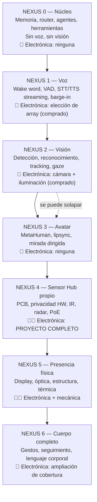
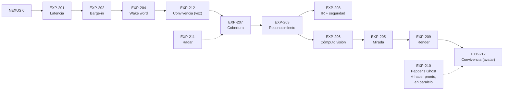

# PROJECT 02 — NEXUS · Prototype Roadmap

---

## 1. Las siete fases

### Puertas de fase (no avanzar sin cumplirlas)

| De → a | Puerta |
|---|---|
| N0 → N1 | El núcleo responde con memoria y herramientas de forma fiable por texto |
| N1 → N2 | **Latencia conversacional < 1 000 ms p95** y barge-in funcionando (`EXP-201`, `EXP-202`) |
| N2 → N3 | Reconocimiento facial con FAR/FRR aceptables **en nuestra sala** (`EXP-203`) |
| N3 → N4 | El avatar mira al usuario con < 200 ms de latencia y no cae por debajo de 60 fps (`EXP-205`, `EXP-209`) |
| N4 → N5 | El Hub funciona 30 días sin intervención y la cadena de privacidad es verificable |
| N5 → N6 | La instalación física produce el efecto de presencia deseado, medido con personas ajenas al proyecto |

---

## 2. Experimentos

### EXP-201 — Latencia conversacional extremo a extremo

| Campo | Contenido |
|---|---|
| **Hipótesis** | Es posible mantener < 1 000 ms p95 entre el fin del habla del usuario y el primer audio de respuesta, con modelos locales |
| **Hardware** | Array de micrófonos USB, PC con GPU, altavoz |
| **Software** | Pipeline STT→LLM→TTS en streaming, instrumentado con marcas de tiempo en cada etapa |
| **Procedimiento** | 100 turnos de conversación con frases de longitud variable. Registrar el tiempo de cada etapa |
| **Medición** | p50/p95/p99 total y por etapa |
| **Éxito** | p95 < 1 000 ms |
| **Fallo** | p95 > 1 500 ms |
| **Decisión siguiente** | Identificar la etapa dominante y aplicar las palancas de `05_AUDIO_SYSTEM.md` §7 |

---

### EXP-202 — Barge-in y AEC

| Campo | Contenido |
|---|---|
| **Hipótesis** | El array con AEC hardware permite detectar la voz del usuario mientras Nexus habla a volumen normal, y cortar en < 200 ms |
| **Hardware** | Array con AEC, altavoz a distintas distancias y volúmenes |
| **Software** | Pipeline con cancelación de TTS |
| **Procedimiento** | Nexus habla; el usuario interrumpe en 30 ocasiones a distintos volúmenes y distancias (1 m, 2 m, 3 m) y con música de fondo |
| **Medición** | Tasa de detección de la interrupción; latencia hasta el silencio; falsos barge-in causados por el propio TTS |
| **Éxito** | ≥ 95 % de detección, < 200 ms, 0 falsos barge-in en 30 min de habla continua |
| **Fallo** | Nexus se interrumpe a sí mismo, o no oye al usuario mientras habla |
| **Decisión siguiente** | Si falla: revisar referencia de eco, desacoplo mecánico del altavoz, o reducir volumen de salida |

---

### EXP-203 — Reconocimiento facial en condiciones reales

| Campo | Contenido |
|---|---|
| **Hipótesis** | Con SCRFD + ArcFace obtenemos FAR < 0,1 % y FRR < 5 % **en la sala real** |
| **Hardware** | Cámara en la posición prevista, iluminación de la sala |
| **Software** | Pipeline de detección + embedding + comparación |
| **Procedimiento** | Registrar 3–5 personas. Recoger 200+ muestras por persona en condiciones variadas (día, noche, contraluz, de perfil, con gafas, con gorro, a 1/2/3/4 m). Recoger muestras de 20+ desconocidos |
| **Medición** | **Curva ROC completa**; elegir el umbral, no copiarlo |
| **Éxito** | Existe un umbral con FAR < 0,1 % y FRR < 5 % |
| **Fallo** | No hay umbral aceptable → hace falta mejor iluminación, mejor cámara, o varias cámaras |
| **Decisión siguiente** | Fija el umbral de producción y determina si hace falta iluminación IR (`EXP-208`) |

---

### EXP-204 — Wake word

| Campo | Contenido |
|---|---|
| **Hipótesis** | La palabra elegida da < 1 falso positivo cada 24 h y < 5 % de falsos negativos a 3 m |
| **Hardware** | Array en la ubicación prevista |
| **Software** | Modelo de wake word entrenado con la palabra elegida |
| **Procedimiento** | (a) 72 h de audio ambiente normal (conversaciones, TV, música) contando falsos positivos. (b) 100 activaciones deliberadas a 1/2/3/4 m con y sin ruido |
| **Medición** | FP/24 h, FN %, latencia de detección |
| **Éxito** | Cumple NFR-06 y NFR-03 |
| **Fallo** | Demasiados FP → cambiar de palabra o reentrenar con negativos de nuestra casa |
| **Decisión siguiente** | Fija la palabra de activación definitiva |

---

### EXP-205 — Lazo de mirada del avatar

| Campo | Contenido |
|---|---|
| **Hipótesis** | El avatar puede seguir la posición del usuario con < 200 ms de latencia y con precisión angular suficiente para que el usuario perciba que le mira |
| **Hardware** | Cámara + PC de render + pantalla |
| **Software** | Pipeline visión→mirada→Control Rig |
| **Procedimiento** | (a) Medir la latencia con un movimiento brusco filmado a 240 fps. (b) Test perceptual: 5 personas se colocan en 5 posiciones y dicen si sienten que el avatar les mira |
| **Medición** | Latencia p95; puntuación perceptual; error angular estimado |
| **Éxito** | < 200 ms y ≥ 4/5 personas perciben la mirada dirigida |
| **Fallo** | Latencia alta (revisar cadena) o mirada descalibrada (revisar geometría) |
| **Decisión siguiente** | Determina si hace falta profundidad real (Q-V03) |

---

### EXP-206 — Presupuesto de cómputo de visión

| Campo | Contenido |
|---|---|
| **Hipótesis** | El pipeline de visión completo cabe en un acelerador tipo Hailo con margen |
| **Hardware** | Pi 5 + AI HAT+ (o AI HAT+ 2) |
| **Software** | SCRFD + tracking + embeddings sobre el acelerador |
| **Procedimiento** | Medir fps sostenidos, latencia por etapa, uso de CPU y temperatura durante 1 h |
| **Medición** | fps, latencia, W, °C |
| **Éxito** | ≥ 15 fps de detección sostenidos con < 50 % de CPU y sin throttling |
| **Fallo** | Hace falta mover la visión a la estación (y por tanto enviar frames por la red, lo que rompe la política de privacidad) |
| **Decisión siguiente** | Decide Q-V05 (dónde corre la visión) |

---

### EXP-207 — Cobertura de la sala

| Campo | Contenido |
|---|---|
| **Hipótesis** | Una sola cámara con FOV de 110° cubre las posiciones de uso relevantes |
| **Hardware** | Cámara, trípode |
| **Software** | Detección de rostro |
| **Procedimiento** | Mapear la sala: marcar dónde se detecta la cara con fiabilidad y dónde no, en cuadrícula de 0,5 m |
| **Medición** | Mapa de cobertura |
| **Éxito** | Las zonas de uso habitual (sofá, escritorio, entrada) están cubiertas |
| **Fallo** | Hacen falta 2+ cámaras → cambia la arquitectura del Hub (Q-E32) |
| **Decisión siguiente** | Define el número de cámaras y la ubicación del Hub |

---

### EXP-208 — Iluminación IR

| Campo | Contenido |
|---|---|
| **Hipótesis** | Un iluminador IR de 940 nm permite reconocimiento facial fiable en oscuridad total a 3 m, dentro del grupo exento de IEC 62471 |
| **Hardware** | Módulo de LEDs IR, cámara sin filtro de corte IR, radiómetro si es posible |
| **Software** | Pipeline de reconocimiento |
| **Procedimiento** | (a) Medir irradiancia a 20 cm, 50 cm, 1 m, 3 m. (b) Comparar la precisión del reconocimiento con luz normal vs oscuridad con IR |
| **Medición** | Irradiancia (W/m²), FAR/FRR en oscuridad, temperatura de los LEDs |
| **Éxito** | Precisión comparable a luz diurna y **cumplimiento del grupo exento de IEC 62471** |
| **Fallo** | Precisión insuficiente, o irradiancia fuera del grupo exento |
| **Decisión siguiente** | ⚠️ **Requisito de seguridad: si no cumple IEC 62471 grupo exento, hay que reducir potencia, no seguir adelante.** Ver Q-E27 |

---

### EXP-209 — Rendimiento del render

| Campo | Contenido |
|---|---|
| **Hipótesis** | Un MetaHuman se renderiza a 60 fps estables en la GPU disponible, con calidad suficiente |
| **Hardware** | Estación de render |
| **Software** | Unreal Engine 5.6+, escena con un MetaHuman |
| **Procedimiento** | Medir fps, frame time p99, uso de VRAM, con y sin LLM local corriendo simultáneamente |
| **Medición** | fps, p99 frame time, VRAM, temperatura de GPU |
| **Éxito** | 60 fps con p99 < 20 ms **con el LLM corriendo** |
| **Fallo** | Caídas de frames al hablar → confirma la necesidad de separar máquinas (Q-M02) |
| **Decisión siguiente** | Decide la arquitectura de nivel 2/3 de `09_SYSTEM_ARCHITECTURE.md` |

---

### EXP-210 — Maqueta de Pepper's Ghost ⭐

| Campo | Contenido |
|---|---|
| **Hipótesis** | El efecto de presencia de Pepper's Ghost es notablemente superior a un monitor plano, y merece la inversión |
| **Hardware** | Una tablet o monitor pequeño, una lámina de acrílico transparente, una estructura de cartón/madera, tela negra |
| **Software** | Vídeo del avatar sobre fondo negro |
| **Procedimiento** | Construir la maqueta. Mostrar a 5–8 personas ajenas al proyecto el mismo contenido en (a) monitor normal, (b) maqueta Pepper's Ghost. Preguntar cuál produce más sensación de presencia |
| **Medición** | Preferencia, comentarios cualitativos, distancia y ángulo a los que el efecto se pierde |
| **Éxito** | Preferencia clara por la maqueta |
| **Fallo** | Indiferencia → **excelente noticia**: nos ahorramos toda la fase NEXUS 5 cara y usamos un monitor grande |
| **Coste** | **< 200 €** |
| **Decisión siguiente** | Determina toda la estrategia de display (`08_TRANSPARENT_DISPLAY_RESEARCH.md` §4) |

> **Este experimento tiene la mejor relación información/coste de todo el proyecto Nexus.** Hacerlo pronto.

---

### EXP-211 — Radar de presencia

| Campo | Contenido |
|---|---|
| **Hipótesis** | Un sensor mmWave detecta presencia de personas inmóviles a 4 m con < 1 falso positivo/hora |
| **Hardware** | Módulo mmWave de evaluación |
| **Software** | Lectura de detecciones |
| **Procedimiento** | (a) Persona sentada inmóvil a 1/2/3/4/5 m durante 10 min. (b) 24 h de sala vacía contando falsos positivos. (c) Prueba con mascotas / ventilador / cortinas si aplica |
| **Medición** | Tasa de detección, FP/h, consumo |
| **Éxito** | Detecta inmóvil a 4 m, < 1 FP/h |
| **Fallo** | Volver a PIR + política más conservadora, o combinar sensores |
| **Decisión siguiente** | Confirma la estrategia de despertar sin cámara (`07_SENSOR_HARDWARE.md` §6) |

---

### EXP-212 — Uso continuado (prueba de convivencia)

| Campo | Contenido |
|---|---|
| **Hipótesis** | Nexus es útil y no molesta cuando se usa a diario durante 30 días |
| **Hardware** | Sistema NEXUS 2 o 3 completo |
| **Software** | — |
| **Procedimiento** | Uso real diario. Registrar: cuántas veces se usó, cuántas veces falló, cuántas veces molestó, cuántas veces se echó de menos algo |
| **Medición** | Interacciones/día, tasa de fallo, incidencias de molestia |
| **Éxito** | Uso espontáneo creciente, no decreciente |
| **Fallo** | Se deja de usar tras la novedad → hay un problema de producto, no de tecnología |
| **Decisión siguiente** | **La más importante de todas.** Determina si el proyecto vale la pena continuar hacia el hardware caro |

---

## 3. Orden recomendado

**Dos experimentos se pueden hacer inmediatamente y en paralelo con todo lo demás:**
- **EXP-210** (Pepper's Ghost): 200 € y un fin de semana; decide la estrategia de display de todo el proyecto.
- **EXP-201** (latencia): decide si la arquitectura de voz es viable.
