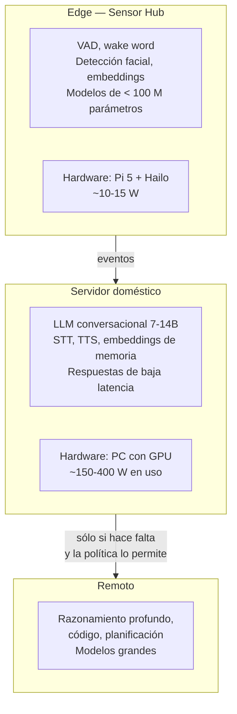

# PROJECT 03 — LARGE AI MODELS ON EDGE HARDWARE · Executive Summary

---

## 1. La pregunta

> **¿Hasta qué punto podemos ejecutar modelos de IA de miles de millones de parámetros en hardware tipo Raspberry Pi?**

---

## 2. La respuesta, en una fórmula

La generación de texto de un LLM es un proceso **limitado por el ancho de banda de memoria**, no por la potencia de cálculo. Para producir **cada token**, el procesador tiene que leer **todos los pesos del modelo** desde la memoria.

```
                    ancho de banda de memoria efectivo (bytes/s)
tokens por segundo ≈ ─────────────────────────────────────────────
                          tamaño del modelo en memoria (bytes)
```

Esta única fórmula predice casi todo el comportamiento observado, y explica por qué añadir un SSD más grande, o más TOPS, no sirve de nada.

### Verificación con datos reales

| Dispositivo | Ancho de banda | Modelo | Tamaño | Predicción | Medido | Fuente del dato medido |
|---|---|---|---|---|---|---|
| Raspberry Pi 5 | ~17 GB/s teórico → ~10 GB/s efectivo | Llama 3.2 1B Q4_K_M | ~0,8 GB | ~12 t/s | **17,2 t/s** | Benchmarks públicos `[CONFIRMADO]` |
| Raspberry Pi 5 | idem | Llama 3.2 3B Q4_K_M | ~1,9 GB | ~5,3 t/s | **4–8,8 t/s** | idem |
| Raspberry Pi 5 (16 GB) | idem | Llama 3.1 8B Q4_K_M | ~4,7 GB | ~2,1 t/s | **2–3 t/s** | idem |
| Jetson Orin Nano Super | 102 GB/s `[CONFIRMADO]` → ~58 GB/s efectivo | 7B Q4_K_M | ~4,1 GB | ~14 t/s | **14,2 t/s** | Benchmark publicado `[CONFIRMADO]` |

> **El modelo simple acierta dentro de un factor de 2 en todos los casos.** Eso significa que se puede usar para **planificar** sin comprar hardware: dado un modelo y un dispositivo, se puede estimar el rendimiento antes de gastarse un euro.

---

## 3. Las cinco conclusiones

### 3.1 Lo que limita primero es el ancho de banda de memoria

En orden de severidad para una Raspberry Pi 5:


**El almacenamiento casi nunca es el límite.** Tener un SSD de 2 TB no permite ejecutar un modelo de 70B, del mismo modo que tener una biblioteca enorme no permite leer más rápido.

### 3.2 Hay un techo duro por tamaño de modelo

| Tamaño | Cuantización | Memoria | ¿Cabe en Pi 5 16 GB? | t/s estimados | ¿Utilizable? |
|---|---|---|---|---|---|
| 1B | Q4 | ~0,8 GB | ✅ | 12–17 | ✅ Conversacional |
| 3B | Q4 | ~1,9 GB | ✅ | 5–9 | ✅ Justo |
| 7–8B | Q4 | ~4,7 GB | ✅ | 2–3 | ⚠️ Lento pero usable en batch |
| 13–14B | Q4 | ~8,5 GB | ✅ apretado | ~1,2 | ❌ Demasiado lento |
| 30–32B | Q4 | ~19 GB | ❌ | ~0,5 | ❌ |
| 70B | Q4 | ~40 GB | ❌ | ~0,25 | ❌ |
| 100B+ | Q4 | > 55 GB | ❌ | — | ❌ |
| "Trillion parameter" | Q4 | > 500 GB | ❌ | — | ❌ Ni con 30 Raspberry Pi |

**Frontera práctica de la Raspberry Pi 5: modelos de 1B a 8B.** Todo lo demás o no cabe, o es tan lento que no sirve.

### 3.3 Un clúster de Raspberry Pi no resuelve el problema

`[CONFIRMADO]` El propio README de `llama.cpp` sobre el backend RPC lo indica: sirve para **ejecutar un modelo que no cabe en un nodo**, no para hacer la inferencia más rápida. La documentación advierte además de que es una prueba de concepto *"frágil e insegura"*.

`[CONFIRMADO]` Medición pública de referencia: dos Pi con RPC ejecutando Llama 3.1 8B dan **10–15 % de mejora** sobre un único Pi de 16 GB con el mismo modelo. No es un factor de 2.

**Motivo:** el paralelismo tensorial requiere sincronización frecuente con enlaces de latencia muy baja y ancho de banda muy alto. Gigabit Ethernet es entre **50 y 500 veces más lento** que la memoria local. Ver `06_DISTRIBUTED_INFERENCE.md` para el cálculo.

### 3.4 Los aceleradores cambian la ecuación — pero sólo los que traen su propia memoria

| Acelerador | TOPS | Memoria propia | ¿Sirve para LLM? |
|---|---|---|---|
| Google Coral Edge TPU | 4 | 8 MB SRAM | ❌ **No.** Diseñado para CNN pequeñas de visión, INT8 |
| Hailo-8 / 8L (AI HAT+) | 26 / 13 | Sin DRAM propia | ⚠️ Excelente para visión; muy limitado para LLM |
| **Hailo-10H (AI HAT+ 2)** | **40 (INT4)** | **8 GB LPDDR4X propios** `[CONFIRMADO]` | ✅ **Sí.** Es la diferencia clave: interfaz DDR directa para escalar a LLM/VLM |
| Jetson Orin Nano Super | 67 | 8 GB compartidos a 102 GB/s | ✅ Sí |
| GPU de escritorio | — | VRAM dedicada de alto ancho de banda | ✅✅ |

`[CONFIRMADO]` El Raspberry Pi AI HAT+ 2, publicado el **15 de enero de 2026**, empareja un Hailo-10H con **8 GB de LPDDR4X a bordo**, y es lo que permite por primera vez ejecutar modelos generativos en el ecosistema Raspberry Pi con una arquitectura pensada para ello.

### 3.5 Entrenar en una Raspberry Pi no tiene sentido; ajustar sí, pero en otro sitio

- **Entrenamiento desde cero:** `CURRENTLY IMPRACTICAL` en cualquier hardware de este tipo, por órdenes de magnitud.
- **Fine-tuning completo:** también impracticable (requiere ~4× la memoria del modelo para gradientes y estados del optimizador).
- **LoRA / QLoRA:** viable **en una GPU**, no en el Pi. El resultado (un adaptador de pocas decenas de MB) **sí se puede ejecutar** en el Pi.

`[PROPUESTA DE DISEÑO]` **Entrenar en la nube o en la estación con GPU; ejecutar en el edge.** Es la división natural.

---

## 4. Corrección de terminología

El brief menciona "billones de iteraciones". Esa expresión mezcla conceptos y conviene corregirla porque cambia el análisis:

| Término | Qué es realmente | Qué NO es |
|---|---|---|
| **Parámetros** | Los pesos del modelo. "7B" = 7 000 millones de números. **Determinan la memoria necesaria** | No son "operaciones" |
| **Tokens** | Fragmentos de texto (≈ 0,75 palabras en inglés, menos en español). La unidad de entrada y salida | No son caracteres ni palabras |
| **Iteraciones** | Pasos de **entrenamiento**. En inferencia no hay iteraciones: hay pasadas hacia delante, una por token | No es una métrica de inferencia |
| **Entrenamiento** | Ajustar los pesos. Requiere miles de GPU durante semanas | |
| **Inferencia** | Usar los pesos ya entrenados. Es lo que hacemos en el edge | |
| **Ventana de contexto** | Cuántos tokens puede "ver" el modelo a la vez. **Consume memoria adicional (KV cache), a menudo mucha** | No es memoria del modelo |

**La forma correcta de plantear la pregunta original es:**

> *"¿Qué número de parámetros, con qué cuantización y con qué ventana de contexto, puede ejecutar en inferencia un dispositivo con X GB de RAM y Y GB/s de ancho de banda, a una velocidad de Z tokens/segundo?"*

Y esa pregunta **tiene respuesta calculable**. Está en `04_MODEL_MEMORY_ANALYSIS.md`.

---

## 5. Recomendación para Nexus



| Nivel | Por qué ahí |
|---|---|
| **Edge** | Latencia dura y privacidad. Modelos diminutos, siempre encendido, pocos vatios |
| **Servidor doméstico** | El punto óptimo: un modelo de 7–14B en una GPU de consumo da conversación fluida con privacidad total |
| **Remoto** | Sólo para lo que un modelo de 14B no puede hacer bien |

**El error a evitar:** intentar meter la capa media en el dispositivo edge. No cabe, y no es necesario.

---

## 6. Estado de madurez

| Elemento | Madurez |
|---|---|
| Ejecutar 1–3B en Raspberry Pi 5 | `READY NOW` |
| Ejecutar 7–8B en Raspberry Pi 5 16 GB | `READY NOW` pero lento (2–3 t/s) |
| Ejecutar LLM en AI HAT+ 2 (Hailo-10H) | `PROVEN BUT REQUIRES INTEGRATION` — reciente (ene. 2026), benchmarks públicos aún dispersos |
| Ejecutar 7B en Jetson Orin Nano Super | `READY NOW` |
| Clúster de Pi con `llama.cpp` RPC | `EXPERIMENTAL` — la propia documentación lo llama frágil e inseguro |
| Clúster con `distributed-llama` | `EXPERIMENTAL` |
| Descarga a SSD (mmap/offload) para modelos grandes | `CURRENTLY IMPRACTICAL` para uso interactivo |
| Coral Edge TPU para LLM | `CURRENTLY IMPRACTICAL` |
| Fine-tuning en el Pi | `CURRENTLY IMPRACTICAL` |
| LoRA/QLoRA en GPU, ejecución en el edge | `READY NOW` |

---

## Documentos relacionados

| Documento | Contenido |
|---|---|
| `02_LLM_FUNDAMENTALS.md` | Terminología rigurosa, cómo funciona la inferencia, prefill vs decode |
| `03_RASPBERRY_PI_LIMITS.md` | Qué limita exactamente y en qué orden |
| `04_MODEL_MEMORY_ANALYSIS.md` | **Las matemáticas**: memoria de pesos, KV cache, overhead, con ejemplos calculados |
| `05_QUANTIZATION.md` | FP32 a INT2, GGUF/GPTQ/AWQ, qué se pierde |
| `06_DISTRIBUTED_INFERENCE.md` | Clústeres, paralelismo tensorial y de pipeline, por qué Ethernet no basta |
| `07_AI_ACCELERATORS.md` | Coral, Hailo, Jetson, NPUs, qué sirve para qué |
| `08_HARDWARE_COMPARISON.md` | Tabla comparativa completa de plataformas |
| `09_BENCHMARKS.md` | Datos medidos publicados, con fuente y con huecos marcados |
| `10_NEXUS_EDGE_AI_ARCHITECTURE.md` | La arquitectura recomendada para Nexus |
| `11_EXPERIMENTS.md` | Experimentos a ejecutar |
| `12_CONCLUSIONS.md` | Conclusiones y recomendaciones finales |
