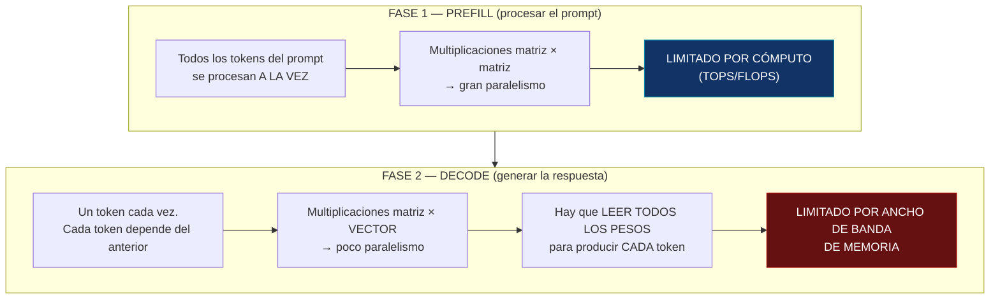

# PROJECT 03 · LLM Fundamentals — terminología y mecánica

> Este documento existe porque **usar mal la terminología lleva a diseñar mal el hardware**. Un ingeniero electrónico que entienda esta sección puede dimensionar un sistema de IA local sin depender de nadie.

---

## 1. Glosario riguroso

| Término | Definición precisa | Unidad | Qué determina |
|---|---|---|---|
| **Parámetro (weight)** | Un número real almacenado en el modelo, ajustado durante el entrenamiento | adimensional (se cuentan) | **La memoria necesaria** y, junto al ancho de banda, **la velocidad de generación** |
| **Token** | Unidad de texto en la que el modelo opera. En inglés ≈ 0,75 palabras; en español ≈ 0,5–0,6 palabras (peor eficiencia por la tokenización) | tokens | La longitud de entrada y salida |
| **Ventana de contexto** | Número máximo de tokens que el modelo puede atender simultáneamente | tokens | **Memoria adicional (KV cache)** y coste de atención |
| **Iteración (step)** | Un paso de optimización durante el **entrenamiento**: procesar un lote y actualizar los pesos | pasos | Sólo relevante en entrenamiento |
| **Época (epoch)** | Una pasada completa sobre el conjunto de entrenamiento | — | Sólo entrenamiento |
| **Entrenamiento** | Proceso de ajustar los parámetros a partir de datos | GPU·hora | Coste de crear el modelo |
| **Inferencia** | Usar un modelo ya entrenado para producir salida | tokens/s | **Lo que hacemos en el edge** |
| **Prefill (prompt processing)** | Procesar el prompt de entrada. Es **paralelizable** y limitado por cómputo | tokens/s (alto) | Latencia hasta el primer token |
| **Decode (generation)** | Generar los tokens de salida, uno a uno. Es **secuencial** y limitado por ancho de banda de memoria | tokens/s (bajo) | Velocidad de respuesta |
| **KV cache** | Memoria intermedia que guarda claves y valores de la atención de todos los tokens anteriores, para no recalcularlos | bytes | **Memoria adicional que crece con el contexto** |
| **Cuantización** | Reducir la precisión numérica de los parámetros | bits/parámetro | Memoria y velocidad, a cambio de calidad |
| **TOPS / FLOPS** | Operaciones por segundo que el hardware puede hacer | ops/s | **Casi nunca es el límite en decode** |
| **Ancho de banda de memoria** | Bytes por segundo que se pueden leer de la RAM | GB/s | **El límite real en decode** |

---

## 2. Corrección de la formulación del brief

> "billones de iteraciones"

Esta frase mezcla tres cosas:

| Lo que probablemente se quería decir | Formulación correcta |
|---|---|
| "Modelos muy grandes" | **Modelos de miles de millones de parámetros** (1B, 7B, 70B...) |
| "Muchos cálculos" | **Operaciones por token** (FLOPs por token ≈ 2 × parámetros) |
| "Mucho procesamiento" | **Ancho de banda de memoria consumido por token** |

**Nota sobre "billón":** en español, *billón* = 10¹². En inglés, *billion* = 10⁹ (mil millones). Cuando se habla de "modelos de 7B", la B es *billion* inglesa = **7 000 millones**. Un modelo de un billón español (10¹²) de parámetros sería un modelo de "1T" en la nomenclatura inglesa. **Esta confusión cambia el análisis por un factor de 1 000.** En estos documentos usamos siempre la notación inglesa (B = 10⁹, T = 10¹²) por ser la estándar del sector.

---

## 3. Cómo funciona realmente la inferencia



### Por qué el decode lee todos los pesos en cada token

Para generar un token, la señal atraviesa **todas las capas** del modelo. En cada capa hay matrices de pesos que deben multiplicarse por el vector de estado. Como el vector es uno solo (batch = 1), **cada peso se usa exactamente una vez** por token.

```
Aritmética por token (batch = 1):
    Operaciones ≈ 2 × N_parámetros                     (una multiplicación + una suma por peso)
    Bytes leídos ≈ N_parámetros × bytes_por_parámetro   (cada peso se lee una vez)

    Intensidad aritmética = operaciones / bytes ≈ 2 / bytes_por_parámetro

    Con INT4 (0,5 bytes/param):  intensidad ≈ 4 ops/byte
    Con FP16 (2 bytes/param):    intensidad ≈ 1 op/byte
```

Un procesador moderno puede hacer **cientos** de operaciones por byte leído. Con una intensidad de 1–4 ops/byte, **el procesador está esperando a la memoria el 95 % del tiempo**. Ese es el fenómeno central de todo este documento.

### La consecuencia práctica

> **Añadir TOPS a un sistema limitado por ancho de banda no acelera la generación de texto.**
> Es como poner un motor más potente a un camión atascado en un embudo de un carril.

Esto explica por qué:
- Un acelerador de 4 TOPS sin memoria propia no sirve para LLM.
- Un dispositivo con 40 TOPS **y 8 GB de memoria propia** sí sirve — porque lo que aporta no son los TOPS, es la memoria y su ancho de banda.
- Una GPU de escritorio es rápida no tanto por sus TFLOPS como por sus cientos de GB/s de VRAM.

---

## 4. Prefill vs decode: dos métricas distintas

| Métrica | Qué mide | Límite | Valor típico Pi 5 (7B Q4) | Valor típico Jetson Orin Nano (7B Q4) |
|---|---|---|---|---|
| **Prefill / prompt eval** | Velocidad de digerir el prompt | Cómputo | decenas de t/s `[HIPÓTESIS]` | **285 t/s** `[CONFIRMADO]` |
| **Decode / generation** | Velocidad de generar la respuesta | Ancho de banda | 2–3 t/s `[CONFIRMADO]` | **14,2 t/s** `[CONFIRMADO]` |
| **TTFT (time to first token)** | Latencia percibida al empezar | prefill + carga | | |

`[CONFIRMADO]` El dato de Jetson (285 t/s de prompt eval frente a 14,2 t/s de generación) ilustra perfectamente la asimetría: **20× de diferencia entre las dos fases del mismo modelo en el mismo hardware.**

### Por qué importa para Nexus

En una conversación:
- El **prompt** puede ser largo (contexto + memoria + historia): 1 000–4 000 tokens.
- La **respuesta** suele ser corta: 30–150 tokens.

```
Ejemplo con un Pi 5 y un modelo de 7B:
    Prefill de 2 000 tokens a ~30 t/s   = 67 s      ← ¡inaceptable!
    Decode de 80 tokens a 2,5 t/s        = 32 s      ← inaceptable
    Total                                ≈ 99 s

El mismo caso en Jetson Orin Nano Super:
    Prefill de 2 000 tokens a 285 t/s    = 7,0 s
    Decode de 80 tokens a 14,2 t/s       = 5,6 s
    Total                                ≈ 12,6 s    ← todavía lejos del objetivo de 1 s de Nexus
```

`[INFERENCIA]` **Ningún dispositivo de esta clase cumple el requisito conversacional de Nexus (< 1 s) con un modelo de 7B y contexto largo.** Eso no es un fallo del hardware: es la razón por la que la arquitectura de Nexus es jerárquica.

> **Palanca importante:** el *prompt caching* (reutilizar el KV cache de la parte del prompt que no cambia) elimina la mayor parte del coste de prefill en conversaciones sucesivas. Es la optimización con mejor retorno para un asistente. `[PROPUESTA DE DISEÑO]`

---

## 5. Entrenamiento vs inferencia: los números

| Aspecto | Entrenamiento | Inferencia |
|---|---|---|
| Memoria necesaria | ~4× el tamaño del modelo en FP16 (pesos + gradientes + estados del optimizador + activaciones) | ~1× el modelo cuantizado + KV cache |
| Cómputo por token | ~6 × N_parámetros FLOPs (forward + backward) | ~2 × N_parámetros FLOPs |
| Paralelismo | Muy alto (lotes grandes) | Muy bajo en decode (batch=1) |
| Límite | Cómputo | Ancho de banda de memoria |
| Hardware típico | Miles de GPU durante semanas | Un dispositivo |
| **¿Viable en Raspberry Pi?** | ❌ **No, por órdenes de magnitud** | ✅ Sí, con modelos pequeños |

### Ejemplo del abismo

```
Entrenar un modelo de 7B desde cero:
    Tokens de entrenamiento ≈ 1-15 billones (10¹² inglés)
    FLOPs ≈ 6 × 7×10⁹ × 2×10¹² ≈ 8,4 × 10²²

Capacidad de una Raspberry Pi 5 (CPU, estimación optimista): ~50 GFLOPS = 5×10¹⁰ FLOP/s
    Tiempo = 8,4×10²² / 5×10¹⁰ ≈ 1,7 × 10¹² segundos ≈ 53 000 AÑOS
```

`[INFERENCIA]` **Entrenar un modelo grande en una Raspberry Pi no es "lento": es imposible en cualquier escala temporal humana.** Ni siquiera con 1 000 Raspberry Pi (53 años).

### Lo que sí es viable

| Técnica | Qué hace | ¿Dónde? |
|---|---|---|
| **LoRA** | Entrena matrices de bajo rango añadidas al modelo congelado. Reduce los parámetros entrenables en 100–1000× | GPU (no Pi) |
| **QLoRA** | LoRA sobre un modelo base cuantizado a 4 bits. Reduce aún más la memoria | GPU (no Pi) |
| **Adaptadores** | Módulos pequeños entrenados por tarea | GPU para entrenar, edge para ejecutar |
| **Entrenar modelos diminutos** (< 50 M parámetros) | Clasificadores, wake word, detectores | ✅ Posible en Pi, aunque una GPU lo hace en minutos |
| **Ejecutar un LoRA entrenado en otro sitio** | Cargar el adaptador junto al modelo base | ✅ En el Pi |

`[PROPUESTA DE DISEÑO]` **La personalización de Nexus se hace con memoria y contexto, no con fine-tuning.** Es más rápido, más barato, reversible, auditable y no requiere GPU. El fine-tuning sólo se justifica para cambiar el *estilo* o el *formato* de forma consistente, no para añadir conocimiento.

---

## 6. Ventana de contexto: el coste oculto

La ventana de contexto no es gratis. Cada token del contexto ocupa memoria en el **KV cache**:

```
Memoria del KV cache =
    2 (K y V) × n_capas × n_kv_heads × dim_por_head × bytes_por_elemento × n_tokens
```

Ejemplo para un modelo tipo Llama-3 de 8B con atención agrupada (GQA):

```
    n_capas       = 32
    n_kv_heads    = 8
    dim_por_head  = 128
    precisión     = FP16 (2 bytes)

    Por token: 2 × 32 × 8 × 128 × 2 = 131 072 bytes = 128 KiB/token

    Contexto de   1 024 tokens →   128 MiB
    Contexto de   8 192 tokens →     1 GiB
    Contexto de  32 768 tokens →     4 GiB
    Contexto de 131 072 tokens →    16 GiB   ← ¡más que el propio modelo!
```

> ⚠️ **Este es el error de dimensionado más frecuente.** Se calcula la memoria del modelo (4,7 GB para 8B Q4), se ve que cabe en un Pi de 8 GB, y luego el sistema se queda sin memoria al usar contexto largo. **El KV cache hay que presupuestarlo siempre.**

Detalle completo y más ejemplos en `04_MODEL_MEMORY_ANALYSIS.md`.

---

## 7. Resumen para el ingeniero electrónico

Si tienes que dimensionar hardware para IA local, mira estas cuatro cifras **en este orden**:

| # | Cifra | Por qué |
|---|---|---|
| **1** | **Ancho de banda de memoria (GB/s)** | Determina los tokens/segundo |
| **2** | **Capacidad de memoria (GB)** | Determina qué modelo cabe, incluido el KV cache |
| **3** | Cómputo (TOPS/TFLOPS) | Determina la velocidad de prefill, no la de generación |
| **4** | Potencia disipable (W) | Determina si el rendimiento es sostenible o sólo un pico |

**Los TOPS que aparecen en el marketing son la tercera cifra en importancia.**
