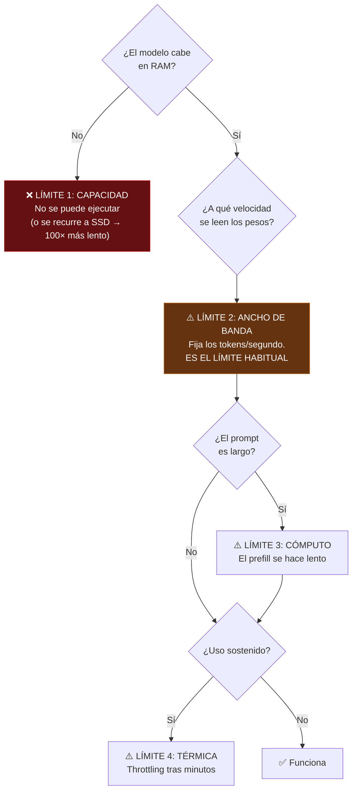
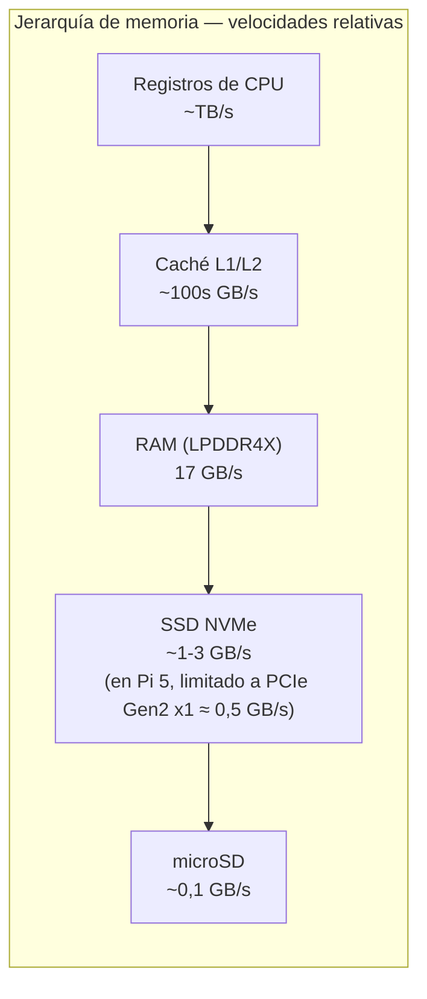

# PROJECT 03 · Los límites reales de la Raspberry Pi

---

## 1. Especificaciones relevantes

| Parámetro | Raspberry Pi 4 B | **Raspberry Pi 5** | CM5 |
|---|---|---|---|
| CPU | 4× Cortex-A72 @ 1,5–1,8 GHz | 4× Cortex-A76 @ 2,4 GHz | igual que Pi 5 |
| Memoria | LPDDR4-3200 | **LPDDR4X-4267** `[CONFIRMADO]` | LPDDR4X |
| Ancho de bus | 32 bit | 32 bit | 32 bit |
| **Ancho de banda teórico** | ~12,8 GB/s | **~17 GB/s** `[CONFIRMADO]` | ~17 GB/s |
| Capacidad | 1–8 GB | 2 / 4 / 8 / **16 GB** | 2 / 4 / 8 / 16 GB `[CONFIRMADO]` |
| PCIe | ❌ | ✅ Gen 2 x1 (5 Gbps) | ✅ Gen 2 x1 `[CONFIRMADO]` |
| Decodificación vídeo HW | H.264 + HEVC | **Sólo HEVC** `[CONFIRMADO]` | HEVC 4Kp60 `[CONFIRMADO]` |
| Codificación vídeo HW | H.264 ✅ | **❌ Ninguna** `[CONFIRMADO]` | ❌ |
| Rango de temperatura | 0–50 °C | 0–50 °C | **−20…+85 °C** `[CONFIRMADO]` |
| Consumo típico | 3–5 W | 5–8 W (hasta 25 W con periféricos) | similar |

`[CONFIRMADO]` Fuentes: [Phoronix — Raspberry Pi 5 benchmarks](https://www.phoronix.com/review/raspberry-pi-5-benchmarks), [Raspberry Pi CM5 Product Brief](https://pip.raspberrypi.com/documents/RP-008181-DS-compute-module-5-product-brief.pdf), [foro oficial sobre codificación en Pi 5](https://forums.raspberrypi.com/viewtopic.php?t=378329).

> ⚠️ Nota sobre el ancho de banda: **17 GB/s es el pico teórico**. El ancho de banda **efectivo** medido en cargas reales es siempre menor (típicamente 50–70 % `[INFERENCIA]`). Además, se ha reportado que **el ancho de banda difiere entre variantes de memoria del mismo modelo de Pi 5** `[CONFIRMADO]` — [foro oficial](https://forums.raspberrypi.com/viewtopic.php?t=369585). Esto significa que **hay que medir el ancho de banda de la unidad concreta**, no fiarse de la especificación. → `EXP-301`.

---

## 2. Qué limita primero, en orden



### Límite 1 — Capacidad de memoria

| Pi 5 | Modelo Q4 más grande que cabe (dejando 2 GB al sistema) |
|---|---|
| 4 GB | ~3B |
| 8 GB | ~8B con contexto corto |
| **16 GB** | ~14B con contexto corto, o 8B con contexto largo |

### Límite 2 — Ancho de banda (el límite real)

```
Con ancho de banda efectivo estimado en 10 GB/s:

    tokens/s ≈ 10 GB/s ÷ tamaño_del_modelo_GB

    1B Q4  (0,8 GB) → 12,5 t/s
    3B Q4  (1,9 GB) →  5,3 t/s
    8B Q4  (4,7 GB) →  2,1 t/s
    14B Q4 (8,5 GB) →  1,2 t/s
```

**Compárese con lo medido** (`09_BENCHMARKS.md`): 17,2 / 4–8,8 / 2–3 t/s. El modelo predice correctamente.

> **Este cálculo se puede hacer en 10 segundos con una calculadora, y ahorra semanas de experimentación.**

### Límite 3 — Cómputo

Sólo domina en el prefill de prompts largos. Un Cortex-A76 a 2,4 GHz con NEON llega a decenas de GFLOPS en la práctica `[HIPÓTESIS]` → `EXP-302`.

### Límite 4 — Térmica

`[CONFIRMADO]` Los benchmarks públicos citan explícitamente la necesidad de **refrigeración activa** para sostener el rendimiento en LLM sobre Pi 5. Sin ella, el rendimiento cae tras unos minutos.

| Configuración | Rendimiento sostenido |
|---|---|
| Sin disipador | Throttling en minutos, pérdida significativa `[INFERENCIA]` |
| Disipador pasivo | Mejor, pero puede seguir limitando bajo carga continua |
| **Ventilador activo oficial** | Sostenido `[CONFIRMADO]` (los benchmarks lo usan) |

> ⚠️ **Conflicto con Nexus:** NFR-09 de Nexus exige que no haya ventiladores audibles. Si el Sensor Hub tuviera que ejecutar un LLM, necesitaría ventilación activa. **Es otro argumento para no poner el LLM en el hub.**

### Límite 5 — Almacenamiento (casi nunca limita)

| Aspecto | Realidad |
|---|---|
| Tamaño | Un SSD de 1 TB guarda docenas de modelos. **Nunca es el problema** |
| Velocidad de carga | Un modelo de 5 GB tarda ~5 s desde NVMe, ~60 s desde microSD. Afecta al arranque, no a la inferencia |
| Como memoria (mmap/swap) | **Ahí sí importa, y es catastrófico**: ver §4 |

`[CONFIRMADO]` Los benchmarks públicos usan **arranque desde NVMe** para obtener los mejores resultados, lo que confirma que la microSD es un cuello de botella para la carga, aunque no para la generación.

---

## 3. Explicación de "SSD grande ≠ modelo grande"

Esta es probablemente la confusión más extendida, y merece una explicación clara.



| Escenario | Ancho de banda | Tokens/s con un modelo de 8B Q4 (4,7 GB) |
|---|---|---|
| Modelo entero en RAM | 10 GB/s efectivo | **~2,1 t/s** |
| Modelo leído desde NVMe en cada token | ~0,45 GB/s (PCIe Gen2 x1) | **~0,10 t/s** = 1 token cada 10 s |
| Modelo leído desde microSD | ~0,08 GB/s | **~0,017 t/s** = 1 token por minuto |

> **Un SSD de 4 TB no permite ejecutar un modelo de 70B.** Permite *almacenarlo*. Ejecutarlo requeriría leer 40 GB desde el SSD **por cada token generado**, lo que a 0,45 GB/s son **89 segundos por token**. Una respuesta de 100 tokens tardaría **2,5 horas**.

### La analogía que funciona

- **Almacenamiento (SSD)** = la biblioteca. Cabe muchísimo.
- **RAM** = la mesa de trabajo. Es donde tienes los libros abiertos.
- **Ancho de banda de memoria** = la velocidad a la que puedes pasar páginas.
- **Cómputo (TOPS)** = la velocidad a la que lees una página abierta.

Para generar cada palabra, el modelo tiene que **pasar por todas las páginas de todos los libros**. Tener una biblioteca más grande no acelera nada. Lo que importa es cuántas páginas caben en la mesa y a qué velocidad se pasan.

---

## 4. Descarga a SSD, mmap y swap: cuándo funciona y cuándo no

| Técnica | Qué hace | ¿Cuándo funciona? |
|---|---|---|
| **`mmap` del fichero de modelo** | El SO mapea el fichero y carga páginas bajo demanda | ✅ **Funciona bien si el modelo cabe en RAM**: acelera la carga y evita duplicar memoria. ❌ Si no cabe, produce thrashing |
| **Descarga de capas (layer offload)** | Unas capas en RAM/GPU, otras en disco | ⚠️ Aceptable si sólo unas pocas capas van a disco y no se usan en cada token. Con LLM, **todas** las capas se usan en cada token → ❌ |
| **Swap en SSD** | El SO expulsa páginas a disco | ❌ **Nunca usar para LLM.** Produce degradación catastrófica y desgasta el SSD |
| **Streaming de pesos** | Leer los pesos de disco por capas mientras se calcula | ⚠️ Teóricamente permite ejecutar modelos enormes con poca RAM, pero la velocidad queda fijada por el ancho de banda del disco (ver tabla §3). Útil para procesamiento por lotes sin prisa; **inútil para conversación** |

### La regla práctica

```
Si tamaño_del_modelo > RAM_disponible × 0,85  →  no ejecutar ese modelo.
Elegir un modelo más pequeño o una cuantización más agresiva.
```

`[PROPUESTA DE DISEÑO]` **En el diseño de Nexus, el sistema debe negarse a cargar un modelo que no quepa**, con un mensaje claro, en lugar de intentarlo y degradar a swap. Un sistema que tarda 10 minutos en responder es peor que uno que dice "ese modelo no cabe".

---

## 5. Optimización dentro de los límites

Cosas que sí ayudan, ordenadas por efecto:

| Optimización | Efecto | Coste |
|---|---|---|
| **Elegir un modelo más pequeño** | Lineal: la mitad de tamaño = el doble de velocidad | Menos calidad |
| **Cuantización más agresiva (Q4 → Q3)** | ~25 % más rápido | Pérdida de calidad, ver `05_QUANTIZATION.md` |
| **Refrigeración activa** | Evita la caída por throttling | Ruido `[CONFIRMADO]` que los benchmarks la usan |
| **Arranque desde NVMe** | Carga mucho más rápida | Coste del HAT + SSD `[CONFIRMADO]` |
| **Overclock** | Ganancia modesta; existen reportes de mejora con overclock en Ollama `[CONFIRMADO]` que se ha investigado | Calor, estabilidad, vida útil |
| **Prompt caching** | Elimina la mayor parte del prefill en conversaciones sucesivas | Memoria del KV cache |
| **Contexto más corto** | Menos KV cache, menos coste de atención | Menos memoria de conversación |
| **Compilación optimizada de `llama.cpp` para el SoC** | Aprovecha NEON, ajustes de hilos | Tiempo de integración |
| **Ajustar el número de hilos** | En Pi 5, típicamente 4 (uno por núcleo) | — |
| Añadir un acelerador con memoria propia | **Cambia el juego** | Coste, ver `07_AI_ACCELERATORS.md` |

Cosas que **no** ayudan:

| No ayuda | Por qué |
|---|---|
| SSD más grande | El almacenamiento no es el límite |
| SSD más rápido | Sólo acelera la carga inicial |
| Más núcleos de CPU | El límite es la memoria, no el cómputo |
| Acelerador sin memoria propia | El cuello de botella sigue siendo la RAM del sistema |
| Clúster por Ethernet | Ver `06_DISTRIBUTED_INFERENCE.md` |

---

## 6. La frontera práctica de la Raspberry Pi 5

| Uso | ¿Viable en Pi 5? | Nota |
|---|---|---|
| Clasificación de texto, extracción, enrutado con modelo de 1B | ✅ **Sí, cómodamente** | 12–17 t/s |
| Asistente conversacional simple con modelo de 3B | ✅ Sí, justo | 5–9 t/s: se lee más rápido de lo que escribe |
| Asistente conversacional de calidad con 7–8B | ⚠️ Técnicamente sí, prácticamente no | 2–3 t/s + prefill lento |
| Modelo de 14B+ | ❌ No | |
| Generación de código | ❌ No con calidad aceptable | Requiere modelos grandes |
| Visión (detección, embeddings) con acelerador | ✅✅ **Sí, es su punto fuerte** | Ver `07_AI_ACCELERATORS.md` |
| STT en tiempo real | ⚠️ Modelos pequeños sí | Medir con `EXP-303` |
| TTS | ⚠️ Modelos ligeros sí | |
| Wake word, VAD | ✅✅ Trivial | |
| Entrenamiento de cualquier tipo | ❌ | |

> **Resumen:** la Raspberry Pi 5 es una plataforma excelente para **percepción** (visión, audio, modelos pequeños especializados) y mediocre para **cognición** (LLM conversacional de calidad). **Esa es exactamente la división que propone la arquitectura de Nexus.**
