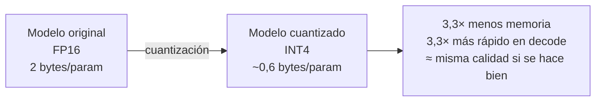

# PROJECT 03 · Quantization

---

## 1. Qué es y por qué funciona

Un modelo entrenado guarda sus parámetros en coma flotante de 16 o 32 bits. **Cuantizar** es representarlos con menos bits.



**Por qué funciona:** las redes neuronales son robustas a la pérdida de precisión numérica. Los pesos individuales importan poco; lo que importa es el patrón. Reducir de 16 a 4 bits pierde precisión numérica pero conserva casi toda la capacidad del modelo, **si la cuantización es inteligente**.

**Por qué la cuantización ingenua falla:** los pesos de una capa no están distribuidos uniformemente. Unos pocos valores atípicos (outliers) tienen magnitudes mucho mayores. Si se elige una escala única para todo el tensor, los outliers la dominan y el resto de valores se aplastan a cero. **Las técnicas modernas resuelven esto de distintas formas.**

---

## 2. Formatos de precisión

| Formato | Bits | Rango | Precisión | Uso |
|---|---|---|---|---|
| **FP32** | 32 | ±3,4×10³⁸ | ~7 dígitos decimales | Entrenamiento clásico, referencia de calidad |
| **FP16** | 16 | ±65 504 | ~3 dígitos | Inferencia estándar. **Riesgo de desbordamiento** en entrenamiento |
| **BF16** | 16 | ±3,4×10³⁸ (igual que FP32) | ~2 dígitos | **Preferido en entrenamiento**: mismo rango que FP32, menos mantisa |
| **FP8** | 8 | variable (E4M3 / E5M2) | ~1 dígito | Hardware reciente |
| **INT8** | 8 | −128…127 (con escala) | — | Cuantización conservadora, muy soportada |
| **INT6** | 6 | 64 niveles | — | Poco común como formato puro |
| **INT5** | 5 | 32 niveles | — | Q5_K en GGUF |
| **INT4** | 4 | 16 niveles | — | **El punto óptimo actual** |
| **INT3** | 3 | 8 niveles | — | Degradación perceptible |
| **INT2** | 2 | 4 niveles | — | Degradación fuerte; investigación activa |

### FP16 vs BF16 — la diferencia que importa

```
FP16:  1 bit signo | 5 bits exponente | 10 bits mantisa   → mucha precisión, poco rango
BF16:  1 bit signo | 8 bits exponente |  7 bits mantisa   → poca precisión, MUCHO rango
```

`[INFERENCIA]` En entrenamiento, el rango importa más que la precisión (los gradientes pueden ser diminutos), por eso BF16 ganó. En inferencia ambos funcionan bien.

---

## 3. Ecosistemas de cuantización

| Sistema | Qué es | Dónde se usa | Nota |
|---|---|---|---|
| **GGUF** | **Formato de fichero**, no un algoritmo. Contiene los pesos cuantizados + metadatos + tokenizador en un único archivo | `llama.cpp`, Ollama, LM Studio | El estándar de facto en el edge. **Es lo que usaremos** |
| **GGML** | La librería de tensores subyacente de `llama.cpp` | | GGUF es su formato de serialización actual (sustituyó a GGML como formato) |
| **GPTQ** | **Algoritmo** de cuantización post-entrenamiento que minimiza el error capa por capa usando información de segundo orden | GPU, ecosistema PyTorch | Buena calidad a 4 bits |
| **AWQ** (Activation-aware Weight Quantization) | **Algoritmo** que identifica los canales de pesos más importantes según las activaciones y los protege | GPU | Suele dar mejor calidad que GPTQ a igual tamaño `[INFERENCIA]` |
| **bitsandbytes** | Cuantización en tiempo de carga (NF4, INT8) | PyTorch, QLoRA | Muy usado para fine-tuning |
| **SmoothQuant** | Redistribuye la dificultad de cuantización entre pesos y activaciones | Servidores | |
| **HQQ, EXL2, etc.** | Otros esquemas | | Ecosistemas específicos |

> ⚠️ **Confusión frecuente:** GGUF **no es un método de cuantización**, es un formato de archivo. Dentro de un GGUF los pesos pueden estar en Q4_K_M, Q5_K_S, Q8_0, FP16... El método que `llama.cpp` usa para producirlos es propio (los esquemas "K-quant"), distinto de GPTQ y AWQ.

---

## 4. Los esquemas K-quant de GGUF

Son los que usaremos en la práctica. Nomenclatura:

```
Q4_K_M
│ │ │ └── Tamaño de la variante: S (small), M (medium), L (large)
│ │ └──── "K-quant": cuantización por bloques con escalas de precisión mixta
│ └────── Bits nominales
└──────── Quantized
```

| Cuantización | Bits efectivos | Bytes/param | Calidad relativa `[INFERENCIA]` | Recomendación |
|---|---|---|---|---|
| `Q8_0` | 8,5 | 1,06 | ≈ FP16 (indistinguible) | Cuando sobra memoria |
| `Q6_K` | 6,6 | 0,82 | Muy cercana a FP16 | Excelente si cabe |
| `Q5_K_M` | 5,7 | 0,71 | Pérdida mínima | Buen compromiso |
| **`Q4_K_M`** | **4,8** | **0,60** | **Pérdida pequeña y aceptable** | ⭐ **El estándar. Empezar aquí** |
| `Q4_K_S` | 4,6 | 0,57 | Ligeramente peor que Q4_K_M | Si falta un poco de memoria |
| `Q3_K_M` | 3,9 | 0,49 | **Pérdida perceptible** | Sólo si no hay alternativa |
| `Q2_K` | 3,0 | 0,37 | **Pérdida importante** | Casi nunca merece la pena |

### La regla más útil sobre cuantización

> `[INFERENCIA]` **Un modelo más grande fuertemente cuantizado suele ser mejor que un modelo más pequeño poco cuantizado, para la misma memoria.**
>
> Ejemplo: con 5 GB disponibles, un **8B en Q4_K_M** (4,8 GB) es normalmente mejor que un **3B en Q8** (3,0 GB) o un 3B en FP16 (6 GB, no cabe).
>
> **Pero el límite está en Q3.** Por debajo de 4 bits la degradación se acelera y deja de compensar.

---

## 5. Qué se pierde exactamente

`[INFERENCIA]` La degradación por cuantización no es uniforme; afecta más a unas capacidades que a otras:

| Capacidad | Sensibilidad a la cuantización |
|---|---|
| Conversación general, tono, estilo | **Baja** — se conserva bien hasta Q3 |
| Conocimiento factual | Media |
| Razonamiento en varios pasos | **Alta** — se degrada antes |
| Matemáticas y cálculo | **Muy alta** |
| Generación de código | **Alta** |
| Seguimiento de instrucciones complejas | Media-alta |
| Idiomas minoritarios | Alta |
| Contexto muy largo | Alta |

**Consecuencia para Nexus:** un modelo local de 7–8B en Q4 es aceptable para conversación, pero **no** para las tareas de razonamiento o código, que deben enrutarse a un modelo grande. Esto refuerza la arquitectura del router.

### Cómo medir la degradación (sin fiarse de benchmarks ajenos)

`[PROPUESTA DE DISEÑO]` Construir un conjunto de evaluación **propio** con 50–100 casos representativos del uso real de Nexus, y comparar la salida de cada cuantización. Los benchmarks académicos no miden lo que nos importa. → `EXP-305`.

---

## 6. Cuantización del KV cache

Aparte de los pesos, el KV cache también se puede cuantizar:

| Precisión del KV | Memoria | Efecto en calidad `[INFERENCIA]` |
|---|---|---|
| FP16 | 100 % | Referencia |
| Q8 | 50 % | Prácticamente nulo |
| Q5 | ~31 % | Pequeño |
| Q4 | 25 % | Perceptible en contextos largos |

`[PROPUESTA DE DISEÑO]` **KV cache en Q8 por defecto.** Ahorra la mitad de la memoria de contexto con impacto despreciable.

---

## 7. Efecto en la velocidad

La cuantización acelera el decode **linealmente** porque hay menos bytes que leer:

```
Modelo de 8B en un Pi 5 (BW efectivo 10 GB/s):

    FP16   (16,0 GB) → no cabe
    Q8     ( 8,0 GB) →  1,25 t/s
    Q5_K_M ( 5,7 GB) →  1,75 t/s
    Q4_K_M ( 4,8 GB) →  2,08 t/s    ← +67 % respecto a Q8
    Q3_K_M ( 3,9 GB) →  2,56 t/s    ← +23 % más, con pérdida de calidad
    Q2_K   ( 3,0 GB) →  3,33 t/s    ← +30 % más, con pérdida importante
```

> **Rendimiento decreciente:** pasar de Q8 a Q4 da +67 % de velocidad con poca pérdida. Pasar de Q4 a Q2 da +60 % más pero con una pérdida de calidad que rara vez compensa.

---

## 8. Cuantización y aceleradores

| Hardware | Formatos nativos | Nota |
|---|---|---|
| CPU ARM (Pi) | Todo por software; NEON acelera INT8 | `llama.cpp` tiene kernels optimizados |
| **Hailo-10H** | **INT4** — sus 40 TOPS son cifra INT4 `[CONFIRMADO]` | El hardware está diseñado alrededor de INT4 |
| Coral Edge TPU | **Sólo INT8**, y con restricciones fuertes de arquitectura | Ver `07_AI_ACCELERATORS.md` |
| Jetson (GPU Ampere) | FP16, INT8, INT4 vía TensorRT | |
| GPU de escritorio | FP16, INT8, INT4 según software | |

> 🔑 **Al elegir acelerador, comprobar qué formatos soporta nativamente.** Un acelerador que sólo hace INT8 obliga a usar modelos 2× más grandes en memoria que uno que hace INT4.

---

## 9. Recomendación

| Escenario | Cuantización recomendada |
|---|---|
| Modelo pequeño (1–3B) con memoria de sobra | `Q6_K` o `Q8_0` |
| **Modelo mediano (7–14B) en el edge** | **`Q4_K_M`** ⭐ |
| Modelo grande en servidor con GPU | `Q4_K_M` o AWQ/GPTQ de 4 bits |
| Cuando falta un poco de memoria | `Q4_K_S` antes que `Q3` |
| KV cache | `Q8` |
| Cuando la calidad es crítica (código, razonamiento) | **No cuantizar agresivamente: enrutar a un modelo grande remoto** |

**Regla de oro:** empezar siempre en `Q4_K_M`, medir con un conjunto de evaluación propio, y sólo entonces decidir si conviene subir o bajar.
