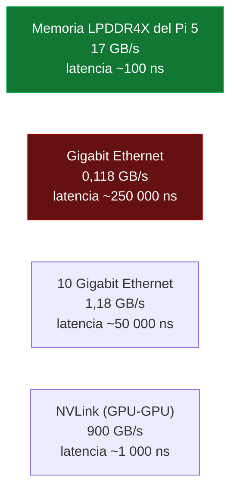
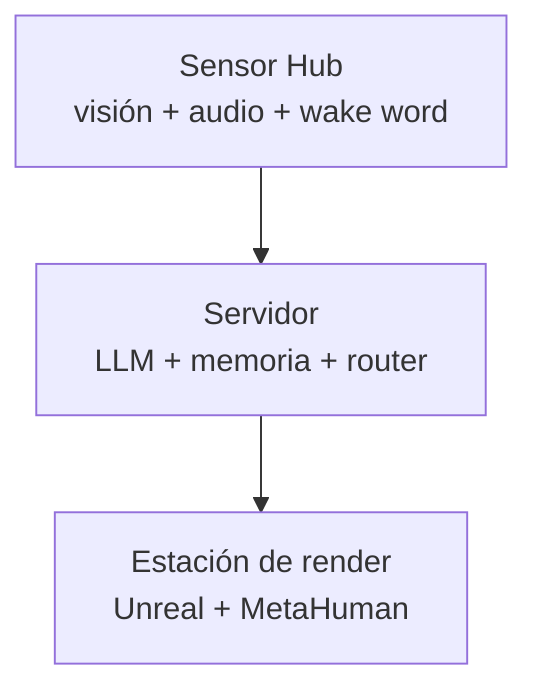

# PROJECT 03 · Distributed Inference — ¿sirve un clúster de Raspberry Pi?

> **Respuesta corta:** sirve para **ejecutar** un modelo que no cabe en un nodo. **No** sirve para hacerlo rápido. Y el modelo que consigues ejecutar sigue siendo demasiado lento para ser útil.

---

## 1. Los tipos de paralelismo


| Tipo | Reparte | Comunicación por token | ¿Acelera un solo usuario? | ¿Permite modelos más grandes? |
|---|---|---|---|---|
| **Tensorial** | Cada matriz | Muy alta (varias veces por capa) | ✅ En teoría sí | ✅ Sí |
| **Pipeline** | Capas completas | Baja (un vector por frontera) | ❌ No (latencia igual o peor) | ✅ Sí |
| **Datos** | Nada (réplicas) | Ninguna | ❌ No | ❌ No |

---

## 2. El cálculo que decide la cuestión

### Paralelismo tensorial: cuántos datos hay que mover

En paralelismo tensorial, tras cada bloque de atención y cada bloque MLP hay que hacer un **all-reduce** del vector de activación entre todos los nodos.

```
Modelo tipo 8B:  n_capas = 32,  d_model = 4096,  FP16 (2 bytes)

Vector de activación: 4096 × 2 = 8 192 bytes = 8 KiB

All-reduces por token: 2 por capa × 32 capas = 64

Datos movidos por nodo y por token (all-reduce en anillo, N nodos):
    ≈ 64 × 8 KiB × 2 × (N−1)/N

Con N = 4:   64 × 8 KiB × 2 × 0,75 ≈ 768 KiB por token y nodo
```

Ahora la latencia:

```
Gigabit Ethernet:
    Ancho de banda útil: ~940 Mbps ≈ 118 MB/s
    Latencia por salto (RTT):  ~0,2-0,5 ms típico en switch doméstico  [INFERENCIA]

Tiempo de transferencia por token:  768 KiB ÷ 118 MB/s ≈ 6,5 ms
Tiempo de LATENCIA por token:       64 all-reduces × 2 saltos × 0,25 ms ≈ 32 ms

TOTAL de comunicación por token:  ≈ 38 ms  →  máximo 26 t/s SÓLO por la red
```

Pero además hay que sumar el cómputo. Y aquí está el problema real:

```
Con 4 nodos, cada uno lee 4,8/4 = 1,2 GB de pesos por token
Tiempo de lectura de memoria por nodo:  1,2 GB ÷ 10 GB/s = 120 ms

⇒ El cómputo domina: ~120 ms/token = 8,3 t/s
   frente a 480 ms/token = 2,1 t/s en un solo nodo

Speedup teórico ideal: 4×
Speedup real esperado tras sumar comunicación: 480 / (120 + 38) ≈ 3,0×
```

`[INFERENCIA]` **En teoría el paralelismo tensorial debería funcionar razonablemente en 4 Pi.** Pero la medición dice otra cosa.

### Lo que dicen las mediciones reales

`[CONFIRMADO]` Una medición pública de referencia: **dos Pi con el backend RPC de `llama.cpp` ejecutando Llama 3.1 8B dan un 10–15 % de mejora** sobre un único Pi de 16 GB ejecutando el mismo modelo.

**10–15 %, no 100 %.** ¿Por qué la diferencia con el cálculo teórico?

| Motivo | Explicación |
|---|---|
| El backend RPC de `llama.cpp` **no hace paralelismo tensorial**: hace reparto de capas (pipeline) | `[CONFIRMADO]` — la propia documentación dice que reparte pesos y KV cache proporcionalmente a la memoria de cada dispositivo |
| En pipeline con un solo usuario, los nodos **se turnan**: mientras uno calcula, los demás esperan | La utilización es 1/N, no N |
| La sincronización real tiene más sobrecoste que el modelo idealizado | Copias, serialización, TCP |
| La latencia de red domina en mensajes pequeños | Gigabit Ethernet tiene buen ancho de banda pero mala latencia comparada con la memoria |

---

## 3. Qué dicen las herramientas oficialmente

### `llama.cpp` RPC backend `[CONFIRMADO]`

De la documentación oficial ([tools/rpc/README.md](https://github.com/ggml-org/llama.cpp/blob/master/tools/rpc/README.md)):

| Afirmación | Cita |
|---|---|
| Estado de madurez | *"This example and the RPC backend are currently in a proof-of-concept development stage. As such, the functionality is fragile and insecure."* |
| Seguridad | *"Never run the RPC server on an open network or in a sensitive environment"* |
| Reparto | Por defecto distribuye pesos y KV cache entre todos los dispositivos disponibles **en proporción a la memoria de cada uno** |
| Transporte | TCP, con soporte opcional de RDMA en Linux con NIC compatible |
| Propósito | Escalar **capacidad**, no rendimiento |

> ⚠️ Que la documentación oficial diga *"frágil e insegura"* y *"nunca la ejecutes en una red abierta"* es información de primera mano que hay que respetar. **Un clúster RPC no es una base para un sistema de producción.**

### `distributed-llama` `[CONFIRMADO]`

Del [repositorio oficial](https://github.com/b4rtaz/distributed-llama):

| Característica | Dato |
|---|---|
| Propósito | Conectar dispositivos domésticos en un clúster para **acelerar** la inferencia |
| Número de nodos | 1, 2, 4... **2ⁿ** (potencias de dos) |
| **Límite duro** | *"the maximum number of nodes is equal to the number of KV heads in the model"* |
| Benchmarks | El README remite a la sección de *discussions*, donde la comunidad publica mediciones en distintas configuraciones. **No hay tabla oficial en el README** |

> `[NO RELIABLE BENCHMARK FOUND]` para `distributed-llama` sobre Raspberry Pi 5 en una fuente primaria consolidada. Las mediciones existen dispersas en discusiones de la comunidad, con condiciones no homogéneas. **No incluimos números que no podamos citar con precisión.** → `EXP-306` para medirlo nosotros.

### `exo` `[INFERENCIA]`

Orientado a clústeres heterogéneos y fácil de poner en marcha; se recomienda para experimentación rápida más que para producción repetible.

---

## 4. Por qué la red no puede competir con la memoria



| Enlace | Ancho de banda | Latencia | Factor vs memoria local |
|---|---|---|---|
| Memoria local Pi 5 | 17 GB/s | ~100 ns | 1× |
| **Gigabit Ethernet** | **0,118 GB/s** | **~250 µs** | **144× menos BW, 2 500× más latencia** |
| 2,5 Gigabit Ethernet | 0,3 GB/s | ~150 µs | 57× / 1 500× |
| 10 Gigabit Ethernet | 1,18 GB/s | ~50 µs | 14× / 500× |
| NVLink | 900 GB/s | ~1 µs | mejor que la memoria del Pi |

`[INFERENCIA]` **El paralelismo tensorial se diseñó para NVLink e InfiniBand**, donde el enlace entre chips es comparable a la memoria local. Sobre Gigabit Ethernet, la sincronización frecuente domina el tiempo de ejecución. Esta es una conclusión bien establecida en la literatura de sistemas distribuidos de LLM.

**El Raspberry Pi 5 no tiene 10 GbE**, y añadirlo por PCIe Gen2 x1 (5 Gbps ≈ 0,5 GB/s) no llega a saturar 10 GbE. Es decir: **incluso comprando el hardware de red no se resuelve.**

---

## 5. Análisis de las opciones para un clúster de 6 Pi

Supongamos 6× Raspberry Pi 5 de 16 GB = **96 GB de RAM agregada**.

| Opción | ¿Funciona? | Rendimiento esperado | Veredicto |
|---|---|---|---|
| **Un modelo de 70B Q4 (42 GB) repartido en pipeline** | ✅ Cabe | `[INFERENCIA]` cada token recorre los 6 nodos secuencialmente. El límite sigue siendo leer 42 GB por token, repartido: ~7 GB por nodo a 10 GB/s = 0,7 s + comunicación ⇒ **~1,2 t/s** | ⚠️ Funciona pero es inutilizable |
| **Un modelo de 70B con paralelismo tensorial** | ⚠️ Con `distributed-llama` y ≤ n_kv_heads nodos | Mejor en teoría, pero limitado por la red | `EXPERIMENTAL` |
| **6 réplicas de un modelo de 8B (paralelismo de datos)** | ✅ Trivial | 6× el **throughput** para 6 usuarios distintos; **la misma latencia** para uno | ✅ Útil si hay varios usuarios; **inútil para Nexus** (un usuario) |
| **Reparto funcional**: un Pi para STT, otro para TTS, otro para visión, otro para el LLM | ✅ Trivial | Cada tarea a velocidad de un nodo, pero **en paralelo** | ⭐ **La opción realmente útil** |

### El coste comparado

```
6× Raspberry Pi 5 16 GB + alimentación + red + cajas
    ≈ 6 × 130 € + 150 € de infraestructura ≈ 930 €   [HIPÓTESIS]
    Resultado: ~1,2 t/s con un modelo de 70B  →  inutilizable

Un PC con GPU de consumo con ancho de banda de ~500-900 GB/s
    ≈ 900-2 000 €   [HIPÓTESIS]
    Resultado: 15-40 t/s con un modelo de 32B, o 7-15 t/s con 70B en dos GPU
    y ~200 GB/s de ancho de banda por GPU
```

> `[INFERENCIA]` **Para el mismo dinero, un único PC con GPU da 10–30× más rendimiento que un clúster de 6 Raspberry Pi.** El clúster de Pi es un ejercicio educativo excelente y una solución de ingeniería mala.

---

## 6. Cuándo SÍ tiene sentido un clúster de SBC

No todo es negativo. Hay casos reales:

| Caso | Por qué funciona |
|---|---|
| **Reparto funcional de tareas distintas** | Cada nodo hace una cosa; no hay sincronización por token |
| **Servir a varios usuarios simultáneos** (paralelismo de datos) | Escala linealmente en throughput |
| **Procesamiento por lotes sin restricción de latencia** | Si no importa que tarde horas |
| **Redundancia y disponibilidad** | Si un nodo cae, otro sigue |
| **Aprendizaje y experimentación** | Es una forma excelente de entender sistemas distribuidos |
| **Restricción de consumo extrema** | 6 Pi ≈ 40 W; una GPU de consumo puede ser 300 W+ |

`[PROPUESTA DE DISEÑO]` **Para Nexus, el reparto funcional es la única forma de multi-nodo que recomendamos:**



Eso ya es un sistema distribuido — pero **por función**, no por capas de un mismo modelo.

---

## 7. Respuesta directa a la pregunta del brief

> *"¿Podemos distribuir capas diferentes de un LLM entre varios dispositivos?"*

**Sí, técnicamente.** `llama.cpp` con backend RPC y `distributed-llama` lo hacen. `[CONFIRMADO]`

> *"Si sí, ¿qué rendimiento tendría?"*

**Malo.** La medición de referencia disponible da 10–15 % de mejora con dos nodos `[CONFIRMADO]`. Para modelos que no caben en un nodo, la velocidad resultante está por debajo del umbral de usabilidad (< 1,5 t/s para 70B en un clúster de Pi) `[INFERENCIA]`.

> *"Si no es práctico, explicar exactamente por qué."*

**Tres razones, en orden de importancia:**

1. **La red es 144× más lenta en ancho de banda y 2 500× peor en latencia que la memoria local.** El paralelismo tensorial requiere sincronizar decenas de veces por token; sobre Gigabit Ethernet eso domina el tiempo.
2. **El paralelismo de pipeline no acelera a un solo usuario.** Los nodos se turnan; la utilización efectiva es 1/N.
3. **Aunque funcionara perfectamente, el resultado no sería útil.** Un 70B repartido en 6 Pi da ~1,2 t/s. El umbral de conversación es 7–15 t/s.

**Y hay una cuarta razón, económica:** el mismo presupuesto en un PC con GPU da un orden de magnitud más de rendimiento.

---

## 8. Fuentes

- [llama.cpp — RPC backend README](https://github.com/ggml-org/llama.cpp/blob/master/tools/rpc/README.md) `[CONFIRMADO]`
- [llama.cpp — Discussion #9136: RPC over Ethernet strangely slow](https://github.com/ggml-org/llama.cpp/discussions/9136)
- [b4rtaz/distributed-llama](https://github.com/b4rtaz/distributed-llama) `[CONFIRMADO]`
- [Arm Learning Path — Distributed inference with llama.cpp](https://learn.arm.com/learning-paths/servers-and-cloud-computing/distributed-inference-with-llama-cpp/how-to-2/)
- [Seeed Studio Wiki — Distributed llama.cpp on Jetson (RPC mode)](https://wiki.seeedstudio.com/ai_robotics_distributed_llama_cpp_rpc_jetson/)
- *An Evaluation of LLMs Inference on Popular Single-board Computers* — arXiv:2511.07425 (no accesible desde este entorno; **revisar y contrastar**)
