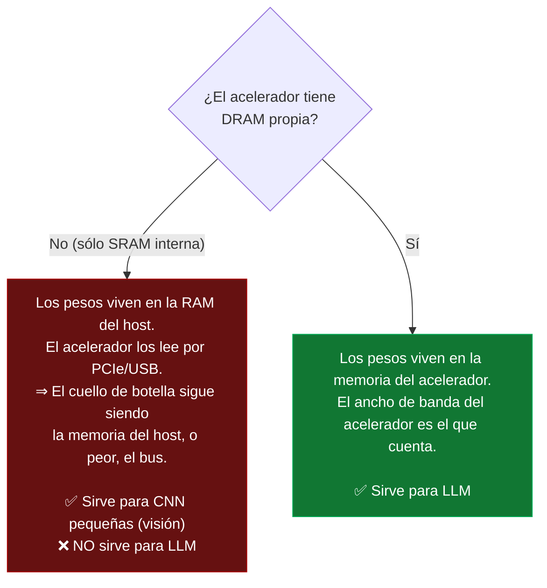

# PROJECT 03 · AI Accelerators

> **Criterio único que separa lo útil de lo inútil para LLM:** ¿el acelerador tiene **memoria propia con ancho de banda alto**? Si no la tiene, sirve para visión pero no para modelos de lenguaje.

---

## 1. El criterio, explicado



**Por qué las CNN de visión son distintas:** un detector como SCRFD tiene entre 0,5 y 30 M de parámetros (≈ 1–60 MB). Eso **cabe en la SRAM interna** de un acelerador, o se carga una vez y se reutiliza para miles de imágenes. Un LLM de 8B tiene 8 000 M de parámetros (4,8 GB): no cabe en ninguna SRAM y hay que releerlo entero **por cada token**.

```
Detector de visión (10 M params, INT8 = 10 MB):
    Se carga una vez. Se procesan 30 imágenes/s. Los pesos NO se releen.
    ⇒ Limitado por CÓMPUTO. Los TOPS importan. ✅

LLM (8 000 M params, INT4 = 4,8 GB):
    Hay que leer los 4,8 GB para CADA token.
    ⇒ Limitado por ANCHO DE BANDA. Los TOPS no importan. ❌
```

---

## 2. Catálogo de aceleradores

### 2.1 Google Coral Edge TPU

| Parámetro | Dato |
|---|---|
| Rendimiento | 4 TOPS (INT8) |
| Memoria propia | ~8 MB de SRAM |
| Formatos | **Sólo INT8**, y sólo modelos compilados con su compilador |
| Restricciones | Operadores soportados limitados; el modelo debe caber esencialmente en la SRAM o se penaliza fuertemente |
| Interfaz | USB, M.2, PCIe |
| Consumo | ~2 W |

**Veredicto para LLM:** ❌ `CURRENTLY IMPRACTICAL`. Fue diseñado en 2018 para MobileNet y similares. No tiene memoria ni el conjunto de operadores para transformers de miles de millones de parámetros.

**Veredicto para visión:** ✅ Sigue siendo válido para clasificación y detección ligeras con muy poco consumo, aunque las alternativas modernas son mejores.

---

### 2.2 Hailo-8 / Hailo-8L (Raspberry Pi AI HAT+ / AI Kit)

| Parámetro | Hailo-8L | Hailo-8 |
|---|---|---|
| Rendimiento | 13 TOPS | 26 TOPS |
| Memoria propia | Sin DRAM dedicada | Sin DRAM dedicada |
| Interfaz | M.2 sobre PCIe (Pi 5) | M.2 sobre PCIe |
| Consumo | ~2–5 W | ~2–5 W |
| Ecosistema | HailoRT, model zoo con modelos precompilados | idem |

`[CONFIRMADO]` Hay modelos precompilados de detección facial (**SCRFD**) para Hailo en Raspberry Pi con AI HAT+, y existe una API pública de **generación de embeddings faciales de 512 dimensiones sobre Hailo-8** ([Seeed face-recognition-api](https://github.com/Seeed-Solution/face-recognition-api)).

**Veredicto para visión:** ✅✅ **Excelente.** Es exactamente lo que necesita el Sensor Hub de Nexus.
**Veredicto para LLM:** ⚠️ Muy limitado por la ausencia de memoria propia.

---

### 2.3 Hailo-10H (Raspberry Pi AI HAT+ 2) ⭐

| Parámetro | Dato | Etiqueta |
|---|---|---|
| Rendimiento | **40 TOPS INT4** | `[CONFIRMADO]` — [Hailo](https://hailo.ai/products/ai-accelerators/hailo-10h-m-2-ai-acceleration-module/) |
| **Memoria propia** | **8 GB LPDDR4X a bordo en el AI HAT+ 2** | `[CONFIRMADO]` — [Raspberry Pi](https://www.raspberrypi.com/news/introducing-the-raspberry-pi-ai-hat-plus-2-generative-ai-on-raspberry-pi-5/) |
| Característica clave | **Interfaz DDR directa** que le permite escalar a modelos grandes (LLM, VLM) | `[CONFIRMADO]` — Hailo |
| Formato nativo | INT4 | `[CONFIRMADO]` |
| Interfaz | M.2 / PCIe sobre Raspberry Pi 5 | `[CONFIRMADO]` |
| Fecha de lanzamiento | **15 de enero de 2026** | `[CONFIRMADO]` — [CNX Software](https://www.cnx-software.com/2026/01/15/raspberry-pi-ai-hat-2-targets-generative-ai-llm-vlm-with-hailo-10h-accelerator/) |
| Ancho de banda de su LPDDR4X | `[NO RELIABLE BENCHMARK FOUND]` — no localizamos el dato oficial. **Es la cifra más importante que falta** | |

**Rendimiento observado en LLM (fuentes secundarias, dispersas):**

| Modelo | t/s reportados | Fuente | Fiabilidad |
|---|---|---|---|
| Qwen 2.5 1.5B | ~20–35 t/s en decode | Reseñas | ⚠️ Media |
| Qwen 2 1.5B | ~9 t/s | Reseña independiente | ⚠️ Media |
| Modelos de 1.5B genéricos | 6–8 t/s | Otra medición | ⚠️ Media |
| Comparación con CPU del Pi 5 | ~11 t/s con los 4 núcleos al 100 % | Reseña | ⚠️ Media |
| Ganancia declarada frente a CPU | "hasta 18× más rápido" en algún caso | Blog | ⚠️ Baja |

> ⚠️ **La dispersión de estas cifras (6 a 35 t/s para modelos del mismo tamaño) indica que las condiciones de medición no son homogéneas.** No hay que planificar con ellas. → `EXP-304`: medirlo nosotros con metodología documentada.

**Veredicto:** ⭐ **El acelerador más interesante del ecosistema Raspberry Pi para nuestros fines.** Con 8 GB propios y soporte INT4 nativo, es la primera vez que un HAT de Raspberry Pi puede ejecutar modelos generativos con una arquitectura pensada para ello. **Pero es reciente (enero 2026) y el ecosistema de software y las mediciones fiables aún están madurando.**

---

### 2.4 NVIDIA Jetson Orin Nano Super

| Parámetro | Dato | Etiqueta |
|---|---|---|
| Rendimiento | **67 TOPS** | `[CONFIRMADO]` — [NVIDIA](https://developer.nvidia.com/blog/nvidia-jetson-orin-nano-developer-kit-gets-a-super-boost/) |
| Memoria | 8 GB compartida CPU/GPU | `[CONFIRMADO]` |
| **Ancho de banda** | **102 GB/s** — **6× el del Pi 5** | `[CONFIRMADO]` |
| CPU | 6× Cortex-A78AE | `[CONFIRMADO]` |
| Consumo configurable | 7 W / 15 W / 25 W | `[CONFIRMADO]` |
| Ecosistema | CUDA, TensorRT, JetPack, contenedores de NVIDIA | `[CONFIRMADO]` |

**Rendimiento medido `[CONFIRMADO]`:**
- Llama 7B Q4_K_M: **prompt eval 285 t/s, generación 14,2 t/s**
- 25 W es el punto óptimo de eficiencia energética para modelos ≤ 4B; entrega 47–48 % más t/s que 15 W manteniendo o mejorando los tokens por julio

**Veredicto:** ⭐⭐ **La opción más capaz de esta categoría.** El ancho de banda de 102 GB/s es la razón, no los 67 TOPS. Contras: más caro, más consumo, y el ecosistema de software de NVIDIA embebido es más pesado que el de Raspberry Pi.

---

### 2.5 Rockchip RK3588 y NPUs integradas en SoC

| Parámetro | Dato |
|---|---|
| NPU | ~6 TOPS típico |
| Memoria | Compartida con el sistema, LPDDR4/5 |
| Ancho de banda | Variable según implementación; típicamente similar o algo superior al Pi 5 `[INFERENCIA]` |
| Ventaja adicional | **Encoder/decoder de vídeo por hardware** (a diferencia del Pi 5) |
| Ecosistema | RKNN toolkit; menos maduro que Hailo o NVIDIA `[INFERENCIA]` |

**Veredicto:** ⚠️ Alternativa razonable si hace falta codificación de vídeo por hardware junto con IA modesta. Para LLM no aporta sobre el Pi 5.

---

### 2.6 Otros

| Acelerador | Nota | Veredicto LLM |
|---|---|---|
| **Intel Movidius / NCS2** | Generación anterior, para visión | ❌ |
| **NPUs de portátiles (Intel/AMD/Qualcomm)** | Diseñadas para cargas asistenciales; comparten memoria del sistema | ⚠️ Depende del ancho de banda del sistema |
| **Apple Silicon** | **Memoria unificada con ancho de banda muy alto** (100–800 GB/s según modelo) | ✅✅ Excelente para LLM local, pero no es una plataforma embebida |
| **eGPU sobre PCIe en el Pi 5** | Técnicamente posible por el conector PCIe Gen2 x1, pero el enlace (0,5 GB/s) estrangula la GPU | ❌ `CURRENTLY IMPRACTICAL` |
| **GPU de escritorio** | 200–1 000 GB/s de VRAM | ✅✅ La referencia |

---

## 3. Tabla comparativa

| Acelerador | TOPS | Memoria propia | BW | ¿Visión? | ¿LLM? | Consumo | Veredicto |
|---|---|---|---|---|---|---|---|
| Coral Edge TPU | 4 (INT8) | 8 MB SRAM | — | ✅ básica | ❌ | ~2 W | Obsoleto para nuestros fines |
| Hailo-8L | 13 | ❌ | — | ✅✅ | ❌ | ~2–5 W | Visión de bajo coste |
| Hailo-8 | 26 | ❌ | — | ✅✅ | ⚠️ | ~2–5 W | **Visión: excelente** |
| **Hailo-10H** | **40 (INT4)** | **8 GB LPDDR4X** | ❓ | ✅✅ | ✅ | ~5–10 W `[HIPÓTESIS]` | ⭐ **Lo más interesante en Raspberry Pi** |
| Jetson Orin Nano Super | 67 | 8 GB compartida | **102 GB/s** | ✅✅ | ✅✅ | 7–25 W | ⭐⭐ **Lo más capaz** |
| RK3588 NPU | ~6 | compartida | ~similar Pi 5 | ✅ | ❌ | ~5–10 W | Alternativa con encoder de vídeo |
| GPU de escritorio | — | 8–24 GB VRAM | 200–1 000 GB/s | ✅✅ | ✅✅ | 100–400 W | Referencia de rendimiento |

---

## 4. Matriz de decisión para Nexus

| Criterio (peso) | Pi 5 solo | Pi 5 + Hailo-8 | **Pi 5 + Hailo-10H** | **Jetson Orin Nano Super** |
|---|---|---|---|---|
| Visión (detección + embeddings) — 30 % | ⚠️ 2 | ✅ 5 | ✅ 5 | ✅ 5 |
| LLM pequeño local — 20 % | ⚠️ 2 | ⚠️ 2 | ✅ 4 | ✅ 5 |
| Consumo — 20 % | ✅ 4 | ✅ 4 | ⚠️ 3 | ⚠️ 3 |
| Coste — 15 % | ✅ 5 | ✅ 4 | ⚠️ 3 | ⚠️ 2 |
| Madurez del ecosistema — 10 % | ✅ 5 | ✅ 4 | ⚠️ 3 (ene. 2026) | ✅ 5 |
| Facilidad de integración — 5 % | ✅ 5 | ✅ 4 | ✅ 4 | ⚠️ 3 |
| **Puntuación ponderada** | **3,15** | **3,85** | **⭐ 3,95** | **⭐ 4,05** |

`[PROPUESTA DE DISEÑO]`

- **Para el Sensor Hub de Nexus (percepción):** **Pi 5 + Hailo-8 (AI HAT+)** es suficiente y es la opción de mejor coste/consumo. Si más adelante se quiere ejecutar un VLM pequeño en el hub, el **AI HAT+ 2 (Hailo-10H)** es el camino de actualización natural, sin cambiar de plataforma.
- **Si el hub debe además razonar** (modelo pequeño local), **Jetson Orin Nano Super**.
- **El LLM conversacional principal no va en ninguno de los dos**: va en el servidor doméstico con GPU.

---

## 5. La conclusión sobre TOPS

> ⚠️ **"TOPS" es la especificación más engañosa del marketing de IA embebida.**
>
> Un acelerador de 40 TOPS **sin memoria propia** es peor para LLM que uno de 20 TOPS **con 8 GB y buen ancho de banda**. Y un dispositivo de 67 TOPS es rápido en LLM **por sus 102 GB/s de ancho de banda**, no por sus TOPS.
>
> **Al evaluar un acelerador, preguntar en este orden:**
> 1. ¿Cuánta memoria propia tiene?
> 2. ¿A qué ancho de banda?
> 3. ¿Qué formatos numéricos soporta nativamente (INT4/INT8)?
> 4. ¿Qué madurez tiene el software (compilador, runtime, zoo de modelos)?
> 5. …y sólo al final: ¿cuántos TOPS?

---

## 6. Fuentes

- [Hailo-10H M.2 AI Acceleration Module](https://hailo.ai/products/ai-accelerators/hailo-10h-m-2-ai-acceleration-module/)
- [Hailo — Bringing on-device generative AI to the Pi](https://hailo.ai/blog/bringing-on-device-generative-ai-to-the-pi-when-and-why-youll-need-the-raspberry-pi-ai-hat-2/)
- [Raspberry Pi — Introducing the AI HAT+ 2](https://www.raspberrypi.com/news/introducing-the-raspberry-pi-ai-hat-plus-2-generative-ai-on-raspberry-pi-5/)
- [CNX Software — Raspberry Pi AI HAT+ 2 (15 ene. 2026)](https://www.cnx-software.com/2026/01/15/raspberry-pi-ai-hat-2-targets-generative-ai-llm-vlm-with-hailo-10h-accelerator/)
- [NVIDIA — Jetson Orin Nano Developer Kit gets a Super boost](https://developer.nvidia.com/blog/nvidia-jetson-orin-nano-developer-kit-gets-a-super-boost/)
- [Seeed — face-recognition-api sobre Hailo-8](https://github.com/Seeed-Solution/face-recognition-api)
