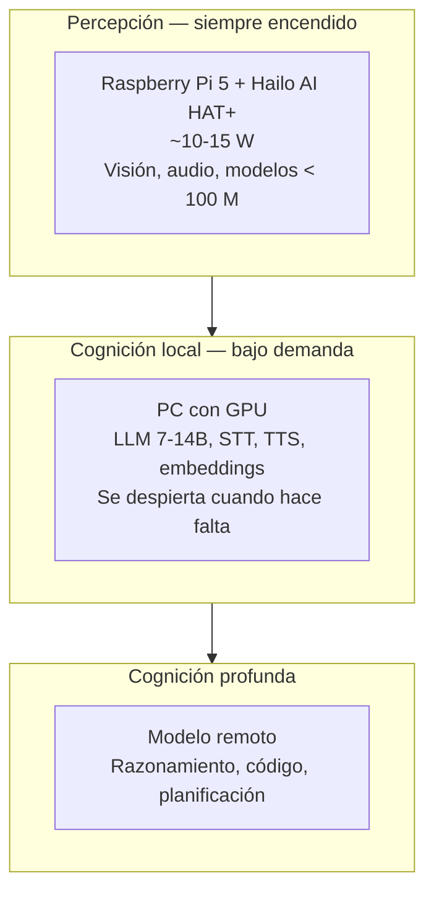

# PROJECT 03 · Hardware Comparison

---

## 1. Tabla maestra

Las cifras de **ancho de banda** son las que determinan el rendimiento en generación. Las de **memoria** determinan qué modelo cabe.

| Plataforma | CPU | Memoria | **Ancho de banda** | Acelerador | Consumo | Etiqueta |
|---|---|---|---|---|---|---|
| **Raspberry Pi 4 B** | 4× A72 @1,8 GHz | 1–8 GB LPDDR4-3200 | ~12,8 GB/s | — | 3–5 W | `[CONFIRMADO]` |
| **Raspberry Pi 5** | 4× A76 @2,4 GHz | 2–16 GB LPDDR4X-4267 | **~17 GB/s** | opcional (HAT) | 5–8 W | `[CONFIRMADO]` |
| **Raspberry Pi CM5** | igual que Pi 5 | 2–16 GB | ~17 GB/s | opcional | 5–8 W | `[CONFIRMADO]` |
| **Pi 5 + AI HAT+ 2** | 4× A76 | 16 GB + **8 GB del acelerador** | 17 GB/s + BW del Hailo (❓) | Hailo-10H 40 TOPS INT4 | ~10–15 W | `[CONFIRMADO]` specs; BW `[NO RELIABLE BENCHMARK FOUND]` |
| **Jetson Orin Nano Super 8GB** | 6× A78AE | 8 GB compartida | **102 GB/s** | GPU Ampere, 67 TOPS | 7–25 W | `[CONFIRMADO]` |
| **Jetson Orin NX** | 6–8× A78AE | 8–16 GB | ~102 GB/s | 70–157 TOPS | 10–40 W | `[INFERENCIA]` — verificar en datasheet |
| **Orange Pi / SBC Rockchip RK3588** | 4× A76 + 4× A55 | 4–32 GB LPDDR4/5 | ~similar o algo superior al Pi 5 | NPU ~6 TOPS | 5–12 W | `[INFERENCIA]` |
| **Mini-PC x86 (Intel N100 y similares)** | x86 4 núcleos | 8–32 GB DDR4/5 SO-DIMM | ~25–50 GB/s `[INFERENCIA]` | iGPU modesta | 10–25 W | `[INFERENCIA]` |
| **Mini-PC AMD con iGPU potente** | x86 8–16 núcleos | 16–128 GB DDR5 | ~80–120 GB/s `[INFERENCIA]` | iGPU con memoria unificada | 30–90 W | `[INFERENCIA]` |
| **Apple Silicon (memoria unificada)** | ARM | 16–192 GB | **100–800 GB/s** según modelo `[INFERENCIA]` | GPU + Neural Engine | 20–150 W | `[INFERENCIA]` |
| **PC con GPU de consumo** | x86 | GPU: 8–24 GB VRAM | **200–1 000 GB/s** | GPU | 150–450 W | `[INFERENCIA]` |
| **Plataformas Qualcomm (Snapdragon X / móvil)** | ARM | 8–64 GB | 60–135 GB/s `[INFERENCIA]` | NPU | 5–30 W | `[INFERENCIA]` — verificar |

> ⚠️ Las filas etiquetadas `[INFERENCIA]` requieren verificación en la documentación del fabricante antes de tomar decisiones de compra. **No hemos encontrado fuentes primarias para todas ellas en esta investigación.**

---

## 2. Rendimiento estimado por plataforma

Aplicando el modelo `t/s ≈ (BW × 0,6) / memoria_del_modelo` de `04_MODEL_MEMORY_ANALYSIS.md`:

| Plataforma | BW | 1B Q4 | 3B Q4 | 8B Q4 | 14B Q4 | 32B Q4 | 70B Q4 |
|---|---|---|---|---|---|---|---|
| Pi 4 (8 GB) | 12,8 | 12,8 | 4,3 | 1,6 | ❌ mem | ❌ | ❌ |
| **Pi 5 (16 GB)** | 17 | **17,0** | **5,7** | **2,1** | **1,2** | ❌ mem | ❌ |
| Jetson Orin Nano Super (8 GB) | 102 | 102 | 34 | 12,8 | ❌ mem | ❌ | ❌ |
| Mini-PC AMD (64 GB) | ~100 | 100 | 33 | 12,5 | 7,1 | 3,1 | 1,4 |
| Apple Silicon gama alta (64 GB) | ~400 | — | — | 50 | 28,6 | 12,5 | 5,7 |
| GPU consumo 16 GB | ~600 | — | — | 75 | 43 | 19 | ❌ mem |
| GPU consumo 24 GB | ~900 | — | — | 112 | 64 | 28 | ❌ mem |

❌ mem = el modelo no cabe. Valores en tokens/segundo, `[INFERENCIA]` a partir del modelo de rendimiento.

### Lectura de la tabla

| Plataforma | Zona verde (>15 t/s) | Zona ámbar (5–15) | Zona roja (<5) |
|---|---|---|---|
| Pi 5 | 1B | 3B | 8B, 14B |
| Jetson Orin Nano Super | 1B, 3B | 8B | — |
| Mini-PC AMD | 1B, 3B | 8B, 14B | 32B, 70B |
| Apple Silicon gama alta | 8B, 14B | 32B, 70B | — |
| GPU 24 GB | 8B, 14B, 32B | — | — |

---

## 3. Eficiencia energética

`[INFERENCIA]` a partir del modelo y de los consumos declarados:

| Plataforma | Modelo | t/s | Consumo | **tokens por julio** |
|---|---|---|---|---|
| Pi 5 | 3B Q4 | 5,7 | 7 W | **0,81** |
| Pi 5 | 8B Q4 | 2,1 | 7 W | 0,30 |
| Jetson Orin Nano Super @ 15 W | 7B Q4 | ~10 `[INFERENCIA]` | 15 W | 0,67 |
| Jetson Orin Nano Super @ 25 W | 7B Q4 | 14,2 `[CONFIRMADO]` | 25 W | **0,57** |
| GPU de consumo | 8B Q4 | 75 | 250 W | 0,30 |
| GPU de consumo | 32B Q4 | 19 | 300 W | 0,06 |

`[CONFIRMADO]` NVIDIA reporta que en el Orin Nano Super **25 W es el punto óptimo de eficiencia** para modelos ≤ 4B, entregando 47–48 % más t/s que 15 W **manteniendo o mejorando** los tokens/julio. Esto es contraintuitivo (más potencia = mejor eficiencia) y se explica porque a menor potencia el chip pasa más tiempo esperando.

### Conclusión de eficiencia

> Las plataformas de bajo consumo **no son más eficientes por token**, sólo más lentas. Un Pi 5 y una GPU de escritorio están en el mismo orden de magnitud de tokens por julio para el mismo modelo.
>
> **La razón para usar hardware de bajo consumo no es la eficiencia energética: es el consumo absoluto** (poder estar encendido 24/7 a 7 W en vez de a 250 W).

Esto tiene una implicación directa para Nexus: el Sensor Hub está siempre encendido (bajo consumo, tareas pequeñas), y el servidor con GPU se despierta cuando hace falta. Ver `10_NEXUS_EDGE_AI_ARCHITECTURE.md`.

---

## 4. Coste

| Plataforma | Coste estimado | Etiqueta |
|---|---|---|
| Raspberry Pi 5 8 GB | ~80 € | `[HIPÓTESIS]` |
| Raspberry Pi 5 16 GB | ~130 € | `[HIPÓTESIS]` |
| AI HAT+ (Hailo-8) | ~110 € | `[HIPÓTESIS]` |
| **AI HAT+ 2 (Hailo-10H)** | `SIN PRECIO FIABLE` — consultar canal oficial | |
| Jetson Orin Nano Super Dev Kit | `SIN PRECIO FIABLE` | |
| Mini-PC con AMD e iGPU potente | `SIN PRECIO FIABLE` | |
| PC con GPU de consumo 16–24 GB | `SIN PRECIO FIABLE` | |

> Deliberadamente no inventamos precios de las plataformas más caras. **Son las decisiones de compra más importantes y merecen una cotización real.**

---

## 5. Recomendación por rol

| Rol | Plataforma | Por qué |
|---|---|---|
| **Percepción 24/7** | Pi 5 + Hailo | Consumo absoluto bajo; los modelos de visión y audio son pequeños |
| **Cognición conversacional** | PC con GPU (o Apple Silicon) | Es el único hardware que da > 15 t/s con modelos de 8–14B |
| **Cognición profunda** | Remoto | Ningún hardware doméstico razonable ejecuta modelos de 100B+ con calidad |
| **Experimentación / aprendizaje** | Pi 5 | Barato, y enseña exactamente dónde están los límites |
| **Lo que NO recomendamos** | Clúster de Pi | Ver `06_DISTRIBUTED_INFERENCE.md` |

---

## 6. Preguntas abiertas

| ID | Pregunta | Cómo resolverla |
|---|---|---|
| **Q-H01** | ¿Cuál es el ancho de banda real de la LPDDR4X del AI HAT+ 2? | Documentación de Hailo o medición (`EXP-304`) |
| **Q-H02** | ¿Cuál es el ancho de banda medido (no teórico) de nuestro Pi 5 concreto? | `EXP-301` |
| **Q-H03** | ¿Qué rendimiento real da el AI HAT+ 2 con modelos de 3B y 7B? | `EXP-304` |
| **Q-H04** | ¿Merece la pena el Jetson frente a Pi 5 + Hailo-10H para nuestro caso? | Comparativa directa tras `EXP-304` |
| **Q-H05** | ¿Cuánta VRAM necesita realmente el servidor de Nexus? | Depende del modelo elegido; usar la tabla de `04_MODEL_MEMORY_ANALYSIS.md` |
| **Q-H06** | ¿Puede el servidor compartir GPU con el render de Unreal? | `EXP-209` del Proyecto 02 |
| **Q-H07** | ¿Cuál es el consumo real medido de cada configuración? | Medición con vatímetro |
