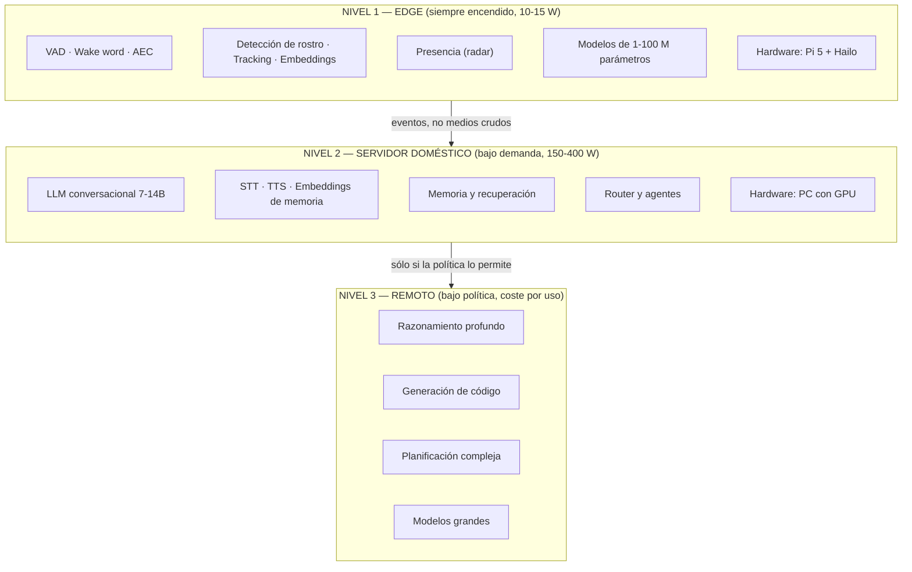
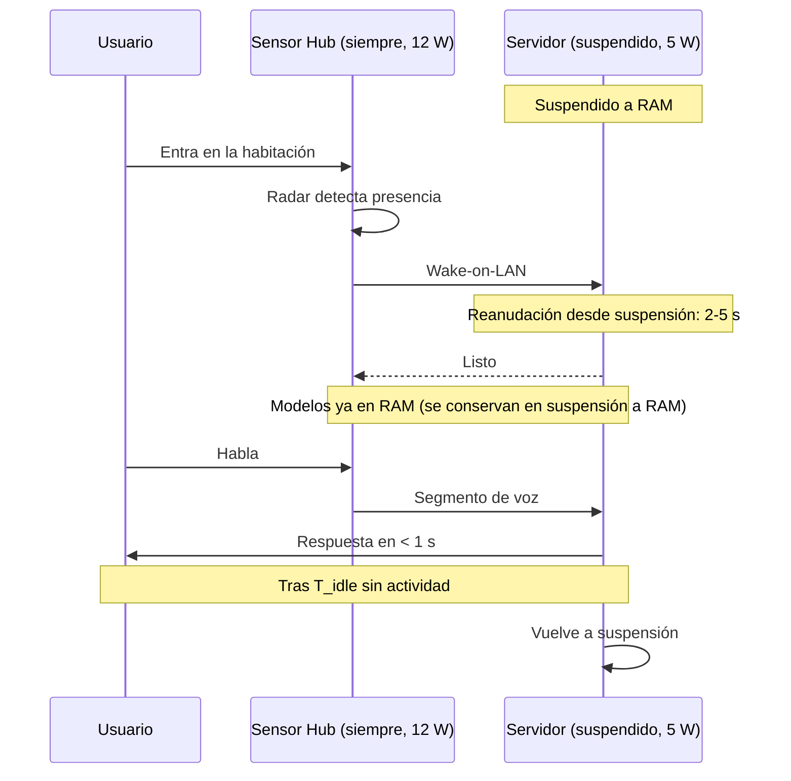
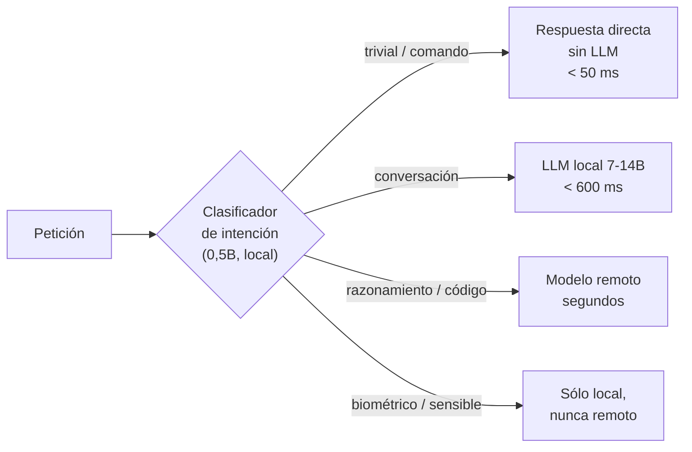
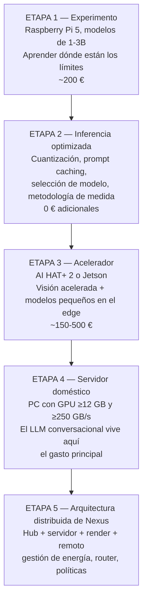

# PROJECT 03 · Arquitectura de IA local para Nexus

> **La pregunta final no es "¿puede una Raspberry Pi ejecutar un modelo enorme?" (no puede). Es: ¿cuál es la mejor arquitectura para tener IA local potente con bajo consumo?**

---

## 1. La respuesta: jerarquía de tres niveles



### Por qué esta división y no otra

| Nivel | Criterio que lo define |
|---|---|
| **Edge** | **Latencia dura + privacidad + consumo 24/7.** Todo lo que debe responder en < 200 ms o que no debe salir del dispositivo |
| **Servidor** | **El punto óptimo de calidad/latencia/privacidad.** Un modelo de 7–14B en GPU da conversación fluida sin salir de casa |
| **Remoto** | **Capacidad que no se puede replicar en casa.** Sólo para lo que un 14B hace mal |

---

## 2. Asignación de cada función

| Función | Nivel | Tamaño de modelo | Latencia objetivo | Justificación |
|---|---|---|---|---|
| VAD | Edge | < 1 M | < 30 ms | Tiempo real duro |
| Wake word | Edge | 1–5 M | < 200 ms | Privacidad: el audio previo no sale nunca |
| AEC / beamforming | Edge (**DSP**) | — | < 10 ms | Tiempo real duro; hardware dedicado |
| Detección de rostro | Edge | 1–10 M | < 100 ms | Frecuencia alta, el vídeo no debe salir |
| Embedding facial | Edge | 10–50 M | < 500 ms | **Biometría: nunca sale del dispositivo** |
| Tracking | Edge | — | < 33 ms | Trivial en CPU |
| Estimación de pose/mirada | Edge | 5–30 M | < 100 ms | Alimenta el lazo del avatar |
| Presencia | Edge (**sensor**) | — | < 500 ms | Radar, sin modelo |
| STT streaming | Servidor | 100 M–1,5 B | < 300 ms | Necesita más cómputo del que hay en el hub |
| Identificación de hablante | Servidor | 10–50 M | < 500 ms | |
| **LLM conversacional** | **Servidor** | **7–14B** | **< 600 ms al primer token** | El equilibrio calidad/latencia/privacidad |
| Clasificación de intención | Servidor (o edge) | 0,5–1B | < 100 ms | Podría ir al edge si el hub tiene el Hailo-10H |
| Embeddings de memoria | Servidor | 100–500 M | < 100 ms | |
| TTS streaming | Servidor | 100 M–1B | < 300 ms al primer audio | |
| Razonamiento profundo | Remoto | > 100B | segundos | Ningún hardware doméstico razonable lo hace bien |
| Generación de código | Remoto | > 30B | segundos | Sensible a la cuantización (`05_QUANTIZATION.md` §5) |
| Planificación de agentes | Remoto | > 30B | segundos | |
| Render del avatar | Estación de render | — | 16,7 ms | GPU separada |

---

## 3. Dimensionado del servidor doméstico

### Requisitos derivados

De `../02_Nexus/02_SYSTEM_VISION.md` NFR-01: **< 1 000 ms p95 de fin de habla a primer audio**.

De ese presupuesto, el LLM tiene ~600 ms para el primer token, y luego debe generar lo bastante rápido para que el TTS no se quede sin texto.

```
El TTS consume texto a la velocidad del habla: ~150 palabras/minuto ≈ 3-4 tokens/s

⇒ El LLM sólo necesita generar más rápido que 4 t/s para no ser el cuello de botella
   en una conversación hablada.

PERO: para agentes y razonamiento (texto que el usuario no oye), hacen falta ≥ 30 t/s.
```

`[INFERENCIA]` **Requisito del servidor: ≥ 30 t/s con el modelo elegido.**

### Cálculo del hardware necesario

```
Objetivo: 30 t/s con un modelo de 14B Q4_K_M (8,4 GB)

    BW necesario = 30 × 8,4 / 0,6 = 420 GB/s

Objetivo: 30 t/s con un modelo de 8B Q4_K_M (4,8 GB)

    BW necesario = 30 × 4,8 / 0,6 = 240 GB/s

Memoria necesaria:
    Modelo 14B Q4          =  8,4 GB
    KV cache 16k tokens Q8 =  1,0 GB
    Overhead               =  1,0 GB
    TOTAL                  = 10,4 GB   ⇒ GPU de ≥ 12 GB de VRAM
```

| Requisito del servidor Nexus | Valor |
|---|---|
| **Ancho de banda de memoria del acelerador** | **≥ 250 GB/s** (mínimo), **≥ 420 GB/s** (cómodo) |
| **Memoria del acelerador** | **≥ 12 GB**, idealmente 16 GB |
| Cómputo | Suficiente para prefill de 2 000 tokens en < 2 s |
| Consumo en uso | 150–400 W (aceptable si sólo está activo bajo demanda) |
| Consumo en reposo | **< 20 W** o suspendido |

> **Nótese que estos requisitos se derivan de un cálculo, no de una opinión.** El ingeniero puede llevarlos a cualquier catálogo y comprobar qué cumple.

### Comparación con las alternativas

| Opción | ¿Cumple ≥ 250 GB/s? | ¿Cumple ≥ 12 GB? | Veredicto |
|---|---|---|---|
| Raspberry Pi 5 | ❌ (17 GB/s) | ⚠️ 16 GB de sistema | ❌ **15× por debajo** |
| Pi 5 + AI HAT+ 2 | ❓ (dato desconocido) | ✅ 8 GB del HAT | ⚠️ Probablemente no |
| Jetson Orin Nano Super | ❌ (102 GB/s) | ⚠️ 8 GB | ⚠️ 2,5× por debajo |
| Mini-PC AMD con iGPU | ⚠️ (~100 GB/s) | ✅ configurable | ⚠️ |
| Apple Silicon gama alta | ✅ | ✅ | ✅ |
| **PC con GPU de consumo 16 GB** | ✅ | ✅ | ✅✅ **La opción** |

---

## 4. Gestión de energía del sistema completo

El problema: el servidor a 300 W encendido 24/7 son ~2 600 kWh/año. Inaceptable.



| Estrategia | Efecto | Requisito |
|---|---|---|
| **Suspensión a RAM del servidor** | Consumo ~5 W; los modelos siguen en RAM; reanudación en 2–5 s | Wake-on-LAN, BIOS configurada |
| **Despertar por presencia, no por wake word** | El servidor ya está listo cuando hablas | Radar en el hub `[PROPUESTA DE DISEÑO]` |
| **Respuesta de relleno del hub** | El hub puede emitir una señal inmediata mientras el servidor despierta | Un modelo diminuto en el hub |
| **Escalado de frecuencia de la GPU** | Menor consumo en tareas ligeras | |
| Nunca hibernar (a disco) | La recarga de modelos tarda demasiado | |

`[HIPÓTESIS]` Con esta estrategia el consumo medio anual del sistema completo estaría en el orden de **200–500 kWh/año**, dominado por el hub a 12 W (105 kWh/año) más el uso real del servidor. → medir con `EXP-307`.

---

## 5. Estrategia de modelos

### El error a evitar

> ❌ **"Un modelo lo hace todo".** Ni el más grande sirve para el wake word (latencia), ni el más pequeño sirve para razonar.

### La estrategia correcta



| Tipo de petición | % estimado del tráfico `[HIPÓTESIS]` | Destino | Latencia |
|---|---|---|---|
| Comandos y respuestas triviales ("qué hora es", "para", "sí") | 30 % | Sin LLM, reglas | < 50 ms |
| Conversación cotidiana | 50 % | LLM local | < 1 s |
| Razonamiento, código, planificación | 15 % | Remoto | 2–10 s |
| Sensible / biométrico | 5 % | Local obligatorio | variable |

> `[PROPUESTA DE DISEÑO]` **El 30 % de peticiones que no necesitan LLM es la optimización más infravalorada.** Un asistente que responde "para" instantáneamente sin invocar un modelo se siente mucho más vivo que uno que tarda 800 ms en todo.

---

## 6. Ruta de evolución



| Etapa | Qué se aprende | Qué se decide después |
|---|---|---|
| 1 | Los límites reales, medidos por nosotros | Si el modelo de rendimiento es correcto |
| 2 | Cuánto se puede exprimir sin comprar nada | Qué cuantización y qué modelo usar |
| 3 | Si el acelerador cambia la ecuación | Qué va en el edge y qué no |
| 4 | Cuánta calidad conversacional podemos tener en casa | Qué se enruta a remoto |
| 5 | Cómo se comporta el sistema completo | El diseño final |

---

## 7. Respuesta directa a la pregunta del brief

> *"¿Cuál es la mejor arquitectura para tener IA local potente con bajo consumo?"*

**No existe "IA local potente con bajo consumo" en un solo dispositivo.** Potencia y bajo consumo son contradictorios: la potencia en LLM viene del ancho de banda de memoria, y el ancho de banda de memoria cuesta vatios.

**La arquitectura correcta acepta esa contradicción y la reparte en el tiempo:**

| Componente | Potencia | Consumo | Encendido |
|---|---|---|---|
| Sensor Hub | Baja | 10–15 W | **24/7** |
| Servidor | Alta | 150–400 W | **Sólo cuando se usa** (segundos o minutos al día) |
| Remoto | Máxima | 0 W para nosotros | Bajo demanda y bajo política |

> **La clave no es tener un dispositivo eficiente. Es que el dispositivo caro esté apagado el 95 % del tiempo, y que el barato sepa cuándo despertarlo.**

Esa es la razón de que el radar de presencia del `../02_Nexus/07_SENSOR_HARDWARE.md` §6 no sea un detalle: es la pieza que hace viable toda la arquitectura energética.
