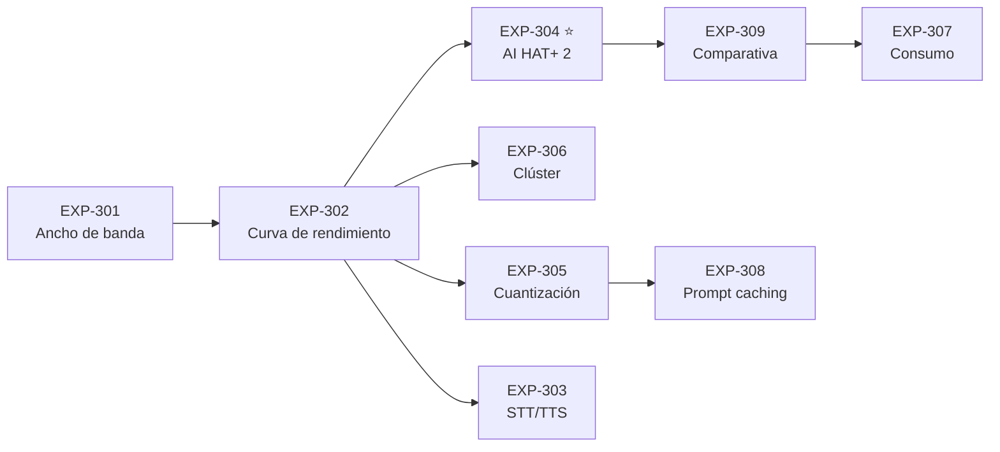

# PROJECT 03 · Experiments

> Todos los experimentos de este proyecto son **baratos**: el material necesario cuesta menos de 400 € y la mayoría se ejecutan en un fin de semana. Su valor es que sustituyen opiniones por números.

---

## EXP-301 — Ancho de banda de memoria real

| Campo | Contenido |
|---|---|
| **Hipótesis** | El ancho de banda efectivo de nuestro Raspberry Pi 5 está entre 8 y 12 GB/s (η = 0,5–0,7 sobre los 17 GB/s teóricos) |
| **Hardware** | Raspberry Pi 5 (la unidad concreta que vayamos a usar), refrigeración activa |
| **Software** | Herramienta de medición de ancho de banda de memoria (STREAM, `sysbench memory`, o `tinymembench`) |
| **Procedimiento** | 1) Ejecutar la medición en frío. 2) Repetir 10 veces. 3) Repetir tras 10 min de carga (para ver el efecto térmico). 4) Repetir con las distintas variantes de memoria si tenemos más de una placa |
| **Medición** | GB/s de lectura, escritura y copia; media y desviación |
| **Éxito** | Se obtiene un valor estable en el rango previsto ⇒ el modelo de `04_MODEL_MEMORY_ANALYSIS.md` es aplicable |
| **Fallo** | Valor fuera de 6–14 GB/s ⇒ recalibrar el modelo |
| **Decisión siguiente** | Fija el valor de η que usaremos en todos los cálculos de planificación |
| **Nota** | `[CONFIRMADO]` Hay reportes de que el ancho de banda **difiere entre variantes de memoria del mismo modelo de Pi 5**. Por eso hay que medir nuestra unidad |

---

## EXP-302 — Curva de rendimiento por tamaño de modelo

| Campo | Contenido |
|---|---|
| **Hipótesis** | `t/s ≈ (BW_medido × η) / tamaño_del_modelo` predice el rendimiento dentro de un ±30 % para modelos de 1B a 8B |
| **Hardware** | Pi 5 16 GB, NVMe, refrigeración activa, vatímetro |
| **Software** | `llama.cpp` compilado con optimizaciones para el SoC |
| **Procedimiento** | Para cada modelo de {1B, 3B, 7B, 8B} × {Q8, Q5_K_M, Q4_K_M, Q3_K_M}: seguir la metodología de `09_BENCHMARKS.md` §5 (calentamiento + 5 ejecuciones + 10 min continuos) |
| **Medición** | Prefill t/s, decode t/s, W, °C, RAM usada, throttling sí/no |
| **Éxito** | La predicción cae dentro del ±30 % en todos los casos |
| **Fallo** | Desviaciones sistemáticas ⇒ hay un factor que no hemos modelado |
| **Decisión siguiente** | Publica la tabla de referencia definitiva del proyecto |
| **Predicciones a verificar** | P2, P3, P4, P5 de `09_BENCHMARKS.md` §6 |

---

## EXP-303 — Modelos de percepción en el Pi

| Campo | Contenido |
|---|---|
| **Hipótesis** | STT y TTS de tamaño pequeño corren en tiempo real en el Pi 5 sin acelerador |
| **Hardware** | Pi 5, array de micrófonos |
| **Software** | Motor de STT ligero y motor de TTS ligero |
| **Procedimiento** | Medir el factor de tiempo real (RTF) del STT y la latencia al primer audio del TTS con 20 muestras |
| **Medición** | RTF (< 1 significa tiempo real), latencia, CPU, calidad subjetiva |
| **Éxito** | STT con RTF < 0,5 y TTS con < 500 ms al primer audio |
| **Fallo** | Confirma que STT/TTS van en el servidor, no en el hub |
| **Decisión siguiente** | Define la frontera edge/servidor para audio (`10_NEXUS_EDGE_AI_ARCHITECTURE.md` §2) |

---

## EXP-304 — Raspberry Pi AI HAT+ 2 (Hailo-10H) ⭐

| Campo | Contenido |
|---|---|
| **Hipótesis** | El AI HAT+ 2 ejecuta modelos de 1–3B a ≥ 3× la velocidad de la CPU del Pi 5, y permite modelos de hasta ~7B gracias a sus 8 GB propios |
| **Hardware** | Pi 5 + AI HAT+ 2, vatímetro, refrigeración |
| **Software** | HailoRT + modelos del zoo de Hailo |
| **Procedimiento** | 1) Modelos disponibles de 1,5B, 3B y (si existe) 7B con la metodología de `09_BENCHMARKS.md` §5. 2) Comparar con los mismos modelos en la CPU. 3) Medir consumo total del conjunto. 4) **Inferir el ancho de banda de la memoria del HAT** a partir del rendimiento medido: `BW ≈ t/s × tamaño_modelo / η` |
| **Medición** | t/s, W, °C, qué modelos están disponibles en el zoo, cuánto cuesta convertir uno propio |
| **Éxito** | ≥ 3× sobre CPU y capacidad de ejecutar un 3B con fluidez |
| **Fallo** | Ganancia < 2×, o el zoo de modelos es demasiado restrictivo |
| **Decisión siguiente** | **Decide si el Sensor Hub de Nexus puede alojar un modelo de lenguaje o sólo percepción.** Resuelve Q-H01, Q-H03 |
| **Prioridad** | ⭐ **Alta.** Es el hueco de información más importante de esta investigación |

---

## EXP-305 — Impacto real de la cuantización en la calidad

| Campo | Contenido |
|---|---|
| **Hipótesis** | La degradación de Q8 a Q4_K_M es imperceptible en conversación, pero perceptible en razonamiento y código |
| **Hardware** | Cualquiera con memoria suficiente |
| **Software** | El mismo modelo base en Q8, Q5_K_M, Q4_K_M, Q3_K_M, Q2_K |
| **Procedimiento** | 1) Construir un conjunto de evaluación **propio** de 50–100 casos representativos del uso de Nexus (conversación, resumen, extracción, razonamiento simple, código). 2) Ejecutar los 5 modelos con la misma semilla y temperatura. 3) Evaluación ciega: mezclar las salidas y puntuarlas sin saber cuál es cuál |
| **Medición** | Puntuación por categoría y por cuantización |
| **Éxito** | Se identifica el punto de corte a partir del cual la degradación es inaceptable |
| **Fallo** | No hay diferencias medibles ⇒ usar siempre la cuantización más agresiva (buena noticia) |
| **Decisión siguiente** | Fija la cuantización de producción. Verifica P6 |

---

## EXP-306 — Clúster: ¿merece la pena?

| Campo | Contenido |
|---|---|
| **Hipótesis** | Dos Raspberry Pi 5 en clúster dan **menos del 30 %** de mejora sobre uno solo con el mismo modelo, confirmando que un clúster no es la solución |
| **Hardware** | 2× Pi 5 16 GB, switch Gigabit, cables |
| **Software** | `llama.cpp` con backend RPC, y `distributed-llama` |
| **Procedimiento** | 1) Medir un modelo de 8B en un solo Pi. 2) El mismo modelo repartido en dos con RPC. 3) El mismo con `distributed-llama`. 4) Un modelo de 14B que no quepa en uno solo, repartido en dos. 5) Medir el tráfico de red durante la inferencia |
| **Medición** | t/s en cada configuración, tráfico de red (MB/s), latencia añadida, consumo total |
| **Éxito de la hipótesis** | Mejora < 30 % ⇒ confirma la conclusión de `06_DISTRIBUTED_INFERENCE.md` |
| **Refutación** | Mejora > 80 % ⇒ **hay que revisar toda la conclusión sobre clústeres**, y merece la pena explorar más nodos |
| **Decisión siguiente** | Cierra definitivamente la pregunta del clúster. Verifica P7 |
| **Nota** | ⚠️ El backend RPC de `llama.cpp` está declarado oficialmente como *"frágil e inseguro"*: ejecutarlo sólo en una red aislada de laboratorio |

---

## EXP-307 — Consumo del sistema completo

| Campo | Contenido |
|---|---|
| **Hipótesis** | La estrategia de "hub siempre encendido + servidor suspendido" mantiene el consumo medio por debajo de 500 kWh/año |
| **Hardware** | Sistema completo con vatímetro registrador en cada nivel |
| **Software** | Wake-on-LAN configurado, suspensión a RAM |
| **Procedimiento** | Registrar 7 días de uso real. Medir por separado hub, servidor y estación de render |
| **Medición** | kWh por nivel, tiempo en cada estado, latencia de reanudación del servidor |
| **Éxito** | < 500 kWh/año extrapolado, y reanudación < 5 s |
| **Fallo** | Consumo excesivo, o la reanudación es tan lenta que rompe la experiencia |
| **Decisión siguiente** | Ajustar la política de energía; posiblemente mover más funciones al hub |

---

## EXP-308 — Prompt caching

| Campo | Contenido |
|---|---|
| **Hipótesis** | El prompt caching elimina > 80 % del tiempo de prefill en turnos sucesivos de una conversación |
| **Hardware** | Servidor Nexus |
| **Software** | Motor con soporte de reutilización de KV cache |
| **Procedimiento** | Simular una conversación de 10 turnos con un prompt de sistema de 1 500 tokens. Medir el prefill de cada turno con y sin caching |
| **Medición** | Tiempo de prefill por turno, memoria adicional consumida por el caché |
| **Éxito** | Reducción > 80 % a partir del segundo turno |
| **Fallo** | El motor invalida el caché demasiado a menudo |
| **Decisión siguiente** | Define cómo se construye el prompt (**partes estables primero, variables al final**) para maximizar el aprovechamiento del caché |

---

## EXP-309 — Comparativa directa de plataformas

| Campo | Contenido |
|---|---|
| **Hipótesis** | El Jetson Orin Nano Super supera al Pi 5 + AI HAT+ 2 en LLM, pero con peor relación consumo/coste para el papel de percepción |
| **Hardware** | Ambas plataformas |
| **Software** | El mismo modelo (en el formato nativo de cada una) |
| **Procedimiento** | Metodología de `09_BENCHMARKS.md` §5 en ambas, con el mismo modelo y las mismas condiciones. Incluir también las tareas de **visión** (SCRFD + embeddings), no sólo LLM |
| **Medición** | t/s de LLM, fps de visión, W, €, complejidad de integración |
| **Éxito** | Se obtiene una recomendación fundamentada para el Sensor Hub |
| **Decisión siguiente** | Resuelve Q-H04 y fija la plataforma del hub de Nexus |

---

## Orden recomendado

| Prioridad | Experimentos | Material necesario |
|---|---|---|
| **Inmediata** | EXP-301, EXP-302 | Un Pi 5 16 GB + NVMe + refrigeración ≈ 200 € |
| **Alta** | **EXP-304** ⭐ | AI HAT+ 2 |
| **Media** | EXP-303, EXP-305, EXP-306, EXP-308 | Un segundo Pi para EXP-306 |
| **Cuando haya servidor** | EXP-307, EXP-309 | |

> **EXP-301 y EXP-302 juntos cuestan ~200 € y un fin de semana, y calibran un modelo que sirve para todas las decisiones de hardware posteriores del ecosistema.** Es la mejor inversión de tiempo de los tres proyectos.
