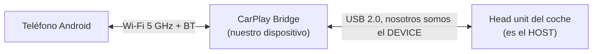
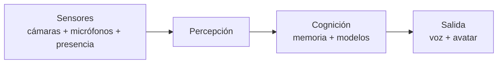
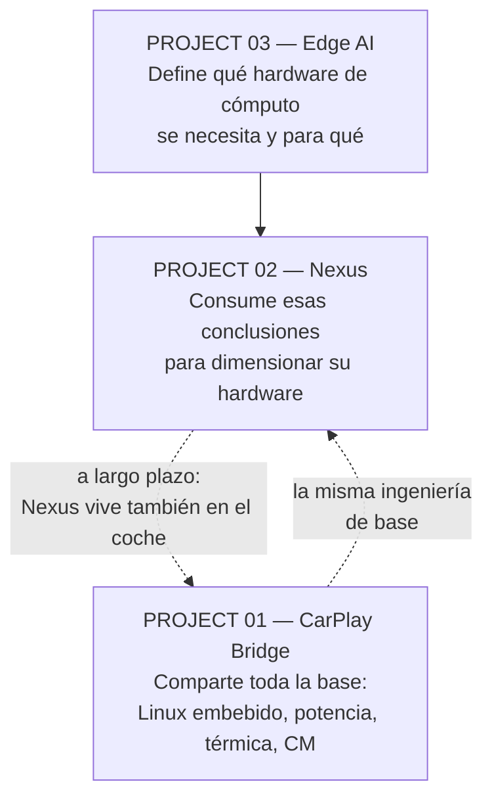
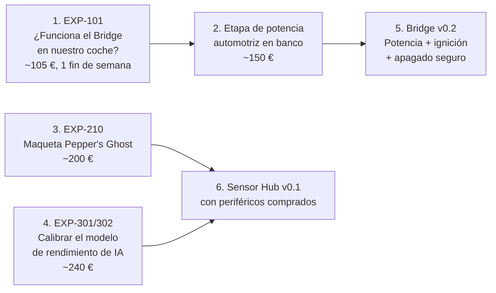

# ENGINEER HANDOFF

> **Para el ingeniero electrónico que se incorpora al proyecto.**
> Este documento asume que no has oído hablar de nada de esto antes. Al terminar de leerlo deberías saber qué estamos construyendo, por qué, qué depende de ti y qué puedes empezar a hacer mañana.
>
> Tiempo de lectura: ~20 minutos.

---

## 1. ¿Qué estamos intentando construir?

Tres cosas, que comparten más ingeniería de la que parece.

### PROJECT 01 — CarPlay Bridge

Un dispositivo que se instala en un coche y permite usar **la pantalla del automóvil como interfaz de un teléfono Android**, sin cable entre el teléfono y el coche.

### PROJECT 02 — Nexus

Un compañero digital: escucha, ve, reconoce a la persona, recuerda, razona, ejecuta tareas, y — al final del camino — aparece como un humano digital a tamaño real en una instalación física.

### PROJECT 03 — Edge AI Research

No es un producto: es la investigación que responde **qué modelos de IA se pueden ejecutar en qué hardware**, y por tanto qué hardware hay que comprar para los otros dos proyectos.

---

## 2. ¿Por qué?

| Proyecto | Motivación |
|---|---|
| CarPlay Bridge | Tener una plataforma propia, controlable y evolucionable dentro del coche, en lugar de depender de lo que los fabricantes decidan permitir |
| Nexus | Construir un asistente que sea realmente **nuestro**: local, privado, persistente, y con presencia física |
| Edge AI | Dejar de tomar decisiones de hardware por intuición y tomarlas por cálculo |

---

## 3. ¿Cómo se relacionan?

**Lo importante para ti:** los tres proyectos usan **la misma base electrónica**. Diseñar la etapa de potencia del Bridge te deja al 60 % de la del Sensor Hub de Nexus. No son tres proyectos: es una plataforma con tres aplicaciones.

---

## 4. Las tres correcciones que ya hemos hecho a la idea original

Es importante que sepas dónde ya hemos dicho "no" a la visión inicial, para que no vuelvas a explorar caminos cerrados:

| Idea original | Corrección | Detalle |
|---|---|---|
| "El Pi aparenta ser un iPhone ante el CarPlay del coche" | ❌ **Cerrado.** CarPlay exige un coprocesador de autenticación de Apple que sólo se licencia para fabricar **head units**, no transmisores. La ruta construible es Android Auto, donde el protocolo de accesorio USB (AOAP) es público y no hay chip de autenticación | `01_CarPlay_Bridge/02_TECHNICAL_RESEARCH.md` §2 |
| "Pantalla LED transparente para mostrar a Nexus a tamaño real" | ❌ **Tecnología equivocada.** El pixel pitch mínimo del LED transparente comercial es 3,9 mm, lo que exige mirar desde 4–13 m. Para una cara a 2 m hacen falta ~0,5 mm. La ruta práctica es Pepper's Ghost | `02_Nexus/08_TRANSPARENT_DISPLAY_RESEARCH.md` §1 |
| "Un modelo de IA grande corriendo en el edge" | ❌ **Físicamente acotado.** Una Raspberry Pi 5 llega a modelos de 8B a 2–3 tokens/s. La arquitectura correcta es jerárquica: percepción en el edge, cognición en un servidor | `03_Edge_AI_Research/01_EXECUTIVE_SUMMARY.md` |

---

## 5. ¿Qué hardware hay que investigar?

| Área | Qué hay que investigar | Documento |
|---|---|---|
| **Conversión de potencia automotriz** | Bucks de amplio Vin, protección de load dump (ISO 16750-2: picos de ~101 V durante ~400 ms), transitorios ISO 7637-2, consumo en reposo < 1 mA | `01/04_HARDWARE_ARCHITECTURE.md` §2–3 |
| **Compute Modules** | CM4 vs CM5: rango de temperatura (−20…+85 °C), USB2 dedicado, PCIe, carrier boards | `01/02_TECHNICAL_RESEARCH.md` §7 |
| **MCU supervisor** | STM32G0 vs RP2350: consumo en STOP, ADC, disponibilidad, grado automotriz | `01/04_HARDWARE_ARCHITECTURE.md` §6 |
| **Aceleradores de IA** | Hailo-8 vs Hailo-10H vs Jetson. **Criterio: ¿tiene memoria propia?** | `03/07_AI_ACCELERATORS.md` |
| **Arrays de micrófonos** | DSP dedicado con AEC/beamforming/DoA; modo USB vs I²S | `02/05_AUDIO_SYSTEM.md` §2 |
| **Iluminación IR** | 940 nm, driver de corriente, **seguridad fotobiológica IEC 62471** | `02/07_SENSOR_HARDWARE.md` §5 |
| **Radar de presencia mmWave** | Detección de personas inmóviles, homologación regional | `02/07_SENSOR_HARDWARE.md` §6 |
| **PoE+ (802.3at)** | Alimentación del Sensor Hub por un solo cable | `02/07_SENSOR_HARDWARE.md` §9 |
| **Displays** | Pepper's Ghost, light field, OLED transparente. **No** LED transparente | `02/08_TRANSPARENT_DISPLAY_RESEARCH.md` |
| **Antenas** | 5 GHz obligatorio, antenas externas, coexistencia BT/Wi-Fi en caja metálica | `01/04_HARDWARE_ARCHITECTURE.md` §8 |

---

## 6. ¿Qué conocimientos electrónicos hacen falta?

| Área | Nivel | Dónde se usa |
|---|---|---|
| Diseño de convertidores conmutados (buck) | **Alto** | Ambos dispositivos |
| Protección de entrada automotriz (TVS, surge stopper, polaridad inversa) | **Alto** | CarPlay Bridge |
| EMC/EMI: diseño para cumplir y para no interferir | **Alto** | Ambos |
| Integridad de señal en USB 2.0 HS (par diferencial 90 Ω) | Medio-alto | CarPlay Bridge |
| Diseño con Compute Modules y carrier boards | Medio-alto | Ambos |
| Firmware de MCU (C, bajo consumo, watchdog) | Medio | Ambos |
| Diseño térmico por convección natural | **Alto** | Ambos (sin ventiladores) |
| RF: antenas, colocación, coexistencia | Medio | Ambos |
| Audio analógico y acústica (ruido, alimentación limpia, desacoplo mecánico) | Medio-alto | Nexus |
| Óptica e iluminación IR + seguridad fotobiológica | Medio | Nexus |
| Interfaces MIPI CSI-2 | Medio | Nexus |
| PoE | Bajo-medio | Nexus |
| Mecánica de precisión para calibración de sensores | Medio | Nexus |
| Diseño de PCB de 4–6 capas con planos y control de impedancia | **Alto** | Ambos |

---

## 7. ¿Qué prototipos construimos primero?

En orden estricto:

**Lo primero que construyes tú es la etapa de potencia automotriz.** Es independiente del resultado de `EXP-101`, es trabajo reutilizable en el Sensor Hub, y es donde el proyecto se gana o se pierde.

---

## 8. ¿Qué es lo que todavía no sabemos?

Las incógnitas que más te afectan:

| # | Incógnita | Cómo se resuelve |
|---|---|---|
| 1 | ¿El puerto USB del coche puede alimentar el Bridge, o hay que cablear 12 V? | `EXP-107` — **cambia radicalmente la instalación y la PCB** |
| 2 | ¿Cuánto tarda un head unit real en dejar de reintentar la enumeración USB? | `EXP-103` — fija el requisito de tiempo de arranque |
| 3 | ¿Qué temperatura alcanza el dispositivo en un coche en verano? | `EXP-111` |
| 4 | ¿Cuánto consume realmente en reposo nuestro diseño? | `EXP-106` — requisito duro de < 1 mA |
| 5 | ¿Cuál es la irradiancia del iluminador IR y cumple IEC 62471? | `EXP-208` — **seguridad de personas** |
| 6 | ¿Podemos disipar 10–15 W en el Sensor Hub sin ventilador? | Simulación + medición |
| 7 | ¿Qué tolerancias mecánicas necesita la calibración cámara↔micrófonos↔pantalla? | Análisis de sensibilidad |
| 8 | ¿Cuál es el ancho de banda de memoria del acelerador Hailo-10H? | `EXP-304` — dato ausente en la documentación pública |
| 9 | ¿Detecta el radar mmWave a una persona inmóvil a 4 m? | `EXP-211` |
| 10 | ¿Los módulos Wi-Fi de CM4/CM5 permiten antena externa manteniendo certificación? | Consulta al fabricante |

---

## 9. ¿Qué decisiones dependen de ti?

Estas son las preguntas abiertas dirigidas específicamente al ingeniero electrónico. Están numeradas y repartidas por los documentos:

### CarPlay Bridge (`01/04_HARDWARE_ARCHITECTURE.md` §11)

| ID | Decisión |
|---|---|
| Q-E01 | Buck discreto o integrado; frecuencia de conmutación fuera de la banda AM |
| Q-E02 | **Alimentar de B+ permanente con corte por MCU, o sólo de ACC con hold-up** |
| Q-E03 | TVS puro vs surge stopper con FET en serie para el load dump |
| Q-E04 | Qué MCU supervisor; ¿grado automotriz desde cuándo? |
| Q-E05 | Cable cautivo USB o conector; longitud máxima con integridad de señal HS |
| Q-E06 | Caja de aluminio: mecanizada, extruida o fundida; acoplamiento térmico |
| Q-E07 | Qué antenas y dónde; ¿medimos el patrón dentro del vehículo? |
| Q-E08 | Protección del sensado de ACC frente a transitorios |
| Q-E09 | Nivel de EMC objetivo y cuándo hacer pre-compliance |
| Q-E10 | ¿Ponemos CAN desde el principio o sólo el footprint? |
| Q-E11 | **Cómo garantizamos y medimos < 1 mA en reposo** |
| Q-E12 | ¿Protección contra jump start a 24 V? |

### Nexus Sensor Hub (`02/07_SENSOR_HARDWARE.md` §11)

| ID | Decisión |
|---|---|
| Q-E20 | Pi 5 + AI HAT+ 2, Jetson, o CM5 con acelerador propio |
| Q-E21 | PoE+ o alimentación local; presupuesto de pico real |
| Q-E22 | Sincronización de relojes hub↔servidor |
| Q-E23 | MIPI CSI-2 o USB para la cámara |
| Q-E24 | **Tolerancias mecánicas de montaje para la calibración** |
| Q-E25 | Array de micrófonos por USB o I²S; control del buffer de audio |
| Q-E26 | **Desacoplo mecánico del altavoz respecto a los micrófonos** |
| Q-E27 | ⚠️ **Cálculo de seguridad fotobiológica del IR (IEC 62471)** |
| Q-E28 | **Diseño exacto de la cadena de privacidad por hardware** |
| Q-E29 | Radar mmWave: banda, fabricante, regulación |
| Q-E30 | Disipar 10–15 W sin ventilador |
| Q-E31 | Qué hace el hub si se corta la red |
| Q-E32 | Un hub o varios distribuidos |

### Instalación física (`02/08_TRANSPARENT_DISPLAY_RESEARCH.md` §6)

| ID | Decisión |
|---|---|
| Q-E40 | Controladora de vídeo según tecnología de display |
| Q-E41 | Presupuesto eléctrico y térmico de la instalación |
| Q-E42 | ⚠️ **Material, espesor y anclaje de la lámina de Pepper's Ghost — es un elemento de seguridad** |
| Q-E43 | Cómo evitar dobles reflexiones en la lámina |
| Q-E44 | Integración del Sensor Hub en la estructura sin perder calibración |
| Q-E45 | ¿Nexus controla la iluminación de la sala? |
| Q-E46 | Brillo real necesario medido en la sala |

---

## 10. ¿Qué deberías empezar a investigar?

Por orden de utilidad inmediata:

1. **ISO 16750-2 e ISO 7637-2.** Son la norma de referencia del entorno eléctrico del vehículo. Analog Devices publica modelos de LTspice de esos transitorios — es la forma más rápida de empezar a simular.
2. **Controladores de surge stopper / diodo ideal** para automoción (familias tipo LTC4364/LT4363 y equivalentes). Entender por qué desconectar es mejor que disipar en un load dump de 400 ms.
3. **Documentación de Compute Module 4 y 5**: product briefs, guías de diseño de carrier board, y los ficheros de referencia del CM IO Board.
4. **USB gadget en Linux**: cómo funciona `configfs` y qué determina la enumeración. No tienes que implementarlo, pero sí entender qué ve el head unit.
5. **IEC 62471** (seguridad fotobiológica de lámparas) aplicada a LEDs IR.
6. **Datasheets de aceleradores**: Hailo-10H y Jetson Orin Nano Super, buscando específicamente **memoria propia y ancho de banda**.
7. **Diseño térmico por convección natural en cajas de aluminio**: cálculo de resistencia térmica, no sólo intuición.

---

## 11. ¿Qué deberías empezar a diseñar?

En este orden:

| # | Diseño | Por qué primero | Reutilizable en |
|---|---|---|---|
| 1 | **Etapa de entrada 12 V**: fusible → polaridad inversa → TVS → surge stopper → filtro EMI → buck de 5 A | Independiente de todos los experimentos; es el corazón de la robustez del Bridge | Ambos proyectos |
| 2 | **Circuito de sensado de ignición + MCU supervisor + load switch** | Resuelve el apagado seguro y el consumo en reposo | Ambos |
| 3 | **Esquema de la cadena de privacidad del Sensor Hub** (interruptores, rails, LEDs en serie) | Es una decisión que no se puede añadir después | Nexus |
| 4 | **Driver del iluminador IR** con límite de corriente por hardware | Elemento de seguridad | Nexus |
| 5 | Carrier board de CM4 para el Bridge | Depende de EXP-101 y EXP-107 | — |
| 6 | Carrier board del Sensor Hub | Depende de EXP-206 y EXP-207 | — |

> **No diseñes ninguna PCB completa hasta que EXP-101 y EXP-107 estén hechos.** Esos dos experimentos cambian requisitos de la placa (si el USB del coche alimenta, la etapa de potencia cambia por completo).

---

## 12. ¿Qué deberíamos comprar para el laboratorio?

### Imprescindible

| Equipo | Para qué | Coste est. `[HIPÓTESIS]` |
|---|---|---|
| Fuente de alimentación programable 0–30 V / 5 A | Simular 12 V, cold crank, rampas, cortes | ~150–400 € |
| Multímetro con rango de µA | Medir el consumo en reposo (< 1 mA) | ~60–200 € |
| Osciloscopio ≥ 100 MHz, 2–4 canales | Transitorios, integridad de señal, arranque | ~350–800 € |
| Adaptador USB-UART 3,3 V | Consolas serie | ~10 € |
| Estación de soldadura + aire caliente | Rework | ~150–350 € |
| Analizador lógico USB | UART, I²C, SPI | ~15–150 € |

### Muy recomendable

| Equipo | Para qué | Coste est. |
|---|---|---|
| Cámara termográfica | Puntos calientes, EXP-111 | ~250–500 € |
| Sondas near-field de EMI | Pre-compliance casero | ~80–200 € |
| Analizador de espectro / SDR (2,4 y 5 GHz) | Selección de canal, coexistencia | ~150–600 € |
| Medidor de corriente USB en línea | EXP-107 | ~20 € |
| Sonómetro | Ruido del Sensor Hub (requisito duro) | ~50–200 € |
| Radiómetro IR | **EXP-208, seguridad IEC 62471** | ~200–800 €, o subcontratar |

### Material de referencia (comprar para estudiar, no para usar)

| Elemento | Por qué | Coste est. |
|---|---|---|
| Un adaptador comercial de Android Auto inalámbrico | Referencia de latencia y comportamiento | ~50–90 € |
| Un dongle Carlinkit CPC200-CCPA | Convierte un Linux en receptor CarPlay | ~90–120 € |
| Un "CarPlay AI Box" barato | Objeto de estudio del comportamiento del head unit | ~80–150 € |

> Estos tres cuestan menos que un día de ingeniería y ahorran semanas de suposiciones.

---

## 13. ¿Qué podemos probar inmediatamente?

Cuatro experimentos, ~545 € en total, que puedes empezar esta semana:

| Experimento | Qué responde | Material | Duración |
|---|---|---|---|
| **EXP-101** | ¿El Bridge funciona en nuestro coche? | Pi 4 + cable + fuente ≈ 105 € | Un fin de semana |
| **EXP-107** | ¿El puerto USB del coche puede alimentarnos? | Medidor USB ≈ 20 € | Una tarde |
| **EXP-210** | ¿Aporta algo el Pepper's Ghost frente a un monitor? | Acrílico + estructura ≈ 200 € | Un fin de semana |
| **EXP-301/302** | ¿Predice bien nuestro modelo de rendimiento de IA? | Pi 5 16 GB + NVMe ≈ 240 € | Un fin de semana |

**Los cuatro tienen resultado binario o numérico.** Ninguno requiere diseñar nada. Y entre los cuatro eliminan la mayor parte de la incertidumbre de los tres proyectos.

---

## 14. Cómo trabajamos

### Convenciones de la documentación

Toda afirmación técnica está etiquetada:

| Etiqueta | Significado |
|---|---|
| `[CONFIRMADO]` | Verificado en fuente oficial, con enlace |
| `[INFERENCIA]` | Deducción razonada, no verificada directamente |
| `[HIPÓTESIS]` | A validar con un experimento |
| `[PROPUESTA DE DISEÑO]` | Decisión nuestra, discutible |
| `[NO RELIABLE BENCHMARK FOUND]` | Buscamos y no hay dato. No se inventa |

**Respeta estas etiquetas al editar.** Si conviertes una hipótesis en confirmada, añade la fuente o el resultado del experimento.

### Formato de los experimentos

Cada experimento tiene: hipótesis, hardware, software, procedimiento, medición, criterio de éxito, criterio de fallo, y decisión siguiente. **Si no se puede escribir el criterio de fallo, el experimento está mal planteado.**

### Nunca confundimos

| PoC | Prototype | Engineering prototype | Production design |
|---|---|---|---|
| Demuestra que es posible | Hace la función completa | PCB propia, caja, cumple requisitos | Fabricable y certificable |

Una Raspberry Pi es correcta en las dos primeras columnas y normalmente incorrecta en la última.

---

## 15. Las tres frases que resumen tu trabajo

> **CarPlay Bridge:** el protocolo, que parecía imposible, está resuelto y es verificable en un fin de semana con 105 €. **El trabajo real es electrónico:** sobrevivir al entorno eléctrico del vehículo, no descargar la batería, no cocerse en verano, arrancar en menos de 15 segundos y no morir tras 500 cortes de corriente.

> **Nexus:** se puede llevar bastante lejos comprando hardware. **Tu trabajo empieza en NEXUS 4** y son tres cosas concretas: un array de sensores mecánicamente rígido y calibrable, una cadena de privacidad que sea hardware y no una promesa, y disipar 10–15 W sin que se oiga un ventilador. La cuarta, el iluminador IR, es seguridad de personas y requiere cálculo.

> **Edge AI:** el rendimiento de un modelo de lenguaje es una división: ancho de banda de memoria entre tamaño del modelo. Con esa fórmula puedes dimensionar cualquier sistema antes de comprar nada. **Los TOPS del marketing son la tercera especificación en importancia.**

---

## 16. Índice rápido de documentos

| Necesito... | Voy a... |
|---|---|
| Entender el CarPlay Bridge en 10 min | `01_CarPlay_Bridge/01_EXECUTIVE_SUMMARY.md` |
| Diseñar la electrónica del Bridge | `01_CarPlay_Bridge/04_HARDWARE_ARCHITECTURE.md` |
| Saber por qué CarPlay está cerrado | `01_CarPlay_Bridge/02_TECHNICAL_RESEARCH.md` §2 |
| Ver los experimentos del Bridge | `01_CarPlay_Bridge/07_PROTOTYPE_PLAN.md` |
| Entender Nexus en 10 min | `02_Nexus/01_EXECUTIVE_SUMMARY.md` |
| Diseñar el Sensor Hub | `02_Nexus/07_SENSOR_HARDWARE.md` |
| Elegir tecnología de display | `02_Nexus/08_TRANSPARENT_DISPLAY_RESEARCH.md` |
| Dimensionar hardware de IA | `03_Edge_AI_Research/04_MODEL_MEMORY_ANALYSIS.md` |
| Elegir acelerador de IA | `03_Edge_AI_Research/07_AI_ACCELERATORS.md` |
| Ver el plan completo | `00_MASTER_TECHNOLOGY_ROADMAP.md` |
| Comprar material | `01_CarPlay_Bridge/08_BOM.md` y `02_Nexus/11_BOM.md` |
